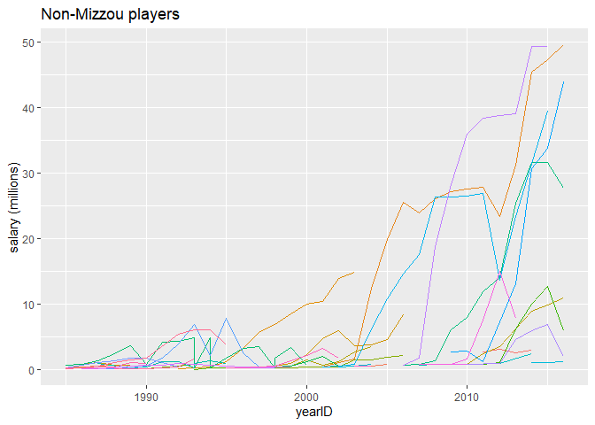
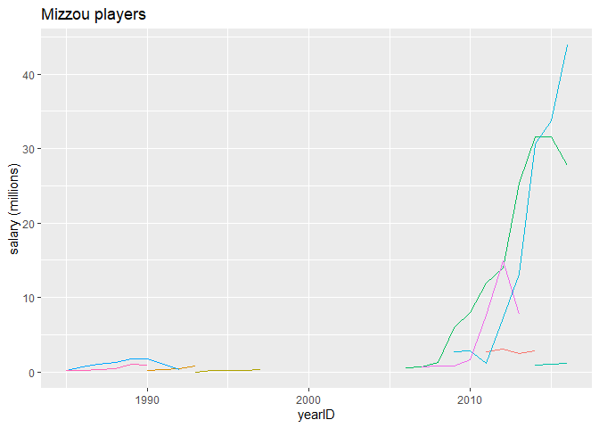

```
## Loading required package: Lahman
```

```
## Warning: package 'Lahman' was built under R version 3.6.3
```

```
## Loading required package: blscrapeR
```

```
## Warning: package 'blscrapeR' was built under R version 3.6.3
```

```
## Loading required package: tidyverse
```

```
## Warning: package 'tidyverse' was built under R version 3.6.3
```

```
## -- Attaching packages ---------------------------------------------------------- tidyverse 1.3.0 --
```

```
## v ggplot2 3.2.1     v purrr   0.3.4
## v tibble  3.0.3     v dplyr   1.0.2
## v tidyr   1.1.1     v stringr 1.4.0
## v readr   1.3.1     v forcats 0.4.0
```

```
## Warning: package 'ggplot2' was built under R version 3.6.2
```

```
## Warning: package 'tibble' was built under R version 3.6.3
```

```
## Warning: package 'tidyr' was built under R version 3.6.3
```

```
## Warning: package 'purrr' was built under R version 3.6.3
```

```
## Warning: package 'dplyr' was built under R version 3.6.3
```

```
## -- Conflicts ------------------------------------------------------------- tidyverse_conflicts() --
## x dplyr::filter() masks stats::filter()
## x dplyr::lag()    masks stats::lag()
```

```
## Joining, by = "playerID"
## Joining, by = "playerID"
```

```
## Joining, by = "schoolID"
```

<!-- -->
In the plot, each line represents a different player. I left the legend out because the identity of individual players isn't relevant to the question. This is the plot for non-Mizzou players. We can see there is a signifigant amount of players and going all the way back to about 1985 and a strong trend of higher paid player as we move closer to the present, with salaries topping out close to 50 million per year. 
<!-- -->
This is the graph of Mizzou players. We can a much smaller number of players, which isn't unexpected becuause this is only one collge compared to many. We can see a very similar trend of salaries, in that as we get close to present day there is a spike in salaries. Both graphs still have players in recent history that also have low salaries. 

In conclusion, both graphs are very similar on the whole. The Mizzou graph has understandable less data points but they trend the same direction with similar peak values and similar rates of accent and durrations of lines 
