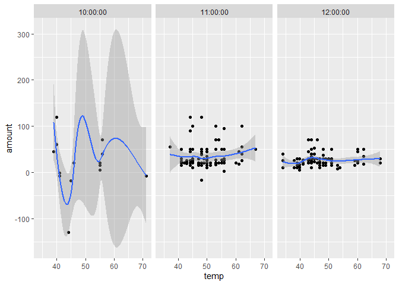

```
## Loading required package: lubridate
```

```
## 
## Attaching package: 'lubridate'
```

```
## The following objects are masked from 'package:base':
## 
##     date, intersect, setdiff, union
```

```
## Loading required package: riem
```

```
## Loading required package: viridis
```

```
## Loading required package: viridisLite
```

```
## Loading required package: MASS
```

```
## Loading required package: tidyverse
```

```
## -- Attaching packages ---------------------------------- tidyverse 1.3.0 --
```

```
## v ggplot2 3.2.1     v purrr   0.3.4
## v tibble  3.0.4     v dplyr   1.0.2
## v tidyr   1.1.2     v stringr 1.4.0
## v readr   1.4.0     v forcats 0.4.0
```

```
## -- Conflicts ------------------------------------- tidyverse_conflicts() --
## x lubridate::as.difftime() masks base::as.difftime()
## x lubridate::date()        masks base::date()
## x dplyr::filter()          masks stats::filter()
## x lubridate::intersect()   masks base::intersect()
## x dplyr::lag()             masks stats::lag()
## x dplyr::select()          masks MASS::select()
## x lubridate::setdiff()     masks base::setdiff()
## x lubridate::union()       masks base::union()
```


```
## 
## -- Column specification ---------------------------------------------------
## cols(
##   name = col_character(),
##   type = col_character(),
##   time = col_datetime(format = ""),
##   amount = col_double()
## )
```

```
## Joining, by = c("date", "time")
```

<!-- --><!-- -->

```
## `geom_smooth()` using method = 'loess' and formula 'y ~ x'
```

<!-- -->

```
## `geom_smooth()` using method = 'loess' and formula 'y ~ x'
```

<!-- -->

#conclusion

When we look at the density plots by time we see the extreme times (10am, 5pm) (8am and 9am aren't included on the plot because there are only 10 and 4 values respectivley with the majority being negative, which can't be plotted by geom_density) are fairly flat distributions when compared to temp. The other time intervals form a progression with the early times concentrated around lower temperatures and as the day goes on the distributions start to stretch to the right and higher temps. As for the magnitude of the sells, regardless of the temperature, there is little no correlation. The extreme values still don't have enough data points to make meanningful conclusions
