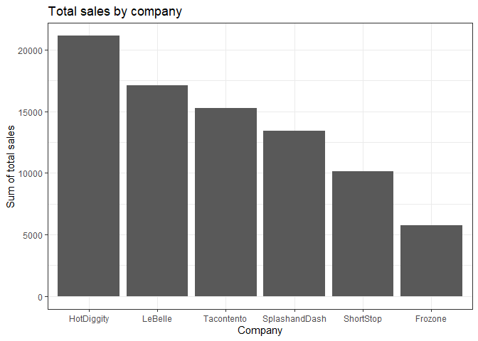
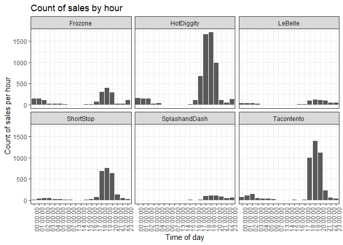
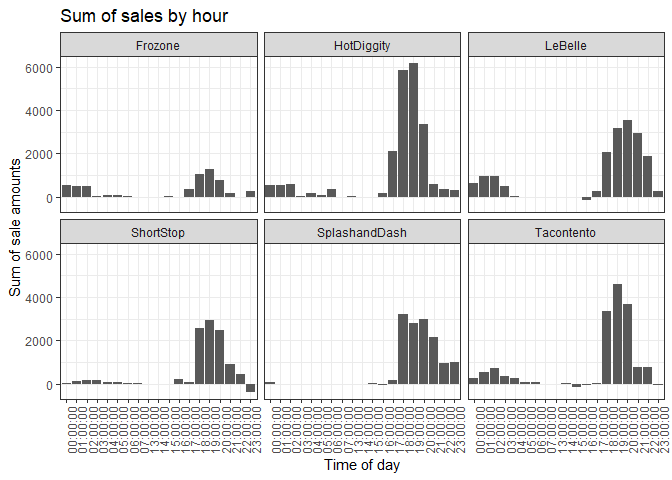
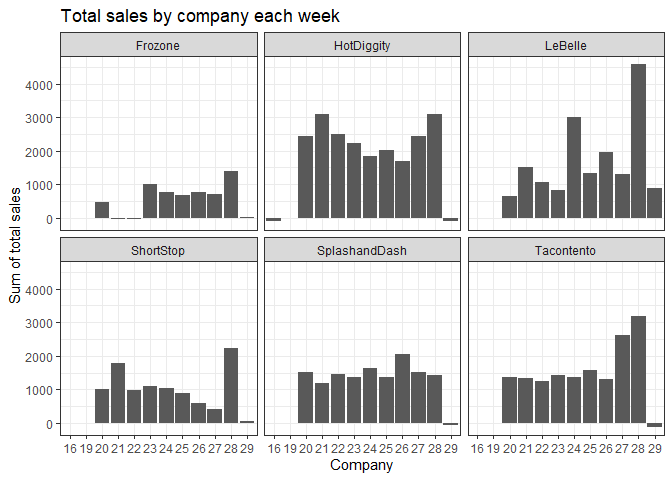
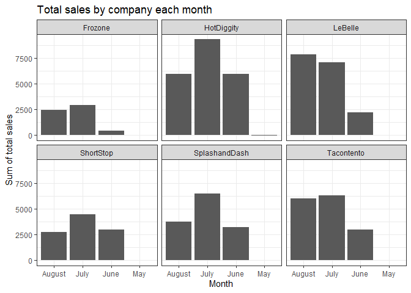
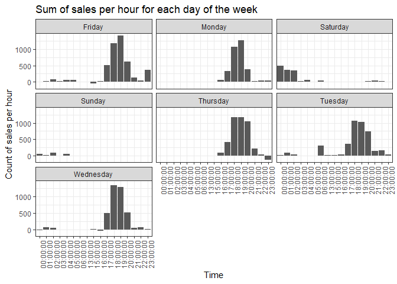

```r
total_sales
```

<!-- -->


# Analysis and Recommendations 

If we look at raw total sales over the time frame provided, we see that HotDiggity had the most total sales of any company.


```r
by_time
```

<!-- -->

```r
amount_by_time
```

<!-- -->


When we drill down and look at the traffic per hour and sum of sales per hour, we see that again HotDiggity has the greastest magnitude at its peak hours and very compared values at all other times again supporting that HotDiggit would be my recommendation. Looking at the traffic and sales by hour again specifically for HotDiggity, though this trend carries over to the other businesses as well, there is some traffic from 12am to about 5am, then a dead period from 5am to 3 or 4pm, then a surge in traffic when most transactions are done. The surge ends around 10pm, but there is consistent traffic until the end of the day. Realistically the early morning traffic is probably a continuation of the late day traffic. 


```r
weekly_plot
```

<!-- -->

```r
monthly_plot
```

<!-- -->


Our inferences hold when we look at sum of sales by week and by month


```r
weekday
```

<!-- -->


Finally, when we look at sales by hour and weekday we see that the general trend seen in the previous holds for Monday through Friday, but with no early morning traffic on Monday and Thursday. Saturday and Sunday have exclusivley morning traffic, and are lower total traffic days than the weekdays. My recommendation for operating hours would be: 4pm to 5am on the weekdays, and 12am to 5am on the weekends. 
