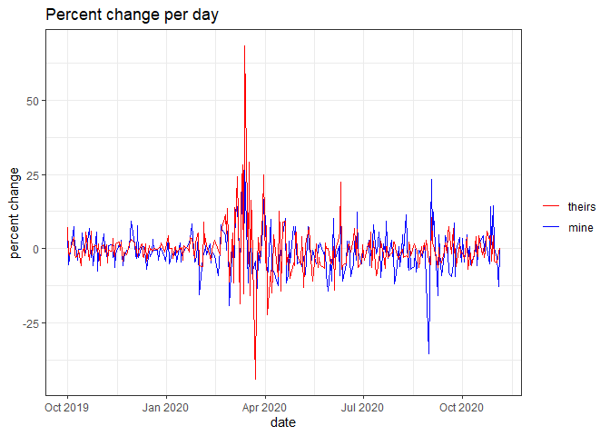
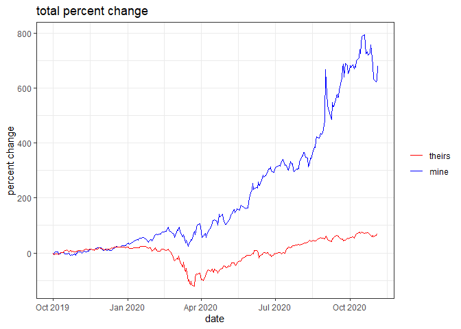
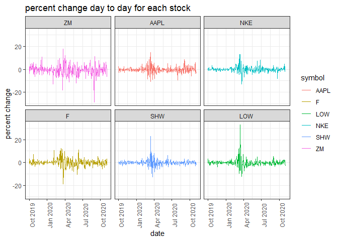
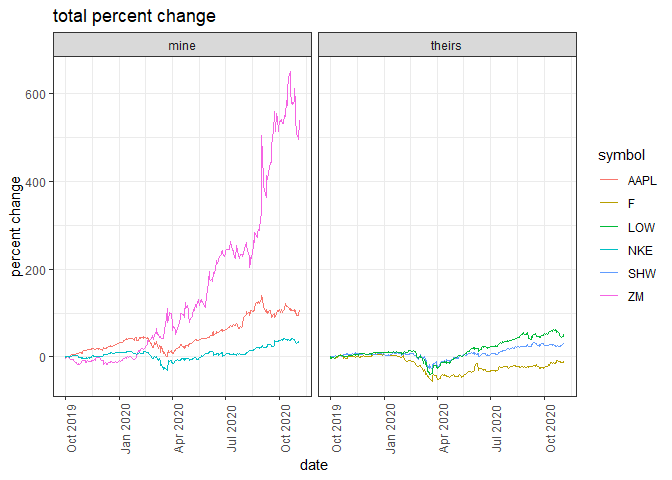

# intro 

I decided that I was going to use percent change of closing price as the measure because it would account for the initial price when we bought the stocks and show the growth of our investments. 


```r
#who wins each day
win_day <- ggplot() +
  geom_line(data = my_win_day, mapping = aes(x = date, y = sum_change_day, color = 'red')) +
  geom_line(data = their_win_day, mapping = aes(x = date, y = sum_change_day, color = 'blue')) +
  ylab('percent change') +
  scale_color_manual(labels = c('theirs', 'mine'), values = c('red', 'blue')) +
  labs(color = NULL) +
  ggtitle('Percent change per day') +
  theme_bw()
win_day
```

<!-- -->

# by day

in this graph we can see each of our percent increase or decrease relative to the previous day. this graph doesn't tell us who won the total competition, but if we are to pick a point we can tell who improved the most from the previous day. 


```r
#who wins in total
win_total <- ggplot() +
  geom_line(data = my_win_total, mapping = aes(x = date, y = sum_change_total, color = 'red')) +
  geom_line(data = their_win_total, mapping = aes(x = date, y = sum_change_total, color = 'blue')) +
  ylab('percent change') +
  scale_color_manual(labels = c('theirs', 'mine'), values = c('red', 'blue')) +
  labs(color = NULL) +
  ggtitle('total percent change') +
  theme_bw()  
win_total
```

<!-- -->

# in total

in this graph we can see the percent difference relative to the closing price we first bought at. This is more indicative of who won the overall competition. 


```r
#which stokcs help by day
perc_graph <- ggplot() +
  geom_line(data = my_stocks, mapping = aes(x = date, y = perc_change, color = symbol)) +
  geom_line(data = their_stocks, mapping = aes(x = date, y = perc_change, color = symbol)) +
  facet_wrap(~symbol) +
  ylab('percent change') +
  ggtitle('percent change day to day for each stock') +
  theme_bw() +
  theme(axis.text.x = element_text(angle = 90)) 
perc_graph
```

<!-- -->

# which stocks helped the most 

this graph shows which stock had the greatest day to day gains or losses, mine are on the top row and theirs are the bottom row. again it's not immediately obvious which stock contributed the most. the most I can personally infer is that greater amplitude areas on the graph are time periods of rapid growth or loss and therefore a consistently high amplitude across the graph implies large amounts of change over time period, though it isn't easy to determine the direction of change.


```r
# which stocks help in total 
p <- ggplot() +
  geom_line(data = my_stocks, mapping = aes(x = date, y = total_perc_change, color = symbol)) +
  geom_line(data = their_stocks, mapping = aes(x = date, y = total_perc_change, color = symbol)) +
  facet_wrap(~data) +
  ylab('percent change') +
  ggtitle('total percent change') +
  theme_bw() +
  theme(axis.text.x = element_text(angle = 90)) +
  ggtitle('total percent change')
p
```

<!-- -->

in this graph we see the total percent change relative to intial close price. my inference from the previous graph holds as we can see zoom had the most consistent large amplitude variations and also had the most toal change from inital price. it's also evident that most of the margin by wich I won by was due to the incredible gains in zoom stock. 

# conclusion

in conclusion, I won because of zoom
