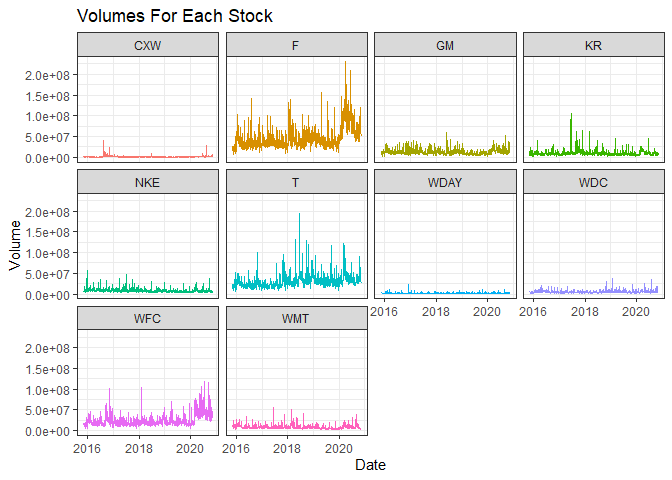

```r
dygraph(matrix_prices, main = 'Tickers') %>%
  dySeries(fillGraph = FALSE) %>% 
  dyHighlight(highlightCircleSize = 5., 
              highlightSeriesBackgroundAlpha = 0.2,
              hideOnMouseOut = FALSE) %>% 
  dyOptions(axisLineColor = "black",
            gridLineColor = "black") %>% 
  dyRangeSelector() 
```

<!--html_preserve--><div id="htmlwidget-d87e80778c013bcb59b5" style="width:672px;height:480px;" class="dygraphs html-widget"></div>
<script type="application/json" data-for="htmlwidget-d87e80778c013bcb59b5">{"x":{"attrs":{"title":"Tickers","labels":["day","F","GM","KR","WDC","NKE","T","WDAY","WFC","WMT","CXW"],"legend":"auto","retainDateWindow":false,"axes":{"x":{"pixelsPerLabel":60,"drawAxis":true},"y":{"drawAxis":true}},"series":{"CXW":{"axis":"y","fillGraph":false}},"highlightCircleSize":5,"highlightSeriesBackgroundAlpha":0.2,"highlightSeriesOpts":[],"hideOverlayOnMouseOut":false,"stackedGraph":false,"fillGraph":false,"fillAlpha":0.15,"stepPlot":false,"drawPoints":false,"pointSize":1,"drawGapEdgePoints":false,"connectSeparatedPoints":false,"strokeWidth":1,"strokeBorderColor":"white","colorValue":0.5,"colorSaturation":1,"includeZero":false,"drawAxesAtZero":false,"logscale":false,"axisTickSize":3,"axisLineColor":"black","axisLineWidth":0.3,"axisLabelColor":"black","axisLabelFontSize":14,"axisLabelWidth":60,"drawGrid":true,"gridLineColor":"black","gridLineWidth":0.3,"rightGap":5,"digitsAfterDecimal":2,"labelsKMB":false,"labelsKMG2":false,"labelsUTC":false,"maxNumberWidth":6,"animatedZooms":false,"mobileDisableYTouch":true,"disableZoom":false,"showRangeSelector":true,"rangeSelectorHeight":40,"rangeSelectorPlotFillColor":" #A7B1C4","rangeSelectorPlotStrokeColor":"#808FAB","interactionModel":"Dygraph.Interaction.defaultModel"},"scale":"daily","annotations":[],"shadings":[],"events":[],"format":"date","data":[["2015-11-09T00:00:00.000Z","2015-11-10T00:00:00.000Z","2015-11-11T00:00:00.000Z","2015-11-12T00:00:00.000Z","2015-11-13T00:00:00.000Z","2015-11-16T00:00:00.000Z","2015-11-17T00:00:00.000Z","2015-11-18T00:00:00.000Z","2015-11-19T00:00:00.000Z","2015-11-20T00:00:00.000Z","2015-11-23T00:00:00.000Z","2015-11-24T00:00:00.000Z","2015-11-25T00:00:00.000Z","2015-11-27T00:00:00.000Z","2015-11-30T00:00:00.000Z","2015-12-01T00:00:00.000Z","2015-12-02T00:00:00.000Z","2015-12-03T00:00:00.000Z","2015-12-04T00:00:00.000Z","2015-12-07T00:00:00.000Z","2015-12-08T00:00:00.000Z","2015-12-09T00:00:00.000Z","2015-12-10T00:00:00.000Z","2015-12-11T00:00:00.000Z","2015-12-14T00:00:00.000Z","2015-12-15T00:00:00.000Z","2015-12-16T00:00:00.000Z","2015-12-17T00:00:00.000Z","2015-12-18T00:00:00.000Z","2015-12-21T00:00:00.000Z","2015-12-22T00:00:00.000Z","2015-12-23T00:00:00.000Z","2015-12-24T00:00:00.000Z","2015-12-28T00:00:00.000Z","2015-12-29T00:00:00.000Z","2015-12-30T00:00:00.000Z","2015-12-31T00:00:00.000Z","2016-01-04T00:00:00.000Z","2016-01-05T00:00:00.000Z","2016-01-06T00:00:00.000Z","2016-01-07T00:00:00.000Z","2016-01-08T00:00:00.000Z","2016-01-11T00:00:00.000Z","2016-01-12T00:00:00.000Z","2016-01-13T00:00:00.000Z","2016-01-14T00:00:00.000Z","2016-01-15T00:00:00.000Z","2016-01-19T00:00:00.000Z","2016-01-20T00:00:00.000Z","2016-01-21T00:00:00.000Z","2016-01-22T00:00:00.000Z","2016-01-25T00:00:00.000Z","2016-01-26T00:00:00.000Z","2016-01-27T00:00:00.000Z","2016-01-28T00:00:00.000Z","2016-01-29T00:00:00.000Z","2016-02-01T00:00:00.000Z","2016-02-02T00:00:00.000Z","2016-02-03T00:00:00.000Z","2016-02-04T00:00:00.000Z","2016-02-05T00:00:00.000Z","2016-02-08T00:00:00.000Z","2016-02-09T00:00:00.000Z","2016-02-10T00:00:00.000Z","2016-02-11T00:00:00.000Z","2016-02-12T00:00:00.000Z","2016-02-16T00:00:00.000Z","2016-02-17T00:00:00.000Z","2016-02-18T00:00:00.000Z","2016-02-19T00:00:00.000Z","2016-02-22T00:00:00.000Z","2016-02-23T00:00:00.000Z","2016-02-24T00:00:00.000Z","2016-02-25T00:00:00.000Z","2016-02-26T00:00:00.000Z","2016-02-29T00:00:00.000Z","2016-03-01T00:00:00.000Z","2016-03-02T00:00:00.000Z","2016-03-03T00:00:00.000Z","2016-03-04T00:00:00.000Z","2016-03-07T00:00:00.000Z","2016-03-08T00:00:00.000Z","2016-03-09T00:00:00.000Z","2016-03-10T00:00:00.000Z","2016-03-11T00:00:00.000Z","2016-03-14T00:00:00.000Z","2016-03-15T00:00:00.000Z","2016-03-16T00:00:00.000Z","2016-03-17T00:00:00.000Z","2016-03-18T00:00:00.000Z","2016-03-21T00:00:00.000Z","2016-03-22T00:00:00.000Z","2016-03-23T00:00:00.000Z","2016-03-24T00:00:00.000Z","2016-03-28T00:00:00.000Z","2016-03-29T00:00:00.000Z","2016-03-30T00:00:00.000Z","2016-03-31T00:00:00.000Z","2016-04-01T00:00:00.000Z","2016-04-04T00:00:00.000Z","2016-04-05T00:00:00.000Z","2016-04-06T00:00:00.000Z","2016-04-07T00:00:00.000Z","2016-04-08T00:00:00.000Z","2016-04-11T00:00:00.000Z","2016-04-12T00:00:00.000Z","2016-04-13T00:00:00.000Z","2016-04-14T00:00:00.000Z","2016-04-15T00:00:00.000Z","2016-04-18T00:00:00.000Z","2016-04-19T00:00:00.000Z","2016-04-20T00:00:00.000Z","2016-04-21T00:00:00.000Z","2016-04-22T00:00:00.000Z","2016-04-25T00:00:00.000Z","2016-04-26T00:00:00.000Z","2016-04-27T00:00:00.000Z","2016-04-28T00:00:00.000Z","2016-04-29T00:00:00.000Z","2016-05-02T00:00:00.000Z","2016-05-03T00:00:00.000Z","2016-05-04T00:00:00.000Z","2016-05-05T00:00:00.000Z","2016-05-06T00:00:00.000Z","2016-05-09T00:00:00.000Z","2016-05-10T00:00:00.000Z","2016-05-11T00:00:00.000Z","2016-05-12T00:00:00.000Z","2016-05-13T00:00:00.000Z","2016-05-16T00:00:00.000Z","2016-05-17T00:00:00.000Z","2016-05-18T00:00:00.000Z","2016-05-19T00:00:00.000Z","2016-05-20T00:00:00.000Z","2016-05-23T00:00:00.000Z","2016-05-24T00:00:00.000Z","2016-05-25T00:00:00.000Z","2016-05-26T00:00:00.000Z","2016-05-27T00:00:00.000Z","2016-05-31T00:00:00.000Z","2016-06-01T00:00:00.000Z","2016-06-02T00:00:00.000Z","2016-06-03T00:00:00.000Z","2016-06-06T00:00:00.000Z","2016-06-07T00:00:00.000Z","2016-06-08T00:00:00.000Z","2016-06-09T00:00:00.000Z","2016-06-10T00:00:00.000Z","2016-06-13T00:00:00.000Z","2016-06-14T00:00:00.000Z","2016-06-15T00:00:00.000Z","2016-06-16T00:00:00.000Z","2016-06-17T00:00:00.000Z","2016-06-20T00:00:00.000Z","2016-06-21T00:00:00.000Z","2016-06-22T00:00:00.000Z","2016-06-23T00:00:00.000Z","2016-06-24T00:00:00.000Z","2016-06-27T00:00:00.000Z","2016-06-28T00:00:00.000Z","2016-06-29T00:00:00.000Z","2016-06-30T00:00:00.000Z","2016-07-01T00:00:00.000Z","2016-07-05T00:00:00.000Z","2016-07-06T00:00:00.000Z","2016-07-07T00:00:00.000Z","2016-07-08T00:00:00.000Z","2016-07-11T00:00:00.000Z","2016-07-12T00:00:00.000Z","2016-07-13T00:00:00.000Z","2016-07-14T00:00:00.000Z","2016-07-15T00:00:00.000Z","2016-07-18T00:00:00.000Z","2016-07-19T00:00:00.000Z","2016-07-20T00:00:00.000Z","2016-07-21T00:00:00.000Z","2016-07-22T00:00:00.000Z","2016-07-25T00:00:00.000Z","2016-07-26T00:00:00.000Z","2016-07-27T00:00:00.000Z","2016-07-28T00:00:00.000Z","2016-07-29T00:00:00.000Z","2016-08-01T00:00:00.000Z","2016-08-02T00:00:00.000Z","2016-08-03T00:00:00.000Z","2016-08-04T00:00:00.000Z","2016-08-05T00:00:00.000Z","2016-08-08T00:00:00.000Z","2016-08-09T00:00:00.000Z","2016-08-10T00:00:00.000Z","2016-08-11T00:00:00.000Z","2016-08-12T00:00:00.000Z","2016-08-15T00:00:00.000Z","2016-08-16T00:00:00.000Z","2016-08-17T00:00:00.000Z","2016-08-18T00:00:00.000Z","2016-08-19T00:00:00.000Z","2016-08-22T00:00:00.000Z","2016-08-23T00:00:00.000Z","2016-08-24T00:00:00.000Z","2016-08-25T00:00:00.000Z","2016-08-26T00:00:00.000Z","2016-08-29T00:00:00.000Z","2016-08-30T00:00:00.000Z","2016-08-31T00:00:00.000Z","2016-09-01T00:00:00.000Z","2016-09-02T00:00:00.000Z","2016-09-06T00:00:00.000Z","2016-09-07T00:00:00.000Z","2016-09-08T00:00:00.000Z","2016-09-09T00:00:00.000Z","2016-09-12T00:00:00.000Z","2016-09-13T00:00:00.000Z","2016-09-14T00:00:00.000Z","2016-09-15T00:00:00.000Z","2016-09-16T00:00:00.000Z","2016-09-19T00:00:00.000Z","2016-09-20T00:00:00.000Z","2016-09-21T00:00:00.000Z","2016-09-22T00:00:00.000Z","2016-09-23T00:00:00.000Z","2016-09-26T00:00:00.000Z","2016-09-27T00:00:00.000Z","2016-09-28T00:00:00.000Z","2016-09-29T00:00:00.000Z","2016-09-30T00:00:00.000Z","2016-10-03T00:00:00.000Z","2016-10-04T00:00:00.000Z","2016-10-05T00:00:00.000Z","2016-10-06T00:00:00.000Z","2016-10-07T00:00:00.000Z","2016-10-10T00:00:00.000Z","2016-10-11T00:00:00.000Z","2016-10-12T00:00:00.000Z","2016-10-13T00:00:00.000Z","2016-10-14T00:00:00.000Z","2016-10-17T00:00:00.000Z","2016-10-18T00:00:00.000Z","2016-10-19T00:00:00.000Z","2016-10-20T00:00:00.000Z","2016-10-21T00:00:00.000Z","2016-10-24T00:00:00.000Z","2016-10-25T00:00:00.000Z","2016-10-26T00:00:00.000Z","2016-10-27T00:00:00.000Z","2016-10-28T00:00:00.000Z","2016-10-31T00:00:00.000Z","2016-11-01T00:00:00.000Z","2016-11-02T00:00:00.000Z","2016-11-03T00:00:00.000Z","2016-11-04T00:00:00.000Z","2016-11-07T00:00:00.000Z","2016-11-08T00:00:00.000Z","2016-11-09T00:00:00.000Z","2016-11-10T00:00:00.000Z","2016-11-11T00:00:00.000Z","2016-11-14T00:00:00.000Z","2016-11-15T00:00:00.000Z","2016-11-16T00:00:00.000Z","2016-11-17T00:00:00.000Z","2016-11-18T00:00:00.000Z","2016-11-21T00:00:00.000Z","2016-11-22T00:00:00.000Z","2016-11-23T00:00:00.000Z","2016-11-25T00:00:00.000Z","2016-11-28T00:00:00.000Z","2016-11-29T00:00:00.000Z","2016-11-30T00:00:00.000Z","2016-12-01T00:00:00.000Z","2016-12-02T00:00:00.000Z","2016-12-05T00:00:00.000Z","2016-12-06T00:00:00.000Z","2016-12-07T00:00:00.000Z","2016-12-08T00:00:00.000Z","2016-12-09T00:00:00.000Z","2016-12-12T00:00:00.000Z","2016-12-13T00:00:00.000Z","2016-12-14T00:00:00.000Z","2016-12-15T00:00:00.000Z","2016-12-16T00:00:00.000Z","2016-12-19T00:00:00.000Z","2016-12-20T00:00:00.000Z","2016-12-21T00:00:00.000Z","2016-12-22T00:00:00.000Z","2016-12-23T00:00:00.000Z","2016-12-27T00:00:00.000Z","2016-12-28T00:00:00.000Z","2016-12-29T00:00:00.000Z","2016-12-30T00:00:00.000Z","2017-01-03T00:00:00.000Z","2017-01-04T00:00:00.000Z","2017-01-05T00:00:00.000Z","2017-01-06T00:00:00.000Z","2017-01-09T00:00:00.000Z","2017-01-10T00:00:00.000Z","2017-01-11T00:00:00.000Z","2017-01-12T00:00:00.000Z","2017-01-13T00:00:00.000Z","2017-01-17T00:00:00.000Z","2017-01-18T00:00:00.000Z","2017-01-19T00:00:00.000Z","2017-01-20T00:00:00.000Z","2017-01-23T00:00:00.000Z","2017-01-24T00:00:00.000Z","2017-01-25T00:00:00.000Z","2017-01-26T00:00:00.000Z","2017-01-27T00:00:00.000Z","2017-01-30T00:00:00.000Z","2017-01-31T00:00:00.000Z","2017-02-01T00:00:00.000Z","2017-02-02T00:00:00.000Z","2017-02-03T00:00:00.000Z","2017-02-06T00:00:00.000Z","2017-02-07T00:00:00.000Z","2017-02-08T00:00:00.000Z","2017-02-09T00:00:00.000Z","2017-02-10T00:00:00.000Z","2017-02-13T00:00:00.000Z","2017-02-14T00:00:00.000Z","2017-02-15T00:00:00.000Z","2017-02-16T00:00:00.000Z","2017-02-17T00:00:00.000Z","2017-02-21T00:00:00.000Z","2017-02-22T00:00:00.000Z","2017-02-23T00:00:00.000Z","2017-02-24T00:00:00.000Z","2017-02-27T00:00:00.000Z","2017-02-28T00:00:00.000Z","2017-03-01T00:00:00.000Z","2017-03-02T00:00:00.000Z","2017-03-03T00:00:00.000Z","2017-03-06T00:00:00.000Z","2017-03-07T00:00:00.000Z","2017-03-08T00:00:00.000Z","2017-03-09T00:00:00.000Z","2017-03-10T00:00:00.000Z","2017-03-13T00:00:00.000Z","2017-03-14T00:00:00.000Z","2017-03-15T00:00:00.000Z","2017-03-16T00:00:00.000Z","2017-03-17T00:00:00.000Z","2017-03-20T00:00:00.000Z","2017-03-21T00:00:00.000Z","2017-03-22T00:00:00.000Z","2017-03-23T00:00:00.000Z","2017-03-24T00:00:00.000Z","2017-03-27T00:00:00.000Z","2017-03-28T00:00:00.000Z","2017-03-29T00:00:00.000Z","2017-03-30T00:00:00.000Z","2017-03-31T00:00:00.000Z","2017-04-03T00:00:00.000Z","2017-04-04T00:00:00.000Z","2017-04-05T00:00:00.000Z","2017-04-06T00:00:00.000Z","2017-04-07T00:00:00.000Z","2017-04-10T00:00:00.000Z","2017-04-11T00:00:00.000Z","2017-04-12T00:00:00.000Z","2017-04-13T00:00:00.000Z","2017-04-17T00:00:00.000Z","2017-04-18T00:00:00.000Z","2017-04-19T00:00:00.000Z","2017-04-20T00:00:00.000Z","2017-04-21T00:00:00.000Z","2017-04-24T00:00:00.000Z","2017-04-25T00:00:00.000Z","2017-04-26T00:00:00.000Z","2017-04-27T00:00:00.000Z","2017-04-28T00:00:00.000Z","2017-05-01T00:00:00.000Z","2017-05-02T00:00:00.000Z","2017-05-03T00:00:00.000Z","2017-05-04T00:00:00.000Z","2017-05-05T00:00:00.000Z","2017-05-08T00:00:00.000Z","2017-05-09T00:00:00.000Z","2017-05-10T00:00:00.000Z","2017-05-11T00:00:00.000Z","2017-05-12T00:00:00.000Z","2017-05-15T00:00:00.000Z","2017-05-16T00:00:00.000Z","2017-05-17T00:00:00.000Z","2017-05-18T00:00:00.000Z","2017-05-19T00:00:00.000Z","2017-05-22T00:00:00.000Z","2017-05-23T00:00:00.000Z","2017-05-24T00:00:00.000Z","2017-05-25T00:00:00.000Z","2017-05-26T00:00:00.000Z","2017-05-30T00:00:00.000Z","2017-05-31T00:00:00.000Z","2017-06-01T00:00:00.000Z","2017-06-02T00:00:00.000Z","2017-06-05T00:00:00.000Z","2017-06-06T00:00:00.000Z","2017-06-07T00:00:00.000Z","2017-06-08T00:00:00.000Z","2017-06-09T00:00:00.000Z","2017-06-12T00:00:00.000Z","2017-06-13T00:00:00.000Z","2017-06-14T00:00:00.000Z","2017-06-15T00:00:00.000Z","2017-06-16T00:00:00.000Z","2017-06-19T00:00:00.000Z","2017-06-20T00:00:00.000Z","2017-06-21T00:00:00.000Z","2017-06-22T00:00:00.000Z","2017-06-23T00:00:00.000Z","2017-06-26T00:00:00.000Z","2017-06-27T00:00:00.000Z","2017-06-28T00:00:00.000Z","2017-06-29T00:00:00.000Z","2017-06-30T00:00:00.000Z","2017-07-03T00:00:00.000Z","2017-07-05T00:00:00.000Z","2017-07-06T00:00:00.000Z","2017-07-07T00:00:00.000Z","2017-07-10T00:00:00.000Z","2017-07-11T00:00:00.000Z","2017-07-12T00:00:00.000Z","2017-07-13T00:00:00.000Z","2017-07-14T00:00:00.000Z","2017-07-17T00:00:00.000Z","2017-07-18T00:00:00.000Z","2017-07-19T00:00:00.000Z","2017-07-20T00:00:00.000Z","2017-07-21T00:00:00.000Z","2017-07-24T00:00:00.000Z","2017-07-25T00:00:00.000Z","2017-07-26T00:00:00.000Z","2017-07-27T00:00:00.000Z","2017-07-28T00:00:00.000Z","2017-07-31T00:00:00.000Z","2017-08-01T00:00:00.000Z","2017-08-02T00:00:00.000Z","2017-08-03T00:00:00.000Z","2017-08-04T00:00:00.000Z","2017-08-07T00:00:00.000Z","2017-08-08T00:00:00.000Z","2017-08-09T00:00:00.000Z","2017-08-10T00:00:00.000Z","2017-08-11T00:00:00.000Z","2017-08-14T00:00:00.000Z","2017-08-15T00:00:00.000Z","2017-08-16T00:00:00.000Z","2017-08-17T00:00:00.000Z","2017-08-18T00:00:00.000Z","2017-08-21T00:00:00.000Z","2017-08-22T00:00:00.000Z","2017-08-23T00:00:00.000Z","2017-08-24T00:00:00.000Z","2017-08-25T00:00:00.000Z","2017-08-28T00:00:00.000Z","2017-08-29T00:00:00.000Z","2017-08-30T00:00:00.000Z","2017-08-31T00:00:00.000Z","2017-09-01T00:00:00.000Z","2017-09-05T00:00:00.000Z","2017-09-06T00:00:00.000Z","2017-09-07T00:00:00.000Z","2017-09-08T00:00:00.000Z","2017-09-11T00:00:00.000Z","2017-09-12T00:00:00.000Z","2017-09-13T00:00:00.000Z","2017-09-14T00:00:00.000Z","2017-09-15T00:00:00.000Z","2017-09-18T00:00:00.000Z","2017-09-19T00:00:00.000Z","2017-09-20T00:00:00.000Z","2017-09-21T00:00:00.000Z","2017-09-22T00:00:00.000Z","2017-09-25T00:00:00.000Z","2017-09-26T00:00:00.000Z","2017-09-27T00:00:00.000Z","2017-09-28T00:00:00.000Z","2017-09-29T00:00:00.000Z","2017-10-02T00:00:00.000Z","2017-10-03T00:00:00.000Z","2017-10-04T00:00:00.000Z","2017-10-05T00:00:00.000Z","2017-10-06T00:00:00.000Z","2017-10-09T00:00:00.000Z","2017-10-10T00:00:00.000Z","2017-10-11T00:00:00.000Z","2017-10-12T00:00:00.000Z","2017-10-13T00:00:00.000Z","2017-10-16T00:00:00.000Z","2017-10-17T00:00:00.000Z","2017-10-18T00:00:00.000Z","2017-10-19T00:00:00.000Z","2017-10-20T00:00:00.000Z","2017-10-23T00:00:00.000Z","2017-10-24T00:00:00.000Z","2017-10-25T00:00:00.000Z","2017-10-26T00:00:00.000Z","2017-10-27T00:00:00.000Z","2017-10-30T00:00:00.000Z","2017-10-31T00:00:00.000Z","2017-11-01T00:00:00.000Z","2017-11-02T00:00:00.000Z","2017-11-03T00:00:00.000Z","2017-11-06T00:00:00.000Z","2017-11-07T00:00:00.000Z","2017-11-08T00:00:00.000Z","2017-11-09T00:00:00.000Z","2017-11-10T00:00:00.000Z","2017-11-13T00:00:00.000Z","2017-11-14T00:00:00.000Z","2017-11-15T00:00:00.000Z","2017-11-16T00:00:00.000Z","2017-11-17T00:00:00.000Z","2017-11-20T00:00:00.000Z","2017-11-21T00:00:00.000Z","2017-11-22T00:00:00.000Z","2017-11-24T00:00:00.000Z","2017-11-27T00:00:00.000Z","2017-11-28T00:00:00.000Z","2017-11-29T00:00:00.000Z","2017-11-30T00:00:00.000Z","2017-12-01T00:00:00.000Z","2017-12-04T00:00:00.000Z","2017-12-05T00:00:00.000Z","2017-12-06T00:00:00.000Z","2017-12-07T00:00:00.000Z","2017-12-08T00:00:00.000Z","2017-12-11T00:00:00.000Z","2017-12-12T00:00:00.000Z","2017-12-13T00:00:00.000Z","2017-12-14T00:00:00.000Z","2017-12-15T00:00:00.000Z","2017-12-18T00:00:00.000Z","2017-12-19T00:00:00.000Z","2017-12-20T00:00:00.000Z","2017-12-21T00:00:00.000Z","2017-12-22T00:00:00.000Z","2017-12-26T00:00:00.000Z","2017-12-27T00:00:00.000Z","2017-12-28T00:00:00.000Z","2017-12-29T00:00:00.000Z","2018-01-02T00:00:00.000Z","2018-01-03T00:00:00.000Z","2018-01-04T00:00:00.000Z","2018-01-05T00:00:00.000Z","2018-01-08T00:00:00.000Z","2018-01-09T00:00:00.000Z","2018-01-10T00:00:00.000Z","2018-01-11T00:00:00.000Z","2018-01-12T00:00:00.000Z","2018-01-16T00:00:00.000Z","2018-01-17T00:00:00.000Z","2018-01-18T00:00:00.000Z","2018-01-19T00:00:00.000Z","2018-01-22T00:00:00.000Z","2018-01-23T00:00:00.000Z","2018-01-24T00:00:00.000Z","2018-01-25T00:00:00.000Z","2018-01-26T00:00:00.000Z","2018-01-29T00:00:00.000Z","2018-01-30T00:00:00.000Z","2018-01-31T00:00:00.000Z","2018-02-01T00:00:00.000Z","2018-02-02T00:00:00.000Z","2018-02-05T00:00:00.000Z","2018-02-06T00:00:00.000Z","2018-02-07T00:00:00.000Z","2018-02-08T00:00:00.000Z","2018-02-09T00:00:00.000Z","2018-02-12T00:00:00.000Z","2018-02-13T00:00:00.000Z","2018-02-14T00:00:00.000Z","2018-02-15T00:00:00.000Z","2018-02-16T00:00:00.000Z","2018-02-20T00:00:00.000Z","2018-02-21T00:00:00.000Z","2018-02-22T00:00:00.000Z","2018-02-23T00:00:00.000Z","2018-02-26T00:00:00.000Z","2018-02-27T00:00:00.000Z","2018-02-28T00:00:00.000Z","2018-03-01T00:00:00.000Z","2018-03-02T00:00:00.000Z","2018-03-05T00:00:00.000Z","2018-03-06T00:00:00.000Z","2018-03-07T00:00:00.000Z","2018-03-08T00:00:00.000Z","2018-03-09T00:00:00.000Z","2018-03-12T00:00:00.000Z","2018-03-13T00:00:00.000Z","2018-03-14T00:00:00.000Z","2018-03-15T00:00:00.000Z","2018-03-16T00:00:00.000Z","2018-03-19T00:00:00.000Z","2018-03-20T00:00:00.000Z","2018-03-21T00:00:00.000Z","2018-03-22T00:00:00.000Z","2018-03-23T00:00:00.000Z","2018-03-26T00:00:00.000Z","2018-03-27T00:00:00.000Z","2018-03-28T00:00:00.000Z","2018-03-29T00:00:00.000Z","2018-04-02T00:00:00.000Z","2018-04-03T00:00:00.000Z","2018-04-04T00:00:00.000Z","2018-04-05T00:00:00.000Z","2018-04-06T00:00:00.000Z","2018-04-09T00:00:00.000Z","2018-04-10T00:00:00.000Z","2018-04-11T00:00:00.000Z","2018-04-12T00:00:00.000Z","2018-04-13T00:00:00.000Z","2018-04-16T00:00:00.000Z","2018-04-17T00:00:00.000Z","2018-04-18T00:00:00.000Z","2018-04-19T00:00:00.000Z","2018-04-20T00:00:00.000Z","2018-04-23T00:00:00.000Z","2018-04-24T00:00:00.000Z","2018-04-25T00:00:00.000Z","2018-04-26T00:00:00.000Z","2018-04-27T00:00:00.000Z","2018-04-30T00:00:00.000Z","2018-05-01T00:00:00.000Z","2018-05-02T00:00:00.000Z","2018-05-03T00:00:00.000Z","2018-05-04T00:00:00.000Z","2018-05-07T00:00:00.000Z","2018-05-08T00:00:00.000Z","2018-05-09T00:00:00.000Z","2018-05-10T00:00:00.000Z","2018-05-11T00:00:00.000Z","2018-05-14T00:00:00.000Z","2018-05-15T00:00:00.000Z","2018-05-16T00:00:00.000Z","2018-05-17T00:00:00.000Z","2018-05-18T00:00:00.000Z","2018-05-21T00:00:00.000Z","2018-05-22T00:00:00.000Z","2018-05-23T00:00:00.000Z","2018-05-24T00:00:00.000Z","2018-05-25T00:00:00.000Z","2018-05-29T00:00:00.000Z","2018-05-30T00:00:00.000Z","2018-05-31T00:00:00.000Z","2018-06-01T00:00:00.000Z","2018-06-04T00:00:00.000Z","2018-06-05T00:00:00.000Z","2018-06-06T00:00:00.000Z","2018-06-07T00:00:00.000Z","2018-06-08T00:00:00.000Z","2018-06-11T00:00:00.000Z","2018-06-12T00:00:00.000Z","2018-06-13T00:00:00.000Z","2018-06-14T00:00:00.000Z","2018-06-15T00:00:00.000Z","2018-06-18T00:00:00.000Z","2018-06-19T00:00:00.000Z","2018-06-20T00:00:00.000Z","2018-06-21T00:00:00.000Z","2018-06-22T00:00:00.000Z","2018-06-25T00:00:00.000Z","2018-06-26T00:00:00.000Z","2018-06-27T00:00:00.000Z","2018-06-28T00:00:00.000Z","2018-06-29T00:00:00.000Z","2018-07-02T00:00:00.000Z","2018-07-03T00:00:00.000Z","2018-07-05T00:00:00.000Z","2018-07-06T00:00:00.000Z","2018-07-09T00:00:00.000Z","2018-07-10T00:00:00.000Z","2018-07-11T00:00:00.000Z","2018-07-12T00:00:00.000Z","2018-07-13T00:00:00.000Z","2018-07-16T00:00:00.000Z","2018-07-17T00:00:00.000Z","2018-07-18T00:00:00.000Z","2018-07-19T00:00:00.000Z","2018-07-20T00:00:00.000Z","2018-07-23T00:00:00.000Z","2018-07-24T00:00:00.000Z","2018-07-25T00:00:00.000Z","2018-07-26T00:00:00.000Z","2018-07-27T00:00:00.000Z","2018-07-30T00:00:00.000Z","2018-07-31T00:00:00.000Z","2018-08-01T00:00:00.000Z","2018-08-02T00:00:00.000Z","2018-08-03T00:00:00.000Z","2018-08-06T00:00:00.000Z","2018-08-07T00:00:00.000Z","2018-08-08T00:00:00.000Z","2018-08-09T00:00:00.000Z","2018-08-10T00:00:00.000Z","2018-08-13T00:00:00.000Z","2018-08-14T00:00:00.000Z","2018-08-15T00:00:00.000Z","2018-08-16T00:00:00.000Z","2018-08-17T00:00:00.000Z","2018-08-20T00:00:00.000Z","2018-08-21T00:00:00.000Z","2018-08-22T00:00:00.000Z","2018-08-23T00:00:00.000Z","2018-08-24T00:00:00.000Z","2018-08-27T00:00:00.000Z","2018-08-28T00:00:00.000Z","2018-08-29T00:00:00.000Z","2018-08-30T00:00:00.000Z","2018-08-31T00:00:00.000Z","2018-09-04T00:00:00.000Z","2018-09-05T00:00:00.000Z","2018-09-06T00:00:00.000Z","2018-09-07T00:00:00.000Z","2018-09-10T00:00:00.000Z","2018-09-11T00:00:00.000Z","2018-09-12T00:00:00.000Z","2018-09-13T00:00:00.000Z","2018-09-14T00:00:00.000Z","2018-09-17T00:00:00.000Z","2018-09-18T00:00:00.000Z","2018-09-19T00:00:00.000Z","2018-09-20T00:00:00.000Z","2018-09-21T00:00:00.000Z","2018-09-24T00:00:00.000Z","2018-09-25T00:00:00.000Z","2018-09-26T00:00:00.000Z","2018-09-27T00:00:00.000Z","2018-09-28T00:00:00.000Z","2018-10-01T00:00:00.000Z","2018-10-02T00:00:00.000Z","2018-10-03T00:00:00.000Z","2018-10-04T00:00:00.000Z","2018-10-05T00:00:00.000Z","2018-10-08T00:00:00.000Z","2018-10-09T00:00:00.000Z","2018-10-10T00:00:00.000Z","2018-10-11T00:00:00.000Z","2018-10-12T00:00:00.000Z","2018-10-15T00:00:00.000Z","2018-10-16T00:00:00.000Z","2018-10-17T00:00:00.000Z","2018-10-18T00:00:00.000Z","2018-10-19T00:00:00.000Z","2018-10-22T00:00:00.000Z","2018-10-23T00:00:00.000Z","2018-10-24T00:00:00.000Z","2018-10-25T00:00:00.000Z","2018-10-26T00:00:00.000Z","2018-10-29T00:00:00.000Z","2018-10-30T00:00:00.000Z","2018-10-31T00:00:00.000Z","2018-11-01T00:00:00.000Z","2018-11-02T00:00:00.000Z","2018-11-05T00:00:00.000Z","2018-11-06T00:00:00.000Z","2018-11-07T00:00:00.000Z","2018-11-08T00:00:00.000Z","2018-11-09T00:00:00.000Z","2018-11-12T00:00:00.000Z","2018-11-13T00:00:00.000Z","2018-11-14T00:00:00.000Z","2018-11-15T00:00:00.000Z","2018-11-16T00:00:00.000Z","2018-11-19T00:00:00.000Z","2018-11-20T00:00:00.000Z","2018-11-21T00:00:00.000Z","2018-11-23T00:00:00.000Z","2018-11-26T00:00:00.000Z","2018-11-27T00:00:00.000Z","2018-11-28T00:00:00.000Z","2018-11-29T00:00:00.000Z","2018-11-30T00:00:00.000Z","2018-12-03T00:00:00.000Z","2018-12-04T00:00:00.000Z","2018-12-06T00:00:00.000Z","2018-12-07T00:00:00.000Z","2018-12-10T00:00:00.000Z","2018-12-11T00:00:00.000Z","2018-12-12T00:00:00.000Z","2018-12-13T00:00:00.000Z","2018-12-14T00:00:00.000Z","2018-12-17T00:00:00.000Z","2018-12-18T00:00:00.000Z","2018-12-19T00:00:00.000Z","2018-12-20T00:00:00.000Z","2018-12-21T00:00:00.000Z","2018-12-24T00:00:00.000Z","2018-12-26T00:00:00.000Z","2018-12-27T00:00:00.000Z","2018-12-28T00:00:00.000Z","2018-12-31T00:00:00.000Z","2019-01-02T00:00:00.000Z","2019-01-03T00:00:00.000Z","2019-01-04T00:00:00.000Z","2019-01-07T00:00:00.000Z","2019-01-08T00:00:00.000Z","2019-01-09T00:00:00.000Z","2019-01-10T00:00:00.000Z","2019-01-11T00:00:00.000Z","2019-01-14T00:00:00.000Z","2019-01-15T00:00:00.000Z","2019-01-16T00:00:00.000Z","2019-01-17T00:00:00.000Z","2019-01-18T00:00:00.000Z","2019-01-22T00:00:00.000Z","2019-01-23T00:00:00.000Z","2019-01-24T00:00:00.000Z","2019-01-25T00:00:00.000Z","2019-01-28T00:00:00.000Z","2019-01-29T00:00:00.000Z","2019-01-30T00:00:00.000Z","2019-01-31T00:00:00.000Z","2019-02-01T00:00:00.000Z","2019-02-04T00:00:00.000Z","2019-02-05T00:00:00.000Z","2019-02-06T00:00:00.000Z","2019-02-07T00:00:00.000Z","2019-02-08T00:00:00.000Z","2019-02-11T00:00:00.000Z","2019-02-12T00:00:00.000Z","2019-02-13T00:00:00.000Z","2019-02-14T00:00:00.000Z","2019-02-15T00:00:00.000Z","2019-02-19T00:00:00.000Z","2019-02-20T00:00:00.000Z","2019-02-21T00:00:00.000Z","2019-02-22T00:00:00.000Z","2019-02-25T00:00:00.000Z","2019-02-26T00:00:00.000Z","2019-02-27T00:00:00.000Z","2019-02-28T00:00:00.000Z","2019-03-01T00:00:00.000Z","2019-03-04T00:00:00.000Z","2019-03-05T00:00:00.000Z","2019-03-06T00:00:00.000Z","2019-03-07T00:00:00.000Z","2019-03-08T00:00:00.000Z","2019-03-11T00:00:00.000Z","2019-03-12T00:00:00.000Z","2019-03-13T00:00:00.000Z","2019-03-14T00:00:00.000Z","2019-03-15T00:00:00.000Z","2019-03-18T00:00:00.000Z","2019-03-19T00:00:00.000Z","2019-03-20T00:00:00.000Z","2019-03-21T00:00:00.000Z","2019-03-22T00:00:00.000Z","2019-03-25T00:00:00.000Z","2019-03-26T00:00:00.000Z","2019-03-27T00:00:00.000Z","2019-03-28T00:00:00.000Z","2019-03-29T00:00:00.000Z","2019-04-01T00:00:00.000Z","2019-04-02T00:00:00.000Z","2019-04-03T00:00:00.000Z","2019-04-04T00:00:00.000Z","2019-04-05T00:00:00.000Z","2019-04-08T00:00:00.000Z","2019-04-09T00:00:00.000Z","2019-04-10T00:00:00.000Z","2019-04-11T00:00:00.000Z","2019-04-12T00:00:00.000Z","2019-04-15T00:00:00.000Z","2019-04-16T00:00:00.000Z","2019-04-17T00:00:00.000Z","2019-04-18T00:00:00.000Z","2019-04-22T00:00:00.000Z","2019-04-23T00:00:00.000Z","2019-04-24T00:00:00.000Z","2019-04-25T00:00:00.000Z","2019-04-26T00:00:00.000Z","2019-04-29T00:00:00.000Z","2019-04-30T00:00:00.000Z","2019-05-01T00:00:00.000Z","2019-05-02T00:00:00.000Z","2019-05-03T00:00:00.000Z","2019-05-06T00:00:00.000Z","2019-05-07T00:00:00.000Z","2019-05-08T00:00:00.000Z","2019-05-09T00:00:00.000Z","2019-05-10T00:00:00.000Z","2019-05-13T00:00:00.000Z","2019-05-14T00:00:00.000Z","2019-05-15T00:00:00.000Z","2019-05-16T00:00:00.000Z","2019-05-17T00:00:00.000Z","2019-05-20T00:00:00.000Z","2019-05-21T00:00:00.000Z","2019-05-22T00:00:00.000Z","2019-05-23T00:00:00.000Z","2019-05-24T00:00:00.000Z","2019-05-28T00:00:00.000Z","2019-05-29T00:00:00.000Z","2019-05-30T00:00:00.000Z","2019-05-31T00:00:00.000Z","2019-06-03T00:00:00.000Z","2019-06-04T00:00:00.000Z","2019-06-05T00:00:00.000Z","2019-06-06T00:00:00.000Z","2019-06-07T00:00:00.000Z","2019-06-10T00:00:00.000Z","2019-06-11T00:00:00.000Z","2019-06-12T00:00:00.000Z","2019-06-13T00:00:00.000Z","2019-06-14T00:00:00.000Z","2019-06-17T00:00:00.000Z","2019-06-18T00:00:00.000Z","2019-06-19T00:00:00.000Z","2019-06-20T00:00:00.000Z","2019-06-21T00:00:00.000Z","2019-06-24T00:00:00.000Z","2019-06-25T00:00:00.000Z","2019-06-26T00:00:00.000Z","2019-06-27T00:00:00.000Z","2019-06-28T00:00:00.000Z","2019-07-01T00:00:00.000Z","2019-07-02T00:00:00.000Z","2019-07-03T00:00:00.000Z","2019-07-05T00:00:00.000Z","2019-07-08T00:00:00.000Z","2019-07-09T00:00:00.000Z","2019-07-10T00:00:00.000Z","2019-07-11T00:00:00.000Z","2019-07-12T00:00:00.000Z","2019-07-15T00:00:00.000Z","2019-07-16T00:00:00.000Z","2019-07-17T00:00:00.000Z","2019-07-18T00:00:00.000Z","2019-07-19T00:00:00.000Z","2019-07-22T00:00:00.000Z","2019-07-23T00:00:00.000Z","2019-07-24T00:00:00.000Z","2019-07-25T00:00:00.000Z","2019-07-26T00:00:00.000Z","2019-07-29T00:00:00.000Z","2019-07-30T00:00:00.000Z","2019-07-31T00:00:00.000Z","2019-08-01T00:00:00.000Z","2019-08-02T00:00:00.000Z","2019-08-05T00:00:00.000Z","2019-08-06T00:00:00.000Z","2019-08-07T00:00:00.000Z","2019-08-08T00:00:00.000Z","2019-08-09T00:00:00.000Z","2019-08-12T00:00:00.000Z","2019-08-13T00:00:00.000Z","2019-08-14T00:00:00.000Z","2019-08-15T00:00:00.000Z","2019-08-16T00:00:00.000Z","2019-08-19T00:00:00.000Z","2019-08-20T00:00:00.000Z","2019-08-21T00:00:00.000Z","2019-08-22T00:00:00.000Z","2019-08-23T00:00:00.000Z","2019-08-26T00:00:00.000Z","2019-08-27T00:00:00.000Z","2019-08-28T00:00:00.000Z","2019-08-29T00:00:00.000Z","2019-08-30T00:00:00.000Z","2019-09-03T00:00:00.000Z","2019-09-04T00:00:00.000Z","2019-09-05T00:00:00.000Z","2019-09-06T00:00:00.000Z","2019-09-09T00:00:00.000Z","2019-09-10T00:00:00.000Z","2019-09-11T00:00:00.000Z","2019-09-12T00:00:00.000Z","2019-09-13T00:00:00.000Z","2019-09-16T00:00:00.000Z","2019-09-17T00:00:00.000Z","2019-09-18T00:00:00.000Z","2019-09-19T00:00:00.000Z","2019-09-20T00:00:00.000Z","2019-09-23T00:00:00.000Z","2019-09-24T00:00:00.000Z","2019-09-25T00:00:00.000Z","2019-09-26T00:00:00.000Z","2019-09-27T00:00:00.000Z","2019-09-30T00:00:00.000Z","2019-10-01T00:00:00.000Z","2019-10-02T00:00:00.000Z","2019-10-03T00:00:00.000Z","2019-10-04T00:00:00.000Z","2019-10-07T00:00:00.000Z","2019-10-08T00:00:00.000Z","2019-10-09T00:00:00.000Z","2019-10-10T00:00:00.000Z","2019-10-11T00:00:00.000Z","2019-10-14T00:00:00.000Z","2019-10-15T00:00:00.000Z","2019-10-16T00:00:00.000Z","2019-10-17T00:00:00.000Z","2019-10-18T00:00:00.000Z","2019-10-21T00:00:00.000Z","2019-10-22T00:00:00.000Z","2019-10-23T00:00:00.000Z","2019-10-24T00:00:00.000Z","2019-10-25T00:00:00.000Z","2019-10-28T00:00:00.000Z","2019-10-29T00:00:00.000Z","2019-10-30T00:00:00.000Z","2019-10-31T00:00:00.000Z","2019-11-01T00:00:00.000Z","2019-11-04T00:00:00.000Z","2019-11-05T00:00:00.000Z","2019-11-06T00:00:00.000Z","2019-11-07T00:00:00.000Z","2019-11-08T00:00:00.000Z","2019-11-11T00:00:00.000Z","2019-11-12T00:00:00.000Z","2019-11-13T00:00:00.000Z","2019-11-14T00:00:00.000Z","2019-11-15T00:00:00.000Z","2019-11-18T00:00:00.000Z","2019-11-19T00:00:00.000Z","2019-11-20T00:00:00.000Z","2019-11-21T00:00:00.000Z","2019-11-22T00:00:00.000Z","2019-11-25T00:00:00.000Z","2019-11-26T00:00:00.000Z","2019-11-27T00:00:00.000Z","2019-11-29T00:00:00.000Z","2019-12-02T00:00:00.000Z","2019-12-03T00:00:00.000Z","2019-12-04T00:00:00.000Z","2019-12-05T00:00:00.000Z","2019-12-06T00:00:00.000Z","2019-12-09T00:00:00.000Z","2019-12-10T00:00:00.000Z","2019-12-11T00:00:00.000Z","2019-12-12T00:00:00.000Z","2019-12-13T00:00:00.000Z","2019-12-16T00:00:00.000Z","2019-12-17T00:00:00.000Z","2019-12-18T00:00:00.000Z","2019-12-19T00:00:00.000Z","2019-12-20T00:00:00.000Z","2019-12-23T00:00:00.000Z","2019-12-24T00:00:00.000Z","2019-12-26T00:00:00.000Z","2019-12-27T00:00:00.000Z","2019-12-30T00:00:00.000Z","2019-12-31T00:00:00.000Z","2020-01-02T00:00:00.000Z","2020-01-03T00:00:00.000Z","2020-01-06T00:00:00.000Z","2020-01-07T00:00:00.000Z","2020-01-08T00:00:00.000Z","2020-01-09T00:00:00.000Z","2020-01-10T00:00:00.000Z","2020-01-13T00:00:00.000Z","2020-01-14T00:00:00.000Z","2020-01-15T00:00:00.000Z","2020-01-16T00:00:00.000Z","2020-01-17T00:00:00.000Z","2020-01-21T00:00:00.000Z","2020-01-22T00:00:00.000Z","2020-01-23T00:00:00.000Z","2020-01-24T00:00:00.000Z","2020-01-27T00:00:00.000Z","2020-01-28T00:00:00.000Z","2020-01-29T00:00:00.000Z","2020-01-30T00:00:00.000Z","2020-01-31T00:00:00.000Z","2020-02-03T00:00:00.000Z","2020-02-04T00:00:00.000Z","2020-02-05T00:00:00.000Z","2020-02-06T00:00:00.000Z","2020-02-07T00:00:00.000Z","2020-02-10T00:00:00.000Z","2020-02-11T00:00:00.000Z","2020-02-12T00:00:00.000Z","2020-02-13T00:00:00.000Z","2020-02-14T00:00:00.000Z","2020-02-18T00:00:00.000Z","2020-02-19T00:00:00.000Z","2020-02-20T00:00:00.000Z","2020-02-21T00:00:00.000Z","2020-02-24T00:00:00.000Z","2020-02-25T00:00:00.000Z","2020-02-26T00:00:00.000Z","2020-02-27T00:00:00.000Z","2020-02-28T00:00:00.000Z","2020-03-02T00:00:00.000Z","2020-03-03T00:00:00.000Z","2020-03-04T00:00:00.000Z","2020-03-05T00:00:00.000Z","2020-03-06T00:00:00.000Z","2020-03-09T00:00:00.000Z","2020-03-10T00:00:00.000Z","2020-03-11T00:00:00.000Z","2020-03-12T00:00:00.000Z","2020-03-13T00:00:00.000Z","2020-03-16T00:00:00.000Z","2020-03-17T00:00:00.000Z","2020-03-18T00:00:00.000Z","2020-03-19T00:00:00.000Z","2020-03-20T00:00:00.000Z","2020-03-23T00:00:00.000Z","2020-03-24T00:00:00.000Z","2020-03-25T00:00:00.000Z","2020-03-26T00:00:00.000Z","2020-03-27T00:00:00.000Z","2020-03-30T00:00:00.000Z","2020-03-31T00:00:00.000Z","2020-04-01T00:00:00.000Z","2020-04-02T00:00:00.000Z","2020-04-03T00:00:00.000Z","2020-04-06T00:00:00.000Z","2020-04-07T00:00:00.000Z","2020-04-08T00:00:00.000Z","2020-04-09T00:00:00.000Z","2020-04-13T00:00:00.000Z","2020-04-14T00:00:00.000Z","2020-04-15T00:00:00.000Z","2020-04-16T00:00:00.000Z","2020-04-17T00:00:00.000Z","2020-04-20T00:00:00.000Z","2020-04-21T00:00:00.000Z","2020-04-22T00:00:00.000Z","2020-04-23T00:00:00.000Z","2020-04-24T00:00:00.000Z","2020-04-27T00:00:00.000Z","2020-04-28T00:00:00.000Z","2020-04-29T00:00:00.000Z","2020-04-30T00:00:00.000Z","2020-05-01T00:00:00.000Z","2020-05-04T00:00:00.000Z","2020-05-05T00:00:00.000Z","2020-05-06T00:00:00.000Z","2020-05-07T00:00:00.000Z","2020-05-08T00:00:00.000Z","2020-05-11T00:00:00.000Z","2020-05-12T00:00:00.000Z","2020-05-13T00:00:00.000Z","2020-05-14T00:00:00.000Z","2020-05-15T00:00:00.000Z","2020-05-18T00:00:00.000Z","2020-05-19T00:00:00.000Z","2020-05-20T00:00:00.000Z","2020-05-21T00:00:00.000Z","2020-05-22T00:00:00.000Z","2020-05-26T00:00:00.000Z","2020-05-27T00:00:00.000Z","2020-05-28T00:00:00.000Z","2020-05-29T00:00:00.000Z","2020-06-01T00:00:00.000Z","2020-06-02T00:00:00.000Z","2020-06-03T00:00:00.000Z","2020-06-04T00:00:00.000Z","2020-06-05T00:00:00.000Z","2020-06-08T00:00:00.000Z","2020-06-09T00:00:00.000Z","2020-06-10T00:00:00.000Z","2020-06-11T00:00:00.000Z","2020-06-12T00:00:00.000Z","2020-06-15T00:00:00.000Z","2020-06-16T00:00:00.000Z","2020-06-17T00:00:00.000Z","2020-06-18T00:00:00.000Z","2020-06-19T00:00:00.000Z","2020-06-22T00:00:00.000Z","2020-06-23T00:00:00.000Z","2020-06-24T00:00:00.000Z","2020-06-25T00:00:00.000Z","2020-06-26T00:00:00.000Z","2020-06-29T00:00:00.000Z","2020-06-30T00:00:00.000Z","2020-07-01T00:00:00.000Z","2020-07-02T00:00:00.000Z","2020-07-06T00:00:00.000Z","2020-07-07T00:00:00.000Z","2020-07-08T00:00:00.000Z","2020-07-09T00:00:00.000Z","2020-07-10T00:00:00.000Z","2020-07-13T00:00:00.000Z","2020-07-14T00:00:00.000Z","2020-07-15T00:00:00.000Z","2020-07-16T00:00:00.000Z","2020-07-17T00:00:00.000Z","2020-07-20T00:00:00.000Z","2020-07-21T00:00:00.000Z","2020-07-22T00:00:00.000Z","2020-07-23T00:00:00.000Z","2020-07-24T00:00:00.000Z","2020-07-27T00:00:00.000Z","2020-07-28T00:00:00.000Z","2020-07-29T00:00:00.000Z","2020-07-30T00:00:00.000Z","2020-07-31T00:00:00.000Z","2020-08-03T00:00:00.000Z","2020-08-04T00:00:00.000Z","2020-08-05T00:00:00.000Z","2020-08-06T00:00:00.000Z","2020-08-07T00:00:00.000Z","2020-08-10T00:00:00.000Z","2020-08-11T00:00:00.000Z","2020-08-12T00:00:00.000Z","2020-08-13T00:00:00.000Z","2020-08-14T00:00:00.000Z","2020-08-17T00:00:00.000Z","2020-08-18T00:00:00.000Z","2020-08-19T00:00:00.000Z","2020-08-20T00:00:00.000Z","2020-08-21T00:00:00.000Z","2020-08-24T00:00:00.000Z","2020-08-25T00:00:00.000Z","2020-08-26T00:00:00.000Z","2020-08-27T00:00:00.000Z","2020-08-28T00:00:00.000Z","2020-08-31T00:00:00.000Z","2020-09-01T00:00:00.000Z","2020-09-02T00:00:00.000Z","2020-09-03T00:00:00.000Z","2020-09-04T00:00:00.000Z","2020-09-08T00:00:00.000Z","2020-09-09T00:00:00.000Z","2020-09-10T00:00:00.000Z","2020-09-11T00:00:00.000Z","2020-09-14T00:00:00.000Z","2020-09-15T00:00:00.000Z","2020-09-16T00:00:00.000Z","2020-09-17T00:00:00.000Z","2020-09-18T00:00:00.000Z","2020-09-21T00:00:00.000Z","2020-09-22T00:00:00.000Z","2020-09-23T00:00:00.000Z","2020-09-24T00:00:00.000Z","2020-09-25T00:00:00.000Z","2020-09-28T00:00:00.000Z","2020-09-29T00:00:00.000Z","2020-09-30T00:00:00.000Z","2020-10-01T00:00:00.000Z","2020-10-02T00:00:00.000Z","2020-10-05T00:00:00.000Z","2020-10-06T00:00:00.000Z","2020-10-07T00:00:00.000Z","2020-10-08T00:00:00.000Z","2020-10-09T00:00:00.000Z","2020-10-12T00:00:00.000Z","2020-10-13T00:00:00.000Z","2020-10-14T00:00:00.000Z","2020-10-15T00:00:00.000Z","2020-10-16T00:00:00.000Z","2020-10-19T00:00:00.000Z","2020-10-20T00:00:00.000Z","2020-10-21T00:00:00.000Z","2020-10-22T00:00:00.000Z","2020-10-23T00:00:00.000Z","2020-10-26T00:00:00.000Z","2020-10-27T00:00:00.000Z","2020-10-28T00:00:00.000Z","2020-10-29T00:00:00.000Z","2020-10-30T00:00:00.000Z","2020-11-02T00:00:00.000Z","2020-11-03T00:00:00.000Z","2020-11-04T00:00:00.000Z","2020-11-05T00:00:00.000Z","2020-11-06T00:00:00.000Z"],[11.334781,11.295232,11.318962,11.105396,11.010476,11.105396,11.192403,11.437609,11.524615,11.548348,11.508797,11.508797,11.508797,11.492977,11.334781,11.516708,11.279411,11.057936,11.231952,11.168674,11.050024,10.986749,11.042115,10.789002,10.773184,10.970926,11.358509,11.057936,10.915559,10.86019,11.231952,11.358509,11.318962,11.216133,11.255682,11.208222,11.144945,11.050024,10.852281,10.369781,10.045479,9.918921,10.100847,10.164125,9.649986,9.642078,9.46806,9.452242,9.412693,9.499701,9.602528,9.47597,9.697449,9.489245,9.377135,9.561316,9.665416,9.216979,9.176941,9.232995,9.168933,9.281042,9.088855,9.080847,8.944713,9.249009,9.50526,9.825572,9.817564,9.689439,10.057797,9.945686,9.673423,9.921664,9.985727,10.017759,10.482213,10.586311,10.842562,10.8826,10.906627,10.594319,10.562289,10.530257,10.642366,10.626351,10.594319,10.810531,10.78651,10.922641,10.938657,10.8826,10.618342,10.458188,10.482213,10.570297,10.690414,10.810531,10.490219,10.249985,10.225961,10.265999,10.025766,10.04979,10.137876,10.257992,10.458188,10.482213,10.362095,10.610335,10.762485,10.922641,10.930648,10.898617,10.874595,11.010725,11.059301,11.407436,10.978343,11.026917,10.873092,10.775938,10.784034,10.881189,10.784034,10.921667,10.784034,10.808324,10.703074,10.784034,10.638303,10.654495,10.597823,10.678784,10.630208,10.759745,10.945956,10.89738,10.889283,10.921667,10.614014,10.694977,10.557343,10.67069,10.83261,10.81642,10.735456,10.60592,10.508765,10.39542,10.533054,10.622111,10.735456,10.864995,10.703074,10.67069,10.848803,10.136344,9.844885,10.031096,10.160633,10.176826,10.298267,10.03919,10.176826,10.322553,10.597823,10.743553,10.889283,10.913571,11.002631,10.986437,11.051204,11.051204,11.124071,11.269801,11.205032,11.196936,11.344265,11.327894,10.403002,10.362075,10.214749,9.772766,9.928278,9.887352,9.977386,9.969202,10.075605,10.026496,10.075605,10.091975,10.173824,10.100161,10.141086,10.091975,10.141086,10.116529,10.165639,10.06742,10.206564,10.1329,10.206564,10.272043,10.312968,10.182008,10.231118,10.370261,10.394816,10.419372,10.1329,10.394816,10.1329,9.93646,9.911905,9.911905,9.911905,9.821874,9.895537,9.969202,9.961019,9.830058,9.805504,9.895537,9.79732,9.879168,9.903723,9.985572,10.214749,10.141086,10.059235,9.920094,9.81369,9.789135,9.748212,9.748212,9.723656,9.731841,9.830058,9.79732,9.838243,9.977386,9.819939,9.844797,9.728782,9.712208,9.728782,9.621052,9.447027,9.405593,9.397305,9.59619,9.513323,9.59619,9.89452,10.17627,9.99396,9.977388,9.94424,9.836511,9.745355,9.770215,9.853085,9.861371,9.977388,9.877944,9.877944,9.911092,10.300575,10.143124,10.308861,10.408304,10.822646,10.797787,10.913801,10.623763,10.582328,10.383442,10.424877,10.466311,10.491171,10.590614,10.4746,10.275713,10.325436,10.267427,10.151411,10.134836,10.05197,10.433165,10.913801,10.582328,10.574041,10.466311,10.648623,10.499459,10.433165,10.466311,10.449739,10.407804,10.424579,10.36587,10.323938,10.575537,10.726498,10.374257,10.474898,10.374257,10.36587,10.332325,10.298778,10.533605,10.500058,10.349098,10.382646,10.382646,10.491672,10.533605,10.609084,10.59231,10.516831,10.550377,10.642629,10.625857,10.533605,10.458125,10.61747,10.508443,10.642629,10.61747,10.609084,10.500058,10.449739,10.508443,10.483285,10.508443,10.516831,10.525217,10.609084,10.651016,10.46651,10.298778,9.829128,9.87106,9.787194,9.745261,9.611075,9.770419,9.795581,9.795581,9.762035,9.594303,9.535596,9.443342,9.45173,9.418182,9.434956,9.460115,9.418182,9.317543,9.460115,9.468616,9.511114,9.749104,9.63861,9.715106,9.757604,9.8596,9.749104,9.749104,9.706606,9.281623,9.409118,9.34962,9.468616,9.460114,9.485615,9.38362,9.358121,9.281623,9.298622,9.298622,9.145626,9.171128,9.239123,9.434618,9.392119,9.315622,9.230625,9.290123,9.417618,9.451615,9.698107,9.647109,9.562112,9.451615,9.409118,9.434618,9.460114,9.58761,9.579112,9.536612,9.553611,9.536612,9.553611,9.451615,9.38362,9.460114,9.38362,9.502615,9.417618,9.426118,9.494113,9.511114,9.825602,9.604609,9.502615,9.570611,9.63861,9.672607,9.749104,9.8596,9.927596,9.978595,9.987094,10.055091,10.072309,9.92596,9.719349,9.702132,9.521345,9.624652,9.61604,9.659086,9.426647,9.469692,9.409431,9.426647,9.400823,9.374995,9.400823,9.271691,9.271691,9.392213,9.33195,9.297515,9.159775,9.090904,9.099514,9.168383,9.220037,9.220037,9.314734,9.288908,9.33195,9.418039,9.495519,9.771001,9.77961,9.900133,9.814044,9.77961,9.822654,9.977612,10.003438,9.951786,10.003438,10.012046,10.089527,10.080919,10.089527,10.192832,10.278921,10.270311,10.287529,10.296139,10.304747,10.408052,10.623274,10.588839,10.545794,10.597447,10.623274,10.666317,10.65771,10.433879,10.373618,10.433879,10.563012,10.494142,10.528575,10.546008,10.493712,10.62445,10.493712,10.694175,10.511145,10.546008,10.694175,10.763901,10.82491,10.772614,10.746469,10.598303,10.511145,10.493712,10.467567,10.598303,10.476283,10.458849,10.493712,10.467567,10.572154,10.563438,10.51986,10.546008,10.554723,10.64188,10.946932,10.912067,10.964361,11.007939,10.833627,10.790049,10.920783,10.990509,10.964361,10.981793,11.007939,10.859773,10.964361,11.034085,11.060234,11.086381,11.007939,10.964361,10.981793,10.894634,10.964361,10.885921,11.034085,11.121245,11.31299,11.504736,11.461157,11.400147,11.356568,11.469872,11.530882,11.417578,10.615733,10.51986,10.458849,10.476283,10.423988,10.502429,10.084075,10.1538,9.801238,9.748354,9.669026,9.624957,9.439862,9.0256,9.483932,9.483932,9.193069,9.281209,9.431047,9.334092,9.466303,9.483932,9.35172,9.36935,9.342908,9.36935,9.431047,9.598516,9.35172,9.35172,9.069672,9.166625,9.325278,9.36935,9.36935,9.35172,9.457488,9.528003,9.50156,9.713098,9.757168,9.827681,9.704285,9.686653,9.783608,9.475119,9.307652,9.545631,9.545631,9.572072,9.765981,9.572072,9.827681,9.986334,10.003963,9.854123,9.915821,10.092102,10.074474,9.968706,9.942263,10.030404,10.030404,9.986334,9.789824,9.66477,9.86128,9.789824,9.923807,10.209641,10.263235,10.039927,10.057794,10.013129,10.0042,10.147115,10.129251,10.066726,9.879146,10.013129,9.995266,9.986335,10.022063,10.182844,10.236438,10.120317,10.281099,10.290033,10.218573,10.379354,10.281099,10.218573,10.316831,10.316831,10.459747,10.486544,10.566935,10.691988,10.74558,10.808107,10.74558,10.817039,10.73665,10.62053,10.611596,10.709852,10.62053,10.602664,10.459747,10.406152,10.272168,10.290033,10.20071,10.075657,9.888079,9.914875,9.816618,9.870214,9.879146,10.0042,10.048861,9.888079,9.870214,9.807687,9.691567,9.700499,9.70943,9.66477,9.565134,9.483612,9.57419,9.528902,8.958256,8.994487,9.121297,9.094123,8.967312,8.985428,9.094123,9.085064,9.130355,9.103181,8.976371,8.822386,8.568765,8.604998,8.559706,8.614056,8.650288,8.804271,8.931081,8.777096,8.72275,8.768039,9.048834,9.066948,9.030718,8.786155,8.586881,8.577824,8.595939,8.541593,8.396666,8.496303,8.432898,8.460072,8.487244,8.559706,8.650288,8.67746,8.858618,8.885792,8.922024,8.686519,8.50536,8.396666,8.360434,8.37855,8.441955,8.333261,8.269855,8.287971,8.260797,8.387608,8.106812,7.989059,7.980003,7.826019,7.980003,7.970944,7.934714,7.708267,7.699208,7.754531,7.920503,7.542458,8.289328,8.280106,8.556725,8.722695,8.805681,8.565945,8.648931,8.787239,8.796461,8.851785,8.722695,8.648931,8.750357,8.796461,8.796461,8.584388,8.34465,8.529062,8.353872,8.399974,8.418415,8.667371,8.556725,8.676593,8.63971,8.676593,8.851785,8.464518,8.316989,8.132576,7.855958,7.874399,7.966605,7.837517,7.855958,7.837517,7.809855,7.671545,7.616223,7.422589,7.035324,7.238178,7.238178,7.201295,7.053765,7.28428,7.173633,7.450252,7.643884,7.717649,8.040372,7.994267,8.132576,8.289328,8.151017,7.643884,7.708428,7.911282,7.837517,7.689988,7.929724,8.169458,7.985046,8.077253,8.171064,8.255496,8.180448,8.161684,8.20859,8.180448,7.795816,7.870865,7.814578,7.936534,7.889627,7.89901,8.011583,8.283641,8.386833,8.171064,8.171064,8.217972,8.330546,8.236733,8.227353,8.246116,8.264878,8.227353,8.049109,7.955296,7.89901,8.077252,8.039727,8.002203,7.889627,7.908391,8.039727,8.161684,7.983441,8.152303,8.011583,7.983441,8.217972,8.086635,8.227353,8.236733,8.424358,8.452501,8.565078,8.668272,8.677652,8.724559,8.640128,8.752703,8.80899,8.865276,8.752703,8.780846,8.912184,8.95909,8.912184,9.05516,9.121881,8.959842,9.922548,9.836762,9.960675,9.817699,9.855827,9.922548,9.884421,9.893953,9.855827,9.722382,9.893953,9.608002,9.760509,9.874889,9.913016,9.808168,9.798635,9.760509,9.503152,9.388772,9.369707,9.322048,9.255326,9.283922,9.074224,9.160008,9.455493,9.322048,9.293454,9.302985,9.360175,9.455493,9.388772,9.588937,9.512683,9.579405,9.627065,9.569874,9.569874,9.522215,9.484088,9.379239,9.445961,9.722382,9.750978,9.674723,9.646129,9.722382,9.722382,9.722382,9.665193,9.636596,9.712851,9.998802,9.93208,10.017866,9.846294,9.779572,9.722382,9.69336,9.83847,9.993254,9.248356,9.25803,9.287052,9.238682,9.219334,9.006506,8.977483,8.929112,9.170962,9.219334,9.248356,9.141941,8.987157,8.958136,8.706611,8.571175,8.667914,8.735632,8.667914,8.745307,8.745307,8.484109,8.532478,8.474435,8.706611,8.8227,8.871069,8.803351,8.900091,9.035527,9.035527,9.229008,9.112919,9.112919,9.103246,9.141941,8.996831,8.977483,8.948462,8.803351,8.871069,8.861395,8.813025,8.900091,8.842048,8.784003,8.861395,8.60987,8.329324,8.426064,8.455086,8.397042,8.261606,8.280955,8.338999,8.493782,8.532478,8.774328,8.774328,8.813025,8.987157,8.878997,8.918327,9.055987,8.456188,8.574182,8.46602,8.495519,8.397191,8.446355,8.741339,8.849499,8.869164,8.770837,8.741339,8.888829,8.928161,8.888829,8.662676,8.64301,8.800335,8.800335,8.75117,8.584013,8.564348,8.741339,8.849499,8.859331,8.947826,8.908496,8.859331,8.741339,8.800335,8.780669,8.869164,8.859331,8.918327,8.957659,9.164147,9.075652,9.232977,9.232977,9.380468,9.252643,9.321471,9.282141,9.31164,9.291973,9.203478,9.095318,9.144482,9.262475,9.055987,9.006823,9.095318,9.095318,9.105151,9.095318,9.085485,9.134649,9.036321,9.016656,9.006823,9.055987,9.006823,8.987158,8.849499,8.741339,8.820001,8.86,8.84,8.82,8.98,9.18,8.31,8.25,8.11,8.06,8.1,8.24,8.25,8.1,8.06,8,8.03,7.89,7.57,7.23,7.21,6.97,6.96,7.2,6.97,7.08,6.74,6.49,5.9,6.26,5.9,5.35,5.63,5.01,5.01,4.5,4.47,4.33,4.01,4.95,5.39,5.25,5.19,5.03,4.83,4.4,4.36,4.24,4.53,4.71,5.03,5.37,5.16,5.29,5.03,4.94,5.12,4.98,4.77,4.77,4.89,4.87,5.17,5.38,5.26,5.09,4.92,4.86,4.97,4.87,4.87,5.24,5.12,4.98,4.72,4.89,4.9,5.31,5.3,5.49,5.63,5.65,5.84,6.03,5.85,5.71,5.87,5.9,6.19,6.57,7.34,7.53,7.24,6.81,6.13,6.46,6.5,6.55,6.33,6.33,6.23,6.28,6.15,5.95,6.03,5.91,6.01,6.08,5.98,6.05,6.19,6.12,6.09,5.84,6.1,6.06,6.36,6.74,6.86,6.8,6.66,6.68,6.84,6.98,6.88,6.93,7.01,6.92,6.74,6.61,6.69,6.86,6.96,6.93,6.86,7.09,7.23,7.11,7.03,7.04,6.98,6.89,6.87,6.84,6.66,6.98,6.94,6.82,6.91,6.94,6.82,6.83,6.95,6.82,6.9,7.03,6.97,6.91,7,7.12,7.04,7.02,7.28,7.23,6.87,6.78,6.64,6.66,6.51,6.69,6.6,6.66,6.75,6.89,7.02,6.98,7.23,7.35,7.25,7.67,7.76,7.57,7.62,7.67,7.59,7.74,7.85,8.21,8.16,8.03,7.92,7.7,7.9,7.73,7.71,7.88,7.64,7.99,7.79],[29.133387,29.092545,29.035379,28.659676,28.022612,28.725012,28.757683,29.778622,29.517256,29.680603,29.468256,29.582596,29.680603,29.705107,29.566259,29.615267,29.18239,28.970041,29.607092,29.50909,28.978203,28.953703,29.100719,28.218628,28.087946,28.210459,29.002792,28.152693,27.78953,27.921591,28.301256,28.705666,28.557104,28.482824,28.474575,28.334267,28.070156,27.492409,26.766094,25.808695,24.752245,24.372585,24.966835,25.008102,25.164921,25.008102,24.405598,24.265289,24.281794,24.38909,24.166246,24.124975,24.471624,24.108467,23.951656,24.463375,24.851292,24.471624,23.86912,23.638021,23.555489,23.671038,23.002501,22.870447,22.201912,22.870447,23.588501,24.157991,23.959913,23.753572,24.455118,24.248783,23.803089,24.347822,24.455118,24.2983,24.768757,24.884298,25.64362,25.89123,26.072807,25.321737,25.522303,25.7563,26.124008,26.057158,25.948509,26.483364,26.709,26.709,26.809288,26.658857,26.165792,25.873299,25.923439,26.065512,25.898367,26.266079,25.463802,24.987453,24.736746,25.020882,24.586319,24.544535,24.678246,24.828671,25.722872,25.672729,25.539022,26.165792,26.717352,26.901211,27.293991,26.892855,26.700638,26.901211,26.876137,27.110134,26.575289,26.533503,26.11565,25.564089,25.522303,25.873299,25.722872,26.199221,25.973579,26.057158,25.50559,25.630947,25.597519,25.697802,25.338449,25.547375,25.564089,25.948509,26.449932,26.14908,26.232653,26.140724,25.254879,25.288309,24.736746,25.062668,25.263235,25.026262,24.848534,24.594633,24.611553,24.399973,24.42536,24.560776,24.738506,25.093967,24.975481,24.814676,25.237848,23.993725,23.282803,23.477463,23.841385,23.951412,24.45075,23.841385,24.036045,24.323797,25.102436,25.500214,25.897993,25.923384,26.033409,26.041868,26.126501,26.448111,26.65123,27.108259,27.218281,27.133646,27.209824,27.099794,26.228064,26.693554,26.490427,25.330948,25.593306,25.677944,26.067263,26.134968,26.295769,26.448111,26.871283,26.718941,26.964376,26.837429,26.955915,26.702015,26.938992,26.972843,26.998232,26.896673,26.693554,26.685089,26.922064,26.803577,27.01516,26.913603,27.218281,27.184429,27.312899,27.158731,26.10527,26.704802,26.49925,26.302261,26.653418,26.524942,27.167295,27.107344,27.50132,27.741135,27.509886,27.235817,27.064524,27.321461,26.961748,27.210121,27.44137,27.552711,27.989515,27.86104,27.698309,27.535585,27.312899,27.133039,26.987442,27.295773,27.030264,26.893229,27.278639,27.192993,27.44137,28.246452,27.064524,27.047392,26.833273,26.824709,27.064524,26.961748,26.93605,26.61059,26.687675,27.424244,27.175865,26.51638,28.032337,29.137184,28.503397,28.631868,28.460569,28.623301,28.263582,28.272144,28.957331,29.000151,29.334171,29.162876,29.608246,29.573986,31.201279,30.327688,30.249762,30.362316,31.4272,31.531094,32.604637,32.119816,32.344906,31.124186,31.375257,31.487801,31.513781,31.695585,31.531094,30.899082,30.899082,30.769215,30.431576,30.422913,30.163183,30.431576,32.11116,31.505117,31.15881,31.176125,32.33625,32.855709,32.474773,32.327595,32.30162,32.440147,32.292965,32.041893,31.730225,32.03323,33.141411,32.483433,32.041893,31.453175,31.695585,31.288677,30.933714,31.453175,31.886065,30.388283,30.422913,30.370972,30.448893,30.751902,32.24102,32.102497,32.059212,32.223701,32.734505,32.760479,32.249683,31.946663,32.266991,31.894711,32.405518,32.691216,33.098125,32.821075,32.483433,32.59713,32.212303,32.212303,32.24728,32.326,32.439701,32.430958,31.774992,31.232723,30.218163,30.078226,29.964521,30.226908,30.358105,31.10153,31.08404,30.970341,30.926607,29.885807,29.97327,29.73712,29.877062,29.483484,29.710884,29.66715,29.684641,29.203598,29.64966,29.465982,29.553453,29.824585,29.518467,29.658405,29.728376,30.069475,30.209419,30.296877,29.912043,29.037426,29.282316,28.993694,29.535952,29.710884,29.964521,29.938282,29.833324,29.40476,29.579689,29.229839,28.355219,28.398951,28.617607,28.792526,29.054918,29.037426,28.512651,28.923725,29.326048,29.675901,30.113205,30.130701,30.139444,30.113205,30.36968,30.166267,30.36968,30.670368,30.52002,30.608463,30.599619,30.325466,30.378521,30.422741,30.183956,30.237019,30.245861,30.528864,30.254711,30.58193,30.829557,30.891464,31.457464,30.962212,30.838402,30.900307,31.121401,31.307129,31.395563,31.713947,32.147278,32.173824,32.218037,32.253414,32.200344,31.899654,31.678562,31.457464,31.501688,31.784685,31.634348,31.820066,30.741123,30.79418,30.74996,31.192158,31.218683,31.298277,31.200994,30.847244,30.891464,31.369026,31.430937,31.616657,30.953371,30.80303,30.873775,31.218683,31.386717,31.413254,31.483999,31.404404,31.413254,31.678562,32.315323,33.040516,32.925541,33.658211,33.315228,33.396461,33.712364,34.199776,34.488609,35.012127,35.093361,34.8316,34.930889,35.093361,35.291939,35.580761,36.375061,36.338951,36.627792,36.627792,36.447269,38.044888,39.218273,39.516136,39.579311,40.554131,40.915176,40.806862,41.041538,40.518021,41.41161,41.303291,40.635368,40.725624,40.933224,41.167904,40.752708,41.953167,40.725624,40.842964,40.29237,39.146061,38.794048,38.92944,38.451054,38.216377,38.035854,37.638714,38.008778,38.008778,38.505207,39.326584,38.812103,38.685734,39.353661,39.606396,40.508999,40.590233,39.976463,40.129906,39.868149,40.545101,39.543209,38.893333,38.622547,38.857227,38.631577,38.044888,38.272587,38.272587,37.9538,37.826283,37.707878,37.170498,37.298019,38.390999,38.700676,38.728004,38.400105,38.272587,38.072212,37.625912,37.689667,37.33445,38.072212,39.001244,40.203526,40.085114,40.27639,40.121544,39.165192,40.249065,40.139767,40.249065,40.103336,39.948494,39.301815,39.429329,39.511299,40.221741,39.310921,39.611496,39.183407,38.891941,38.627808,38.646023,37.343552,36.013763,38.126858,38.609589,37.115849,37.762527,38.254375,37.707878,38.081322,38.117744,37.425522,37.134071,36.942799,37.261574,37.261574,37.8354,36.587574,35.840702,34.419827,34.09193,34.374287,34.547344,34.374287,34.815926,34.815926,34.806732,34.972336,34.67791,34.82513,34.907928,34.052254,33.941849,34.576706,33.445004,32.359303,33.11377,32.083282,32.63533,33.435806,32.902153,33.98785,34.990742,34.963139,34.668713,34.806732,35.947628,35.883221,35.726807,35.634796,36.039635,36.085644,35.81881,34.751522,34.604309,34.67791,34.898735,35.064354,35.193161,34.641113,33.803837,33.509411,33.306995,33.26099,33.776226,33.435806,33.426601,33.371399,34.190273,33.941849,33.702629,33.98785,34.990742,35.239166,34.76992,35.045956,35.22076,34.82513,35.321972,35.239166,34.392693,34.806732,39.287521,39.74757,40.281219,39.940784,40.419224,40.846157,41.068909,41.625774,41.003941,41.254528,40.43779,40.753349,40.790478,39.221966,38.934254,38.163921,38.284573,37.690582,38.061829,37.467834,37.607052,36.567577,36.660381,36.168484,36.632538,36.344818,36.89241,37.20797,36.474751,36.446915,36.530441,36.716072,37.152275,37.00378,36.484043,36.567577,36.446915,36.641815,34.943378,34.10807,34.832001,34.961933,35.184685,34.470036,33.987419,35.017624,34.896969,34.878407,34.952652,34.813438,33.959576,33.56049,33.597614,33.356304,33.681141,33.764675,34.126637,34.256573,33.532646,33.105713,33.365585,34.980503,34.637096,34.451477,33.746113,33.458393,33.040745,32.753033,32.255783,31.814821,31.777292,31.683474,31.955553,32.133812,32.490337,32.856239,32.931293,33.522366,33.850746,33.137703,32.602917,31.477062,31.645945,31.589645,31.589645,32.086903,31.242508,31.89926,32.133812,32.011845,32.133812,30.632673,30.58576,30.313681,29.825809,30.135416,30.341825,29.957159,29.159676,29.272261,29.403612,30.135416,28.671804,30.022833,30.632673,31.083014,31.467682,34.329227,34.216648,33.803833,34.010242,34.207264,34.601311,34.310467,33.494221,33.484837,33.710018,33.053261,33.353493,33.541134,33.475456,32.921909,33.353493,33.710018,35.323738,34.423054,34.666992,34.488728,35.605202,36.07431,34.263557,33.846405,32.888844,32.632858,32.888844,33.827442,33.287033,33.277554,32.860401,33.087936,33.116386,32.49065,31.267626,30.689297,31.779591,32.196747,32.158821,31.713224,31.89336,30.575533,31.599455,32.575977,33.002617,33.353401,32.926765,35.249557,35.704636,35.600349,35.714115,36.273479,36.605312,36.169197,35.714115,36.178677,36.633751,36.463097,36.47258,37.060394,36.994022,36.766479,36.908699,37.259487,37.837807,36.643238,36.690636,36.624275,37.003498,36.97506,36.870773,37.060394,37.477543,37.875732,37.56287,37.913658,38.05587,38.027428,37.923141,37.430138,37.477543,37.212078,37.240524,36.662193,36.422825,36.37495,36.978168,36.978168,37.150509,36.413246,36.451546,36.365376,36.643047,35.427036,35.762154,34.890846,35.18766,35.302563,35.053616,35.484489,35.522785,36.154728,36.202602,36.757942,37.140938,37.284561,37.399464,37.207966,37.581383,37.657982,38.021824,37.887779,37.973953,38.289925,38.586742,37.820755,38.13673,38.031403,37.447334,37.993107,38.309067,37.29414,37.102634,36.623894,37.150509,36.470695,36.891991,36.585594,35.98238,36.279202,35.005741,35.465336,35.781303,35.790882,35.427036,35.398315,35.55151,34.038681,33.636536,33.626961,33.368435,33.310989,33.339718,31.922632,32.267326,34.211025,34.316353,34.055058,34.345383,34.84861,35.032486,34.519577,34.858288,34.509899,34.974415,35.516357,35.593781,35.767975,35.729259,35.767975,36.464748,36.900238,37.08411,37.287334,37.50024,37.103466,36.929272,37.258308,36.997013,36.851849,36.871208,37.190559,37.945404,38.090569,38.158314,37.897018,37.858307,38.206699,38.57444,39.397026,39.561546,39.435738,39.455093,39.367996,39.126057,39.03896,38.855087,38.497021,37.75185,37.819603,38.119598,38.806702,38.332504,37.606697,37.75185,35.990555,35.293777,35.806683,36.155075,35.767975,35.922806,36.058296,34.896999,35.080872,34.732479,35.264744,35.719585,35.89378,35.719585,37.006691,37.857082,37.905952,38.687923,38.687923,38.570625,38.189419,37.98415,36.371338,37.426998,37.319477,36.92849,36.527733,36.400665,35.941254,36.273594,36.762325,36.576607,36.635254,35.296131,33.898361,34.191601,34.123177,33.966785,33.116394,33.370529,33.878811,34.768299,34.699879,35.442749,35.823963,35.374325,35.354778,35.12019,35.491623,35.784866,35.012669,35.911934,35.814186,37.348797,37.055561,36.322464,37.114208,37.524746,37.368351,37.554066,37.62249,37.798431,37.847305,37.720234,36.351791,35.970581,36.058548,35.794636,35.560051,34.484837,33.888588,34.533714,35.002895,35.100639,35.325455,35.18861,35.071316,34.729202,34.993114,34.884445,35.111671,34.953602,34.686855,34.815289,35.664921,35.220348,35.674805,35.872395,36.86034,36.81094,36.801064,36.326847,36.139141,36.040344,36.119381,36.000824,36.158894,36.929497,35.882271,35.408058,34.726376,34.232399,34.657219,34.232399,34.558422,34.726376,34.726376,35.121552,35.170948,34.568302,34.489265,34.459629,33.896496,33.007343,33.23457,33.195053,32.92831,32.987583,33.313606,33.955772,34.607819,33.916256,33.224693,33.837219,34.588058,35.062275,34.864685,34.341072,33.995289,34.499142,34.864685,34.232399,32.6912,31.36735,31.614336,30.339882,30.132414,31.041327,30.152174,31.150002,30.1,28.690001,24.690001,27.120001,26,23.040001,24.709999,21,20.32,16.799999,17.709999,18.139999,17.6,21.110001,21.49,22.559999,21.379999,21.32,20.780001,19.26,18.190001,18.040001,19.549999,21.299999,23.129999,24.059999,23.01,22.98,21.66,20.870001,22.48,22.379999,21.24,21.299999,21.52,21.950001,22.450001,22.18,23.780001,22.290001,20.9,20.75,21.26,21.889999,22.440001,23.93,22.799999,22.559999,21.459999,22.309999,22.629999,24.809999,24.690001,25.48,25.799999,25.98,27.4,27.790001,26.68,25.879999,26.940001,27.41,29.07,29.16,30.610001,30.68,29.860001,28.75,26.5,27.959999,27.77,27.780001,27.16,27.09,26.59,26.370001,26.25,25.280001,25.23,24.459999,25.299999,25.299999,24.959999,25.24,25.73,25.129999,24.940001,23.42,24.389999,24.860001,25.639999,26.879999,26.85,26.450001,26.01,26.15,26.299999,26.76,26.25,25.700001,26.33,25.889999,25.200001,24.889999,25.639999,25.799999,26.33,26.620001,26.719999,27.98,28.52,28.030001,27.549999,27.860001,30.01,29.84,29.219999,28.83,28.559999,30.309999,29.690001,29.48,29.690001,30.02,29.629999,29.790001,30.959999,29.48,30,32.380001,31.950001,30.17,30.459999,31.18,31.58,31.790001,31.92,31.5,30,29.440001,29.34,29.110001,29,29.440001,28.74,29.59,30.379999,30.459999,30.959999,30.4,31.620001,32.209999,32.16,32.209999,31.870001,31.67,32.59,33.450001,33.349998,35.599998,35.77,37.41,36.830002,35.82,34.889999,34.09,34.889999,34.529999,34.549999,35.349998,35.240002,37.139999,37.470001],[33.924496,34.084538,33.865047,33.389484,32.968803,33.416931,33.8559,34.331455,34.130264,34.121117,34.066246,33.94735,33.993073,34.761284,34.4412,34.935047,34.852737,36.498894,37.084194,37.888985,37.870697,37.724361,37.61462,37.568893,38.282223,38.693775,38.803513,38.355385,37.166492,37.687778,38.501717,38.693775,38.830952,38.821793,38.995552,38.693775,38.254795,37.642056,38.492573,38.455986,37.559746,37.312828,37.751801,37.715225,35.849583,35.694111,35.200256,34.9259,34.614964,33.9748,33.94735,33.535824,33.636417,34.258293,34.587521,35.492916,36.681793,36.718384,36.745808,35.630089,34.413765,33.672997,33.590691,33.797047,33.411846,35.154427,35.301182,36.154129,34.906796,34.686684,35.099403,35.56715,35.493778,36.190811,36.181644,36.603527,37.254711,37.28223,34.668339,33.787872,33.980476,33.952969,34.677517,34.604137,35.438747,35.209457,34.980175,35.411232,34.934315,35.365376,34.971001,34.805912,34.475735,34.530769,34.906796,34.879284,34.934315,35.081066,35.145252,34.879284,35.053547,35.8423,35.00769,34.842606,34.09053,34.081364,34.72337,33.998821,33.85207,33.641129,33.228416,33.888771,33.44854,32.632259,33.723675,33.384327,33.301781,32.944103,32.458008,32.49469,32.283749,32.100315,32.026947,31.687603,32.870724,32.320435,31.929482,32.095062,32.067463,31.975471,31.699507,31.616718,32.039867,31.846685,32.012268,32.674587,32.141056,32.738979,32.849373,32.895359,33.502499,33.520889,33.346115,33.134544,33.382912,33.594475,33.649685,33.861248,33.244926,32.895359,32.849373,32.628597,32.361824,31.929482,31.708704,31.478729,31.892691,32.325031,33.68647,33.162128,33.53009,33.842861,33.622074,34.339603,34.56958,34.330399,34.827145,34.532776,34.394791,34.477585,34.312,33.769268,33.428894,33.309319,33.4841,33.079346,33.097748,32.922958,33.502499,32.720585,31.644316,31.451136,31.285549,29.997707,30.540445,29.942511,30.006905,29.721735,29.703342,29.896517,29.822653,30.081177,30.219673,29.637987,29.434862,29.970379,30.108877,30.339701,29.776489,30.459736,30.24737,30.17351,29.850353,29.693394,29.536428,29.508728,30.007313,30.164268,28.917812,28.908581,29.093245,28.520796,28.576195,28.354605,28.853188,28.696222,28.428469,28.705458,28.474634,28.391535,28.114544,27.772926,27.606731,27.551332,27.237408,27.403599,27.034283,26.775755,26.628029,27.117374,26.775755,26.821918,27.800619,28.779324,28.742386,28.871655,28.465397,28.289968,28.631596,28.548498,28.400772,28.788553,28.539263,28.530027,28.640825,28.862417,28.603895,28.428469,29.748789,28.640825,28.548498,28.843946,28.530027,29.813421,30.462141,31.064518,32.102482,32.306362,31.231346,31.064518,30.999662,31.07379,31.018187,31.231346,31.398157,31.194273,30.675295,29.933897,30.916246,30.860647,30.51775,30.647486,31.166475,31.685444,32.232231,31.713251,31.898603,32.176617,33.325787,33.307247,33.251644,32.890213,32.630722,32.41758,32.51025,32.593655,32.139549,32.056145,31.982002,31.24988,30.805038,30.777231,30.684561,30.508472,30.758703,30.647486,31.064518,31.602036,32.287834,32.352703,31.750313,31.592772,31.07379,30.944054,31.018187,31.268412,30.916246,31.138666,31.472292,30.990389,31.602036,31.52791,31.222071,30.656761,30.434341,31.03673,31.02746,30.887945,30.75773,31.166969,31.566902,31.632008,31.827326,30.906542,30.683331,30.962347,29.967167,29.57653,29.818356,28.525541,27.558258,27.316437,26.795595,26.972309,26.814196,26.804895,26.683985,26.693283,26.823498,27.269938,27.48385,27.149023,26.907204,26.935106,27.214134,27.065319,26.907204,27.009512,27.288536,27.158329,27.428049,27.344345,27.614065,27.260633,27.446655,27.772179,28.079105,27.502453,27.772179,27.874487,27.902388,27.734978,27.855886,27.632664,27.855886,28.032597,27.753576,27.772179,28.041903,27.576864,26.990911,26.804895,27.344345,27.176926,27.297836,26.897907,27.01881,27.939592,28.415838,27.566067,27.211222,26.912403,26.706963,27.164532,27.295261,27.341953,27.192547,27.201881,27.304604,27.500702,27.790186,27.808863,28.247751,28.135691,28.098341,27.836874,27.74349,28.201061,28.74267,28.042311,28.313114,28.27577,22.934368,20.814629,21.141459,20.898666,20.88933,21.066751,21.104103,21.113443,21.26285,21.804466,21.701744,21.776447,21.991226,21.692402,21.599026,21.627037,21.113443,21.132118,21.290865,21.402925,21.486971,21.356234,21.057413,21.421602,21.720417,21.720417,21.692402,22.112617,22.149973,22.364746,22.672905,22.89702,22.971725,22.999737,22.467464,22.532831,22.756947,22.532831,22.35541,22.009897,22.052145,22.136639,21.695404,21.676628,21.460709,21.460709,21.226013,21.535814,21.554585,19.808441,20.409267,20.390488,20.474979,20.841108,20.531307,21.047636,21.05703,21.169682,21.376215,19.770889,20.033751,20.259058,20.399876,19.958649,20.24967,20.127626,19.836603,19.526804,18.982306,18.91659,18.719446,18.95414,18.991693,19.019857,18.8321,18.738216,19.301493,19.273333,19.432922,19.36721,19.048021,19.273333,19.508026,19.714563,19.996199,19.188843,19.226395,19.404764,19.611296,19.733334,20.04314,20.155788,19.836603,19.545578,19.310881,19.376598,19.432922,19.620682,19.883545,20.183956,20.024361,20.005585,20.512533,20.606415,20.728455,20.784779,20.789501,20.402412,21.034971,22.101826,21.903564,21.507032,21.846912,21.695852,21.88468,22.243443,23.01762,24.414919,24.235535,25.377916,24.754799,24.934181,25.047476,25.189095,25.094681,24.858652,25.198538,24.452682,24.971951,25.491213,25.44401,25.793333,26.010481,26.67136,26.246508,26.161537,26.104889,25.916069,26.718567,26.293715,25.47233,25.793333,26.407007,26.218187,26.425886,26.51086,26.567509,26.67136,27.067892,27.436096,28.059216,27.974241,27.672127,27.832626,28.569038,29.154396,29.58869,29.107189,28.663454,28.521833,27.700449,26.879068,27.445538,27.28504,26.02936,26.114332,25.680035,26.548628,26.932701,27.302553,27.20772,26.069719,25.993855,25.813667,26.003336,26.411118,25.86108,25.718834,26.041267,25.936953,26.543884,26.562855,24.874815,21.79273,22.835897,22.750546,22.769514,22.228964,22.409145,22.466047,21.963432,22.20051,22.238447,22.181543,22.07723,22.636745,22.257414,22.399666,22.703129,22.07723,22.371212,22.835897,22.579847,22.541914,22.323795,22.247931,22.266895,22.380697,22.503981,22.921246,22.978146,23.310066,22.930727,22.873831,23.509216,24.068731,24.305815,24.305815,24.2015,23.88855,23.480768,23.281616,22.636745,22.892796,22.741064,22.845381,23.101429,23.101429,23.300581,23.572239,23.591303,23.772408,24.115549,23.724747,23.610369,23.543646,23.419727,23.410194,23.457857,23.353008,23.810534,23.190962,23.276752,23.591303,23.743811,23.524582,23.810534,24.172747,24.344318,24.487293,24.792315,24.935293,24.6684,24.792315,24.773251,24.954351,27.384974,28.30003,27.956884,27.642332,27.651867,27.09902,27.11808,26.898851,27.35638,27.261059,27.756718,27.404037,27.423101,26.660551,26.641493,26.736807,26.679617,27.089483,26.822594,26.803532,26.822594,26.965574,26.651018,26.956041,27.299187,27.35638,28.328625,27.642332,27.346848,28.347691,28.528791,28.509731,28.595516,29.176958,28.423944,28.728964,28.490669,29.161036,28.787542,29.237648,30.022938,30.070822,30.032518,30.396429,30.942303,29.879288,29.869713,29.793097,29.3813,29.726061,30.166588,30.549658,30.607117,31.181719,30.999762,30.406008,30.061245,30.386852,27.370195,26.623209,27.619188,28.050138,27.657492,27.944796,28.682201,28.356594,28.02141,28.145906,27.772417,27.87776,27.532997,27.849031,28.136328,27.561729,27.839455,28.107599,26.738132,26.556175,25.608084,25.780462,26.335909,26.048611,26.1348,26.201839,26.39337,26.795589,27.226542,26.766863,26.814745,26.412527,27.035007,28.816273,28.500246,28.088448,28.892887,29.314264,29.524952,29.994209,30.022938,30.061245,30.042091,30.051668,29.137806,28.887697,29.089708,29.397535,28.464436,28.406717,28.560631,28.445192,28.897318,29.099329,29.205143,28.531773,28.627966,27.550571,28.435575,28.060411,27.694866,28.127747,28.618349,28.627966,28.425953,27.81992,27.463993,27.156164,26.627087,26.357737,25.588167,26.675186,26.338497,26.530895,26.453932,26.261543,26.309641,26.607851,26.85796,27.377417,26.983013,27.396656,27.348555,27.223499,27.53133,27.60829,27.829538,28.310522,28.204704,28.127747,27.617907,27.050354,27.146547,27.011871,27.185024,27.252363,27.002253,27.050354,27.223499,27.213886,27.108067,26.771381,26.502031,27.492853,27.858398,27.993729,28.515711,28.564039,27.790731,27.626406,27.568407,27.887396,27.955063,28.805698,28.351381,27.085091,27.684402,27.955063,27.491077,24.755503,23.653538,23.846863,23.663206,23.904863,23.924196,23.547209,23.730871,23.518209,23.189554,23.508543,23.527878,23.344213,23.653538,23.460215,23.624538,23.779202,23.663206,22.967228,23.005894,22.889898,23.102554,23.063892,23.141224,24.146521,24.881163,24.813499,24.620173,24.716837,24.687838,24.919832,24.649172,24.378515,24.716837,24.910162,24.165855,24.716837,24.919832,24.726501,24.919832,24.881163,24.852163,24.910162,24.436512,24.513844,24.968163,24.542841,24.542841,24.50396,23.969366,23.541689,23.395887,23.619448,23.327848,22.871012,23.055691,22.958492,22.385015,22.142017,22.171173,22.316975,22.96821,22.715492,23.036253,23.259809,23.706926,23.969366,23.940205,23.930487,23.580566,23.677767,23.269529,22.977932,22.482216,21.61714,21.46162,21.238064,20.829824,20.790945,21.101982,20.995064,20.839546,20.946463,21.140863,21.189463,21.101982,21.043663,21.150583,21.276941,21.46162,21.344982,21.033943,21.053385,21.082544,20.275791,20.236908,20.645145,20.547947,20.878426,20.829824,20.829824,20.567389,20.917305,21.61714,21.306105,21.656019,23.230648,22.696054,22.666893,22.423895,22.404455,21.641003,21.758455,22.179335,22.502335,22.42403,22.844912,23.167912,22.795973,23.412609,22.629578,23.011305,23.167912,23.1777,23.500698,24.136909,24.303303,24.176062,24.655668,25.272305,25.027609,25.047184,25.673607,25.428911,25.105909,24.685032,25.272305,25.135275,25.174427,25.262516,25.223364,25.233156,25.194,25.233156,25.047184,24.518637,24.068396,24.264154,24.313091,23.941153,24.009668,23.334305,23.735607,23.588791,23.794334,23.990093,23.911789,23.432182,23.598577,24.322882,24.450123,24.401184,24.743759,24.792698,24.107546,24.215214,24.117334,24.459909,24.459909,27.23967,26.427273,26.290245,26.44685,26.045547,26.427273,26.486002,26.49585,26.338308,26.594309,26.456463,26.180771,26.28908,26.633692,26.584461,26.623848,26.810923,26.91923,27.313074,26.968458,27.214611,26.387539,27.066921,27.411535,27.441074,27.588764,27.765995,27.657686,27.8743,28.258301,27.893993,28.317375,28.553682,28.445374,28.652142,28.445374,28.317375,28.612757,28.543835,28.218916,28.258301,28.356758,28.149992,27.982607,28.0023,27.923531,27.982607,28.396143,27.85461,27.64784,27.716763,27.972761,27.933378,28.0023,27.756147,27.893993,27.893993,27.027538,27.125996,26.446619,26.56477,26.968458,27.64784,27.618301,27.529686,27.706917,28.0023,28.248453,28.347464,27.951412,29.416805,29.248487,29.486116,30.010885,29.971281,29.377203,28.466282,28.08013,27.852398,29.387104,29.050459,30.65447,33.139702,31.723816,30.94161,32.278286,30.288124,28.832632,30.406937,30.793091,32.674339,33.575359,33.842697,31.45648,30.773287,29.852465,27.664276,28.713814,28.842529,29.357399,29.822763,30.199011,31.288157,31.971346,32.307991,31.545589,30.713881,30.753485,31.020821,31.773321,31.713911,31.634703,31.614899,31.614899,31.85253,31.991152,32.555527,32.634735,32.951576,32.040657,31.208946,31.298058,31.644602,32.208977,32.486217,32.456512,32.357498,33.010986,33.397137,33.218914,33.763485,32.609516,32.340919,32.09222,31.594822,32.132011,31.95295,32.201649,31.206852,33.106915,31.893263,32.450348,32.321026,32.828373,32.510036,32.937801,32.311077,32.838322,32.748787,32.400608,32.529934,32.09222,31.91316,32.360817,32.639362,31.644562,32.072327,31.90321,31.933052,32.649311,32.609516,32.510036,33.952499,33.67395,33.395409,33.325771,33.554577,33.504837,32.251389,32.589619,33.266083,33.106915,34.061928,33.594368,33.554577,33.67395,33.972393,34.609066,34.977139,34.947296,34.52948,34.57922,35.046776,34.927399,34.231041,34.609066,34.91745,35.205944,34.907505,34.847816,35.056725,34.847816,34.081818,34.43,34.59,35.389999,36,36.240002,36.220001,35.919998,35.91,36.060001,36.080002,36.369999,36.16,35.299999,35.68,35.400002,36.599998,36.110001,35.470001,34.619999,35.18,34.740002,34.369999,32.84,32.720001,32.02,32.509998,33.209999,33.459999,33.740002,33.279999,33.43,33.529999,33.700001,33.77,33.91,34.02,34.07,34.529999,33.950001,34.029999,34.290001,34.450001,34.630001,34.799999,33.84,33.98,34.07,33.880001,33.330002,33.330002,32.639999,32.759998,33.16,32.34,32.16,32.259998,32.209999,32.060001,32.740002,32.09,32.720001,33.169998],[56.541111,53.969139,53.137276,52.967518,51.12553,52.330875,53.01844,54.529373,52.636459,52.381809,52.050758,52.483681,52.3139,52.398785,52.976002,54.266232,52.967518,54.003094,54.817974,53.790882,54.325649,53.434361,53.773911,52.695889,50.404022,51.677277,51.745178,50.42099,49.962624,50.132397,50.66716,51.201927,51.965889,51.184948,52.263432,52.720818,51.823299,52.125351,51.900967,50.744541,49.907436,47.801708,45.566536,45.186817,43.141502,42.502869,40.76823,40.086468,39.51688,37.92033,38.619362,36.651722,39.128529,37.687317,39.43058,41.40686,42.451088,40.466187,41.458633,42.407936,39.577297,36.168427,34.675446,34.71859,34.606396,35.452145,36.919243,37.359371,38.325939,38.075665,39.784409,36.910618,37.903065,37.963478,37.877174,37.566494,39.784409,40.863163,41.993694,42.166306,43.210537,40.077827,40.94083,41.329185,43.046562,41.588089,39.361549,39.810303,39.698112,42.304379,42.537399,44.306549,42.045479,41.527679,41.493156,41.700275,40.235279,41.1945,40.636402,40.34864,38.48251,38.997002,37.715122,37.584324,38.569698,38.342979,39.066757,36.468124,35.308331,35.779221,36.032112,37.741283,37.802326,38.072647,37.793606,38.840031,40.182953,40.165524,35.639698,35.622253,34.322941,34.532223,33.250343,32.500404,32.23008,33.459633,32.038231,31.706854,30.904594,31.01796,32.046951,33.538116,33.459633,34.497341,35.282169,36.869251,38.499943,38.700508,39.232452,40.584087,41.534592,42.188614,41.65667,41.87468,43.374569,42.956001,42.005493,40.854412,40.357357,40.461994,40.339916,40.479439,40.627697,41.517147,42.615902,42.162449,44.307632,41.717724,36.782059,38.465069,40.220287,41.684448,40.987659,39.444118,40.096802,42.037262,43.527882,43.642544,45.724117,45.874062,45.64473,45.565357,45.971088,45.159618,45.75058,45.556534,46.218056,45.926979,47.399975,47.135353,47.364681,41.904953,40.634834,39.735172,39.497032,39.073662,40.061523,39.999779,39.938042,38.076973,38.712029,39.082485,40.431976,40.379059,39.45293,40.405514,41.10231,40.696587,41.014107,40.052711,40.961189,41.393383,41.525688,41.543324,41.164051,40.855347,41.428665,41.940235,47.011883,47.161816,45.503613,46.138672,46.191593,45.856422,46.994236,48.458401,48.184963,47.999744,49.507999,49.45507,49.331593,50.284176,51.915928,51.604572,51.835873,52.013783,52.360722,52.209488,52.698761,51.64016,52.191696,52.716549,50.368057,50.199036,49.17601,48.784599,47.307903,48.028458,47.681519,47.912819,47.210049,47.610355,47.708206,50.279099,53.001217,52.67207,51.987095,50.919601,49.104855,49.051476,48.944733,51.30212,50.937389,51.133095,50.563763,52.387402,52.912258,53.116867,52.956738,52.307335,54.202148,54.415649,54.433445,54.300003,54.789272,55.394199,55.750023,56.630707,54.807076,56.354939,55.234058,56.799721,61.514515,60.713886,60.233509,58.970303,60.402531,59.753136,60.393627,59.762039,60.811741,61.336575,61.576763,62.439671,62.581997,62.421867,62.009727,61.310875,60.880817,62.206829,63.201378,63.210342,63.058014,64.384033,63.470146,64.016685,63.389526,63.613518,64.169014,65.620468,64.213799,65.073929,65.091866,68.102287,71.695114,70.306366,71.247147,70.978348,71.43528,70.924583,70.987305,70.897705,70.727463,70.826027,69.060982,69.930077,69.311852,70.306366,68.460678,68.102287,68.048531,67.116745,67.107773,66.722511,66.830017,66.883781,68.18293,68.881783,70.171974,68.3442,69.473129,68.810104,68.810104,68.496506,66.534355,67.197372,67.824547,67.824547,68.738426,69.114746,68.872833,68.469627,65.602554,67.134651,68.263557,70.046539,70.395966,72.178932,73.378006,75.505692,74.405785,74.054192,74.820503,74.559044,75.81221,76.785919,76.434303,77.579277,75.920418,75.280304,75.875343,74.712326,74.6492,76.100723,74.928696,77.326851,78.327576,76.281036,77.272751,80.301987,79.066856,78.697235,80.437218,80.392151,81.789574,81.050285,80.130692,80.725723,80.851936,80.82489,80.256912,80.202827,76.830994,77.633369,78.129242,79.319283,79.364372,80.869972,80.4823,81.14946,82.303467,81.194534,82.573921,82.510803,80.617546,81.086342,81.077339,82.060036,77.543228,78.111206,81.185532,79.157005,78.715256,78.543945,79.914314,79.54467,82.069069,81.365829,84.151665,83.538605,82.808319,84.9114,83.080276,80.315475,77.314964,78.330238,78.067368,78.810692,80.922813,83.170921,85.328384,84.122749,85.609406,85.727242,85.455299,85.645653,86.126106,85.953865,85.772568,84.983925,84.267792,83.3069,77.024895,77.160873,77.659439,76.481003,76.607918,73.580208,73.398895,73.734306,73.417038,71.785362,72.428955,75.084999,75.982422,77.822617,74.767723,75.420395,76.018677,78.547798,80.052597,81.086006,81.811195,82.092216,81.648018,81.856522,80.016327,81.956238,81.13131,81.185715,80.152306,78.865089,79.209541,80.478638,77.722885,77.768227,80.242943,80.841225,81.512039,78.293991,77.496269,78.393707,78.040161,78.212402,80.424248,79.047684,78.765083,76.021065,75.66552,76.89624,76.194275,76.440422,76.823288,78.409538,78.054008,78.181625,80.041367,79.157074,78.199883,77.944603,77.926369,78.774185,80.214569,80.123398,79.576431,81.481743,79.412338,78.208969,81.381462,81.354118,80.770668,79.321175,80.086952,78.48246,79.421448,79.886383,81.062386,80.624809,83.487335,82.375145,83.150024,83.232086,82.849182,84.189293,84.699814,84.581299,78.901817,79.211777,73.842255,71.891365,72.347176,70.296005,71.617867,70.979729,71.42643,74.270737,74.024582,74.544212,76.239853,75.337341,74.407471,76.230736,76.795952,75.455856,73.687279,73.550537,72.930634,73.805786,73.970917,72.952705,74.649712,75.833038,75.374367,75.851364,74.70475,73.95256,74.218575,75.447754,76.245804,76.942947,78.117096,79.254547,78.520706,79.107765,80.116798,79.777397,80.713043,82.189896,80.217705,79.878304,81.621178,80.401161,78.199646,74.713913,77.282349,76.787025,73.466393,73.925041,75.530304,76.108215,76.438446,77.548355,77.887779,79.309586,78.584908,78.456505,81.767944,81.841331,79.979195,79.841621,80.052582,80.951553,82.510941,86.042542,87.390961,89.179703,91.317024,94.353264,94.399132,94.665146,93.775368,97.646362,94.628471,95.096268,94.334915,92.491158,84.703293,86.473686,84.556526,83.744904,85.100685,82.997826,84.123039,85.322029,83.495865,80.950317,81.67894,83.67112,82.66581,83.468208,82.942497,83.486664,84.270607,84.574966,82.55513,82.60125,80.240166,79.714439,79.244072,81.079453,74.595673,72.66806,73.590378,70.805016,70.998703,71.275398,72.419037,71.69043,72.354477,72.898636,72.677299,74.817024,76.532509,80.258598,79.797455,78.164986,79.806671,81.042564,81.623604,80.664413,79.640663,79.769775,79.806671,77.021332,79.197968,78.257202,79.225616,78.137299,76.182022,76.200478,76.550949,75.739326,76.421837,76.135925,74.337433,74.033066,74.254417,73.986954,74.604904,73.488914,72.059341,72.409836,71.293839,71.414513,71.860107,72.444923,71.35881,71.906517,72.342827,73.967354,74.338684,72.58419,73.196861,73.818825,72.806976,73.32682,73.131874,71.906517,71.145309,70.903946,69.724998,70.207718,71.563034,66.030342,65.009209,65.120605,64.266579,63.60746,63.087624,63.403252,62.892677,62.242874,61.370255,60.144897,59.615765,60.330551,59.365116,60.395538,59.996361,59.430096,60.23772,59.430096,58.808132,59.235157,59.847832,60.033497,58.845268,58.743156,58.706017,55.921104,55.707588,53.646755,53.553917,52.959808,51.038219,52.514221,53.006222,52.876263,53.08049,53.934528,54.203743,55.744724,56.366692,55.624039,55.401249,54.714306,54.564507,54.807938,54.321087,54.040211,54.639412,53.000977,52.570301,52.102184,50.950592,50.697807,50.679081,50.941231,51.025494,52.486042,52.205162,52.270706,52.93544,51.830662,52.111542,49.003197,50.56673,41.37278,38.901085,38.732563,40.324184,44.078541,44.696465,45.276932,45.782509,45.436092,44.527935,42.814606,40.689323,41.840908,42.177952,43.750847,43.629131,42.234131,42.767792,43.910011,44.32196,44.864983,45.57653,45.080326,42.617989,42.496277,43.413803,40.296097,40.820396,39.350483,39.004066,38.947899,38.358063,37.412453,36.307678,35.811474,36.251511,34.247936,34.350925,33.611286,32.824841,34.575623,35.012207,34.869846,35.088139,36.312473,33.835327,35.268467,36.521275,36.170105,37.764587,37.783577,37.992371,36.122654,35.761997,35.904362,34.61359,37.204628,35.648106,35.705048,38.096779,40.963051,41.760292,40.384102,41.598949,42.699902,44.60759,45.414318,44.996716,45.556679,43.525616,44.332344,43.592052,44.854351,45.262466,45.537697,45.224499,45.556679,45.993267,44.78791,46.970844,48.745647,48.3755,46.069195,47.739605,49.03038,49.932022,48.157207,45.670578,44.598091,45.063148,47.132187,46.648144,46.496288,45.158062,45.651588,45.831921,45.442791,44.768929,49.144268,45.926834,45.452278,44.683517,43.070049,43.904964,46.121803,47.321396,48.348244,49.912506,49.327106,49.941296,49.509445,48.08913,48.645733,48.780094,49.739761,49.768555,52.100555,52.254105,53.156193,52.023777,52.254105,51.764668,50.814594,48.866463,48.434612,49.058395,48.751301,47.753242,48.751301,47.56131,45.306084,44.81665,44.547943,44.010525,41.256268,42.830132,43.655453,43.27158,42.830132,40.258213,41.69772,40.488529,39.816765,39.327332,37.983791,38.060562,37.868629,35.718964,35.584614,37.561535,36.371544,36.457912,35.45026,36.448315,36.860973,34.778492,35.834129,34.864861,34.807278,36.573074,37.273632,38.04137,38.42524,39.375313,39.44249,42.321503,43.243649,46.155678,48.194099,46.912807,46.534237,47.097237,48.407646,49.970436,52.455372,52.668915,53.678421,53.037773,49.980145,49.980145,51.329384,50.9217,53.688129,54.338482,55.678017,55.299454,54.843231,54.154057,54.930592,52.309769,53.882267,52.795101,51.203194,52.008862,51.280849,53.581356,52.668915,52.581558,53.969624,52.833935,52.474785,53.571648,55.571243,54.542324,54.697628,55.250916,53.028072,53.037773,51.115837,51.872963,53.464874,55.59066,55.78479,57.590252,60.133423,60.414921,60.909962,60.444038,62.414516,62.80278,62.705711,61.142929,62.03595,61.696213,60.812893,58.900665,59.201572,57.83292,59.259811,59.98782,58.716236,57.891159,56.871952,55.153851,56.583622,57.357262,56.789276,54.370415,55.359505,56.152733,57.141819,58.052559,59.560677,58.228832,58.385521,56.926373,57.386639,57.641258,56.456314,58.287594,59.962185,61.431129,61.489883,60.872932,50.580547,52.715408,53.82201,53.018986,52.607689,52.137627,50.942886,50.913509,51.452122,49.963593,49.336845,49.297672,48.484856,46.536064,47.49577,46.849434,47.4566,48.729679,47.70142,49.366222,49.28788,47.49577,46.722126,46.457718,46.408756,48.063763,47.064884,48.220451,50.012554,52.617477,53.175674,55.330124,56.054802,56.04501,57.553123,59.844673,61.401749,60.941479,61.499676,60.843552,61.088375,62.155804,64.771545,63.774597,62.550629,66.785164,67.752487,67.73275,67.061546,68.236153,68.315117,65.807961,67.782104,67.377403,67.900551,67.782104,70.012878,68.621109,65.798096,67.525467,65.896797,66.094215,64.653091,66.37059,67.545204,67.229347,67.811714,66.163307,67.140503,68.02887,69.440376,68.680336,68.354607,67.426758,68.660591,68.167061,66.11396,62.738174,58.760281,58.849117,54.456654,54.841614,59.263687,56.193901,58.375324,56.963814,54.022346,46.787125,49.30415,44.556343,38.604313,41.27927,32.839821,33.609737,28.812576,30.934776,30.648525,33.925598,39.946728,41.091728,43.717335,41.703712,42.947418,41.081856,38.169998,38.400002,38.209999,43.310001,42.860001,45.34,45.049999,43.759998,44.77,42.650002,41.080002,42.32,39.549999,37.830002,39.93,39.389999,40.689999,43.09,44.700001,47.73,46.080002,40.48,39.669998,40.34,40.630001,41.849998,44.200001,42.389999,40.98,39.25,40.34,39.209999,42.380001,41.740002,42.98,42.689999,42.419998,45.07,46.009998,43.619999,44.369999,43.080002,44,45.439999,45.98,48.459999,48.529999,47.830002,46.849998,42.349998,42.950001,42.93,44.470001,43.709999,42.82,44.389999,45.110001,43.509998,42.25,42.57,40.869999,41.990002,44.150002,42.450001,42.439999,42.950001,41.720001,42.799999,42.32,42.310001,41.849998,42.049999,44.07,43.799999,43.41,43.580002,44.169998,43.959999,46.16,42.849998,43.73,42.849998,42.419998,42.759998,43.099998,43.900002,44.759998,44.470001,37.299999,36.990002,37.360001,36.98,36.77,35.740002,35.740002,35.599998,34.709999,34.450001,34.099998,33.709999,34.540001,34.310001,34.299999,35.240002,37.84,38.419998,37.34,38.860001,37.709999,38.16,36.450001,36.549999,36.25,37.369999,38.939999,37.779999,38.779999,38.279999,37.209999,36.09,36.470001,38.919998,37.529999,38.470001,38.619999,39.32,36.549999,36.330002,35.959999,36.57,36.259998,37.549999,38.700001,38.119999,38.32,37.849998,37.73,38,37.939999,40.919998,41.41,42.060001,42.939999,41.720001,40.490002,40.32,38.810001,38.110001,37.73,37.029999,37.48,37.509998,39.150002,39.810001],[61.320339,61.094765,59.882263,59.205517,57.269287,58.021221,57.607655,59.111519,59.111519,62.34016,62.250862,62.274353,63.035706,63.129681,62.166267,62.650314,62.34016,60.681194,62.18977,62.147274,62.194492,60.843868,60.749413,59.639656,60.381062,60.73526,61.830875,61.495567,60.692749,61.297226,62.265339,60.782475,59.672714,60.267738,60.692749,59.738819,59.030453,58.104855,58.917118,58.076542,56.527557,55.601963,56.244217,56.612572,55.51696,55.261951,54.364697,55.0825,55.762524,57.198154,57.500381,57.330379,57.717621,56.272552,57.80262,58.567654,59.65382,59.077682,59.021011,56.8298,53.996338,51.984585,52.589046,54.223019,52.891293,53.287968,54.581924,54.940823,55.346958,56.017532,56.8298,56.867584,57.047028,58.917118,59.124897,58.170971,59.427128,58.765995,58.207302,58.008453,56.105145,56.635429,55.233978,55.754784,56.891094,57.582355,58.141033,58.576611,59.826565,59.646637,61.284821,61.455257,59.125832,58.377766,58.084217,58.226265,58.747063,58.207302,58.320946,56.786922,56.502857,57.108887,57.099415,56.266125,54.845745,55.442299,56.417637,56.332409,56.341873,56.408165,56.398693,56.455509,56.891094,56.275593,56.067261,56.379753,56.124084,55.432838,55.811592,56.427101,56.360821,55.97258,55.101414,55.328682,55.603283,56.057804,53.984043,54.912029,54.268108,54.10714,54.069271,53.141277,54.012459,53.482174,53.018177,53.586327,53.018177,52.876144,53.207558,52.289051,52.014446,51.786514,50.760857,51.568092,50.855827,51.397152,52.175892,52.337337,52.1474,51.397152,51.577587,50.779854,51.007778,51.625076,52.014442,51.824501,51.397152,49.944122,49.279343,50.418968,52.356335,52.422813,52.812187,52.422813,52.992626,53.106579,53.866344,53.970795,55.138924,55.072445,55.547287,54.958477,54.835014,54.854008,54.854008,54.122749,53.875832,54.265205,53.533951,52.983124,52.66024,52.707714,52.622253,52.156891,51.995445,52.033428,53.040108,53.163563,52.964138,52.356335,53.875832,53.609924,53.913818,54.018288,53.999302,54.331684,55.936665,55.708733,56.620434,57.190243,56.259556,56.031628,55.680248,55.081936,54.740047,55.749527,55.405746,54.823227,55.119255,53.639099,52.836952,53.486305,52.875149,52.645954,52.970642,52.693707,52.474075,52.397671,52.846493,52.913349,52.665062,51.948853,52.846493,50.850666,49.809776,50.277702,50.296803,49.790676,49.771587,49.685631,49.456455,49.456455,49.485092,50.077168,49.685631,49.294109,48.730701,48.91214,49.466007,49.551945,49.437351,49.532848,48.749802,49.628334,49.551945,49.676086,47.918999,47.384228,47.479721,47.489269,47.708904,48.616108,48.778446,48.816635,48.119534,48.482418,47.947643,47.871246,48.396465,49.265472,48.797546,48.969437,49.380058,49.02673,49.19862,48.711601,48.348724,47.813953,48.542332,48.360229,49.692394,48.465656,49.931992,49.404869,49.567802,49.395298,50.123665,49.634888,49.155697,48.801094,48.734005,49.634888,50.123665,49.970325,49.749901,49.155697,48.896931,48.935268,48.714836,49.816982,50.861626,50.852039,51.666664,51.158726,50.899967,50.49744,50.219505,50.717861,51.4175,51.053307,50.727451,50.986214,51.024551,51.225819,51.618752,51.4175,50.976624,50.871208,50.6987,50.813709,50.602871,50.181175,50.602871,50.612442,51.63792,53.008419,53.880554,53.755955,54.100975,54.28307,53.947636,54.388489,54.97311,55.81649,55.001865,55.452305,55.289375,54.781433,55.538563,55.567398,54.509888,54.577183,54.365681,54.327221,54.183018,54.250317,54.481037,55.067478,55.432808,55.375118,55.567398,56.413403,55.769283,51.837269,53.231258,54.183018,53.76963,54.432972,54.490658,53.875378,53.577358,53.413921,52.914001,52.856335,53.010143,52.9813,52.779415,52.798645,53.423538,53.202431,54.067657,53.942673,53.702335,54.221485,53.692715,53.3274,53.308167,53.029369,53.3274,53.269726,52.865936,52.942844,52.423698,52.36602,51.866108,52.202583,52.769802,52.452549,52.144909,52.106457,51.693058,50.741299,49.799145,49.683796,49.770317,49.578037,50.183704,50.001045,50.327904,50.558647,50.875889,50.943195,50.451218,51.107178,51.136116,50.624859,51.348335,51.319408,51.570217,52.12006,52.390167,52.727795,51.030014,49.293636,50.181118,49.737373,50.730968,50.547684,50.981777,51.396568,51.078247,51.473743,51.290466,56.914375,56.576744,55.52528,55.139416,55.930435,56.653923,56.12336,56.161953,55.891846,55.94973,55.747162,55.612106,55.727859,57.010849,57.830795,56.86615,57.290592,56.296997,56.094429,56.596039,56.962612,57.724682,57.676453,58.01408,57.647507,57.676453,57.35812,57.782566,56.981899,56.885445,57.666809,56.489929,56.470642,55.428822,53.007545,51.714912,52.216534,51.714912,51.936775,51.994667,51.830669,50.866016,50.70203,51.118252,51.650635,51.311848,51.069851,50.7117,50.527798,51.331207,51.689354,51.805508,52.008785,52.144299,51.786156,51.621601,51.844227,51.486084,51.534485,51.524792,51.979748,50.982735,50.944016,50.189007,50.208366,49.821182,50.41164,50.508434,50.740749,49.869576,49.879253,49.395275,49.201679,49.34687,49.724377,50.334202,50.624588,51.002098,51.360241,51.941029,51.708714,53.180019,54.990116,54.167343,53.499447,53.228416,53.305855,53.354244,53.92535,54.244781,53.383293,53.973747,54.331898,54.293182,54.11895,54.186703,54.815884,55.396664,57.293869,57.351948,57.487465,57.177711,57.419701,57.719784,57.671375,58.426395,58.484463,58.15427,58.367916,58.678696,57.998882,58.853516,59.53334,60.125759,60.378269,62.446892,62.670254,62.922764,62.942173,62.388615,61.757339,62.903343,61.465988,61.815617,61.135788,61.135788,60.747318,61.660229,61.650509,61.611671,62.136112,62.689682,62.242928,62.369198,62.437168,62.806221,61.592243,61.971004,62.26236,65.273018,64.476654,65.205032,66.040253,65.758621,66.079109,65.632355,65.389557,66.253906,65.70034,65.28273,62.53429,63.34037,63.73856,60.689053,63.602589,64.078468,63.971626,66.001396,66.321892,66.331612,65.544937,65.11763,65.19532,66.195648,67.6427,66.069389,65.098206,64.408669,64.184608,63.366367,63.551456,62.509132,63.424816,64.584015,65.090553,64.457367,64.48658,64.671684,64.204102,64.00927,65.071068,64.632721,62.75267,62.957226,64.194374,64.457367,63.746281,64.72039,62.460438,64.973656,66.649139,67.788849,65.801651,65.441223,65.265907,65.100288,66.015953,65.50943,65.324341,65.762688,64.48658,64.028778,64.37944,65.148994,65.236679,64.944435,66.288719,67.759628,66.619926,66.337433,66.493271,65.16848,66.337433,67.545334,66.688103,66.191292,66.162086,66.658882,67.058258,67.70118,69.493553,69.10392,69.474075,69.532516,69.464348,69.493553,70.311829,70.380013,69.084435,70.360527,69.941658,71.074799,72.120003,72.334915,73.0187,73.028473,73.165222,72.862419,72.569344,72.393524,72.969849,74.08345,73.858788,72.540054,72.989388,72.227463,71.729271,70.674286,70.879417,69.697449,70.03933,77.834511,76.535316,74.513245,74.777008,74.708633,75.490089,75.773384,75.568237,75.578026,75.587776,75.949211,75.675697,74.816078,75.167732,75.177521,74.816078,73.780632,75.372894,76.339951,75.109131,74.200676,75.128677,75.744072,76.828377,76.916283,77.668449,78.664825,78.635529,79.377907,78.860184,78.293633,78.283867,77.727066,78.195938,77.902893,80.276611,81.028778,80.725952,80.989708,80.540344,80.735718,80.667343,80.87249,79.514671,80.493919,77.947876,78.26123,78.731277,78.633362,80.395988,80.914993,81.277328,81.737572,81.757133,81.531921,83.490425,82.677643,83.598137,83.774391,82.520966,83.030167,81.962776,82.785362,82.961617,82.707031,81.052094,80.787697,78.515862,78.4571,78.564819,78.750877,73.384613,72.963539,74.33448,73.433563,75.871887,74.892647,74.030899,72.669746,73.345436,71.827599,70.623131,71.582794,70.574173,70.691681,72.963539,73.482521,75.196205,74.99057,75.92086,74.980774,76.351715,76.165649,74.775131,73.541275,73.639206,73.639206,72.787247,73.188751,71.014824,69.64389,70.86795,70.006203,71.20089,70.59375,73.110428,72.797066,73.779221,76.548874,74.437256,74.191719,72.030975,71.215797,72.256882,72.993492,71.628304,71.235435,68.652382,69.880074,67.738983,66.324669,71.0783,66.884506,71.706879,72.355087,72.030975,72.816696,72.738121,71.4515,73.317596,74.3685,75.360481,75.222969,75.055992,74.682785,74.731888,76.489944,76.29351,77.717636,79.014076,79.308723,79.063194,79.004257,79.171219,78.886391,78.788185,79.829262,80.418549,80.055161,80.526581,81.381065,81.233734,80.919449,80.889992,82.186424,83.198036,83.875732,83.168579,83.856079,83.060547,83.325722,82.451607,83.247147,83.649834,84.2686,84.631989,84.199837,85.824562,84.32785,84.130905,83.825661,83.953674,83.50071,84.505089,84.121063,84.613411,85.539001,85.470078,86.474442,86.346436,85.361763,86.66153,80.93071,81.068558,82.102463,81.816917,82.752357,82.919762,83.924126,83.077309,83.175774,83.973358,84.09153,83.431801,82.988678,83.579491,83.697647,84.918648,85.499619,86.454742,87.370506,87.833298,86.0215,86.090424,87.035713,86.21843,86.95694,86.907715,86.484299,84.583862,83.963509,84.386909,82.289551,81.275345,81.501816,81.708603,82.663734,81.265495,82.388023,82.722816,82.988678,83.274246,81.580597,82.358482,81.925232,81.37381,80.901176,79.955872,77.661583,78.045593,76.169495,76.979187,80.59314,81.679306,81.412689,82.360611,81.541061,82.212517,81.590424,82.558105,82.390244,81.076973,83.239433,82.498863,84.167595,84.671181,83.436905,81.580559,81.511436,82.607483,82.893829,84.335464,83.891121,85.115517,85.727715,87.366837,86.932365,86.339912,87.179222,87.998787,88.354256,87.485321,86.399162,86.339912,85.461121,84.88842,85.609215,85.609215,86.181931,86.43866,86.517654,86.102936,84.947647,82.07428,80.119186,77.976479,80.277168,80.257408,81.955788,80.948616,80.622765,82.271744,80.010559,78.509689,79.269997,80.109299,79.516853,81.699036,82.261879,79.427986,81.215218,80.997978,82.429733,84.305832,83.652451,83.820747,85.483894,87.533142,87.800438,87.780617,85.959084,85.879883,86.790665,86.444176,86.394669,86.711464,87.196541,86.820358,85.810593,86.810455,86.305573,89.899162,91.245522,91.384117,92.977966,91.354416,90.572342,91.295021,92.13649,92.235497,90.829742,91.59201,92.0672,92.93837,93.928345,93.839249,93.928345,94.601517,95.136101,95.254906,94.641113,91.39402,90.582245,90.008064,89.938751,88.384514,89.285385,88.651802,88.285515,88.958687,88.978493,88.582504,89.493286,88.909195,89.146797,88.602295,90.374344,90.354546,92.106796,93.235359,92.671082,92.116699,91.235626,92.403786,91.968201,92.39389,93.195755,92.793777,92.863258,91.771454,93.022072,95.076653,96.277641,95.910385,96.287567,96.456306,96.992279,97.041908,98.074158,98.907906,99.821053,100.396736,99.215599,99.295006,99.394257,99.960014,100.813614,100.049347,100.555542,101.438911,101.161003,101.071678,101.022041,100.793755,100.724281,100.148605,101.399223,102.153557,102.024521,102.600204,103.751564,103.801193,103.711861,102.252808,101.27018,99.493507,99.662247,99.096481,97.458786,95.582863,98.530739,100.625023,99.791283,99.523285,98.699478,99.275146,99.275146,102.232964,102.600204,102.768936,101.24041,101.696976,101.766464,99.503433,95.195763,92.208176,91.314873,87.890564,88.960518,92.245041,90.503242,93.349831,90.154892,87.945313,83.715256,87.88559,83.605774,73.851761,75.225296,66.476547,69.512222,67.72068,70.00988,67.133438,62.505268,71.990547,78.639191,83.904366,82.839394,84.979286,82.351677,78.858162,79.763885,78.489899,84.232811,83.765022,84.899673,86.382683,84.063614,87.059486,84.640892,85.894974,89.488037,87.487473,84.800133,88.353386,86.940048,87.955261,88.950569,88.383247,87.65667,86.770844,85.138542,85.347557,86.790749,88.024933,88.144363,90.035454,90.503242,87.845779,85.616287,86.143806,86.581734,90.612732,91.080528,92.513771,93.817619,93.310013,96.16655,99.401299,97.997902,98.362106,99.319977,100.517326,103.879875,101.056129,102.482971,104.059479,102.403145,101.894279,94.959633,96.21685,97.623734,98.821083,98.990707,98.232384,95.568291,99.290047,101.694717,99.858788,101.175873,93.462952,95.658096,97.833275,97.184708,98.212433,99.729073,96.855438,98.621521,96.775612,97.773399,96.246788,96.546127,98.322189,97.045021,96.067184,95.438576,98.142586,98.691376,98.082726,98.212433,96.995125,96.057205,96.755661,96.605988,97.394249,98.112656,97.114868,100.716888,100.227966,101.63485,105.17701,104.88765,104.987427,106.284546,106.194748,105.426453,106.733559,108.150414,107.771255,109.507408,111.582817,111.263519,111.283478,110.595001,112.290001,111.889999,114.839996,116.800003,112.849998,112.400002,112.720001,114.900002,114.790001,118,119.279999,119.269997,118.589996,116.360001,114.660004,113.370003,116.870003,127.110001,124.75,124.230003,124.32,126.349998,125.540001,126.639999,126.639999,127.910004,127.650002,130.059998,129.710007,130.979996,129.460007,129.199997,127.660004,129,128,127.43,128.490005,129.429993,130.020004,129.990005,128.369995,127.989998,122.080002,122.860001,120.080002,122.389999,124.589996,127.339996,129.699997,128.899994],[24.74449,24.706812,24.804768,24.631466,24.34514,24.895184,25.060953,25.271931,25.332209,25.362341,25.211655,25.158907,25.204119,25.294533,25.369884,25.44523,25.287001,24.940397,25.701418,25.821974,25.50551,25.294533,25.369884,24.993137,25.317139,25.475374,25.91993,25.64114,25.317139,25.686344,25.927462,26.206251,26.115831,26.191189,26.319279,26.176113,25.927462,25.882252,26.063091,26.024885,25.604637,25.627558,25.940842,25.90263,25.780382,26.208271,25.971405,26.368721,25.90263,26.391647,26.850101,26.743132,27.048767,27.10989,27.148098,27.553068,27.64476,27.553068,28.057358,27.912188,28.179615,28.35536,28.003878,27.835783,27.667675,27.866341,28.003878,27.996233,28.263668,27.942749,28.164333,28.072645,28.347717,28.554024,28.370646,28.233107,28.569307,28.798527,29.027756,28.981913,29.134724,29.104168,29.020121,29.272263,29.310472,29.279911,29.432724,29.623753,29.891182,29.463295,29.738359,29.516773,29.448008,29.707792,29.85297,30.143326,30.082201,29.929379,29.837694,30.074572,29.944664,29.89052,29.851833,29.782219,29.69713,29.913719,29.588833,29.720327,29.766741,29.898252,30.107105,29.952406,29.287136,29.449579,29.55788,29.465057,29.952406,29.89052,30.02976,30.246357,30.099379,30.076174,29.967876,30.161264,30.060698,30.408804,30.308241,30.594461,30.285034,30.385601,30.254091,29.743538,29.7358,29.743538,29.642977,29.782219,29.875042,30.045225,30.161264,30.285034,29.960131,30.045225,30.331446,30.432009,30.780115,30.834261,31.012186,31.197838,31.08954,31.236517,31.166904,31.321615,31.507261,31.545942,31.770273,31.94821,32.396866,32.118389,32.512901,32.505169,32.907417,33.425697,33.626839,33.534,33.713921,33.088127,33.330631,33.252403,33.174179,33.31498,33.455776,33.549644,33.518364,33.455776,33.408848,33.260223,33.721729,33.588757,33.150715,33.447952,33.307167,33.862537,33.776489,33.760849,33.745209,33.698265,33.760849,33.580933,33.698265,33.792141,33.940758,33.85471,33.651337,32.822174,32.743958,32.384136,32.07906,32.000843,31.953901,31.969549,32.125999,31.82093,32.071247,31.985189,31.977371,32.039951,32.032131,32.251148,32.28244,32.219864,31.062174,31.844393,31.265549,31.202969,31.641016,31.445461,31.335945,31.257727,31.73488,32.157284,32.290257,32.180752,32.431065,31.953901,31.860041,31.766172,31.891317,31.210791,31.004936,30.965347,30.775328,30.886169,30.957432,31.139538,31.171204,31.052446,31.09203,31.163286,31.179121,30.601145,29.682718,29.18391,29.057236,28.843462,28.914717,28.906794,29.128489,28.946392,28.795954,29.00181,28.898886,29.144327,29.286835,29.643124,28.954309,28.906794,28.605936,29.112658,29.413521,29.619373,29.73814,29.880651,30.521965,30.664476,31.044521,31.305805,31.258289,30.585316,30.783247,30.569477,30.585316,31.155369,32.026287,31.994623,31.970877,32.556763,32.746788,32.540936,32.857632,32.992233,33.348518,33.625637,33.538536,33.82357,33.83149,33.768147,33.665218,33.776058,33.673138,34.061092,33.863155,33.768147,33.095348,32.678848,32.686859,32.526669,32.847046,32.806999,32.927143,32.678848,32.839046,33.199474,33.639996,33.12738,33.151409,33.455776,33.647999,33.495823,33.768147,33.688053,32.983212,33.03928,32.887104,32.93515,33.007244,33.087334,33.143406,32.558712,32.638802,32.93515,33.03928,33.223503,33.423725,33.311611,33.599945,33.928337,33.495823,33.471798,33.672028,33.696056,33.647999,33.607956,33.54388,33.455776,33.591938,33.920326,33.936344,33.712074,34.112553,33.992409,34.128574,33.976391,33.704067,33.359661,33.359661,33.38369,33.231506,33.287575,33.199474,33.447765,33.279564,33.295586,33.391697,33.24752,32.907104,32.89901,32.728794,32.672062,32.874691,32.647751,32.663948,32.623425,32.623425,32.712589,32.364059,32.437008,32.372166,32.777428,32.347855,32.120903,31.691328,31.569754,31.123966,30.807859,31.253654,31.261751,30.978071,31.164488,31.156385,31.196913,31.277962,30.953753,30.362074,30.75923,30.994286,31.002386,31.051018,30.921331,30.986181,30.897024,31.245541,31.229334,31.504913,31.504913,31.456276,31.391432,31.415747,31.205019,31.440075,31.667006,31.350912,31.383333,31.480591,31.577854,31.537331,31.334702,30.921331,30.880808,30.75923,30.921331,30.556604,30.751127,30.491758,30.580919,30.888914,30.897024,30.527534,30.363321,30.240162,30.051311,30.240162,29.731089,29.804991,29.878885,29.550461,29.665405,29.98563,29.977413,29.747519,29.739305,31.225449,32.358536,32.021885,32.021885,31.923361,31.422506,31.430712,31.553873,31.627775,31.496405,31.496405,31.356815,31.282925,31.611357,31.332188,31.389671,30.872389,30.683535,30.855968,31.184397,31.13513,30.938076,31.19261,31.151556,31.077648,30.929859,30.757435,30.773863,30.453642,30.02668,29.230238,29.222025,29.345194,29.77215,30.01026,29.821417,30.461849,30.72459,31.373247,31.553873,31.381451,31.685249,32.120419,31.791996,31.833042,32.054737,32.161472,32.112206,32.416,32.432426,32.440639,32.083145,31.842039,32.008316,31.750582,29.813465,29.680443,30.07119,30.121078,29.688753,29.672125,29.547424,29.306314,28.982077,27.843084,28.001047,28.242144,27.884647,27.976109,27.892963,27.577036,27.68512,27.319307,27.493896,27.80151,28.26709,28.449993,28.408417,28.034302,28.109127,28.699411,28.691092,28.799171,28.541447,28.990391,28.940508,28.832428,29.447655,30.328915,30.245785,30.345549,30.98571,30.387119,30.021311,30.07119,30.536772,30.678108,31.675762,31.625883,31.376469,31.792164,31.975067,31.634195,32.049881,32.324245,32.37413,32.4739,32.332561,32.573666,32.324245,32.041576,31.301641,31.592627,31.709024,31.800476,31.581451,30.848558,30.730623,31.084438,30.9328,31.042313,31.295036,31.345583,31.90156,31.328726,31.185518,31.547754,31.859447,31.387691,31.539328,31.547754,32.988255,32.070042,30.856987,31.025469,31.109707,29.964046,30.368402,30.637966,30.831718,30.671659,31.168673,31.28661,30.974928,30.587421,30.722206,30.9328,31.556177,31.059166,30.579,30.326279,30.621119,30.91596,31.059166,31.092859,31.261339,31.210798,31.471933,31.497213,31.193945,31.202377,31.168673,30.814873,30.612688,30.326279,29.795567,29.231161,29.222738,29.399643,29.955622,30.031443,29.568123,29.795567,30.225193,30.44421,30.014593,30.048767,30.595579,30.117119,30.04023,30.023136,30.450329,30.2111,30.082945,29.749733,29.621572,29.80954,29.903521,30.0744,28.28019,28.228926,27.938435,27.801733,27.391632,27.289101,27.459978,27.374538,27.084047,26.82773,27.237837,27.588133,27.502697,27.417259,27.596678,27.280556,27.383085,27.844452,27.707748,27.622314,28.006784,27.776096,27.622314,27.827364,27.613768,27.741926,27.690659,27.921349,28.519419,28.886806,28.903891,29.202925,29.348173,27.52833,27.784643,28.322912,27.502697,27.673576,27.340364,26.998608,27.075504,27.09259,27.015699,27.041328,27.502697,27.434349,27.519785,27.946976,27.852995,27.921349,27.895317,28.198999,27.65237,27.964727,27.478838,27.678398,27.556931,27.513542,27.131773,26.984272,26.897507,27.487514,26.246756,26.333527,26.966915,27.765165,27.739134,27.678398,27.635017,27.999434,27.860613,28.112232,28.077526,28.190321,27.990755,27.947372,27.973404,28.17297,28.710917,28.658859,28.728273,28.979893,28.355179,28.190321,28.320471,28.485325,28.346497,27.964727,27.730457,27.713106,27.643698,27.78252,27.921345,27.869284,28.103556,28.346497,28.997244,29.222839,29.153423,29.170778,29.257544,28.953861,29.014595,29.309599,29.422398,29.292253,28.936506,28.997244,29.136074,29.057985,29.431076,29.431076,29.60461,29.491816,29.595934,29.499071,28.926697,27.958073,28.398357,28.495222,28.521639,28.680141,28.618502,28.944309,28.768194,29.076397,26.734083,26.399464,25.615759,26.100071,26.830944,27.015867,26.848558,26.874973,26.971834,27.262423,27.385704,27.332869,27.024672,27.103922,26.707661,26.866169,26.522749,26.672443,26.725277,25.906343,26.214548,25.853512,26.373051,26.804527,27.068699,26.919001,27.508984,27.922848,27.059893,26.88378,26.540359,26.337826,26.152906,26.557968,26.337826,26.610804,26.293798,26.196934,26.258575,25.228308,24.928915,24.092373,24.726383,24.788025,25.061001,25.131445,26.012018,26.047237,26.716471,27.200781,27.544209,26.944447,27.212997,27.633726,27.409933,27.392029,27.356222,27.427834,27.714287,27.374126,27.651625,27.392029,27.44574,27.454689,27.481548,26.290977,26.908638,26.854929,26.505816,26.52372,26.461056,26.362591,26.452108,26.595331,26.684847,26.711704,26.666946,27.275654,27.41888,27.61582,27.597916,27.884369,27.866467,27.947031,27.803806,27.857513,27.588966,26.837025,26.810173,26.684847,26.783318,26.819124,27.051865,27.41888,27.105576,27.105576,27.454689,27.571062,27.46364,27.311466,27.803806,27.812756,27.544209,28.099211,28.108158,27.759045,28.072351,28.6005,28.314051,28.528889,28.627354,28.958567,28.99437,28.876139,28.994371,29.285406,29.285406,29.1217,29.330881,29.058037,29.130793,29.176271,29.194456,28.003035,27.593765,27.90299,28.084887,28.157646,28.003035,27.848423,27.921181,27.82114,27.766565,27.557384,27.630144,27.848423,27.711998,28.275879,28.421396,28.75791,28.921612,29.276312,29.476398,29.358164,29.230839,29.349073,29.039845,29.021658,28.976185,27.81204,28.275879,28.630577,28.812475,29.194456,29.54916,29.039845,29.203554,29.26722,29.367262,29.421831,29.376354,29.503681,29.476398,29.594635,29.512779,29.631016,29.603725,29.585535,29.994806,30.47683,30.404076,30.77696,30.904293,31.195326,31.149851,30.965204,31.168314,30.891346,31.066761,31.122154,31.002136,30.706696,30.549746,30.272781,29.663446,29.626518,30.688238,31.214478,31.528379,31.703793,31.556072,31.436052,31.500683,31.546839,30.919044,31.352964,31.445286,31.888439,31.888439,31.833038,32.183872,31.472982,31.703793,32.285427,32.663956,32.294655,32.460842,32.67318,32.146938,32.248493,32.054623,32.276192,32.451607,32.553165,32.663956,32.977852,33.134796,33.467163,33.96571,34.695061,35.766014,35.433647,34.999729,34.445789,34.307301,33.938007,34.298069,34.999729,34.713524,34.51041,34.51041,34.51041,34.55658,34.935101,34.538113,34.233448,34.334999,34.630436,34.768921,34.602737,34.677612,35.023922,35.173679,35.070721,35.47319,35.370235,35.388958,36.006695,35.782055,35.725899,35.323437,34.462341,34.546581,36.025414,35.622948,35.753979,36.025414,36.455956,36.399796,36.661865,36.736748,36.895855,36.858425,36.849064,36.661865,36.652508,36.455956,36.970737,37.092419,35.566784,34.799294,35.192394,35.33279,34.874168,35.005207,35.248554,34.986488,34.930325,35.145599,35.660378,35.744617,35.753979,35.604225,35.622948,35.725899,35.894371,35.810131,36.119011,36.034775,36.259403,36.437237,36.64315,36.568272,36.465313,36.652508,36.727386,36.540188,36.577629,36.371719,36.55891,36.596352,36.736748,36.849064,36.801636,36.583481,36.137688,36.128204,35.919537,36.071297,36.403267,36.536057,37.029274,36.640388,36.51709,36.279968,36.592968,35.141769,35.502201,35.682411,35.056408,35.691895,35.862629,36.460178,36.469662,36.36533,36.204082,36.08078,36.336876,36.279968,36.289448,36.460178,36.621422,36.56451,36.090263,35.426319,35.189194,33.889755,33.406025,35.265076,34.430393,36.21357,35.265076,35.122799,32.90332,34.003571,32.742077,29.716373,32.694653,30.17165,32.002251,31.158085,29.545645,26.984705,25.391233,26.643246,26.937283,29.023972,28.303114,28.673027,27.648653,26.605307,27.27874,26.045694,27.923717,28.530754,28.849262,29.660015,29.138819,30.046087,29.042299,29.109863,30.142607,29.90131,28.82996,28.443888,28.472843,28.675529,29.476633,29.582802,30.335644,29.409069,28.858915,28.569363,28.704487,27.787565,27.884083,28.752747,28.357021,27.884083,27.111938,27.584875,27.324278,28.424585,27.951645,28.55971,28.733442,28.839611,29.746881,30.74102,29.978525,29.78549,29.853052,29.910963,30.412859,30.692759,31.628988,32.072968,31.484207,31.020922,29.119514,29.438025,29.438025,29.708275,29.206383,29.293247,29.254639,29.061604,29.19673,28.395628,28.685183,28.067467,28.868567,29.177425,28.858915,29.032648,29.428371,29.264292,29.399418,29.006639,29.585985,29.222668,29.419054,29.468153,29.841291,29.703819,29.311043,29.703819,29.615444,29.360138,29.036097,28.761154,29.153931,29.026278,29.036097,29.045916,29.085196,29.468153,29.311043,29.301222,29.477972,29.654722,29.654722,29.635084,29.369959,29.468153,29.311043,29.252127,29.193209,29.134293,29.153931,29.487793,29.360138,29.448513,29.360138,29.497612,29.271763,28.937902,29.163752,29.055737,28.888805,28.97718,28.839708,28.388014,28.476389,28.613861,28.594223,28.712055,28.545124,28.407654,28.113068,27.995235,27.366793,27.533724,27.533724,27.867582,27.789026,27.995235,27.975597,28.162167,28.152348,28.191624,28.279999,28.610001,28.32,28.129999,27.75,27.49,27.450001,27.33,26.879999,26.76,26.719999,28.280001,27.82,27.379999,26.92,26.5,26.76,27.02,27.34,27.459999,27.040001,27.51,27.440001],[81.540001,81.519997,82,81.919998,78.910004,80.589996,80.93,83.68,84.300003,83.110001,80.480003,82.699997,83.349998,83.220001,83.709999,84.480003,84.080002,83.610001,84.580002,82.980003,83.610001,83.389999,83.809998,78.980003,79,78.970001,81.290001,80.519997,78.550003,78.550003,79.239998,79.839996,79.68,79.610001,79.75,80.279999,79.68,77.760002,77.239998,74.400002,71.75,71.07,70.25,71.900002,71.260002,70.5,67.870003,66.099998,67.489998,68.599998,69.470001,67.370003,66.650002,64.5,62.029999,63.009998,64.839996,61.790001,63.060001,64.839996,54.240002,48.970001,48.900002,49.959999,50.330002,49.25,50.529999,54.779999,54.040001,57.119999,57.32,56.529999,57.560001,59.380001,59.52,60.450001,71.739998,71.910004,74.300003,73.110001,72.550003,71.230003,72.879997,71.690002,71.190002,72.550003,70.269997,71.389999,70.160004,72,73.029999,72,71.260002,72.050003,72.199997,74.339996,76.139999,76.839996,78.599998,78.919998,78.129997,79.010002,77.980003,78.290001,77.029999,76.410004,78.870003,77.669998,76.800003,77.660004,75.379997,76.260002,77.440002,76.949997,76.230003,76.260002,75.93,75.169998,74.980003,75.449997,72.400002,71.269997,71.519997,70.970001,70.230003,72.610001,71.610001,71.050003,70.650002,72.410004,71.830002,72.720001,73.580002,75.260002,75.190002,76.940002,77.82,78,76.029999,75.839996,77.379997,78.18,80.139999,81.839996,81.32,80.459999,79.889999,77.629997,78.889999,80.849998,80.230003,79.300003,78.599998,79.330002,79.410004,78.209999,80.330002,74.029999,69.459999,70.720001,73.889999,74.669998,74.339996,72.650002,72.599998,73.790001,75.709999,77.57,80.480003,79.730003,79.940002,78.849998,78.410004,78.959999,79.82,78.18,79.970001,80.029999,80.099998,81.239998,83.089996,83.339996,82.739998,80.389999,82.029999,82.339996,83.089996,82.620003,83.050003,82.510002,83.650002,83.489998,83.650002,82.25,80.699997,81.370003,82.080002,79.239998,79.949997,79.650002,85.330002,83.080002,83.360001,84.970001,84.790001,87.889999,88.980003,90.099998,89.279999,88.730003,87.220001,87.510002,86.669998,86.730003,88.5,88.93,88.650002,88.690002,90.519997,90.279999,89.510002,88.32,89.790001,90.879997,90.360001,91.690002,91.18,90.489998,92.050003,91.559998,91.040001,91.779999,88.290001,87.620003,87.150002,87.010002,86.080002,86.540001,87.300003,88.07,88.480003,88.540001,87.709999,86.68,85.760002,86.199997,86.68,84.959999,83.099998,83,82.769997,85.589996,85.699997,84.970001,82.080002,82.739998,80.519997,81.410004,80.919998,83.139999,82.75,83.849998,83.150002,83.129997,83.639999,83.18,84.050003,84.32,81.599998,71.400002,73.68,73.5,72.699997,71.809998,70.650002,70.019997,70.559998,68.919998,69.410004,69,69.129997,68.660004,67.900002,66.550003,67.470001,68.099998,66.93,67.040001,66.089996,68.379997,71.360001,72.279999,73.849998,74.760002,74.349998,81.699997,80.120003,80.889999,80.989998,82.110001,82.040001,81.779999,82.080002,82.629997,84.730003,84.099998,84.769997,82.709999,83.089996,82.379997,82.669998,84.400002,85.370003,86.050003,85.800003,86,85.519997,85.410004,86.239998,87.059998,85.5,88.43,88.639999,88.220001,88.190002,89.660004,90.190002,82.93,84.949997,84,83.940002,82.669998,82.800003,82.889999,82.230003,82.650002,84.489998,83.959999,83.580002,85.040001,84.959999,85.5,81.82,81.449997,81.470001,82.949997,82.919998,83.730003,84.580002,83.699997,83.279999,82.32,82.290001,82.400002,82.970001,82.519997,81.860001,81.309998,83.449997,83.599998,83.760002,83.580002,84.349998,85.709999,85,86.879997,86.870003,86.620003,86.830002,87.400002,88.650002,89.349998,89.269997,90.650002,91.860001,90.260002,89.779999,90.169998,89.07,90.889999,95.720001,96.529999,93.75,95.440002,97.82,99.489998,98.440002,99.419998,100.5,99.989998,99.309998,99.980003,101.5,104.410004,102.870003,102.660004,102.5,102.839996,97.970001,97.349998,98.669998,98.580002,98.269997,98.389999,100.209999,98.940002,102.239998,102.830002,103.330002,102.230003,98.360001,98.940002,96.449997,97,95.529999,96.949997,95.639999,97.099998,98.410004,99.379997,102.949997,102.220001,103.779999,102.889999,102.540001,102.699997,103.129997,102.639999,103.650002,103.830002,105.199997,102.68,103.25,102.110001,103.510002,100.080002,100.910004,101.169998,100.800003,101.110001,101.160004,98.139999,99.379997,102.370003,101.900002,106.199997,102.900002,101.400002,101.32,104.889999,103.790001,104.370003,103.57,103.5,104.410004,107.540001,109.690002,108.839996,108.160004,108.5,109.82,107.900002,108.269997,106.980003,107.019997,105.550003,105.040001,106.559998,106.279999,105,103.830002,103.889999,100.269997,99.800003,100.720001,101.849998,105.389999,103.290001,104.519997,105.260002,107.029999,110.230003,108.690002,108.309998,108.510002,108.639999,109.360001,107.230003,107.620003,107.18,106.769997,108.559998,107.75,107.18,105.800003,107.120003,108.510002,108.419998,110.989998,110.269997,110.599998,109.760002,108.419998,108.529999,110.879997,106.150002,107.309998,106.169998,107.470001,106.610001,109.339996,111.68,113.800003,115.290001,115.150002,116.139999,114.940002,114.760002,106.540001,103,100.519997,96.580002,99.199997,102.349998,104.199997,104.849998,104.809998,102.489998,101.470001,103.349998,103.470001,103.650002,102.93,102,102.889999,102.32,102.93,103.059998,102.199997,101.739998,103.400002,105.169998,109.25,109.32,109.940002,109.699997,114.139999,114.239998,112.900002,110.089996,112.260002,113.279999,114.110001,115.300003,117.209999,115.870003,115.32,118.809998,116.519997,120.260002,119.889999,119.029999,117.489998,114.75,116.07,117.769997,110.970001,112.959999,115.629997,116.629997,120.709999,124.309998,124.010002,126.019997,125.669998,124.360001,127.330002,127.800003,128.210007,126.669998,123.949997,131.279999,132.919998,135.949997,137.580002,136.940002,137.619995,139.070007,137.339996,138.789993,136.419998,135.330002,131.600006,133.080002,133.429993,131.220001,127.639999,131.740005,126.440002,123.769997,127.110001,125.239998,125.010002,126.040001,126,122.580002,123.290001,126.5,126.629997,128.229996,124.709999,126.830002,132.570007,132.600006,131.970001,130.529999,129.830002,125.559998,122.580002,125.93,124.239998,124.839996,125.620003,126.370003,128.699997,130.050003,133.130005,134.789993,136.5,138.009995,135.740005,133.960007,133.429993,133.970001,132.919998,134.479996,131.699997,130.350006,129.520004,130.5,130.789993,130.410004,131.779999,130.960007,126.290001,128.149994,128.710007,128.309998,123.370003,123.900002,123.239998,126.589996,126.440002,128.199997,128.089996,131.130005,129.559998,128.179993,125.760002,124.010002,120.720001,121.82,117.720001,119.910004,121.120003,124.260002,123.739998,126.389999,128.75,129.100006,129.139999,131.619995,137.309998,134.759995,132.880005,133.199997,133.190002,132.979996,132.330002,133.919998,130.910004,133.669998,134.410004,130.550003,123.900002,124.019997,126.379997,130.779999,129.160004,131.550003,132.75,135.009995,136.529999,137.169998,137.089996,137.399994,139.199997,140.050003,142.649994,143.289993,145.009995,146.139999,145.679993,151,151.679993,152.259995,153.779999,153.809998,154.539993,156.690002,142.210007,144.520004,144.929993,143.660004,146.149994,148.210007,150.539993,151.070007,144.729996,143.679993,140.660004,141.660004,138.630005,141.5,143.789993,144.509995,145.970001,145.979996,145.869995,142.899994,145.660004,139.759995,139.970001,132.419998,131.669998,124.300003,124.75,128.309998,127,134.190002,137.25,130.429993,127.699997,129.720001,128.779999,122.110001,125.839996,120.650002,122.75,128.020004,133.020004,137.889999,132.839996,130.320007,134.979996,144.240005,145.990005,139.929993,133.100006,135.059998,132.389999,136.179993,134.229996,124.07,126.809998,133.100006,135.259995,140.229996,138.75,145.830002,145.300003,164,167.800003,165.020004,168.130005,160.429993,159.679993,162.940002,165.520004,164.649994,162.029999,153.759995,155.710007,155.690002,152.059998,144.929993,142.410004,153.809998,158.490005,159.559998,159.679993,159.740005,154.020004,163.350006,163.5,166.949997,166.179993,167.960007,167.460007,163.330002,164.470001,165.339996,166.580002,172.080002,170.770004,171.660004,171.199997,175.580002,172.5,166.690002,172.619995,181.529999,186.059998,186.779999,189.289993,188.479996,186.610001,189.410004,190.300003,189.520004,187.75,188.539993,190.789993,192.740005,188.649994,189.470001,194.699997,196.229996,195.119995,197.449997,197.929993,189.139999,179.220001,181.960007,182.429993,181.75,181.610001,185.5,187.339996,186.160004,187.039993,186.690002,187.509995,191.529999,192.710007,197.580002,191.080002,190.699997,192.639999,189.679993,190.199997,192.850006,192.75,193.779999,193.5,185.470001,186.289993,187.110001,190.800003,195.100006,195.869995,195.75,192.910004,195.789993,191.020004,187.830002,189.369995,195.199997,195.369995,198.820007,204.410004,204.509995,205.630005,201.179993,198.649994,203.119995,202.979996,198.539993,196.919998,200.350006,203.529999,194.080002,201.279999,204.990005,212,210.380005,202.809998,206.830002,210.410004,205.320007,210.720001,212.869995,203.229996,207.910004,204.119995,191.880005,195.789993,199.600006,204.110001,211.470001,213.690002,205.770004,209.449997,208.460007,208,209.029999,213.240005,215.759995,220.110001,216.330002,209.070007,204.520004,204.580002,206.259995,205.580002,213.470001,213.960007,216.800003,216.009995,215.270004,218.740005,219.229996,224.300003,222.169998,218,213.5,218.009995,217.880005,214.240005,214.339996,211.970001,214.589996,215.009995,215.889999,212.5,205.970001,199.979996,203.860001,195.830002,187.839996,187.330002,187.149994,192.789993,191.520004,189.740005,192.149994,185.770004,185.990005,192.389999,187.639999,186.149994,190.919998,193.369995,192.130005,193.860001,188.350006,185.309998,187.649994,177.279999,174.979996,173.669998,175.899994,172.300003,171.039993,173.889999,172.559998,170.380005,167.589996,173,175.070007,175.509995,172.740005,174.970001,174.449997,167.509995,169.979996,174.440002,168.649994,169.960007,168.740005,165.809998,172.089996,173.880005,177.839996,169.490005,173.289993,174.320007,180.440002,180.240005,180.960007,160.460007,157.830002,154.539993,154.089996,153.020004,152.289993,158.589996,160.75,159.399994,158.110001,164.100006,162.160004,165.330002,165.190002,161.380005,161.550003,160.440002,162.419998,163.970001,163.710007,166.380005,164.800003,165.979996,164,166.889999,172.559998,171.509995,172.839996,176.449997,177.990005,179.679993,179.119995,171.929993,173.5,165.389999,160.970001,166.220001,163.630005,163.220001,165,159.740005,159.460007,160.449997,159.610001,161.479996,161.570007,167.160004,165.610001,166.190002,165.360001,165.850006,163.839996,164.449997,167.460007,168.440002,169.490005,172.949997,178.710007,179.479996,180.110001,181.919998,179.979996,179.179993,182.779999,181.059998,182.309998,182.410004,184.380005,186.070007,183.960007,186.679993,183.610001,188.149994,184.630005,188.570007,194.699997,188.470001,187.5,192.080002,194.860001,193.070007,194.399994,194.669998,196.990005,199.380005,197.580002,190.559998,183.860001,177.110001,175.470001,175.360001,171.199997,173.25,172.889999,166.559998,170.889999,165.309998,158.679993,142.970001,150.309998,142.029999,131.289993,137.759995,120.190002,124.019997,113.870003,126.739998,125,127.150002,132.389999,135.729996,145.279999,136.210007,137.300003,130.220001,126.279999,122.370003,116.080002,130.309998,131.800003,142.110001,145.410004,141.179993,149.449997,146.070007,142.580002,149.300003,150.899994,140.149994,145.820007,143.600006,144.960007,148.100006,145.070007,154.770004,153.899994,146.660004,148.470001,152.179993,152.279999,160.660004,165.550003,166.580002,159.729996,153.759995,155.229996,154.300003,150.559998,157.419998,159.539993,163.830002,168.149994,168.339996,170.380005,182.559998,183.429993,177.960007,178.830002,181.710007,175.300003,178.669998,181.229996,179.759995,183.050003,173.5,173.550003,178,181.139999,182.559998,187.809998,183.559998,184.940002,185.339996,180.070007,186.259995,187.479996,186.179993,187.360001,191.470001,188.449997,190.789993,191.600006,198.300003,197.559998,195.880005,184.770004,185.679993,183.229996,181.710007,182.830002,193.990005,188.5,188.570007,185.369995,182.779999,183.759995,180.380005,183.910004,180.580002,180.919998,181.589996,181.490005,183.990005,183.690002,177.470001,181.050003,177.550003,178.25,183.759995,181.580002,185.240005,191.559998,191.199997,194.320007,192.649994,191.600006,194.029999,213.619995,216.630005,243.880005,239.710007,241.75,233.479996,223,215.800003,208.580002,210.75,207.309998,206.199997,208.410004,207.630005,205.619995,203.190002,200.449997,203.550003,211.800003,207.389999,208.690002,215.779999,220.339996,220.779999,215.130005,220.520004,218.979996,222.039993,217.009995,227.210007,224.039993,225.729996,228.190002,232.899994,230.539993,226.669998,229.449997,227.639999,224.429993,224.309998,220.850006,224.139999,210.330002,214.169998,209.699997,217.630005,210.119995,205.479996,209.179993,215.240005,225.229996,225],[46.930641,47.302895,47.209835,46.676819,46.169186,46.761425,46.499153,47.099842,47.353668,47.226749,47.040619,46.769901,46.71912,46.862957,46.617596,47.133686,46.600677,45.856152,47.099842,46.888336,46.025356,45.788464,45.974606,45.103168,45.010098,46.456852,47.25214,46.930641,45.509266,45.703857,45.974606,46.566833,46.380711,46.262257,46.778351,46.439926,45.991516,44.76474,44.747814,43.893295,42.64114,41.930454,42.37886,43.453358,42.074284,42.844196,41.304375,40.78828,40.500614,40.619072,41.473591,40.322956,40.830582,41.092861,41.388973,42.497318,42.251961,41.31284,40.583855,41.138054,40.805538,39.646004,39.603371,39.364639,38.503521,40.336605,41.129532,41.035748,40.694702,41.001644,41.939507,41.010155,40.592384,40.711754,40.984592,40.004082,41.538784,42.263481,42.434021,42.723896,42.689785,41.820133,41.598461,41.359726,42.689785,42.527798,42.613056,42.237904,42.39991,43.090511,43.201347,42.945572,42.425472,41.692249,41.521725,40.967533,41.479095,41.23185,41.308575,41.351204,40.507118,40.993111,40.012619,40.131981,40.097885,40.728806,41.803082,41.598461,41.138054,41.641094,42.527798,43.013783,42.672729,43.158718,43.064938,43.414497,43.423031,42.979671,42.613056,43.133141,42.630112,42.045895,42.063076,42.114628,41.994343,42.441101,42.166187,42.269276,41.444511,41.470276,40.911842,41.796753,41.564781,41.882664,41.83971,42.269276,43.386143,43.429096,43.68684,43.575153,43.815708,43.910206,43.119812,43.377552,43.188538,42.956581,42.217728,41.530422,41.21254,40.276085,40.19017,40.250305,40.035534,40.319046,40.576782,40.353409,41.160988,39.270901,38.669514,39.605953,40.353409,40.662693,40.404961,39.700466,40.078487,40.207355,41.057899,41.307045,41.539009,41.470276,42.045895,40.989162,41.478867,41.55619,41.762379,41.496052,41.513229,41.341415,41.21254,41.238316,41.350006,41.21254,41.075081,40.980572,41.197079,41.43092,42.158379,42.357567,42.374882,41.725365,41.777332,41.482872,41.80331,41.950527,42.097752,42.028477,42.132393,42.115078,41.924538,42.115078,41.898571,42.011139,42.920483,43.83847,43.994362,43.673923,43.777855,43.292885,43.102352,43.214931,42.193016,42.037132,40.668808,40.28775,39.967323,39.343788,39.846081,40.322395,39.690193,39.594929,39.612251,38.867466,39.04932,39.239857,38.425793,38.347843,37.95813,37.888847,38.962719,39.127266,39.257175,39.534309,39.361099,39.248516,38.754875,38.720242,38.538368,38.928082,39.196552,38.910767,39.04932,39.421722,39.594929,39.967323,40.192478,40.036598,39.846081,39.828754,39.505657,39.592976,38.946777,39.64537,39.767628,41.907078,45.085697,45.173023,46.474152,45.924007,45.129368,45.836693,46.124866,45.513584,45.600914,45.548515,45.950207,45.042038,45.286537,46.212185,47.45219,46.788528,47.460926,48.50882,50.019531,50.028271,49.897282,48.709667,48.762062,47.766563,48.194458,48.325443,48.220642,48.989105,48.648533,48.683475,48.866856,48.858112,48.307976,47.888817,48.124596,48.901783,48.945446,48.185726,48.063465,47.364872,47.696705,47.853889,47.591915,48.299232,46.963173,47.39106,47.661762,48.089661,47.3736,47.766563,49.443199,49.932213,49.417004,48.971642,49.189949,49.154785,49.014122,50.350468,49.717457,49.532833,48.908611,49.87571,49.990002,50.183426,50.974686,51.475811,51.097763,51.0714,51.212063,51.308777,51.423061,50.825226,51.045021,50.886761,52.513245,51.616486,51.774734,51.528564,51.25602,51.176884,51.607689,51.739563,51.607689,51.660435,51.616486,52.152779,51.581314,50.666977,49.102036,48.644859,48.574528,49.08445,48.697617,49.198742,48.943779,49.444916,48.934994,48.78553,48.530567,48.337154,48.680031,48.214066,47.95031,47.61623,46.701878,45.145737,46.350208,46.112831,45.849079,47.035961,46.596382,47.16785,47.967888,47.95031,47.862396,47.334896,47.879978,47.95031,48.561203,48.853367,48.791393,48.72942,48.410694,48.446106,47.578468,46.941021,47.206627,47.153503,46.250454,46.374397,46.976437,46.932163,47.268593,47.002995,46.728539,46.400963,46.179619,45.276566,46.108799,45.869759,45.79007,45.869759,46.117645,46.53376,47.631592,47.888332,48.207058,48.277889,47.720123,47.711266,48.021141,47.330566,46.905602,46.471786,46.436371,46.834774,47.064968,48.10083,49.384575,49.056999,49.384575,49.384575,49.1898,49.349163,49.216351,48.72942,48.844509,49.225208,48.685154,48.437252,48.516933,48.640877,48.587765,47.959167,48.047699,48.747124,48.61433,48.437252,47.188911,47.755539,47.879486,47.817062,47.620872,47.121475,46.853947,47.005539,47.076885,46.327789,46.318878,47.121475,47.130398,46.987705,46.194031,46.087021,46.211868,46.568577,46.399139,46.515064,46.167274,46.042427,45.85516,45.801647,45.54303,45.45385,44.678009,44.481819,44.303467,44.214291,45.177406,45.988918,45.890823,45.739223,46.069176,47.005539,47.585205,47.933002,48.209446,48.37888,48.18269,47.977585,48.343204,48.37888,49.18148,49.46685,49.564945,49.012039,49.395512,49.564945,49.172558,49.591702,49.636288,49.234978,47.879482,47.977585,47.433598,47.629791,47.933002,48.976376,48.967461,49.422256,49.27066,49.600613,49.823559,49.805725,50.064339,50.126762,50.719452,50.602711,50.450047,49.435295,48.725868,48.49239,48.32177,48.240948,48.528313,48.267887,49.031185,48.627098,48.537289,48.959351,48.546276,48.573208,48.447491,49.902264,50.899048,50.710476,50.46801,51.536633,52.578323,52.596279,53.305706,53.260811,52.865685,54.176781,53.341633,53.179993,53.763695,54.7066,54.20372,54.006157,55.326221,55.272343,54.89518,54.73354,55.04784,54.482101,54.859261,55.281326,55.972794,56.349957,55.712376,55.909931,56.682213,56.583435,56.170353,56.12545,57.364704,57.427574,57.670025,58.128014,57.912479,58.801514,58.954182,59.205624,59.106842,58.621914,59.070923,59.179325,57.878471,52.539604,51.744637,51.979519,50.046322,50.705776,51.04002,52.395061,53.795273,54.21986,54.156624,54.156624,53.957878,53.126789,53.452,54.174686,53.488132,52.765438,51.771744,51.862076,52.024681,51.554935,51.130348,51.238758,52.60284,52.413132,51.997589,51.157452,51.338127,50.498009,50.118587,49.594639,49.495266,47.453667,46.053452,47.236866,46.16185,46.505135,47.345261,46.387703,47.04715,47.796944,48.113125,47.182659,47.200729,47.534969,46.911644,47.607239,45.972153,45.89085,45.683079,45.52047,46.55933,47.48077,47.525936,47.435596,47.977619,47.372364,47.300095,46.938744,47.48077,47.146519,46.909885,47.701725,47.92926,48.411652,48.930443,49.74049,49.55846,49.585766,49.831509,50.095463,49.349121,48.875832,49.640369,50.295689,51.133041,49.758694,49.968037,48.193218,49.358223,49.139786,49.776901,49.904327,49.603966,50.586945,50.632458,50.677963,50.523235,50.404915,50.204674,49.822411,50.040852,50.13187,50.13187,49.585766,49.485649,49.094273,49.112476,48.630093,48.493572,48.812126,50.459518,51.260468,50.568745,50.277493,50.869099,51.670036,51.533516,51.032928,50.996517,50.386707,51.870281,51.478909,51.488007,51.269569,51.342384,52.789551,53.108097,52.998882,53.07169,53.362946,53.235523,52.14333,52.470993,53.05349,53.544983,53.59959,53.535877,53.872635,53.57925,53.221695,52.818291,53.240032,53.166691,53.780952,53.964317,54.120178,54.055996,54.248539,53.744282,53.80846,54.184357,54.156857,54.055996,53.597588,53.615925,53.909306,54.046833,53.111675,52.625767,52.680763,52.607422,51.287189,50.425373,50.17783,49.792767,49.966961,50.627083,50.92963,50.416214,49.746922,49.719421,48.738415,48.426701,48.188324,47.90411,47.79409,48.27084,49.059307,48.765923,49.205997,49.077644,48.069138,47.16148,47.775753,48.811764,49.261005,49.930294,48.683411,48.490875,47.354012,47.2715,46.015442,47.546551,46.987282,47.885773,48.30751,48.802593,49.105148,49.15099,49.196831,49.095974,49.123486,49.132725,49.021816,48.38409,48.744549,48.199242,48.818485,48.929394,49.280605,48.5597,48.458035,47.903488,48.873943,49.16045,50.232578,49.94606,50.167881,50.130913,47.857273,47.219547,46.452419,45.103035,44.141815,44.123333,43.467125,43.014248,43.078945,42.995758,42.210152,42.552128,41.701817,40.29697,42.136215,42.080761,42.311817,42.589096,43.383938,43.041973,44.317429,44.030907,43.938488,44.178787,44.132572,44.243481,44.751816,44.058636,45.232422,45.500462,46.221363,46.082729,46.323029,46.193634,46.332279,46.045757,46.073483,46.295303,45.614487,45.614487,45.754387,45.950237,45.903606,44.84042,44.439396,44.439396,45.74506,45.717079,45.250767,45.903606,46.05283,46.453857,46.220699,45.717079,46.313957,46.248672,46.537785,46.528458,46.659023,46.733643,46.528458,46.463177,46.332611,46.444523,46.407219,46.304634,46.556435,46.957466,47.246582,48.24448,47.946045,47.004101,46.500484,45.054916,44.84042,45.707752,45.483925,45.782368,45.064243,45.521229,44.961655,45.56786,45.856972,45.493252,45.586514,44.896374,44.569958,44.523327,43.357555,43.618687,44.439396,44.34613,44.374107,44.075665,44.159599,44.280846,44.308823,44.7285,45.017616,45.148182,44.980309,45.045597,45.372009,45.16684,43.991737,43.833187,44.0121,44.398167,43.626022,43.776688,43.164619,43.221119,43.032795,42.79739,43.626022,43.409447,42.90097,43.475361,42.929214,42.825634,42.420734,41.780418,41.921665,43.013962,43.183456,43.239956,42.966885,43.56953,43.560108,42.288902,42.646725,42.929214,42.627892,43.409447,42.985718,43.183456,44.153343,43.56953,43.447113,43.126957,43.588364,44.558243,44.906651,44.473499,44.878403,44.981983,44.755989,45.038483,44.398167,44.388756,44.595913,43.983849,42.656139,42.571392,43.14579,43.343533,43.767277,44.445251,45.622295,45.283306,46.422684,45.462212,45.716461,45.584629,44.313427,44.671242,43.447113,44.19101,43.136379,44.183842,44.088615,43.26017,43.764854,41.869904,41.308079,42.26984,43.08876,42.54599,42.850704,43.441093,42.298405,42.831661,42.612644,43.298256,43.983864,44.345722,43.888645,44.279064,45.345566,44.898014,46.097836,46.002613,46.516819,46.32637,46.583477,46.64061,46.431118,46.593002,46.573952,46.307331,46.621567,46.32637,46.907238,46.535866,48.287983,48.030872,46.716793,46.154972,46.164494,46.859627,46.478729,45.536011,45.850258,46.32637,46.859627,46.916759,47.716644,47.221478,47.240528,47.583328,48.049923,48.202278,48.497475,48.659355,49.106907,49.18309,49.678246,49.544937,49.16404,49.687771,50.201981,50.75428,51.230396,51.91296,52.00909,51.961025,52.124454,51.230404,51.422672,51.720688,51.91296,51.941799,51.470741,51.489964,52.182133,52.114841,51.730305,52.239819,52.355183,51.547642,50.547836,51.182335,51.172714,52.268661,51.836048,51.614937,51.115032,52.259048,51.711079,52.124454,52.239819,51.595711,51.557259,51.268856,51.730305,51.739918,52.057159,51.836048,51.528416,51.720688,51.672619,51.355373,51.047741,50.624748,50.778568,50.692043,50.470932,50.096004,47.394608,46.452484,47.346542,47.279243,47.048519,46.683212,46.35635,45.731472,45.279636,45.5392,45.443066,46.058331,45.125816,45.298866,45.433453,46.442871,46.61776,46.481735,46.413723,46.627476,46.433155,46.753784,46.850948,45.655872,45.753033,45.99593,46.345711,45.072899,43.838959,42.886787,41.264198,39.690193,41.060162,39.379276,40.224583,37.795559,36.036949,31.557833,34.084019,31.412096,26.427744,30.012976,25.747616,28.788748,27.321623,27.486797,25.747616,24.533106,28.098907,28.147488,30.022692,29.420296,29.070517,27.885155,25.815628,26.447174,25.485283,27.817141,27.953169,29.420296,32.257389,30.537645,29.323135,27.632536,26.126545,27.574238,26.894115,26.077963,26.039099,25.776766,26.155693,27.603388,28.050329,29.148245,28.225218,26.806669,26.573483,25.572725,24.882887,25.011761,25.210032,24.565653,23.832056,22.335117,23.851881,23.157936,25.190205,23.742832,24.307901,24.248421,23.96093,26.032852,27.708235,26.984547,26.241034,26.855671,27.162989,28.580622,29.958595,31.396055,33.031784,32.347752,29.453007,26.558268,27.72806,27.965984,28.273304,27.212559,27.311691,27.361259,27.113422,26.994461,25.894064,27.133249,25.12081,25.477695,25.378561,24.872972,25.12081,25.26951,24.248421,24.337643,23.832056,25.249683,25.190205,24.040237,25.130724,25.239771,24.734182,24.35747,25.973372,26.032852,26.122072,26.032852,25.26951,25.309166,25.557003,24.436777,24.05015,24.079893,24.010496,24.18894,24.129213,24.955421,24.587112,25.204279,25.074873,24.905649,25.184368,24.358162,23.93013,23.959991,23.641455,23.531956,24.378071,24.497524,23.93013,24.477615,24.577158,24.039625,23.940083,24.457706,24.407934,24.676702,23.860447,23.731043,23.84054,24.159079,24.696609,24.766289,25.592495,24.995239,25.015146,23.93013,23.54191,22.725658,23.213419,23.531956,23.711134,23.153694,23.402552,23.452322,23.880356,24.338255,24.069489,24.696609,25.184368,25.184368,25.562634,24.626928,23.14374,22.84511,22.755522,22.436985,22.70575,22.596254,23.14374,23.173603,22.596254,21.720274,21.0832,21.043383,21.351967,21.799908,21.98904,21.779999,22.33,21.91],[51.662163,51.829979,50.858406,50.301933,49.833813,51.114536,52.925228,53.817326,53.614182,53.057728,53.225536,52.925228,53.207878,52.898735,51.971306,52.103806,51.970196,52.584759,53.136963,53.885124,53.092434,52.664917,53.047905,52.86977,53.787151,53.119152,53.706985,52.531319,52.415527,53.038994,53.92075,54.410614,54.17905,54.107788,54.87376,54.936111,54.597652,54.740158,56.040516,56.601646,57.919823,56.592731,57.198399,56.66399,55.149864,56.165222,55.158775,55.719894,54.18795,55.114239,55.835674,56.512581,57.002445,56.957912,57.198399,59.104412,60.119766,59.549747,59.024246,59.157845,59.674442,59.585365,58.614544,58.596725,58.178116,58.944099,58.694698,58.881748,57.109329,57.590282,58.454227,59.211285,59.781311,60.600727,59.237991,59.086597,59.193474,58.970814,58.908463,59.4785,60.467125,60.600727,60.591743,60.484085,60.268749,60.43922,61.094208,61.004486,60.519966,60.071331,60.986553,60.896812,60.528942,61.013447,61.121132,61.04039,61.731274,61.453125,61.96455,62.00045,61.587692,61.946613,61.210869,61.067295,60.475109,61.731274,62.045307,61.731274,61.96455,62.682369,62.601601,62.099129,61.435158,61.659477,62.332424,62.179901,62.287552,61.829967,59.999561,60.645576,60.116211,60.286686,60.304623,61.237774,61.865845,61.722298,60.023109,60.42078,58.694473,59.670601,58.839088,57.076626,62.544765,63.141312,62.815918,63.484737,63.701664,64.036087,63.945694,63.972813,63.719753,64.126457,64.054184,64.216866,64.198761,64.424736,64.253006,64.298187,63.746872,64.126457,64.280121,64.442825,64.126457,64.262047,64.587402,64.849533,65.165878,65.039352,64.623566,64.632607,65.491241,65.997383,65.807594,66.105865,66.720444,66.458336,66.738525,66.937355,66.223351,66.539703,66.611992,66.584885,66.738525,66.575859,66.693344,66.44931,66.476433,66.657181,66.63913,66.268539,66.196228,65.952194,66.684296,66.096825,65.925079,66.25045,66.666229,66.286613,66.467384,67.295486,67.159004,67.240883,66.722183,66.330879,66.367264,67.613983,66.25808,66.157982,65.493668,65.730293,64.81115,64.738342,64.974976,64.893051,65.01136,66.285385,65.97599,66.430977,65.575562,65.366272,63.973953,65.466377,65.029541,65.084167,65.884979,66.312668,65.602867,65.493668,65.693886,65.766663,65.839462,65.175163,65.821266,65.329865,64.36525,65.63018,65.530083,65.293465,65.220657,63.11853,62.517918,61.86272,61.325787,61.389511,62.090221,62.290413,62.081123,62.672634,62.690815,62.545219,62.190304,62.963833,63.11853,63.327835,63.546234,63.691833,63.719135,63.063934,63.200439,63.36422,62.936531,63.500732,63.509846,64.701958,64.965866,64.820259,64.146835,64.993164,64.965866,62.963833,62.372334,63.12764,63.810154,64.456261,64.820259,64.783852,64.947662,64.092247,64.310654,64.501762,63.646355,64.028542,64.706772,64.468483,64.230186,65.687447,65.80658,65.385002,65.146706,65.055061,65.604973,65.824936,65.29335,63.781082,63.735249,63.881912,63.524456,63.47863,63.350315,62.928711,63.295322,63.432796,62.562096,62.974529,62.534611,62.809555,62.296322,61.526436,62.708752,62.424622,61.975529,61.572247,61.086491,61.773891,61.306465,61.159828,60.179142,60.875694,61.168968,60.701557,61.132313,60.949013,60.857368,61.306465,62.149651,63.31366,62.342144,62.112995,62.928711,62.956215,63.121197,63.579453,65.485825,65.724129,65.357498,66.347351,65.751602,65.009232,64.569313,64.853432,64.184357,64.046883,64.03772,64.443947,64.499336,64.720924,64.582451,65.293343,65.164101,65.034843,64.527039,64.610123,64.53627,64.859406,64.499336,64.268517,64.314697,64.924042,65.311821,66.096573,66.548996,66.318176,66.484367,66.151993,65.948868,67.306068,67.453796,67.795395,67.804634,67.536896,67.850792,68.2201,68.386292,69.060287,69.189529,69.041817,69.291092,69.641914,69.651169,69.411102,69.457275,69.725021,69.946602,70.482101,70.629814,70.278992,70.832947,71.288376,70.758591,70.368202,70.907272,69.810555,69.819862,72.069115,73.212318,73.007851,72.952072,72.636063,72.784775,72.617477,72.636063,73.054314,74.17894,74.002342,74.597198,73.361031,73.565506,73.361031,73.81646,73.649162,73.909401,74.262581,73.342445,69.931358,70.173042,70.21022,70.860847,70.19162,69.559593,70.173042,70.647049,71.111778,70.572708,70.34034,70.042931,70.00573,70.145149,70.015038,68.063202,68.286285,68.723122,69.754791,70.953766,70.981644,70.823639,70.516914,70.656342,70.777184,71.464973,72.979942,73.333153,74.151062,74.17894,74.346237,74.820259,74.848145,75.164154,74.801666,75.545235,75.833359,76.329063,75.440536,75.19735,75.477951,75.543404,75.739822,74.542625,74.177895,74.551994,74.841934,74.78582,73.270645,73.541878,72.980713,73.672836,73.45771,73.01812,73.298721,74.636185,74.898064,74.935478,73.775711,73.962784,74.458473,74.692307,74.523949,75.178635,74.823235,74.87001,75.290894,74.832581,74.383636,74.028236,74.252716,74.15918,73.841179,73.083603,73.373528,74.093697,73.972122,74.271416,73.887947,75.318947,78.685982,80.182442,80.528519,81.014862,80.191803,80.416275,80.640739,80.80909,81.781807,82.913506,82.28685,82.754509,82.885445,82.464561,81.323502,81.66021,82.249458,83.053802,83.876854,82.960266,83.194092,84.419319,84.456734,85.036606,85.102074,85.19561,84.017143,93.173637,91.162773,91.172119,90.274231,90.171356,90.367767,90.367767,90.508049,91.246941,90.938293,91.050514,90.732544,91.499458,91.461868,91.471306,91.253922,91.613091,91.395699,92.39756,91.802101,91.783218,92.529869,93.380508,93.333244,92.681107,92.822868,93.720764,93.815269,93.947594,93.333244,93.182022,93.994858,94.079918,94.63755,96.036369,94.883293,94.202774,94.533585,95.33696,95.16684,97.066582,98.578819,98.852905,99.665726,100.091049,99.987083,100.752655,102.444466,103.54084,101.820663,100.752655,99.731895,98.748947,94.599739,95.365326,97.208344,94.533585,93.919243,94.089355,95.440926,96.121414,97.56752,99.032471,88.947762,86.499832,87.681267,87.794693,88.01207,86.499832,85.07267,84.193672,83.900681,85.044312,84.174774,82.927177,83.592728,84.353348,83.735352,83.954025,83.355034,83.202896,84.781204,83.145859,83.621246,83.839935,82.851112,81.215782,83.193405,81.814781,83.450111,84.591057,81.339386,82.527855,82.927193,83.488144,82.423279,82.03344,82.195084,81.681664,81.225281,81.78624,82.56588,83.573723,83.259964,83.564217,82.699005,81.862305,82.271141,82.879646,83.611755,82.993736,84.10614,83.107841,82.090508,81.985924,83.221924,81.263313,81.52002,78.971931,79.115448,79.77562,80.741951,80.866325,82.406746,80.837639,80.024376,80.856773,79.76606,79.421616,79.268524,78.895393,78.837982,80.483627,78.971931,79.402473,81.727425,80.962029,80.904602,81.277748,80.713264,80.655853,80.464493,80.454926,80.167892,80.081779,79.412048,79.995674,79.995674,80.569725,81.153374,82.732056,82.263229,83.133888,82.148407,81.947502,80.368813,80.789795,80.914177,80.856773,82.215385,83.440048,82.789452,82.779884,83.908867,83.851456,84.377686,84.262878,83.928009,84.253311,83.841904,84.157631,84.100235,84.41597,84.320282,85.037849,85.372734,84.425522,84.923058,85.726738,85.793709,85.889389,86.157295,85.656868,86.782799,86.263145,87.427551,86.821289,94.924095,94.163857,92.383545,92.460541,92.065979,91.594444,91.373108,90.978554,92.450905,92.037109,92.479782,92.248833,91.767654,92.980194,92.816582,92.219955,93.249649,92.999443,92.354691,91.53669,91.026665,91.248001,91.835022,91.652176,92.142975,92.287315,91.344231,91.517456,91.026665,90.584,90.372299,90.843834,91.565582,90.526268,90.660973,89.794884,91.122902,93.422867,92.152611,90.381912,91.23838,90.285667,92.200699,92.922447,92.54715,93.490227,93.480598,94.115738,93.884781,95.443764,95.212791,96.040405,98.561707,96.502312,96.791016,97.522385,99.033249,99.437424,100.390129,100.929024,101.583412,99.957069,99.062096,97.705223,95.790192,94.009888,93.134163,90.612862,90.62249,91.517456,91.565582,91.459709,93.788551,93.624954,93.97139,95.029945,92.200699,91.697556,90.1688,90.894478,90.807396,90.0914,89.946251,88.872223,87.827248,88.127205,87.61438,84.450394,84.30526,83.03772,87.47892,88.620667,89.14315,90.130081,90.313919,89.849495,90.41069,91.475037,92.113625,91.81369,91.881409,91.765282,91.871727,93.129593,93.226334,93.603699,94.561607,94.329384,95.509842,95.171181,93.797226,93.913322,93.574677,91.726601,92.723198,90.817078,91.697556,92.500648,92.53936,93.594032,92.481316,93.081207,93.826241,94.764801,95.325989,96.748329,98.886681,96.641907,96.167786,96.322594,95.906548,95.490479,94.929283,95.780754,94.755119,94.677711,95.151825,95.074417,94.290672,94.42614,95.287292,95.180862,95.819458,95.547081,95.741638,96.947891,97.132729,95.95565,96.364212,95.605438,95.498428,95.644356,94.564552,94.48674,94.875854,95.157959,94.301918,94.54512,95.440071,96.14048,96.529594,96.00428,96.889526,98.056877,98.796181,99.642525,100.128899,100.352646,100.372101,99.584145,100.265091,100.712578,100.702843,98.766998,98.796181,100.041351,98.601624,98.397346,99.30204,99.671692,98.543259,97.570465,97.345543,99.663292,97.68782,98.07901,97.67804,99.076508,98.636452,99.281883,98.890709,99.976234,99.614395,100.406532,100.162048,99.868668,99.937119,99.203651,99.712204,100.298958,102.11795,102.79274,103.721802,105.149612,105.560364,106.420952,106.2547,106.665459,106.753471,107.232651,107.203316,107.887886,108.680023,108.787598,108.279068,107.731422,107.672737,108.054138,108.181274,109.139664,109.843788,109.511292,110.234962,110.391441,110.48925,111.408524,112.073524,112.445145,112.230003,112.073524,112.190895,111.388969,110.332771,109.618866,109.530846,109.745995,110.528358,109.794899,109.589531,107.946556,106.968605,106.988159,103.487091,104.905113,105.814629,106.649963,105.431335,103.406845,105.559105,104.369942,110.748123,111.042946,111.848816,110.119148,110.089661,109.98156,108.920174,110.060173,110.482773,110.777596,112.114166,112.291061,112.664513,113.912636,113.450729,112.752968,114.325386,114.050217,114.020729,114.90522,115.406441,113.578484,114.502289,115.141098,115.091949,114.964203,115.593163,116.359718,116.428513,116.261444,116.408867,116.634895,115.819206,114.119011,114.305733,116.123856,115.209892,115.553856,116.880592,117.548882,118.168022,117.116455,117.470245,117.362144,117.774902,117.086975,117.67662,117.519394,117.29335,117.047661,116.988693,117.165596,115.131256,116.064888,115.239372,115.593163,115.544022,116.811806,117.440765,118.158188,117.381805,116.988693,117.067314,118.895264,118.570946,116.821625,118.177841,117.824051,117.077148,117.794563,117.303185,116.870758,117.136108,116.713516,117.037827,117.224564,116.625069,116.64473,117.138313,118.243942,117.829338,117.612152,117.473953,118.224205,118.747406,118.994194,119.724709,118.322922,118.5401,118.747406,117.503563,117.977409,117.987274,118.056381,117.86882,117.316002,117.414719,116.378189,116.141258,115.065247,114.670372,115.85498,114.887543,114.393959,114.690117,113.801659,114.413704,113.485756,114.107681,114.611137,114.32486,112.903328,114.374222,115.104721,114.403831,115.084984,113.02179,112.804604,113.791779,115.312027,114.818443,114.95665,113.772041,113.92012,114.364342,115.93396,116.378189,118.095871,116.170876,116.180748,117.059341,114.828316,112.923065,112.320892,108.984238,106.299118,114.393959,111.462051,115.272545,114.433449,115.726654,115.657547,118.253822,112.962555,102.715675,112.636787,105.390915,117.730621,121.008041,118.439934,113.006279,113.313652,114.057312,108.474922,108.891365,108.653397,114.215958,112.659241,113.174835,117.646706,118.469688,125.00396,120.958458,120.809723,120.770065,124.240471,127.90918,127.671211,131.211029,131.002792,128.751999,128.117416,130.47728,127.443153,128.345459,127.215103,126.917641,122.55484,120.522179,121.880592,122.653999,123.675293,122.257385,121.390945,122.436646,123.163658,123.273209,123.203491,122.91468,125.424362,127.137321,124.438416,124.936363,124.478249,123.820953,123.352882,121.978531,123.183578,123.552055,123.452469,123.432556,122.964478,121.610046,121.062294,120.743607,120.853157,120.66394,119.598312,117.257935,117.59655,119.160118,118.542656,117.506912,119.359299,121.181808,120.574303,119.807457,119.219872,117.835564,118.572533,119.289581,119.199959,118.721916,118.403229,126.430222,123.930504,127.226952,130.144943,128.989716,131.469513,131.459549,131.658737,131.200623,130.931717,131.788208,132.116852,131.101028,130.702667,130.672791,131.220535,130.154922,129.58725,128.870193,128.770615,131.101028,129.278519,128.820404,129.437866,131.340042,129.666916,131.350006,131.850006,132.600006,135.600006,134.710007,132.410004,130.570007,131.630005,131.330002,130.630005,130.699997,136.630005,140.300003,138.850006,147.589996,147.679993,144.539993,142.830002,138.449997,139.889999,136.809998,136.699997,137.320007,137.360001,136.259995,136.690002,135.289993,137.070007,138.309998,135.990005,136.699997,137.270004,137.25,137.139999,139.910004,143.080002,140.5,141.800003,140.630005,140.889999,141.360001,142.779999,144.25,146.229996,143.940002,144.529999,144.710007,142.949997,143.899994,144.399994,143.550003,143.850006,142.160004,142.869995,140.039993,139.919998,138.75,140.399994,142.779999,141.960007,143.470001,145.770004],[18.35157,18.548897,17.916082,17.079138,16.786547,16.949854,16.840982,17.133572,17.092747,17.725561,17.786798,17.664318,17.630299,17.718754,17.541842,17.535034,17.344511,17.344511,17.065531,17.317295,16.881809,16.752525,16.800154,17.085947,16.888611,16.936247,17.41256,17.330902,17.76639,17.745974,17.82082,18.31074,18.385592,18.548897,18.684982,18.428173,18.386524,18.858513,19.212496,19.150026,18.691925,18.476761,18.73357,18.560045,18.018656,18.580872,18.532286,19.011213,18.594751,18.73357,19.212496,18.823807,19.545662,19.156969,19.212496,19.996817,20.100937,19.837177,20.309162,20.711737,20.316105,20.246695,19.823299,19.781651,19.136147,18.941801,20.420218,20.482689,20.531273,20.031527,20.024584,19.920471,19.955175,20.392456,20.135639,20.080112,20.565979,20.635384,21.197603,20.947729,21.475239,20.989374,21.204544,20.8922,21.225365,21.669584,21.516886,21.919458,22.183214,22.058279,21.787582,22.023575,21.794521,21.808405,22.308151,22.835661,22.609846,22.616903,22.6663,22.249952,21.868887,22.257008,21.86183,21.918283,22.200556,22.348745,22.503992,22.37697,22.341686,22.511053,22.440479,22.045307,21.487823,21.586617,21.678354,21.904171,22.002968,21.995911,21.466652,21.882999,21.939453,22.257008,23.569569,23.548391,23.562508,23.760092,23.456659,23.463713,23.477827,23.597794,23.040308,22.6663,22.518108,22.878002,22.835661,23.223787,23.336693,23.640131,23.753042,23.710701,23.640131,23.957687,24.20467,24.21879,24.331697,24.261129,24.310522,24.239952,24.098824,23.724812,23.745989,23.88006,23.922403,24.105881,24.25407,24.211733,24.486944,24.268185,24.282295,24.592793,24.886675,25.101707,24.184231,24.026539,24.026539,23.295418,23.238075,23.331255,23.660976,24.033705,23.653807,23.703987,23.668146,23.453114,23.266747,22.965698,23.094717,23.252413,23.015877,22.836678,22.693319,22.972868,23.324089,22.836678,22.241749,20.865528,20.542973,20.456966,20.069899,19.754517,19.632666,19.496475,19.345947,19.173922,19.510811,12.593862,13.676201,13.876901,13.188789,12.90208,13.002427,12.550854,12.034774,11.482849,11.418339,11.210474,11.504353,11.504353,11.475681,11.518689,11.102955,11.131626,11.009773,11.482849,11.611871,11.554529,11.898582,11.325159,11.25348,11.712222,11.396834,11.439843,10.59404,10.465019,10.286384,10.323599,10.479905,10.420361,10.241724,10.174739,10.010988,10.010988,9.973773,10.688312,10.591553,10.584109,10.680869,10.829732,10.465019,10.197066,10.412916,10.211953,10.241724,10.144964,9.936559,9.810025,10.755301,10.465019,10.331042,10.532007,10.837175,10.688312,10.561778,15.116963,14.744807,14.469415,15.481677,15.19884,15.370029,14.789471,15.057421,15.831504,16.449282,16.739565,16.374853,16.598146,16.575819,16.903311,17.722055,17.357346,17.268024,17.736938,18.064438,18.622675,18.444038,18.548239,18.890625,18.451481,18.257957,17.863478,17.960232,18.049551,17.558306,17.483877,17.751829,17.982567,17.982567,18.490074,18.52795,18.861244,18.830942,18.4522,18.74004,19.156656,20.05806,20.345901,20.217127,20.618595,20.997334,21.080654,20.838263,21.254877,21.466972,22.459267,22.118404,22.345648,22.065376,22.012352,21.997206,22.269896,22.171429,22.33807,22.292624,22.042656,22.322924,23.474289,23.3228,24.019674,24.678684,24.799885,24.762005,24.822607,25.799753,26.133043,25.754307,26.534508,26.102743,25.527063,26.019421,25.693705,26.072449,24.671108,24.148449,23.9818,24.209051,24.110573,24.171173,24.148449,24.496889,24.73171,25.0347,24.784735,24.027252,24.496889,24.648386,24.049978,23.898479,23.762135,23.936354,24.143629,24.120598,23.821201,23.936354,24.051506,24.489088,24.512117,24.604237,25.625257,25.387276,25.471722,25.863235,25.625257,25.609903,25.75576,26.108892,26.208694,26.446674,26.676981,26.822842,26.446674,26.277788,25.855562,25.226063,25.034142,25.694347,26.108892,25.916977,25.855562,25.187679,25.540813,25.97839,26.247078,23.598572,23.583218,24.059183,23.345236,22.523817,22.54685,23.314533,23.099579,22.661999,22.070885,22.439371,22.923012,22.715734,22.66968,22.232098,22.930691,24.274132,23.521807,23.22241,22.608261,22.293512,21.518154,21.725426,21.241789,21.272493,21.717749,21.779167,21.986439,21.318556,21.602594,21.392183,21.493494,21.485697,21.797424,21.322041,21.431149,21.064869,20.96356,21.805218,21.664944,22.116945,22.335148,22.132532,22.545568,22.623501,22.49881,22.210461,22.358532,21.719496,21.563635,21.220734,21.587011,21.454529,20.597281,21.041491,21.197357,20.231001,20.519352,19.888103,19.794588,20.254385,20.231001,20.231001,19.708862,19.163342,19.030859,19.015274,19.475067,19.42831,19.311413,19.365965,19.708862,20.332312,20.636244,20.885628,20.846661,20.550522,20.885628,20.589489,20.947973,20.464798,20.293352,20.215418,20.114103,20.332312,20.49597,19.942659,20.145279,19.82576,19.895895,20.09852,19.856932,20.332312,20.457003,21.201469,20.718359,20.552044,20.544125,20.742119,20.330286,20.496601,20.552044,20.575802,20.559958,20.544125,20.369886,21.066835,20.852999,20.583721,20.68668,20.369886,19.593737,19.459105,19.601658,19.760059,19.364063,19.53038,19.411579,19.498701,19.427423,19.688778,19.791737,20.59956,20.449081,19.49078,19.300703,18.152327,18.350321,18.5404,18.382,18.382,18.255283,18.374083,18.215683,18.302801,18.564159,18.492878,18.619598,18.382,18.334478,17.803848,17.732574,17.867208,17.859291,17.487057,17.281141,17.24946,17.241541,17.487057,17.843452,17.582094,17.384098,17.534576,17.708813,17.74049,17.708813,17.708813,18.160816,18.201176,18.451389,18.233459,18.346457,19.00832,18.112387,17.515097,18.249603,18.01553,18.193104,17.934814,17.741096,18.03167,18.104315,17.950954,18.217316,18.386818,19.395752,18.61282,18.402958,18.733889,18.459461,18.007458,17.256809,16.724092,16.441593,16.078377,16.255945,16.320517,17.159954,17.482811,17.329453,17.200312,17.168024,17.458599,17.490879,17.846027,17.644243,16.780594,16.780594,17.208382,17.200312,17.184166,17.523169,17.563528,17.119596,17.36981,17.700741,17.555452,17.272953,17.216452,17.345596,16.77252,16.76445,16.925877,16.514235,15.7313,15.55373,15.666732,16.191374,16.100643,15.671732,16.348095,16.925474,17.02445,17.098684,17.181168,17.007957,16.867737,16.570797,16.455322,16.735765,16.884228,16.859486,16.777002,16.711018,16.628534,16.562548,16.75226,16.900726,17.073944,16.628534,16.859486,16.900726,17.379128,17.717308,17.832781,17.214163,16.966715,17.148178,17.214163,17.065693,16.917227,17.304893,16.950216,17.0327,17.370878,17.255402,17.395626,17.329638,17.395626,17.667818,17.882273,17.750299,17.874025,17.849279,17.775043,17.60183,17.651321,17.684315,17.700811,17.667818,17.230658,17.478109,17.69256,17.370878,17.511099,18.129719,18.58338,19.317476,19.647404,19.127766,18.962797,19.556671,20.069113,19.800293,19.993502,20.228724,19.993502,19.968304,20.144718,20.598351,20.682362,20.867174,20.774765,20.379938,20.413536,20.673956,20.640356,20.715961,20.631956,20.816767,21.085588,21.261999,21.488819,21.539223,21.530819,21.640028,21.337608,21.65683,21.673634,21.497219,21.186398,21.312407,21.077187,20.791567,20.472343,20.909174,21.228399,21.261999,21.446817,21.312407,20.976377,20.984781,21.320807,21.598028,21.564423,21.808044,21.749239,21.36281,21.572826,21.63163,20.993181,20.741163,20.615154,20.85877,21.11919,21.194798,21.438416,21.413214,21.295605,21.665232,21.077187,20.640356,20.489141,20.203522,20.295927,20.809101,20.620937,20.663702,20.552515,20.141975,20.005133,20.484095,20.655148,20.364351,20.013685,19.132742,19.175505,19.628807,19.774204,19.671572,19.979475,20.013685,20.347248,20.390013,20.697914,20.304482,20.184742,20.193295,19.209717,19.278141,19.397881,19.979475,18.636679,18.807732,18.970236,18.687992,19.423536,19.278141,18.867601,18.602463,18.320219,18.303114,18.17482,18.14916,18.439959,18.74786,18.277458,18.74786,18.824839,18.773521,19.064316,18.337326,18.961681,18.918919,18.722202,18.576807,18.362982,18.397198,17.969551,17.037292,17.18269,16.053713,16.438589,15.74581,15.138557,15.51488,15.08724,15.506329,15.620215,15.225986,15.339878,15.690303,15.918077,16.426197,16.653973,16.899269,17.074484,16.557606,16.794144,17.16209,17.056961,17.074484,16.724058,16.732819,16.811665,16.794144,16.855467,17.19713,17.144569,17.407387,17.083244,17.494995,17.573837,17.459953,17.643927,17.766575,17.775335,17.530037,17.600122,17.521276,17.819138,17.933025,18.6952,18.958021,19.308447,19.24712,18.922979,18.800329,18.555031,18.213367,18.458664,18.292212,17.451189,17.179613,17.065722,17.311022,17.074484,16.846706,16.820425,16.7591,16.7591,16.706537,16.618931,17.074484,16.811665,16.802904,17.109528,16.978115,17.293499,17.427906,17.669834,17.616072,17.786318,17.974485,18.216415,18.198496,17.875925,18.225378,18.162653,18.234337,18.458347,18.126812,18.395622,18.512108,18.234337,18.368742,18.422503,18.225378,18.422503,18.31498,18.646513,18.933245,18.583792,19.085571,19.166214,18.55691,18.288097,19.345423,19.60527,19.435026,19.354383,19.55151,19.829279,19.784479,19.856161,20.06225,20.01745,19.981607,20.00849,19.721756,19.452944,19.488789,19.623194,19.2827,19.390224,19.372303,19.820322,20.411705,20.716358,21.083733,21.262938,21.504869,21.325663,21.460068,21.567591,21.415266,21.325663,20.044331,19.883043,19.372303,18.521069,18.673395,19.002924,18.490324,18.490324,18.4354,18.545242,18.4354,17.977718,17.70311,16.650444,16.641291,16.412449,15.991382,16.119534,15.561162,15.222476,14.883794,15.414704,15.021098,14.462727,14.810565,14.838025,15.167556,15.5337,15.158401,15.195017,15.378087,15.963923,16.229376,16.494831,16.192762,16.156147,16.265991,15.725927,15.753386,16.174456,16.064611,15.890693,15.854078,15.817463,15.268246,15.76254,15.240785,15.579469,15.634392,15.515394,15.771696,15.908998,15.918152,15.835769,16.11038,16.384987,16.751133,16.531445,16.302603,16.384987,16.073763,16.018845,15.863232,15.890693,15.606929,15.826618,16.558908,16.320913,16.220221,16.220222,15.253392,14.906084,15.093819,15.412967,15.262779,14.849764,14.652643,14.173923,14.586936,14.708963,14.46491,14.371043,14.596323,14.389815,14.568164,14.971791,15.20646,14.915471,14.859151,14.643257,14.52123,14.52123,14.324109,14.746511,15.150138,14.896698,14.624483,14.953018,15.159526,14.962404,14.924858,14.66203,14.774671,14.502456,14.511843,14.417975,14.371043,14.164535,14.145761,14.164535,14.361655,14.455523,14.220855,14.00496,14.033121,14.173923,13.94864,14.126988,14.427362,14.324109,14.164535,14.399202,14.943631,15.056273,15.694568,15.994943,16.03249,16.370411,16.257771,16.276543,16.576918,16.445505,16.285931,16.314089,16.210836,15.526958,15.49806,15.430635,15.392107,14.987559,15.026088,15.295786,15.642542,15.825552,15.989298,15.604014,15.594381,15.54622,15.729231,15.632909,15.623277,15.950768,15.81592,15.81592,15.363211,15.459531,15.77739,16.201204,16.220469,15.979666,16.162676,16.326422,16.750233,16.278261,16.230101,16.326422,16.143412,16.576855,16.759867,16.220469,15.26689,15.536588,15.180201,14.265151,15.488428,15.13204,15.931506,15.738863,15.565485,14.255519,14.159197,12.743278,10.431572,11.65485,10.171505,11.38515,8.803746,9.603211,9.535786,8.408829,9.757324,9.892175,10.739799,10.999866,11.52,11.17,10.08,9.78,8.98,9.6,9.48,10.34,11.26,12.02,12.48,11.96,11.39,11.64,11.42,11.1,11.1,10.93,11.16,11.84,12.5,13.21,13.12,12.16,11.72,11.81,11.54,11,12.33,11.65,11,10.33,10.05,10.24,11.62,11.06,11.43,11.58,11.48,12.23,13.07,12.56,12.03,12.55,12.2,12.97,12.93,13.79,13.96,14.16,13.22,11.96,12.38,12.5,12.52,10.43,10.19,9.84,10.1,9.73,9.35,9.45,9.02,9.53,9.36,9.4,9.53,9.26,9.17,9.25,8.8,9.25,9.12,9.11,9.42,9.24,9.14,8.83,9.16,9.16,9.17,8.91,8.84,8.91,9.04,8.79,8.91,8.92,9.21,9.14,8.74,8.74,8.98,9.16,9.9,9.68,9.87,10.05,9.59,9.37,9.31,9.25,9.66,9.54,9.21,9.43,9.35,9.31,9.41,9.48,9.53,9.49,9.5,9.4,9.06,9.03,9.13,9.15,9.13,8.93,8.57,8.22,8.21,8,8,8.04,8.25,8.16,8,8.18,8.31,8.03,7.98,7.91,7.99,7.92,7.89,7.72,7.82,7.94,7.76,7.64,7.66,6.85,6.73,6.62,6.41,6,5.92,6.32,6.41,7.19,7.51,6.46,6.18,6]],"fixedtz":false,"tzone":"UTC"},"evals":["attrs.interactionModel"],"jsHooks":[]}</script><!--/html_preserve-->


```r
dygraph(matrix_prices, main = 'If $25,000 Were Invested Into Each 5 Years Ago') %>% 
  dySeries(fillGraph = FALSE) %>% 
  dyHighlight(highlightCircleSize = 5., 
              highlightSeriesBackgroundAlpha = 0.2,
              hideOnMouseOut = FALSE) %>%
  dyRebase(value = 25000)
```

<!--html_preserve--><div id="htmlwidget-5bba6e5dc399c705cc4c" style="width:672px;height:480px;" class="dygraphs html-widget"></div>
<script type="application/json" data-for="htmlwidget-5bba6e5dc399c705cc4c">{"x":{"attrs":{"title":"If $25,000 Were Invested Into Each 5 Years Ago","labels":["day","F","GM","KR","WDC","NKE","T","WDAY","WFC","WMT","CXW"],"legend":"auto","retainDateWindow":false,"axes":{"x":{"pixelsPerLabel":60}},"series":{"CXW":{"axis":"y","fillGraph":false}},"highlightCircleSize":5,"highlightSeriesBackgroundAlpha":0.2,"highlightSeriesOpts":[],"hideOverlayOnMouseOut":false},"scale":"daily","annotations":[],"shadings":[],"events":[],"format":"date","data":[["2015-11-09T00:00:00.000Z","2015-11-10T00:00:00.000Z","2015-11-11T00:00:00.000Z","2015-11-12T00:00:00.000Z","2015-11-13T00:00:00.000Z","2015-11-16T00:00:00.000Z","2015-11-17T00:00:00.000Z","2015-11-18T00:00:00.000Z","2015-11-19T00:00:00.000Z","2015-11-20T00:00:00.000Z","2015-11-23T00:00:00.000Z","2015-11-24T00:00:00.000Z","2015-11-25T00:00:00.000Z","2015-11-27T00:00:00.000Z","2015-11-30T00:00:00.000Z","2015-12-01T00:00:00.000Z","2015-12-02T00:00:00.000Z","2015-12-03T00:00:00.000Z","2015-12-04T00:00:00.000Z","2015-12-07T00:00:00.000Z","2015-12-08T00:00:00.000Z","2015-12-09T00:00:00.000Z","2015-12-10T00:00:00.000Z","2015-12-11T00:00:00.000Z","2015-12-14T00:00:00.000Z","2015-12-15T00:00:00.000Z","2015-12-16T00:00:00.000Z","2015-12-17T00:00:00.000Z","2015-12-18T00:00:00.000Z","2015-12-21T00:00:00.000Z","2015-12-22T00:00:00.000Z","2015-12-23T00:00:00.000Z","2015-12-24T00:00:00.000Z","2015-12-28T00:00:00.000Z","2015-12-29T00:00:00.000Z","2015-12-30T00:00:00.000Z","2015-12-31T00:00:00.000Z","2016-01-04T00:00:00.000Z","2016-01-05T00:00:00.000Z","2016-01-06T00:00:00.000Z","2016-01-07T00:00:00.000Z","2016-01-08T00:00:00.000Z","2016-01-11T00:00:00.000Z","2016-01-12T00:00:00.000Z","2016-01-13T00:00:00.000Z","2016-01-14T00:00:00.000Z","2016-01-15T00:00:00.000Z","2016-01-19T00:00:00.000Z","2016-01-20T00:00:00.000Z","2016-01-21T00:00:00.000Z","2016-01-22T00:00:00.000Z","2016-01-25T00:00:00.000Z","2016-01-26T00:00:00.000Z","2016-01-27T00:00:00.000Z","2016-01-28T00:00:00.000Z","2016-01-29T00:00:00.000Z","2016-02-01T00:00:00.000Z","2016-02-02T00:00:00.000Z","2016-02-03T00:00:00.000Z","2016-02-04T00:00:00.000Z","2016-02-05T00:00:00.000Z","2016-02-08T00:00:00.000Z","2016-02-09T00:00:00.000Z","2016-02-10T00:00:00.000Z","2016-02-11T00:00:00.000Z","2016-02-12T00:00:00.000Z","2016-02-16T00:00:00.000Z","2016-02-17T00:00:00.000Z","2016-02-18T00:00:00.000Z","2016-02-19T00:00:00.000Z","2016-02-22T00:00:00.000Z","2016-02-23T00:00:00.000Z","2016-02-24T00:00:00.000Z","2016-02-25T00:00:00.000Z","2016-02-26T00:00:00.000Z","2016-02-29T00:00:00.000Z","2016-03-01T00:00:00.000Z","2016-03-02T00:00:00.000Z","2016-03-03T00:00:00.000Z","2016-03-04T00:00:00.000Z","2016-03-07T00:00:00.000Z","2016-03-08T00:00:00.000Z","2016-03-09T00:00:00.000Z","2016-03-10T00:00:00.000Z","2016-03-11T00:00:00.000Z","2016-03-14T00:00:00.000Z","2016-03-15T00:00:00.000Z","2016-03-16T00:00:00.000Z","2016-03-17T00:00:00.000Z","2016-03-18T00:00:00.000Z","2016-03-21T00:00:00.000Z","2016-03-22T00:00:00.000Z","2016-03-23T00:00:00.000Z","2016-03-24T00:00:00.000Z","2016-03-28T00:00:00.000Z","2016-03-29T00:00:00.000Z","2016-03-30T00:00:00.000Z","2016-03-31T00:00:00.000Z","2016-04-01T00:00:00.000Z","2016-04-04T00:00:00.000Z","2016-04-05T00:00:00.000Z","2016-04-06T00:00:00.000Z","2016-04-07T00:00:00.000Z","2016-04-08T00:00:00.000Z","2016-04-11T00:00:00.000Z","2016-04-12T00:00:00.000Z","2016-04-13T00:00:00.000Z","2016-04-14T00:00:00.000Z","2016-04-15T00:00:00.000Z","2016-04-18T00:00:00.000Z","2016-04-19T00:00:00.000Z","2016-04-20T00:00:00.000Z","2016-04-21T00:00:00.000Z","2016-04-22T00:00:00.000Z","2016-04-25T00:00:00.000Z","2016-04-26T00:00:00.000Z","2016-04-27T00:00:00.000Z","2016-04-28T00:00:00.000Z","2016-04-29T00:00:00.000Z","2016-05-02T00:00:00.000Z","2016-05-03T00:00:00.000Z","2016-05-04T00:00:00.000Z","2016-05-05T00:00:00.000Z","2016-05-06T00:00:00.000Z","2016-05-09T00:00:00.000Z","2016-05-10T00:00:00.000Z","2016-05-11T00:00:00.000Z","2016-05-12T00:00:00.000Z","2016-05-13T00:00:00.000Z","2016-05-16T00:00:00.000Z","2016-05-17T00:00:00.000Z","2016-05-18T00:00:00.000Z","2016-05-19T00:00:00.000Z","2016-05-20T00:00:00.000Z","2016-05-23T00:00:00.000Z","2016-05-24T00:00:00.000Z","2016-05-25T00:00:00.000Z","2016-05-26T00:00:00.000Z","2016-05-27T00:00:00.000Z","2016-05-31T00:00:00.000Z","2016-06-01T00:00:00.000Z","2016-06-02T00:00:00.000Z","2016-06-03T00:00:00.000Z","2016-06-06T00:00:00.000Z","2016-06-07T00:00:00.000Z","2016-06-08T00:00:00.000Z","2016-06-09T00:00:00.000Z","2016-06-10T00:00:00.000Z","2016-06-13T00:00:00.000Z","2016-06-14T00:00:00.000Z","2016-06-15T00:00:00.000Z","2016-06-16T00:00:00.000Z","2016-06-17T00:00:00.000Z","2016-06-20T00:00:00.000Z","2016-06-21T00:00:00.000Z","2016-06-22T00:00:00.000Z","2016-06-23T00:00:00.000Z","2016-06-24T00:00:00.000Z","2016-06-27T00:00:00.000Z","2016-06-28T00:00:00.000Z","2016-06-29T00:00:00.000Z","2016-06-30T00:00:00.000Z","2016-07-01T00:00:00.000Z","2016-07-05T00:00:00.000Z","2016-07-06T00:00:00.000Z","2016-07-07T00:00:00.000Z","2016-07-08T00:00:00.000Z","2016-07-11T00:00:00.000Z","2016-07-12T00:00:00.000Z","2016-07-13T00:00:00.000Z","2016-07-14T00:00:00.000Z","2016-07-15T00:00:00.000Z","2016-07-18T00:00:00.000Z","2016-07-19T00:00:00.000Z","2016-07-20T00:00:00.000Z","2016-07-21T00:00:00.000Z","2016-07-22T00:00:00.000Z","2016-07-25T00:00:00.000Z","2016-07-26T00:00:00.000Z","2016-07-27T00:00:00.000Z","2016-07-28T00:00:00.000Z","2016-07-29T00:00:00.000Z","2016-08-01T00:00:00.000Z","2016-08-02T00:00:00.000Z","2016-08-03T00:00:00.000Z","2016-08-04T00:00:00.000Z","2016-08-05T00:00:00.000Z","2016-08-08T00:00:00.000Z","2016-08-09T00:00:00.000Z","2016-08-10T00:00:00.000Z","2016-08-11T00:00:00.000Z","2016-08-12T00:00:00.000Z","2016-08-15T00:00:00.000Z","2016-08-16T00:00:00.000Z","2016-08-17T00:00:00.000Z","2016-08-18T00:00:00.000Z","2016-08-19T00:00:00.000Z","2016-08-22T00:00:00.000Z","2016-08-23T00:00:00.000Z","2016-08-24T00:00:00.000Z","2016-08-25T00:00:00.000Z","2016-08-26T00:00:00.000Z","2016-08-29T00:00:00.000Z","2016-08-30T00:00:00.000Z","2016-08-31T00:00:00.000Z","2016-09-01T00:00:00.000Z","2016-09-02T00:00:00.000Z","2016-09-06T00:00:00.000Z","2016-09-07T00:00:00.000Z","2016-09-08T00:00:00.000Z","2016-09-09T00:00:00.000Z","2016-09-12T00:00:00.000Z","2016-09-13T00:00:00.000Z","2016-09-14T00:00:00.000Z","2016-09-15T00:00:00.000Z","2016-09-16T00:00:00.000Z","2016-09-19T00:00:00.000Z","2016-09-20T00:00:00.000Z","2016-09-21T00:00:00.000Z","2016-09-22T00:00:00.000Z","2016-09-23T00:00:00.000Z","2016-09-26T00:00:00.000Z","2016-09-27T00:00:00.000Z","2016-09-28T00:00:00.000Z","2016-09-29T00:00:00.000Z","2016-09-30T00:00:00.000Z","2016-10-03T00:00:00.000Z","2016-10-04T00:00:00.000Z","2016-10-05T00:00:00.000Z","2016-10-06T00:00:00.000Z","2016-10-07T00:00:00.000Z","2016-10-10T00:00:00.000Z","2016-10-11T00:00:00.000Z","2016-10-12T00:00:00.000Z","2016-10-13T00:00:00.000Z","2016-10-14T00:00:00.000Z","2016-10-17T00:00:00.000Z","2016-10-18T00:00:00.000Z","2016-10-19T00:00:00.000Z","2016-10-20T00:00:00.000Z","2016-10-21T00:00:00.000Z","2016-10-24T00:00:00.000Z","2016-10-25T00:00:00.000Z","2016-10-26T00:00:00.000Z","2016-10-27T00:00:00.000Z","2016-10-28T00:00:00.000Z","2016-10-31T00:00:00.000Z","2016-11-01T00:00:00.000Z","2016-11-02T00:00:00.000Z","2016-11-03T00:00:00.000Z","2016-11-04T00:00:00.000Z","2016-11-07T00:00:00.000Z","2016-11-08T00:00:00.000Z","2016-11-09T00:00:00.000Z","2016-11-10T00:00:00.000Z","2016-11-11T00:00:00.000Z","2016-11-14T00:00:00.000Z","2016-11-15T00:00:00.000Z","2016-11-16T00:00:00.000Z","2016-11-17T00:00:00.000Z","2016-11-18T00:00:00.000Z","2016-11-21T00:00:00.000Z","2016-11-22T00:00:00.000Z","2016-11-23T00:00:00.000Z","2016-11-25T00:00:00.000Z","2016-11-28T00:00:00.000Z","2016-11-29T00:00:00.000Z","2016-11-30T00:00:00.000Z","2016-12-01T00:00:00.000Z","2016-12-02T00:00:00.000Z","2016-12-05T00:00:00.000Z","2016-12-06T00:00:00.000Z","2016-12-07T00:00:00.000Z","2016-12-08T00:00:00.000Z","2016-12-09T00:00:00.000Z","2016-12-12T00:00:00.000Z","2016-12-13T00:00:00.000Z","2016-12-14T00:00:00.000Z","2016-12-15T00:00:00.000Z","2016-12-16T00:00:00.000Z","2016-12-19T00:00:00.000Z","2016-12-20T00:00:00.000Z","2016-12-21T00:00:00.000Z","2016-12-22T00:00:00.000Z","2016-12-23T00:00:00.000Z","2016-12-27T00:00:00.000Z","2016-12-28T00:00:00.000Z","2016-12-29T00:00:00.000Z","2016-12-30T00:00:00.000Z","2017-01-03T00:00:00.000Z","2017-01-04T00:00:00.000Z","2017-01-05T00:00:00.000Z","2017-01-06T00:00:00.000Z","2017-01-09T00:00:00.000Z","2017-01-10T00:00:00.000Z","2017-01-11T00:00:00.000Z","2017-01-12T00:00:00.000Z","2017-01-13T00:00:00.000Z","2017-01-17T00:00:00.000Z","2017-01-18T00:00:00.000Z","2017-01-19T00:00:00.000Z","2017-01-20T00:00:00.000Z","2017-01-23T00:00:00.000Z","2017-01-24T00:00:00.000Z","2017-01-25T00:00:00.000Z","2017-01-26T00:00:00.000Z","2017-01-27T00:00:00.000Z","2017-01-30T00:00:00.000Z","2017-01-31T00:00:00.000Z","2017-02-01T00:00:00.000Z","2017-02-02T00:00:00.000Z","2017-02-03T00:00:00.000Z","2017-02-06T00:00:00.000Z","2017-02-07T00:00:00.000Z","2017-02-08T00:00:00.000Z","2017-02-09T00:00:00.000Z","2017-02-10T00:00:00.000Z","2017-02-13T00:00:00.000Z","2017-02-14T00:00:00.000Z","2017-02-15T00:00:00.000Z","2017-02-16T00:00:00.000Z","2017-02-17T00:00:00.000Z","2017-02-21T00:00:00.000Z","2017-02-22T00:00:00.000Z","2017-02-23T00:00:00.000Z","2017-02-24T00:00:00.000Z","2017-02-27T00:00:00.000Z","2017-02-28T00:00:00.000Z","2017-03-01T00:00:00.000Z","2017-03-02T00:00:00.000Z","2017-03-03T00:00:00.000Z","2017-03-06T00:00:00.000Z","2017-03-07T00:00:00.000Z","2017-03-08T00:00:00.000Z","2017-03-09T00:00:00.000Z","2017-03-10T00:00:00.000Z","2017-03-13T00:00:00.000Z","2017-03-14T00:00:00.000Z","2017-03-15T00:00:00.000Z","2017-03-16T00:00:00.000Z","2017-03-17T00:00:00.000Z","2017-03-20T00:00:00.000Z","2017-03-21T00:00:00.000Z","2017-03-22T00:00:00.000Z","2017-03-23T00:00:00.000Z","2017-03-24T00:00:00.000Z","2017-03-27T00:00:00.000Z","2017-03-28T00:00:00.000Z","2017-03-29T00:00:00.000Z","2017-03-30T00:00:00.000Z","2017-03-31T00:00:00.000Z","2017-04-03T00:00:00.000Z","2017-04-04T00:00:00.000Z","2017-04-05T00:00:00.000Z","2017-04-06T00:00:00.000Z","2017-04-07T00:00:00.000Z","2017-04-10T00:00:00.000Z","2017-04-11T00:00:00.000Z","2017-04-12T00:00:00.000Z","2017-04-13T00:00:00.000Z","2017-04-17T00:00:00.000Z","2017-04-18T00:00:00.000Z","2017-04-19T00:00:00.000Z","2017-04-20T00:00:00.000Z","2017-04-21T00:00:00.000Z","2017-04-24T00:00:00.000Z","2017-04-25T00:00:00.000Z","2017-04-26T00:00:00.000Z","2017-04-27T00:00:00.000Z","2017-04-28T00:00:00.000Z","2017-05-01T00:00:00.000Z","2017-05-02T00:00:00.000Z","2017-05-03T00:00:00.000Z","2017-05-04T00:00:00.000Z","2017-05-05T00:00:00.000Z","2017-05-08T00:00:00.000Z","2017-05-09T00:00:00.000Z","2017-05-10T00:00:00.000Z","2017-05-11T00:00:00.000Z","2017-05-12T00:00:00.000Z","2017-05-15T00:00:00.000Z","2017-05-16T00:00:00.000Z","2017-05-17T00:00:00.000Z","2017-05-18T00:00:00.000Z","2017-05-19T00:00:00.000Z","2017-05-22T00:00:00.000Z","2017-05-23T00:00:00.000Z","2017-05-24T00:00:00.000Z","2017-05-25T00:00:00.000Z","2017-05-26T00:00:00.000Z","2017-05-30T00:00:00.000Z","2017-05-31T00:00:00.000Z","2017-06-01T00:00:00.000Z","2017-06-02T00:00:00.000Z","2017-06-05T00:00:00.000Z","2017-06-06T00:00:00.000Z","2017-06-07T00:00:00.000Z","2017-06-08T00:00:00.000Z","2017-06-09T00:00:00.000Z","2017-06-12T00:00:00.000Z","2017-06-13T00:00:00.000Z","2017-06-14T00:00:00.000Z","2017-06-15T00:00:00.000Z","2017-06-16T00:00:00.000Z","2017-06-19T00:00:00.000Z","2017-06-20T00:00:00.000Z","2017-06-21T00:00:00.000Z","2017-06-22T00:00:00.000Z","2017-06-23T00:00:00.000Z","2017-06-26T00:00:00.000Z","2017-06-27T00:00:00.000Z","2017-06-28T00:00:00.000Z","2017-06-29T00:00:00.000Z","2017-06-30T00:00:00.000Z","2017-07-03T00:00:00.000Z","2017-07-05T00:00:00.000Z","2017-07-06T00:00:00.000Z","2017-07-07T00:00:00.000Z","2017-07-10T00:00:00.000Z","2017-07-11T00:00:00.000Z","2017-07-12T00:00:00.000Z","2017-07-13T00:00:00.000Z","2017-07-14T00:00:00.000Z","2017-07-17T00:00:00.000Z","2017-07-18T00:00:00.000Z","2017-07-19T00:00:00.000Z","2017-07-20T00:00:00.000Z","2017-07-21T00:00:00.000Z","2017-07-24T00:00:00.000Z","2017-07-25T00:00:00.000Z","2017-07-26T00:00:00.000Z","2017-07-27T00:00:00.000Z","2017-07-28T00:00:00.000Z","2017-07-31T00:00:00.000Z","2017-08-01T00:00:00.000Z","2017-08-02T00:00:00.000Z","2017-08-03T00:00:00.000Z","2017-08-04T00:00:00.000Z","2017-08-07T00:00:00.000Z","2017-08-08T00:00:00.000Z","2017-08-09T00:00:00.000Z","2017-08-10T00:00:00.000Z","2017-08-11T00:00:00.000Z","2017-08-14T00:00:00.000Z","2017-08-15T00:00:00.000Z","2017-08-16T00:00:00.000Z","2017-08-17T00:00:00.000Z","2017-08-18T00:00:00.000Z","2017-08-21T00:00:00.000Z","2017-08-22T00:00:00.000Z","2017-08-23T00:00:00.000Z","2017-08-24T00:00:00.000Z","2017-08-25T00:00:00.000Z","2017-08-28T00:00:00.000Z","2017-08-29T00:00:00.000Z","2017-08-30T00:00:00.000Z","2017-08-31T00:00:00.000Z","2017-09-01T00:00:00.000Z","2017-09-05T00:00:00.000Z","2017-09-06T00:00:00.000Z","2017-09-07T00:00:00.000Z","2017-09-08T00:00:00.000Z","2017-09-11T00:00:00.000Z","2017-09-12T00:00:00.000Z","2017-09-13T00:00:00.000Z","2017-09-14T00:00:00.000Z","2017-09-15T00:00:00.000Z","2017-09-18T00:00:00.000Z","2017-09-19T00:00:00.000Z","2017-09-20T00:00:00.000Z","2017-09-21T00:00:00.000Z","2017-09-22T00:00:00.000Z","2017-09-25T00:00:00.000Z","2017-09-26T00:00:00.000Z","2017-09-27T00:00:00.000Z","2017-09-28T00:00:00.000Z","2017-09-29T00:00:00.000Z","2017-10-02T00:00:00.000Z","2017-10-03T00:00:00.000Z","2017-10-04T00:00:00.000Z","2017-10-05T00:00:00.000Z","2017-10-06T00:00:00.000Z","2017-10-09T00:00:00.000Z","2017-10-10T00:00:00.000Z","2017-10-11T00:00:00.000Z","2017-10-12T00:00:00.000Z","2017-10-13T00:00:00.000Z","2017-10-16T00:00:00.000Z","2017-10-17T00:00:00.000Z","2017-10-18T00:00:00.000Z","2017-10-19T00:00:00.000Z","2017-10-20T00:00:00.000Z","2017-10-23T00:00:00.000Z","2017-10-24T00:00:00.000Z","2017-10-25T00:00:00.000Z","2017-10-26T00:00:00.000Z","2017-10-27T00:00:00.000Z","2017-10-30T00:00:00.000Z","2017-10-31T00:00:00.000Z","2017-11-01T00:00:00.000Z","2017-11-02T00:00:00.000Z","2017-11-03T00:00:00.000Z","2017-11-06T00:00:00.000Z","2017-11-07T00:00:00.000Z","2017-11-08T00:00:00.000Z","2017-11-09T00:00:00.000Z","2017-11-10T00:00:00.000Z","2017-11-13T00:00:00.000Z","2017-11-14T00:00:00.000Z","2017-11-15T00:00:00.000Z","2017-11-16T00:00:00.000Z","2017-11-17T00:00:00.000Z","2017-11-20T00:00:00.000Z","2017-11-21T00:00:00.000Z","2017-11-22T00:00:00.000Z","2017-11-24T00:00:00.000Z","2017-11-27T00:00:00.000Z","2017-11-28T00:00:00.000Z","2017-11-29T00:00:00.000Z","2017-11-30T00:00:00.000Z","2017-12-01T00:00:00.000Z","2017-12-04T00:00:00.000Z","2017-12-05T00:00:00.000Z","2017-12-06T00:00:00.000Z","2017-12-07T00:00:00.000Z","2017-12-08T00:00:00.000Z","2017-12-11T00:00:00.000Z","2017-12-12T00:00:00.000Z","2017-12-13T00:00:00.000Z","2017-12-14T00:00:00.000Z","2017-12-15T00:00:00.000Z","2017-12-18T00:00:00.000Z","2017-12-19T00:00:00.000Z","2017-12-20T00:00:00.000Z","2017-12-21T00:00:00.000Z","2017-12-22T00:00:00.000Z","2017-12-26T00:00:00.000Z","2017-12-27T00:00:00.000Z","2017-12-28T00:00:00.000Z","2017-12-29T00:00:00.000Z","2018-01-02T00:00:00.000Z","2018-01-03T00:00:00.000Z","2018-01-04T00:00:00.000Z","2018-01-05T00:00:00.000Z","2018-01-08T00:00:00.000Z","2018-01-09T00:00:00.000Z","2018-01-10T00:00:00.000Z","2018-01-11T00:00:00.000Z","2018-01-12T00:00:00.000Z","2018-01-16T00:00:00.000Z","2018-01-17T00:00:00.000Z","2018-01-18T00:00:00.000Z","2018-01-19T00:00:00.000Z","2018-01-22T00:00:00.000Z","2018-01-23T00:00:00.000Z","2018-01-24T00:00:00.000Z","2018-01-25T00:00:00.000Z","2018-01-26T00:00:00.000Z","2018-01-29T00:00:00.000Z","2018-01-30T00:00:00.000Z","2018-01-31T00:00:00.000Z","2018-02-01T00:00:00.000Z","2018-02-02T00:00:00.000Z","2018-02-05T00:00:00.000Z","2018-02-06T00:00:00.000Z","2018-02-07T00:00:00.000Z","2018-02-08T00:00:00.000Z","2018-02-09T00:00:00.000Z","2018-02-12T00:00:00.000Z","2018-02-13T00:00:00.000Z","2018-02-14T00:00:00.000Z","2018-02-15T00:00:00.000Z","2018-02-16T00:00:00.000Z","2018-02-20T00:00:00.000Z","2018-02-21T00:00:00.000Z","2018-02-22T00:00:00.000Z","2018-02-23T00:00:00.000Z","2018-02-26T00:00:00.000Z","2018-02-27T00:00:00.000Z","2018-02-28T00:00:00.000Z","2018-03-01T00:00:00.000Z","2018-03-02T00:00:00.000Z","2018-03-05T00:00:00.000Z","2018-03-06T00:00:00.000Z","2018-03-07T00:00:00.000Z","2018-03-08T00:00:00.000Z","2018-03-09T00:00:00.000Z","2018-03-12T00:00:00.000Z","2018-03-13T00:00:00.000Z","2018-03-14T00:00:00.000Z","2018-03-15T00:00:00.000Z","2018-03-16T00:00:00.000Z","2018-03-19T00:00:00.000Z","2018-03-20T00:00:00.000Z","2018-03-21T00:00:00.000Z","2018-03-22T00:00:00.000Z","2018-03-23T00:00:00.000Z","2018-03-26T00:00:00.000Z","2018-03-27T00:00:00.000Z","2018-03-28T00:00:00.000Z","2018-03-29T00:00:00.000Z","2018-04-02T00:00:00.000Z","2018-04-03T00:00:00.000Z","2018-04-04T00:00:00.000Z","2018-04-05T00:00:00.000Z","2018-04-06T00:00:00.000Z","2018-04-09T00:00:00.000Z","2018-04-10T00:00:00.000Z","2018-04-11T00:00:00.000Z","2018-04-12T00:00:00.000Z","2018-04-13T00:00:00.000Z","2018-04-16T00:00:00.000Z","2018-04-17T00:00:00.000Z","2018-04-18T00:00:00.000Z","2018-04-19T00:00:00.000Z","2018-04-20T00:00:00.000Z","2018-04-23T00:00:00.000Z","2018-04-24T00:00:00.000Z","2018-04-25T00:00:00.000Z","2018-04-26T00:00:00.000Z","2018-04-27T00:00:00.000Z","2018-04-30T00:00:00.000Z","2018-05-01T00:00:00.000Z","2018-05-02T00:00:00.000Z","2018-05-03T00:00:00.000Z","2018-05-04T00:00:00.000Z","2018-05-07T00:00:00.000Z","2018-05-08T00:00:00.000Z","2018-05-09T00:00:00.000Z","2018-05-10T00:00:00.000Z","2018-05-11T00:00:00.000Z","2018-05-14T00:00:00.000Z","2018-05-15T00:00:00.000Z","2018-05-16T00:00:00.000Z","2018-05-17T00:00:00.000Z","2018-05-18T00:00:00.000Z","2018-05-21T00:00:00.000Z","2018-05-22T00:00:00.000Z","2018-05-23T00:00:00.000Z","2018-05-24T00:00:00.000Z","2018-05-25T00:00:00.000Z","2018-05-29T00:00:00.000Z","2018-05-30T00:00:00.000Z","2018-05-31T00:00:00.000Z","2018-06-01T00:00:00.000Z","2018-06-04T00:00:00.000Z","2018-06-05T00:00:00.000Z","2018-06-06T00:00:00.000Z","2018-06-07T00:00:00.000Z","2018-06-08T00:00:00.000Z","2018-06-11T00:00:00.000Z","2018-06-12T00:00:00.000Z","2018-06-13T00:00:00.000Z","2018-06-14T00:00:00.000Z","2018-06-15T00:00:00.000Z","2018-06-18T00:00:00.000Z","2018-06-19T00:00:00.000Z","2018-06-20T00:00:00.000Z","2018-06-21T00:00:00.000Z","2018-06-22T00:00:00.000Z","2018-06-25T00:00:00.000Z","2018-06-26T00:00:00.000Z","2018-06-27T00:00:00.000Z","2018-06-28T00:00:00.000Z","2018-06-29T00:00:00.000Z","2018-07-02T00:00:00.000Z","2018-07-03T00:00:00.000Z","2018-07-05T00:00:00.000Z","2018-07-06T00:00:00.000Z","2018-07-09T00:00:00.000Z","2018-07-10T00:00:00.000Z","2018-07-11T00:00:00.000Z","2018-07-12T00:00:00.000Z","2018-07-13T00:00:00.000Z","2018-07-16T00:00:00.000Z","2018-07-17T00:00:00.000Z","2018-07-18T00:00:00.000Z","2018-07-19T00:00:00.000Z","2018-07-20T00:00:00.000Z","2018-07-23T00:00:00.000Z","2018-07-24T00:00:00.000Z","2018-07-25T00:00:00.000Z","2018-07-26T00:00:00.000Z","2018-07-27T00:00:00.000Z","2018-07-30T00:00:00.000Z","2018-07-31T00:00:00.000Z","2018-08-01T00:00:00.000Z","2018-08-02T00:00:00.000Z","2018-08-03T00:00:00.000Z","2018-08-06T00:00:00.000Z","2018-08-07T00:00:00.000Z","2018-08-08T00:00:00.000Z","2018-08-09T00:00:00.000Z","2018-08-10T00:00:00.000Z","2018-08-13T00:00:00.000Z","2018-08-14T00:00:00.000Z","2018-08-15T00:00:00.000Z","2018-08-16T00:00:00.000Z","2018-08-17T00:00:00.000Z","2018-08-20T00:00:00.000Z","2018-08-21T00:00:00.000Z","2018-08-22T00:00:00.000Z","2018-08-23T00:00:00.000Z","2018-08-24T00:00:00.000Z","2018-08-27T00:00:00.000Z","2018-08-28T00:00:00.000Z","2018-08-29T00:00:00.000Z","2018-08-30T00:00:00.000Z","2018-08-31T00:00:00.000Z","2018-09-04T00:00:00.000Z","2018-09-05T00:00:00.000Z","2018-09-06T00:00:00.000Z","2018-09-07T00:00:00.000Z","2018-09-10T00:00:00.000Z","2018-09-11T00:00:00.000Z","2018-09-12T00:00:00.000Z","2018-09-13T00:00:00.000Z","2018-09-14T00:00:00.000Z","2018-09-17T00:00:00.000Z","2018-09-18T00:00:00.000Z","2018-09-19T00:00:00.000Z","2018-09-20T00:00:00.000Z","2018-09-21T00:00:00.000Z","2018-09-24T00:00:00.000Z","2018-09-25T00:00:00.000Z","2018-09-26T00:00:00.000Z","2018-09-27T00:00:00.000Z","2018-09-28T00:00:00.000Z","2018-10-01T00:00:00.000Z","2018-10-02T00:00:00.000Z","2018-10-03T00:00:00.000Z","2018-10-04T00:00:00.000Z","2018-10-05T00:00:00.000Z","2018-10-08T00:00:00.000Z","2018-10-09T00:00:00.000Z","2018-10-10T00:00:00.000Z","2018-10-11T00:00:00.000Z","2018-10-12T00:00:00.000Z","2018-10-15T00:00:00.000Z","2018-10-16T00:00:00.000Z","2018-10-17T00:00:00.000Z","2018-10-18T00:00:00.000Z","2018-10-19T00:00:00.000Z","2018-10-22T00:00:00.000Z","2018-10-23T00:00:00.000Z","2018-10-24T00:00:00.000Z","2018-10-25T00:00:00.000Z","2018-10-26T00:00:00.000Z","2018-10-29T00:00:00.000Z","2018-10-30T00:00:00.000Z","2018-10-31T00:00:00.000Z","2018-11-01T00:00:00.000Z","2018-11-02T00:00:00.000Z","2018-11-05T00:00:00.000Z","2018-11-06T00:00:00.000Z","2018-11-07T00:00:00.000Z","2018-11-08T00:00:00.000Z","2018-11-09T00:00:00.000Z","2018-11-12T00:00:00.000Z","2018-11-13T00:00:00.000Z","2018-11-14T00:00:00.000Z","2018-11-15T00:00:00.000Z","2018-11-16T00:00:00.000Z","2018-11-19T00:00:00.000Z","2018-11-20T00:00:00.000Z","2018-11-21T00:00:00.000Z","2018-11-23T00:00:00.000Z","2018-11-26T00:00:00.000Z","2018-11-27T00:00:00.000Z","2018-11-28T00:00:00.000Z","2018-11-29T00:00:00.000Z","2018-11-30T00:00:00.000Z","2018-12-03T00:00:00.000Z","2018-12-04T00:00:00.000Z","2018-12-06T00:00:00.000Z","2018-12-07T00:00:00.000Z","2018-12-10T00:00:00.000Z","2018-12-11T00:00:00.000Z","2018-12-12T00:00:00.000Z","2018-12-13T00:00:00.000Z","2018-12-14T00:00:00.000Z","2018-12-17T00:00:00.000Z","2018-12-18T00:00:00.000Z","2018-12-19T00:00:00.000Z","2018-12-20T00:00:00.000Z","2018-12-21T00:00:00.000Z","2018-12-24T00:00:00.000Z","2018-12-26T00:00:00.000Z","2018-12-27T00:00:00.000Z","2018-12-28T00:00:00.000Z","2018-12-31T00:00:00.000Z","2019-01-02T00:00:00.000Z","2019-01-03T00:00:00.000Z","2019-01-04T00:00:00.000Z","2019-01-07T00:00:00.000Z","2019-01-08T00:00:00.000Z","2019-01-09T00:00:00.000Z","2019-01-10T00:00:00.000Z","2019-01-11T00:00:00.000Z","2019-01-14T00:00:00.000Z","2019-01-15T00:00:00.000Z","2019-01-16T00:00:00.000Z","2019-01-17T00:00:00.000Z","2019-01-18T00:00:00.000Z","2019-01-22T00:00:00.000Z","2019-01-23T00:00:00.000Z","2019-01-24T00:00:00.000Z","2019-01-25T00:00:00.000Z","2019-01-28T00:00:00.000Z","2019-01-29T00:00:00.000Z","2019-01-30T00:00:00.000Z","2019-01-31T00:00:00.000Z","2019-02-01T00:00:00.000Z","2019-02-04T00:00:00.000Z","2019-02-05T00:00:00.000Z","2019-02-06T00:00:00.000Z","2019-02-07T00:00:00.000Z","2019-02-08T00:00:00.000Z","2019-02-11T00:00:00.000Z","2019-02-12T00:00:00.000Z","2019-02-13T00:00:00.000Z","2019-02-14T00:00:00.000Z","2019-02-15T00:00:00.000Z","2019-02-19T00:00:00.000Z","2019-02-20T00:00:00.000Z","2019-02-21T00:00:00.000Z","2019-02-22T00:00:00.000Z","2019-02-25T00:00:00.000Z","2019-02-26T00:00:00.000Z","2019-02-27T00:00:00.000Z","2019-02-28T00:00:00.000Z","2019-03-01T00:00:00.000Z","2019-03-04T00:00:00.000Z","2019-03-05T00:00:00.000Z","2019-03-06T00:00:00.000Z","2019-03-07T00:00:00.000Z","2019-03-08T00:00:00.000Z","2019-03-11T00:00:00.000Z","2019-03-12T00:00:00.000Z","2019-03-13T00:00:00.000Z","2019-03-14T00:00:00.000Z","2019-03-15T00:00:00.000Z","2019-03-18T00:00:00.000Z","2019-03-19T00:00:00.000Z","2019-03-20T00:00:00.000Z","2019-03-21T00:00:00.000Z","2019-03-22T00:00:00.000Z","2019-03-25T00:00:00.000Z","2019-03-26T00:00:00.000Z","2019-03-27T00:00:00.000Z","2019-03-28T00:00:00.000Z","2019-03-29T00:00:00.000Z","2019-04-01T00:00:00.000Z","2019-04-02T00:00:00.000Z","2019-04-03T00:00:00.000Z","2019-04-04T00:00:00.000Z","2019-04-05T00:00:00.000Z","2019-04-08T00:00:00.000Z","2019-04-09T00:00:00.000Z","2019-04-10T00:00:00.000Z","2019-04-11T00:00:00.000Z","2019-04-12T00:00:00.000Z","2019-04-15T00:00:00.000Z","2019-04-16T00:00:00.000Z","2019-04-17T00:00:00.000Z","2019-04-18T00:00:00.000Z","2019-04-22T00:00:00.000Z","2019-04-23T00:00:00.000Z","2019-04-24T00:00:00.000Z","2019-04-25T00:00:00.000Z","2019-04-26T00:00:00.000Z","2019-04-29T00:00:00.000Z","2019-04-30T00:00:00.000Z","2019-05-01T00:00:00.000Z","2019-05-02T00:00:00.000Z","2019-05-03T00:00:00.000Z","2019-05-06T00:00:00.000Z","2019-05-07T00:00:00.000Z","2019-05-08T00:00:00.000Z","2019-05-09T00:00:00.000Z","2019-05-10T00:00:00.000Z","2019-05-13T00:00:00.000Z","2019-05-14T00:00:00.000Z","2019-05-15T00:00:00.000Z","2019-05-16T00:00:00.000Z","2019-05-17T00:00:00.000Z","2019-05-20T00:00:00.000Z","2019-05-21T00:00:00.000Z","2019-05-22T00:00:00.000Z","2019-05-23T00:00:00.000Z","2019-05-24T00:00:00.000Z","2019-05-28T00:00:00.000Z","2019-05-29T00:00:00.000Z","2019-05-30T00:00:00.000Z","2019-05-31T00:00:00.000Z","2019-06-03T00:00:00.000Z","2019-06-04T00:00:00.000Z","2019-06-05T00:00:00.000Z","2019-06-06T00:00:00.000Z","2019-06-07T00:00:00.000Z","2019-06-10T00:00:00.000Z","2019-06-11T00:00:00.000Z","2019-06-12T00:00:00.000Z","2019-06-13T00:00:00.000Z","2019-06-14T00:00:00.000Z","2019-06-17T00:00:00.000Z","2019-06-18T00:00:00.000Z","2019-06-19T00:00:00.000Z","2019-06-20T00:00:00.000Z","2019-06-21T00:00:00.000Z","2019-06-24T00:00:00.000Z","2019-06-25T00:00:00.000Z","2019-06-26T00:00:00.000Z","2019-06-27T00:00:00.000Z","2019-06-28T00:00:00.000Z","2019-07-01T00:00:00.000Z","2019-07-02T00:00:00.000Z","2019-07-03T00:00:00.000Z","2019-07-05T00:00:00.000Z","2019-07-08T00:00:00.000Z","2019-07-09T00:00:00.000Z","2019-07-10T00:00:00.000Z","2019-07-11T00:00:00.000Z","2019-07-12T00:00:00.000Z","2019-07-15T00:00:00.000Z","2019-07-16T00:00:00.000Z","2019-07-17T00:00:00.000Z","2019-07-18T00:00:00.000Z","2019-07-19T00:00:00.000Z","2019-07-22T00:00:00.000Z","2019-07-23T00:00:00.000Z","2019-07-24T00:00:00.000Z","2019-07-25T00:00:00.000Z","2019-07-26T00:00:00.000Z","2019-07-29T00:00:00.000Z","2019-07-30T00:00:00.000Z","2019-07-31T00:00:00.000Z","2019-08-01T00:00:00.000Z","2019-08-02T00:00:00.000Z","2019-08-05T00:00:00.000Z","2019-08-06T00:00:00.000Z","2019-08-07T00:00:00.000Z","2019-08-08T00:00:00.000Z","2019-08-09T00:00:00.000Z","2019-08-12T00:00:00.000Z","2019-08-13T00:00:00.000Z","2019-08-14T00:00:00.000Z","2019-08-15T00:00:00.000Z","2019-08-16T00:00:00.000Z","2019-08-19T00:00:00.000Z","2019-08-20T00:00:00.000Z","2019-08-21T00:00:00.000Z","2019-08-22T00:00:00.000Z","2019-08-23T00:00:00.000Z","2019-08-26T00:00:00.000Z","2019-08-27T00:00:00.000Z","2019-08-28T00:00:00.000Z","2019-08-29T00:00:00.000Z","2019-08-30T00:00:00.000Z","2019-09-03T00:00:00.000Z","2019-09-04T00:00:00.000Z","2019-09-05T00:00:00.000Z","2019-09-06T00:00:00.000Z","2019-09-09T00:00:00.000Z","2019-09-10T00:00:00.000Z","2019-09-11T00:00:00.000Z","2019-09-12T00:00:00.000Z","2019-09-13T00:00:00.000Z","2019-09-16T00:00:00.000Z","2019-09-17T00:00:00.000Z","2019-09-18T00:00:00.000Z","2019-09-19T00:00:00.000Z","2019-09-20T00:00:00.000Z","2019-09-23T00:00:00.000Z","2019-09-24T00:00:00.000Z","2019-09-25T00:00:00.000Z","2019-09-26T00:00:00.000Z","2019-09-27T00:00:00.000Z","2019-09-30T00:00:00.000Z","2019-10-01T00:00:00.000Z","2019-10-02T00:00:00.000Z","2019-10-03T00:00:00.000Z","2019-10-04T00:00:00.000Z","2019-10-07T00:00:00.000Z","2019-10-08T00:00:00.000Z","2019-10-09T00:00:00.000Z","2019-10-10T00:00:00.000Z","2019-10-11T00:00:00.000Z","2019-10-14T00:00:00.000Z","2019-10-15T00:00:00.000Z","2019-10-16T00:00:00.000Z","2019-10-17T00:00:00.000Z","2019-10-18T00:00:00.000Z","2019-10-21T00:00:00.000Z","2019-10-22T00:00:00.000Z","2019-10-23T00:00:00.000Z","2019-10-24T00:00:00.000Z","2019-10-25T00:00:00.000Z","2019-10-28T00:00:00.000Z","2019-10-29T00:00:00.000Z","2019-10-30T00:00:00.000Z","2019-10-31T00:00:00.000Z","2019-11-01T00:00:00.000Z","2019-11-04T00:00:00.000Z","2019-11-05T00:00:00.000Z","2019-11-06T00:00:00.000Z","2019-11-07T00:00:00.000Z","2019-11-08T00:00:00.000Z","2019-11-11T00:00:00.000Z","2019-11-12T00:00:00.000Z","2019-11-13T00:00:00.000Z","2019-11-14T00:00:00.000Z","2019-11-15T00:00:00.000Z","2019-11-18T00:00:00.000Z","2019-11-19T00:00:00.000Z","2019-11-20T00:00:00.000Z","2019-11-21T00:00:00.000Z","2019-11-22T00:00:00.000Z","2019-11-25T00:00:00.000Z","2019-11-26T00:00:00.000Z","2019-11-27T00:00:00.000Z","2019-11-29T00:00:00.000Z","2019-12-02T00:00:00.000Z","2019-12-03T00:00:00.000Z","2019-12-04T00:00:00.000Z","2019-12-05T00:00:00.000Z","2019-12-06T00:00:00.000Z","2019-12-09T00:00:00.000Z","2019-12-10T00:00:00.000Z","2019-12-11T00:00:00.000Z","2019-12-12T00:00:00.000Z","2019-12-13T00:00:00.000Z","2019-12-16T00:00:00.000Z","2019-12-17T00:00:00.000Z","2019-12-18T00:00:00.000Z","2019-12-19T00:00:00.000Z","2019-12-20T00:00:00.000Z","2019-12-23T00:00:00.000Z","2019-12-24T00:00:00.000Z","2019-12-26T00:00:00.000Z","2019-12-27T00:00:00.000Z","2019-12-30T00:00:00.000Z","2019-12-31T00:00:00.000Z","2020-01-02T00:00:00.000Z","2020-01-03T00:00:00.000Z","2020-01-06T00:00:00.000Z","2020-01-07T00:00:00.000Z","2020-01-08T00:00:00.000Z","2020-01-09T00:00:00.000Z","2020-01-10T00:00:00.000Z","2020-01-13T00:00:00.000Z","2020-01-14T00:00:00.000Z","2020-01-15T00:00:00.000Z","2020-01-16T00:00:00.000Z","2020-01-17T00:00:00.000Z","2020-01-21T00:00:00.000Z","2020-01-22T00:00:00.000Z","2020-01-23T00:00:00.000Z","2020-01-24T00:00:00.000Z","2020-01-27T00:00:00.000Z","2020-01-28T00:00:00.000Z","2020-01-29T00:00:00.000Z","2020-01-30T00:00:00.000Z","2020-01-31T00:00:00.000Z","2020-02-03T00:00:00.000Z","2020-02-04T00:00:00.000Z","2020-02-05T00:00:00.000Z","2020-02-06T00:00:00.000Z","2020-02-07T00:00:00.000Z","2020-02-10T00:00:00.000Z","2020-02-11T00:00:00.000Z","2020-02-12T00:00:00.000Z","2020-02-13T00:00:00.000Z","2020-02-14T00:00:00.000Z","2020-02-18T00:00:00.000Z","2020-02-19T00:00:00.000Z","2020-02-20T00:00:00.000Z","2020-02-21T00:00:00.000Z","2020-02-24T00:00:00.000Z","2020-02-25T00:00:00.000Z","2020-02-26T00:00:00.000Z","2020-02-27T00:00:00.000Z","2020-02-28T00:00:00.000Z","2020-03-02T00:00:00.000Z","2020-03-03T00:00:00.000Z","2020-03-04T00:00:00.000Z","2020-03-05T00:00:00.000Z","2020-03-06T00:00:00.000Z","2020-03-09T00:00:00.000Z","2020-03-10T00:00:00.000Z","2020-03-11T00:00:00.000Z","2020-03-12T00:00:00.000Z","2020-03-13T00:00:00.000Z","2020-03-16T00:00:00.000Z","2020-03-17T00:00:00.000Z","2020-03-18T00:00:00.000Z","2020-03-19T00:00:00.000Z","2020-03-20T00:00:00.000Z","2020-03-23T00:00:00.000Z","2020-03-24T00:00:00.000Z","2020-03-25T00:00:00.000Z","2020-03-26T00:00:00.000Z","2020-03-27T00:00:00.000Z","2020-03-30T00:00:00.000Z","2020-03-31T00:00:00.000Z","2020-04-01T00:00:00.000Z","2020-04-02T00:00:00.000Z","2020-04-03T00:00:00.000Z","2020-04-06T00:00:00.000Z","2020-04-07T00:00:00.000Z","2020-04-08T00:00:00.000Z","2020-04-09T00:00:00.000Z","2020-04-13T00:00:00.000Z","2020-04-14T00:00:00.000Z","2020-04-15T00:00:00.000Z","2020-04-16T00:00:00.000Z","2020-04-17T00:00:00.000Z","2020-04-20T00:00:00.000Z","2020-04-21T00:00:00.000Z","2020-04-22T00:00:00.000Z","2020-04-23T00:00:00.000Z","2020-04-24T00:00:00.000Z","2020-04-27T00:00:00.000Z","2020-04-28T00:00:00.000Z","2020-04-29T00:00:00.000Z","2020-04-30T00:00:00.000Z","2020-05-01T00:00:00.000Z","2020-05-04T00:00:00.000Z","2020-05-05T00:00:00.000Z","2020-05-06T00:00:00.000Z","2020-05-07T00:00:00.000Z","2020-05-08T00:00:00.000Z","2020-05-11T00:00:00.000Z","2020-05-12T00:00:00.000Z","2020-05-13T00:00:00.000Z","2020-05-14T00:00:00.000Z","2020-05-15T00:00:00.000Z","2020-05-18T00:00:00.000Z","2020-05-19T00:00:00.000Z","2020-05-20T00:00:00.000Z","2020-05-21T00:00:00.000Z","2020-05-22T00:00:00.000Z","2020-05-26T00:00:00.000Z","2020-05-27T00:00:00.000Z","2020-05-28T00:00:00.000Z","2020-05-29T00:00:00.000Z","2020-06-01T00:00:00.000Z","2020-06-02T00:00:00.000Z","2020-06-03T00:00:00.000Z","2020-06-04T00:00:00.000Z","2020-06-05T00:00:00.000Z","2020-06-08T00:00:00.000Z","2020-06-09T00:00:00.000Z","2020-06-10T00:00:00.000Z","2020-06-11T00:00:00.000Z","2020-06-12T00:00:00.000Z","2020-06-15T00:00:00.000Z","2020-06-16T00:00:00.000Z","2020-06-17T00:00:00.000Z","2020-06-18T00:00:00.000Z","2020-06-19T00:00:00.000Z","2020-06-22T00:00:00.000Z","2020-06-23T00:00:00.000Z","2020-06-24T00:00:00.000Z","2020-06-25T00:00:00.000Z","2020-06-26T00:00:00.000Z","2020-06-29T00:00:00.000Z","2020-06-30T00:00:00.000Z","2020-07-01T00:00:00.000Z","2020-07-02T00:00:00.000Z","2020-07-06T00:00:00.000Z","2020-07-07T00:00:00.000Z","2020-07-08T00:00:00.000Z","2020-07-09T00:00:00.000Z","2020-07-10T00:00:00.000Z","2020-07-13T00:00:00.000Z","2020-07-14T00:00:00.000Z","2020-07-15T00:00:00.000Z","2020-07-16T00:00:00.000Z","2020-07-17T00:00:00.000Z","2020-07-20T00:00:00.000Z","2020-07-21T00:00:00.000Z","2020-07-22T00:00:00.000Z","2020-07-23T00:00:00.000Z","2020-07-24T00:00:00.000Z","2020-07-27T00:00:00.000Z","2020-07-28T00:00:00.000Z","2020-07-29T00:00:00.000Z","2020-07-30T00:00:00.000Z","2020-07-31T00:00:00.000Z","2020-08-03T00:00:00.000Z","2020-08-04T00:00:00.000Z","2020-08-05T00:00:00.000Z","2020-08-06T00:00:00.000Z","2020-08-07T00:00:00.000Z","2020-08-10T00:00:00.000Z","2020-08-11T00:00:00.000Z","2020-08-12T00:00:00.000Z","2020-08-13T00:00:00.000Z","2020-08-14T00:00:00.000Z","2020-08-17T00:00:00.000Z","2020-08-18T00:00:00.000Z","2020-08-19T00:00:00.000Z","2020-08-20T00:00:00.000Z","2020-08-21T00:00:00.000Z","2020-08-24T00:00:00.000Z","2020-08-25T00:00:00.000Z","2020-08-26T00:00:00.000Z","2020-08-27T00:00:00.000Z","2020-08-28T00:00:00.000Z","2020-08-31T00:00:00.000Z","2020-09-01T00:00:00.000Z","2020-09-02T00:00:00.000Z","2020-09-03T00:00:00.000Z","2020-09-04T00:00:00.000Z","2020-09-08T00:00:00.000Z","2020-09-09T00:00:00.000Z","2020-09-10T00:00:00.000Z","2020-09-11T00:00:00.000Z","2020-09-14T00:00:00.000Z","2020-09-15T00:00:00.000Z","2020-09-16T00:00:00.000Z","2020-09-17T00:00:00.000Z","2020-09-18T00:00:00.000Z","2020-09-21T00:00:00.000Z","2020-09-22T00:00:00.000Z","2020-09-23T00:00:00.000Z","2020-09-24T00:00:00.000Z","2020-09-25T00:00:00.000Z","2020-09-28T00:00:00.000Z","2020-09-29T00:00:00.000Z","2020-09-30T00:00:00.000Z","2020-10-01T00:00:00.000Z","2020-10-02T00:00:00.000Z","2020-10-05T00:00:00.000Z","2020-10-06T00:00:00.000Z","2020-10-07T00:00:00.000Z","2020-10-08T00:00:00.000Z","2020-10-09T00:00:00.000Z","2020-10-12T00:00:00.000Z","2020-10-13T00:00:00.000Z","2020-10-14T00:00:00.000Z","2020-10-15T00:00:00.000Z","2020-10-16T00:00:00.000Z","2020-10-19T00:00:00.000Z","2020-10-20T00:00:00.000Z","2020-10-21T00:00:00.000Z","2020-10-22T00:00:00.000Z","2020-10-23T00:00:00.000Z","2020-10-26T00:00:00.000Z","2020-10-27T00:00:00.000Z","2020-10-28T00:00:00.000Z","2020-10-29T00:00:00.000Z","2020-10-30T00:00:00.000Z","2020-11-02T00:00:00.000Z","2020-11-03T00:00:00.000Z","2020-11-04T00:00:00.000Z","2020-11-05T00:00:00.000Z","2020-11-06T00:00:00.000Z"],[11.334781,11.295232,11.318962,11.105396,11.010476,11.105396,11.192403,11.437609,11.524615,11.548348,11.508797,11.508797,11.508797,11.492977,11.334781,11.516708,11.279411,11.057936,11.231952,11.168674,11.050024,10.986749,11.042115,10.789002,10.773184,10.970926,11.358509,11.057936,10.915559,10.86019,11.231952,11.358509,11.318962,11.216133,11.255682,11.208222,11.144945,11.050024,10.852281,10.369781,10.045479,9.918921,10.100847,10.164125,9.649986,9.642078,9.46806,9.452242,9.412693,9.499701,9.602528,9.47597,9.697449,9.489245,9.377135,9.561316,9.665416,9.216979,9.176941,9.232995,9.168933,9.281042,9.088855,9.080847,8.944713,9.249009,9.50526,9.825572,9.817564,9.689439,10.057797,9.945686,9.673423,9.921664,9.985727,10.017759,10.482213,10.586311,10.842562,10.8826,10.906627,10.594319,10.562289,10.530257,10.642366,10.626351,10.594319,10.810531,10.78651,10.922641,10.938657,10.8826,10.618342,10.458188,10.482213,10.570297,10.690414,10.810531,10.490219,10.249985,10.225961,10.265999,10.025766,10.04979,10.137876,10.257992,10.458188,10.482213,10.362095,10.610335,10.762485,10.922641,10.930648,10.898617,10.874595,11.010725,11.059301,11.407436,10.978343,11.026917,10.873092,10.775938,10.784034,10.881189,10.784034,10.921667,10.784034,10.808324,10.703074,10.784034,10.638303,10.654495,10.597823,10.678784,10.630208,10.759745,10.945956,10.89738,10.889283,10.921667,10.614014,10.694977,10.557343,10.67069,10.83261,10.81642,10.735456,10.60592,10.508765,10.39542,10.533054,10.622111,10.735456,10.864995,10.703074,10.67069,10.848803,10.136344,9.844885,10.031096,10.160633,10.176826,10.298267,10.03919,10.176826,10.322553,10.597823,10.743553,10.889283,10.913571,11.002631,10.986437,11.051204,11.051204,11.124071,11.269801,11.205032,11.196936,11.344265,11.327894,10.403002,10.362075,10.214749,9.772766,9.928278,9.887352,9.977386,9.969202,10.075605,10.026496,10.075605,10.091975,10.173824,10.100161,10.141086,10.091975,10.141086,10.116529,10.165639,10.06742,10.206564,10.1329,10.206564,10.272043,10.312968,10.182008,10.231118,10.370261,10.394816,10.419372,10.1329,10.394816,10.1329,9.93646,9.911905,9.911905,9.911905,9.821874,9.895537,9.969202,9.961019,9.830058,9.805504,9.895537,9.79732,9.879168,9.903723,9.985572,10.214749,10.141086,10.059235,9.920094,9.81369,9.789135,9.748212,9.748212,9.723656,9.731841,9.830058,9.79732,9.838243,9.977386,9.819939,9.844797,9.728782,9.712208,9.728782,9.621052,9.447027,9.405593,9.397305,9.59619,9.513323,9.59619,9.89452,10.17627,9.99396,9.977388,9.94424,9.836511,9.745355,9.770215,9.853085,9.861371,9.977388,9.877944,9.877944,9.911092,10.300575,10.143124,10.308861,10.408304,10.822646,10.797787,10.913801,10.623763,10.582328,10.383442,10.424877,10.466311,10.491171,10.590614,10.4746,10.275713,10.325436,10.267427,10.151411,10.134836,10.05197,10.433165,10.913801,10.582328,10.574041,10.466311,10.648623,10.499459,10.433165,10.466311,10.449739,10.407804,10.424579,10.36587,10.323938,10.575537,10.726498,10.374257,10.474898,10.374257,10.36587,10.332325,10.298778,10.533605,10.500058,10.349098,10.382646,10.382646,10.491672,10.533605,10.609084,10.59231,10.516831,10.550377,10.642629,10.625857,10.533605,10.458125,10.61747,10.508443,10.642629,10.61747,10.609084,10.500058,10.449739,10.508443,10.483285,10.508443,10.516831,10.525217,10.609084,10.651016,10.46651,10.298778,9.829128,9.87106,9.787194,9.745261,9.611075,9.770419,9.795581,9.795581,9.762035,9.594303,9.535596,9.443342,9.45173,9.418182,9.434956,9.460115,9.418182,9.317543,9.460115,9.468616,9.511114,9.749104,9.63861,9.715106,9.757604,9.8596,9.749104,9.749104,9.706606,9.281623,9.409118,9.34962,9.468616,9.460114,9.485615,9.38362,9.358121,9.281623,9.298622,9.298622,9.145626,9.171128,9.239123,9.434618,9.392119,9.315622,9.230625,9.290123,9.417618,9.451615,9.698107,9.647109,9.562112,9.451615,9.409118,9.434618,9.460114,9.58761,9.579112,9.536612,9.553611,9.536612,9.553611,9.451615,9.38362,9.460114,9.38362,9.502615,9.417618,9.426118,9.494113,9.511114,9.825602,9.604609,9.502615,9.570611,9.63861,9.672607,9.749104,9.8596,9.927596,9.978595,9.987094,10.055091,10.072309,9.92596,9.719349,9.702132,9.521345,9.624652,9.61604,9.659086,9.426647,9.469692,9.409431,9.426647,9.400823,9.374995,9.400823,9.271691,9.271691,9.392213,9.33195,9.297515,9.159775,9.090904,9.099514,9.168383,9.220037,9.220037,9.314734,9.288908,9.33195,9.418039,9.495519,9.771001,9.77961,9.900133,9.814044,9.77961,9.822654,9.977612,10.003438,9.951786,10.003438,10.012046,10.089527,10.080919,10.089527,10.192832,10.278921,10.270311,10.287529,10.296139,10.304747,10.408052,10.623274,10.588839,10.545794,10.597447,10.623274,10.666317,10.65771,10.433879,10.373618,10.433879,10.563012,10.494142,10.528575,10.546008,10.493712,10.62445,10.493712,10.694175,10.511145,10.546008,10.694175,10.763901,10.82491,10.772614,10.746469,10.598303,10.511145,10.493712,10.467567,10.598303,10.476283,10.458849,10.493712,10.467567,10.572154,10.563438,10.51986,10.546008,10.554723,10.64188,10.946932,10.912067,10.964361,11.007939,10.833627,10.790049,10.920783,10.990509,10.964361,10.981793,11.007939,10.859773,10.964361,11.034085,11.060234,11.086381,11.007939,10.964361,10.981793,10.894634,10.964361,10.885921,11.034085,11.121245,11.31299,11.504736,11.461157,11.400147,11.356568,11.469872,11.530882,11.417578,10.615733,10.51986,10.458849,10.476283,10.423988,10.502429,10.084075,10.1538,9.801238,9.748354,9.669026,9.624957,9.439862,9.0256,9.483932,9.483932,9.193069,9.281209,9.431047,9.334092,9.466303,9.483932,9.35172,9.36935,9.342908,9.36935,9.431047,9.598516,9.35172,9.35172,9.069672,9.166625,9.325278,9.36935,9.36935,9.35172,9.457488,9.528003,9.50156,9.713098,9.757168,9.827681,9.704285,9.686653,9.783608,9.475119,9.307652,9.545631,9.545631,9.572072,9.765981,9.572072,9.827681,9.986334,10.003963,9.854123,9.915821,10.092102,10.074474,9.968706,9.942263,10.030404,10.030404,9.986334,9.789824,9.66477,9.86128,9.789824,9.923807,10.209641,10.263235,10.039927,10.057794,10.013129,10.0042,10.147115,10.129251,10.066726,9.879146,10.013129,9.995266,9.986335,10.022063,10.182844,10.236438,10.120317,10.281099,10.290033,10.218573,10.379354,10.281099,10.218573,10.316831,10.316831,10.459747,10.486544,10.566935,10.691988,10.74558,10.808107,10.74558,10.817039,10.73665,10.62053,10.611596,10.709852,10.62053,10.602664,10.459747,10.406152,10.272168,10.290033,10.20071,10.075657,9.888079,9.914875,9.816618,9.870214,9.879146,10.0042,10.048861,9.888079,9.870214,9.807687,9.691567,9.700499,9.70943,9.66477,9.565134,9.483612,9.57419,9.528902,8.958256,8.994487,9.121297,9.094123,8.967312,8.985428,9.094123,9.085064,9.130355,9.103181,8.976371,8.822386,8.568765,8.604998,8.559706,8.614056,8.650288,8.804271,8.931081,8.777096,8.72275,8.768039,9.048834,9.066948,9.030718,8.786155,8.586881,8.577824,8.595939,8.541593,8.396666,8.496303,8.432898,8.460072,8.487244,8.559706,8.650288,8.67746,8.858618,8.885792,8.922024,8.686519,8.50536,8.396666,8.360434,8.37855,8.441955,8.333261,8.269855,8.287971,8.260797,8.387608,8.106812,7.989059,7.980003,7.826019,7.980003,7.970944,7.934714,7.708267,7.699208,7.754531,7.920503,7.542458,8.289328,8.280106,8.556725,8.722695,8.805681,8.565945,8.648931,8.787239,8.796461,8.851785,8.722695,8.648931,8.750357,8.796461,8.796461,8.584388,8.34465,8.529062,8.353872,8.399974,8.418415,8.667371,8.556725,8.676593,8.63971,8.676593,8.851785,8.464518,8.316989,8.132576,7.855958,7.874399,7.966605,7.837517,7.855958,7.837517,7.809855,7.671545,7.616223,7.422589,7.035324,7.238178,7.238178,7.201295,7.053765,7.28428,7.173633,7.450252,7.643884,7.717649,8.040372,7.994267,8.132576,8.289328,8.151017,7.643884,7.708428,7.911282,7.837517,7.689988,7.929724,8.169458,7.985046,8.077253,8.171064,8.255496,8.180448,8.161684,8.20859,8.180448,7.795816,7.870865,7.814578,7.936534,7.889627,7.89901,8.011583,8.283641,8.386833,8.171064,8.171064,8.217972,8.330546,8.236733,8.227353,8.246116,8.264878,8.227353,8.049109,7.955296,7.89901,8.077252,8.039727,8.002203,7.889627,7.908391,8.039727,8.161684,7.983441,8.152303,8.011583,7.983441,8.217972,8.086635,8.227353,8.236733,8.424358,8.452501,8.565078,8.668272,8.677652,8.724559,8.640128,8.752703,8.80899,8.865276,8.752703,8.780846,8.912184,8.95909,8.912184,9.05516,9.121881,8.959842,9.922548,9.836762,9.960675,9.817699,9.855827,9.922548,9.884421,9.893953,9.855827,9.722382,9.893953,9.608002,9.760509,9.874889,9.913016,9.808168,9.798635,9.760509,9.503152,9.388772,9.369707,9.322048,9.255326,9.283922,9.074224,9.160008,9.455493,9.322048,9.293454,9.302985,9.360175,9.455493,9.388772,9.588937,9.512683,9.579405,9.627065,9.569874,9.569874,9.522215,9.484088,9.379239,9.445961,9.722382,9.750978,9.674723,9.646129,9.722382,9.722382,9.722382,9.665193,9.636596,9.712851,9.998802,9.93208,10.017866,9.846294,9.779572,9.722382,9.69336,9.83847,9.993254,9.248356,9.25803,9.287052,9.238682,9.219334,9.006506,8.977483,8.929112,9.170962,9.219334,9.248356,9.141941,8.987157,8.958136,8.706611,8.571175,8.667914,8.735632,8.667914,8.745307,8.745307,8.484109,8.532478,8.474435,8.706611,8.8227,8.871069,8.803351,8.900091,9.035527,9.035527,9.229008,9.112919,9.112919,9.103246,9.141941,8.996831,8.977483,8.948462,8.803351,8.871069,8.861395,8.813025,8.900091,8.842048,8.784003,8.861395,8.60987,8.329324,8.426064,8.455086,8.397042,8.261606,8.280955,8.338999,8.493782,8.532478,8.774328,8.774328,8.813025,8.987157,8.878997,8.918327,9.055987,8.456188,8.574182,8.46602,8.495519,8.397191,8.446355,8.741339,8.849499,8.869164,8.770837,8.741339,8.888829,8.928161,8.888829,8.662676,8.64301,8.800335,8.800335,8.75117,8.584013,8.564348,8.741339,8.849499,8.859331,8.947826,8.908496,8.859331,8.741339,8.800335,8.780669,8.869164,8.859331,8.918327,8.957659,9.164147,9.075652,9.232977,9.232977,9.380468,9.252643,9.321471,9.282141,9.31164,9.291973,9.203478,9.095318,9.144482,9.262475,9.055987,9.006823,9.095318,9.095318,9.105151,9.095318,9.085485,9.134649,9.036321,9.016656,9.006823,9.055987,9.006823,8.987158,8.849499,8.741339,8.820001,8.86,8.84,8.82,8.98,9.18,8.31,8.25,8.11,8.06,8.1,8.24,8.25,8.1,8.06,8,8.03,7.89,7.57,7.23,7.21,6.97,6.96,7.2,6.97,7.08,6.74,6.49,5.9,6.26,5.9,5.35,5.63,5.01,5.01,4.5,4.47,4.33,4.01,4.95,5.39,5.25,5.19,5.03,4.83,4.4,4.36,4.24,4.53,4.71,5.03,5.37,5.16,5.29,5.03,4.94,5.12,4.98,4.77,4.77,4.89,4.87,5.17,5.38,5.26,5.09,4.92,4.86,4.97,4.87,4.87,5.24,5.12,4.98,4.72,4.89,4.9,5.31,5.3,5.49,5.63,5.65,5.84,6.03,5.85,5.71,5.87,5.9,6.19,6.57,7.34,7.53,7.24,6.81,6.13,6.46,6.5,6.55,6.33,6.33,6.23,6.28,6.15,5.95,6.03,5.91,6.01,6.08,5.98,6.05,6.19,6.12,6.09,5.84,6.1,6.06,6.36,6.74,6.86,6.8,6.66,6.68,6.84,6.98,6.88,6.93,7.01,6.92,6.74,6.61,6.69,6.86,6.96,6.93,6.86,7.09,7.23,7.11,7.03,7.04,6.98,6.89,6.87,6.84,6.66,6.98,6.94,6.82,6.91,6.94,6.82,6.83,6.95,6.82,6.9,7.03,6.97,6.91,7,7.12,7.04,7.02,7.28,7.23,6.87,6.78,6.64,6.66,6.51,6.69,6.6,6.66,6.75,6.89,7.02,6.98,7.23,7.35,7.25,7.67,7.76,7.57,7.62,7.67,7.59,7.74,7.85,8.21,8.16,8.03,7.92,7.7,7.9,7.73,7.71,7.88,7.64,7.99,7.79],[29.133387,29.092545,29.035379,28.659676,28.022612,28.725012,28.757683,29.778622,29.517256,29.680603,29.468256,29.582596,29.680603,29.705107,29.566259,29.615267,29.18239,28.970041,29.607092,29.50909,28.978203,28.953703,29.100719,28.218628,28.087946,28.210459,29.002792,28.152693,27.78953,27.921591,28.301256,28.705666,28.557104,28.482824,28.474575,28.334267,28.070156,27.492409,26.766094,25.808695,24.752245,24.372585,24.966835,25.008102,25.164921,25.008102,24.405598,24.265289,24.281794,24.38909,24.166246,24.124975,24.471624,24.108467,23.951656,24.463375,24.851292,24.471624,23.86912,23.638021,23.555489,23.671038,23.002501,22.870447,22.201912,22.870447,23.588501,24.157991,23.959913,23.753572,24.455118,24.248783,23.803089,24.347822,24.455118,24.2983,24.768757,24.884298,25.64362,25.89123,26.072807,25.321737,25.522303,25.7563,26.124008,26.057158,25.948509,26.483364,26.709,26.709,26.809288,26.658857,26.165792,25.873299,25.923439,26.065512,25.898367,26.266079,25.463802,24.987453,24.736746,25.020882,24.586319,24.544535,24.678246,24.828671,25.722872,25.672729,25.539022,26.165792,26.717352,26.901211,27.293991,26.892855,26.700638,26.901211,26.876137,27.110134,26.575289,26.533503,26.11565,25.564089,25.522303,25.873299,25.722872,26.199221,25.973579,26.057158,25.50559,25.630947,25.597519,25.697802,25.338449,25.547375,25.564089,25.948509,26.449932,26.14908,26.232653,26.140724,25.254879,25.288309,24.736746,25.062668,25.263235,25.026262,24.848534,24.594633,24.611553,24.399973,24.42536,24.560776,24.738506,25.093967,24.975481,24.814676,25.237848,23.993725,23.282803,23.477463,23.841385,23.951412,24.45075,23.841385,24.036045,24.323797,25.102436,25.500214,25.897993,25.923384,26.033409,26.041868,26.126501,26.448111,26.65123,27.108259,27.218281,27.133646,27.209824,27.099794,26.228064,26.693554,26.490427,25.330948,25.593306,25.677944,26.067263,26.134968,26.295769,26.448111,26.871283,26.718941,26.964376,26.837429,26.955915,26.702015,26.938992,26.972843,26.998232,26.896673,26.693554,26.685089,26.922064,26.803577,27.01516,26.913603,27.218281,27.184429,27.312899,27.158731,26.10527,26.704802,26.49925,26.302261,26.653418,26.524942,27.167295,27.107344,27.50132,27.741135,27.509886,27.235817,27.064524,27.321461,26.961748,27.210121,27.44137,27.552711,27.989515,27.86104,27.698309,27.535585,27.312899,27.133039,26.987442,27.295773,27.030264,26.893229,27.278639,27.192993,27.44137,28.246452,27.064524,27.047392,26.833273,26.824709,27.064524,26.961748,26.93605,26.61059,26.687675,27.424244,27.175865,26.51638,28.032337,29.137184,28.503397,28.631868,28.460569,28.623301,28.263582,28.272144,28.957331,29.000151,29.334171,29.162876,29.608246,29.573986,31.201279,30.327688,30.249762,30.362316,31.4272,31.531094,32.604637,32.119816,32.344906,31.124186,31.375257,31.487801,31.513781,31.695585,31.531094,30.899082,30.899082,30.769215,30.431576,30.422913,30.163183,30.431576,32.11116,31.505117,31.15881,31.176125,32.33625,32.855709,32.474773,32.327595,32.30162,32.440147,32.292965,32.041893,31.730225,32.03323,33.141411,32.483433,32.041893,31.453175,31.695585,31.288677,30.933714,31.453175,31.886065,30.388283,30.422913,30.370972,30.448893,30.751902,32.24102,32.102497,32.059212,32.223701,32.734505,32.760479,32.249683,31.946663,32.266991,31.894711,32.405518,32.691216,33.098125,32.821075,32.483433,32.59713,32.212303,32.212303,32.24728,32.326,32.439701,32.430958,31.774992,31.232723,30.218163,30.078226,29.964521,30.226908,30.358105,31.10153,31.08404,30.970341,30.926607,29.885807,29.97327,29.73712,29.877062,29.483484,29.710884,29.66715,29.684641,29.203598,29.64966,29.465982,29.553453,29.824585,29.518467,29.658405,29.728376,30.069475,30.209419,30.296877,29.912043,29.037426,29.282316,28.993694,29.535952,29.710884,29.964521,29.938282,29.833324,29.40476,29.579689,29.229839,28.355219,28.398951,28.617607,28.792526,29.054918,29.037426,28.512651,28.923725,29.326048,29.675901,30.113205,30.130701,30.139444,30.113205,30.36968,30.166267,30.36968,30.670368,30.52002,30.608463,30.599619,30.325466,30.378521,30.422741,30.183956,30.237019,30.245861,30.528864,30.254711,30.58193,30.829557,30.891464,31.457464,30.962212,30.838402,30.900307,31.121401,31.307129,31.395563,31.713947,32.147278,32.173824,32.218037,32.253414,32.200344,31.899654,31.678562,31.457464,31.501688,31.784685,31.634348,31.820066,30.741123,30.79418,30.74996,31.192158,31.218683,31.298277,31.200994,30.847244,30.891464,31.369026,31.430937,31.616657,30.953371,30.80303,30.873775,31.218683,31.386717,31.413254,31.483999,31.404404,31.413254,31.678562,32.315323,33.040516,32.925541,33.658211,33.315228,33.396461,33.712364,34.199776,34.488609,35.012127,35.093361,34.8316,34.930889,35.093361,35.291939,35.580761,36.375061,36.338951,36.627792,36.627792,36.447269,38.044888,39.218273,39.516136,39.579311,40.554131,40.915176,40.806862,41.041538,40.518021,41.41161,41.303291,40.635368,40.725624,40.933224,41.167904,40.752708,41.953167,40.725624,40.842964,40.29237,39.146061,38.794048,38.92944,38.451054,38.216377,38.035854,37.638714,38.008778,38.008778,38.505207,39.326584,38.812103,38.685734,39.353661,39.606396,40.508999,40.590233,39.976463,40.129906,39.868149,40.545101,39.543209,38.893333,38.622547,38.857227,38.631577,38.044888,38.272587,38.272587,37.9538,37.826283,37.707878,37.170498,37.298019,38.390999,38.700676,38.728004,38.400105,38.272587,38.072212,37.625912,37.689667,37.33445,38.072212,39.001244,40.203526,40.085114,40.27639,40.121544,39.165192,40.249065,40.139767,40.249065,40.103336,39.948494,39.301815,39.429329,39.511299,40.221741,39.310921,39.611496,39.183407,38.891941,38.627808,38.646023,37.343552,36.013763,38.126858,38.609589,37.115849,37.762527,38.254375,37.707878,38.081322,38.117744,37.425522,37.134071,36.942799,37.261574,37.261574,37.8354,36.587574,35.840702,34.419827,34.09193,34.374287,34.547344,34.374287,34.815926,34.815926,34.806732,34.972336,34.67791,34.82513,34.907928,34.052254,33.941849,34.576706,33.445004,32.359303,33.11377,32.083282,32.63533,33.435806,32.902153,33.98785,34.990742,34.963139,34.668713,34.806732,35.947628,35.883221,35.726807,35.634796,36.039635,36.085644,35.81881,34.751522,34.604309,34.67791,34.898735,35.064354,35.193161,34.641113,33.803837,33.509411,33.306995,33.26099,33.776226,33.435806,33.426601,33.371399,34.190273,33.941849,33.702629,33.98785,34.990742,35.239166,34.76992,35.045956,35.22076,34.82513,35.321972,35.239166,34.392693,34.806732,39.287521,39.74757,40.281219,39.940784,40.419224,40.846157,41.068909,41.625774,41.003941,41.254528,40.43779,40.753349,40.790478,39.221966,38.934254,38.163921,38.284573,37.690582,38.061829,37.467834,37.607052,36.567577,36.660381,36.168484,36.632538,36.344818,36.89241,37.20797,36.474751,36.446915,36.530441,36.716072,37.152275,37.00378,36.484043,36.567577,36.446915,36.641815,34.943378,34.10807,34.832001,34.961933,35.184685,34.470036,33.987419,35.017624,34.896969,34.878407,34.952652,34.813438,33.959576,33.56049,33.597614,33.356304,33.681141,33.764675,34.126637,34.256573,33.532646,33.105713,33.365585,34.980503,34.637096,34.451477,33.746113,33.458393,33.040745,32.753033,32.255783,31.814821,31.777292,31.683474,31.955553,32.133812,32.490337,32.856239,32.931293,33.522366,33.850746,33.137703,32.602917,31.477062,31.645945,31.589645,31.589645,32.086903,31.242508,31.89926,32.133812,32.011845,32.133812,30.632673,30.58576,30.313681,29.825809,30.135416,30.341825,29.957159,29.159676,29.272261,29.403612,30.135416,28.671804,30.022833,30.632673,31.083014,31.467682,34.329227,34.216648,33.803833,34.010242,34.207264,34.601311,34.310467,33.494221,33.484837,33.710018,33.053261,33.353493,33.541134,33.475456,32.921909,33.353493,33.710018,35.323738,34.423054,34.666992,34.488728,35.605202,36.07431,34.263557,33.846405,32.888844,32.632858,32.888844,33.827442,33.287033,33.277554,32.860401,33.087936,33.116386,32.49065,31.267626,30.689297,31.779591,32.196747,32.158821,31.713224,31.89336,30.575533,31.599455,32.575977,33.002617,33.353401,32.926765,35.249557,35.704636,35.600349,35.714115,36.273479,36.605312,36.169197,35.714115,36.178677,36.633751,36.463097,36.47258,37.060394,36.994022,36.766479,36.908699,37.259487,37.837807,36.643238,36.690636,36.624275,37.003498,36.97506,36.870773,37.060394,37.477543,37.875732,37.56287,37.913658,38.05587,38.027428,37.923141,37.430138,37.477543,37.212078,37.240524,36.662193,36.422825,36.37495,36.978168,36.978168,37.150509,36.413246,36.451546,36.365376,36.643047,35.427036,35.762154,34.890846,35.18766,35.302563,35.053616,35.484489,35.522785,36.154728,36.202602,36.757942,37.140938,37.284561,37.399464,37.207966,37.581383,37.657982,38.021824,37.887779,37.973953,38.289925,38.586742,37.820755,38.13673,38.031403,37.447334,37.993107,38.309067,37.29414,37.102634,36.623894,37.150509,36.470695,36.891991,36.585594,35.98238,36.279202,35.005741,35.465336,35.781303,35.790882,35.427036,35.398315,35.55151,34.038681,33.636536,33.626961,33.368435,33.310989,33.339718,31.922632,32.267326,34.211025,34.316353,34.055058,34.345383,34.84861,35.032486,34.519577,34.858288,34.509899,34.974415,35.516357,35.593781,35.767975,35.729259,35.767975,36.464748,36.900238,37.08411,37.287334,37.50024,37.103466,36.929272,37.258308,36.997013,36.851849,36.871208,37.190559,37.945404,38.090569,38.158314,37.897018,37.858307,38.206699,38.57444,39.397026,39.561546,39.435738,39.455093,39.367996,39.126057,39.03896,38.855087,38.497021,37.75185,37.819603,38.119598,38.806702,38.332504,37.606697,37.75185,35.990555,35.293777,35.806683,36.155075,35.767975,35.922806,36.058296,34.896999,35.080872,34.732479,35.264744,35.719585,35.89378,35.719585,37.006691,37.857082,37.905952,38.687923,38.687923,38.570625,38.189419,37.98415,36.371338,37.426998,37.319477,36.92849,36.527733,36.400665,35.941254,36.273594,36.762325,36.576607,36.635254,35.296131,33.898361,34.191601,34.123177,33.966785,33.116394,33.370529,33.878811,34.768299,34.699879,35.442749,35.823963,35.374325,35.354778,35.12019,35.491623,35.784866,35.012669,35.911934,35.814186,37.348797,37.055561,36.322464,37.114208,37.524746,37.368351,37.554066,37.62249,37.798431,37.847305,37.720234,36.351791,35.970581,36.058548,35.794636,35.560051,34.484837,33.888588,34.533714,35.002895,35.100639,35.325455,35.18861,35.071316,34.729202,34.993114,34.884445,35.111671,34.953602,34.686855,34.815289,35.664921,35.220348,35.674805,35.872395,36.86034,36.81094,36.801064,36.326847,36.139141,36.040344,36.119381,36.000824,36.158894,36.929497,35.882271,35.408058,34.726376,34.232399,34.657219,34.232399,34.558422,34.726376,34.726376,35.121552,35.170948,34.568302,34.489265,34.459629,33.896496,33.007343,33.23457,33.195053,32.92831,32.987583,33.313606,33.955772,34.607819,33.916256,33.224693,33.837219,34.588058,35.062275,34.864685,34.341072,33.995289,34.499142,34.864685,34.232399,32.6912,31.36735,31.614336,30.339882,30.132414,31.041327,30.152174,31.150002,30.1,28.690001,24.690001,27.120001,26,23.040001,24.709999,21,20.32,16.799999,17.709999,18.139999,17.6,21.110001,21.49,22.559999,21.379999,21.32,20.780001,19.26,18.190001,18.040001,19.549999,21.299999,23.129999,24.059999,23.01,22.98,21.66,20.870001,22.48,22.379999,21.24,21.299999,21.52,21.950001,22.450001,22.18,23.780001,22.290001,20.9,20.75,21.26,21.889999,22.440001,23.93,22.799999,22.559999,21.459999,22.309999,22.629999,24.809999,24.690001,25.48,25.799999,25.98,27.4,27.790001,26.68,25.879999,26.940001,27.41,29.07,29.16,30.610001,30.68,29.860001,28.75,26.5,27.959999,27.77,27.780001,27.16,27.09,26.59,26.370001,26.25,25.280001,25.23,24.459999,25.299999,25.299999,24.959999,25.24,25.73,25.129999,24.940001,23.42,24.389999,24.860001,25.639999,26.879999,26.85,26.450001,26.01,26.15,26.299999,26.76,26.25,25.700001,26.33,25.889999,25.200001,24.889999,25.639999,25.799999,26.33,26.620001,26.719999,27.98,28.52,28.030001,27.549999,27.860001,30.01,29.84,29.219999,28.83,28.559999,30.309999,29.690001,29.48,29.690001,30.02,29.629999,29.790001,30.959999,29.48,30,32.380001,31.950001,30.17,30.459999,31.18,31.58,31.790001,31.92,31.5,30,29.440001,29.34,29.110001,29,29.440001,28.74,29.59,30.379999,30.459999,30.959999,30.4,31.620001,32.209999,32.16,32.209999,31.870001,31.67,32.59,33.450001,33.349998,35.599998,35.77,37.41,36.830002,35.82,34.889999,34.09,34.889999,34.529999,34.549999,35.349998,35.240002,37.139999,37.470001],[33.924496,34.084538,33.865047,33.389484,32.968803,33.416931,33.8559,34.331455,34.130264,34.121117,34.066246,33.94735,33.993073,34.761284,34.4412,34.935047,34.852737,36.498894,37.084194,37.888985,37.870697,37.724361,37.61462,37.568893,38.282223,38.693775,38.803513,38.355385,37.166492,37.687778,38.501717,38.693775,38.830952,38.821793,38.995552,38.693775,38.254795,37.642056,38.492573,38.455986,37.559746,37.312828,37.751801,37.715225,35.849583,35.694111,35.200256,34.9259,34.614964,33.9748,33.94735,33.535824,33.636417,34.258293,34.587521,35.492916,36.681793,36.718384,36.745808,35.630089,34.413765,33.672997,33.590691,33.797047,33.411846,35.154427,35.301182,36.154129,34.906796,34.686684,35.099403,35.56715,35.493778,36.190811,36.181644,36.603527,37.254711,37.28223,34.668339,33.787872,33.980476,33.952969,34.677517,34.604137,35.438747,35.209457,34.980175,35.411232,34.934315,35.365376,34.971001,34.805912,34.475735,34.530769,34.906796,34.879284,34.934315,35.081066,35.145252,34.879284,35.053547,35.8423,35.00769,34.842606,34.09053,34.081364,34.72337,33.998821,33.85207,33.641129,33.228416,33.888771,33.44854,32.632259,33.723675,33.384327,33.301781,32.944103,32.458008,32.49469,32.283749,32.100315,32.026947,31.687603,32.870724,32.320435,31.929482,32.095062,32.067463,31.975471,31.699507,31.616718,32.039867,31.846685,32.012268,32.674587,32.141056,32.738979,32.849373,32.895359,33.502499,33.520889,33.346115,33.134544,33.382912,33.594475,33.649685,33.861248,33.244926,32.895359,32.849373,32.628597,32.361824,31.929482,31.708704,31.478729,31.892691,32.325031,33.68647,33.162128,33.53009,33.842861,33.622074,34.339603,34.56958,34.330399,34.827145,34.532776,34.394791,34.477585,34.312,33.769268,33.428894,33.309319,33.4841,33.079346,33.097748,32.922958,33.502499,32.720585,31.644316,31.451136,31.285549,29.997707,30.540445,29.942511,30.006905,29.721735,29.703342,29.896517,29.822653,30.081177,30.219673,29.637987,29.434862,29.970379,30.108877,30.339701,29.776489,30.459736,30.24737,30.17351,29.850353,29.693394,29.536428,29.508728,30.007313,30.164268,28.917812,28.908581,29.093245,28.520796,28.576195,28.354605,28.853188,28.696222,28.428469,28.705458,28.474634,28.391535,28.114544,27.772926,27.606731,27.551332,27.237408,27.403599,27.034283,26.775755,26.628029,27.117374,26.775755,26.821918,27.800619,28.779324,28.742386,28.871655,28.465397,28.289968,28.631596,28.548498,28.400772,28.788553,28.539263,28.530027,28.640825,28.862417,28.603895,28.428469,29.748789,28.640825,28.548498,28.843946,28.530027,29.813421,30.462141,31.064518,32.102482,32.306362,31.231346,31.064518,30.999662,31.07379,31.018187,31.231346,31.398157,31.194273,30.675295,29.933897,30.916246,30.860647,30.51775,30.647486,31.166475,31.685444,32.232231,31.713251,31.898603,32.176617,33.325787,33.307247,33.251644,32.890213,32.630722,32.41758,32.51025,32.593655,32.139549,32.056145,31.982002,31.24988,30.805038,30.777231,30.684561,30.508472,30.758703,30.647486,31.064518,31.602036,32.287834,32.352703,31.750313,31.592772,31.07379,30.944054,31.018187,31.268412,30.916246,31.138666,31.472292,30.990389,31.602036,31.52791,31.222071,30.656761,30.434341,31.03673,31.02746,30.887945,30.75773,31.166969,31.566902,31.632008,31.827326,30.906542,30.683331,30.962347,29.967167,29.57653,29.818356,28.525541,27.558258,27.316437,26.795595,26.972309,26.814196,26.804895,26.683985,26.693283,26.823498,27.269938,27.48385,27.149023,26.907204,26.935106,27.214134,27.065319,26.907204,27.009512,27.288536,27.158329,27.428049,27.344345,27.614065,27.260633,27.446655,27.772179,28.079105,27.502453,27.772179,27.874487,27.902388,27.734978,27.855886,27.632664,27.855886,28.032597,27.753576,27.772179,28.041903,27.576864,26.990911,26.804895,27.344345,27.176926,27.297836,26.897907,27.01881,27.939592,28.415838,27.566067,27.211222,26.912403,26.706963,27.164532,27.295261,27.341953,27.192547,27.201881,27.304604,27.500702,27.790186,27.808863,28.247751,28.135691,28.098341,27.836874,27.74349,28.201061,28.74267,28.042311,28.313114,28.27577,22.934368,20.814629,21.141459,20.898666,20.88933,21.066751,21.104103,21.113443,21.26285,21.804466,21.701744,21.776447,21.991226,21.692402,21.599026,21.627037,21.113443,21.132118,21.290865,21.402925,21.486971,21.356234,21.057413,21.421602,21.720417,21.720417,21.692402,22.112617,22.149973,22.364746,22.672905,22.89702,22.971725,22.999737,22.467464,22.532831,22.756947,22.532831,22.35541,22.009897,22.052145,22.136639,21.695404,21.676628,21.460709,21.460709,21.226013,21.535814,21.554585,19.808441,20.409267,20.390488,20.474979,20.841108,20.531307,21.047636,21.05703,21.169682,21.376215,19.770889,20.033751,20.259058,20.399876,19.958649,20.24967,20.127626,19.836603,19.526804,18.982306,18.91659,18.719446,18.95414,18.991693,19.019857,18.8321,18.738216,19.301493,19.273333,19.432922,19.36721,19.048021,19.273333,19.508026,19.714563,19.996199,19.188843,19.226395,19.404764,19.611296,19.733334,20.04314,20.155788,19.836603,19.545578,19.310881,19.376598,19.432922,19.620682,19.883545,20.183956,20.024361,20.005585,20.512533,20.606415,20.728455,20.784779,20.789501,20.402412,21.034971,22.101826,21.903564,21.507032,21.846912,21.695852,21.88468,22.243443,23.01762,24.414919,24.235535,25.377916,24.754799,24.934181,25.047476,25.189095,25.094681,24.858652,25.198538,24.452682,24.971951,25.491213,25.44401,25.793333,26.010481,26.67136,26.246508,26.161537,26.104889,25.916069,26.718567,26.293715,25.47233,25.793333,26.407007,26.218187,26.425886,26.51086,26.567509,26.67136,27.067892,27.436096,28.059216,27.974241,27.672127,27.832626,28.569038,29.154396,29.58869,29.107189,28.663454,28.521833,27.700449,26.879068,27.445538,27.28504,26.02936,26.114332,25.680035,26.548628,26.932701,27.302553,27.20772,26.069719,25.993855,25.813667,26.003336,26.411118,25.86108,25.718834,26.041267,25.936953,26.543884,26.562855,24.874815,21.79273,22.835897,22.750546,22.769514,22.228964,22.409145,22.466047,21.963432,22.20051,22.238447,22.181543,22.07723,22.636745,22.257414,22.399666,22.703129,22.07723,22.371212,22.835897,22.579847,22.541914,22.323795,22.247931,22.266895,22.380697,22.503981,22.921246,22.978146,23.310066,22.930727,22.873831,23.509216,24.068731,24.305815,24.305815,24.2015,23.88855,23.480768,23.281616,22.636745,22.892796,22.741064,22.845381,23.101429,23.101429,23.300581,23.572239,23.591303,23.772408,24.115549,23.724747,23.610369,23.543646,23.419727,23.410194,23.457857,23.353008,23.810534,23.190962,23.276752,23.591303,23.743811,23.524582,23.810534,24.172747,24.344318,24.487293,24.792315,24.935293,24.6684,24.792315,24.773251,24.954351,27.384974,28.30003,27.956884,27.642332,27.651867,27.09902,27.11808,26.898851,27.35638,27.261059,27.756718,27.404037,27.423101,26.660551,26.641493,26.736807,26.679617,27.089483,26.822594,26.803532,26.822594,26.965574,26.651018,26.956041,27.299187,27.35638,28.328625,27.642332,27.346848,28.347691,28.528791,28.509731,28.595516,29.176958,28.423944,28.728964,28.490669,29.161036,28.787542,29.237648,30.022938,30.070822,30.032518,30.396429,30.942303,29.879288,29.869713,29.793097,29.3813,29.726061,30.166588,30.549658,30.607117,31.181719,30.999762,30.406008,30.061245,30.386852,27.370195,26.623209,27.619188,28.050138,27.657492,27.944796,28.682201,28.356594,28.02141,28.145906,27.772417,27.87776,27.532997,27.849031,28.136328,27.561729,27.839455,28.107599,26.738132,26.556175,25.608084,25.780462,26.335909,26.048611,26.1348,26.201839,26.39337,26.795589,27.226542,26.766863,26.814745,26.412527,27.035007,28.816273,28.500246,28.088448,28.892887,29.314264,29.524952,29.994209,30.022938,30.061245,30.042091,30.051668,29.137806,28.887697,29.089708,29.397535,28.464436,28.406717,28.560631,28.445192,28.897318,29.099329,29.205143,28.531773,28.627966,27.550571,28.435575,28.060411,27.694866,28.127747,28.618349,28.627966,28.425953,27.81992,27.463993,27.156164,26.627087,26.357737,25.588167,26.675186,26.338497,26.530895,26.453932,26.261543,26.309641,26.607851,26.85796,27.377417,26.983013,27.396656,27.348555,27.223499,27.53133,27.60829,27.829538,28.310522,28.204704,28.127747,27.617907,27.050354,27.146547,27.011871,27.185024,27.252363,27.002253,27.050354,27.223499,27.213886,27.108067,26.771381,26.502031,27.492853,27.858398,27.993729,28.515711,28.564039,27.790731,27.626406,27.568407,27.887396,27.955063,28.805698,28.351381,27.085091,27.684402,27.955063,27.491077,24.755503,23.653538,23.846863,23.663206,23.904863,23.924196,23.547209,23.730871,23.518209,23.189554,23.508543,23.527878,23.344213,23.653538,23.460215,23.624538,23.779202,23.663206,22.967228,23.005894,22.889898,23.102554,23.063892,23.141224,24.146521,24.881163,24.813499,24.620173,24.716837,24.687838,24.919832,24.649172,24.378515,24.716837,24.910162,24.165855,24.716837,24.919832,24.726501,24.919832,24.881163,24.852163,24.910162,24.436512,24.513844,24.968163,24.542841,24.542841,24.50396,23.969366,23.541689,23.395887,23.619448,23.327848,22.871012,23.055691,22.958492,22.385015,22.142017,22.171173,22.316975,22.96821,22.715492,23.036253,23.259809,23.706926,23.969366,23.940205,23.930487,23.580566,23.677767,23.269529,22.977932,22.482216,21.61714,21.46162,21.238064,20.829824,20.790945,21.101982,20.995064,20.839546,20.946463,21.140863,21.189463,21.101982,21.043663,21.150583,21.276941,21.46162,21.344982,21.033943,21.053385,21.082544,20.275791,20.236908,20.645145,20.547947,20.878426,20.829824,20.829824,20.567389,20.917305,21.61714,21.306105,21.656019,23.230648,22.696054,22.666893,22.423895,22.404455,21.641003,21.758455,22.179335,22.502335,22.42403,22.844912,23.167912,22.795973,23.412609,22.629578,23.011305,23.167912,23.1777,23.500698,24.136909,24.303303,24.176062,24.655668,25.272305,25.027609,25.047184,25.673607,25.428911,25.105909,24.685032,25.272305,25.135275,25.174427,25.262516,25.223364,25.233156,25.194,25.233156,25.047184,24.518637,24.068396,24.264154,24.313091,23.941153,24.009668,23.334305,23.735607,23.588791,23.794334,23.990093,23.911789,23.432182,23.598577,24.322882,24.450123,24.401184,24.743759,24.792698,24.107546,24.215214,24.117334,24.459909,24.459909,27.23967,26.427273,26.290245,26.44685,26.045547,26.427273,26.486002,26.49585,26.338308,26.594309,26.456463,26.180771,26.28908,26.633692,26.584461,26.623848,26.810923,26.91923,27.313074,26.968458,27.214611,26.387539,27.066921,27.411535,27.441074,27.588764,27.765995,27.657686,27.8743,28.258301,27.893993,28.317375,28.553682,28.445374,28.652142,28.445374,28.317375,28.612757,28.543835,28.218916,28.258301,28.356758,28.149992,27.982607,28.0023,27.923531,27.982607,28.396143,27.85461,27.64784,27.716763,27.972761,27.933378,28.0023,27.756147,27.893993,27.893993,27.027538,27.125996,26.446619,26.56477,26.968458,27.64784,27.618301,27.529686,27.706917,28.0023,28.248453,28.347464,27.951412,29.416805,29.248487,29.486116,30.010885,29.971281,29.377203,28.466282,28.08013,27.852398,29.387104,29.050459,30.65447,33.139702,31.723816,30.94161,32.278286,30.288124,28.832632,30.406937,30.793091,32.674339,33.575359,33.842697,31.45648,30.773287,29.852465,27.664276,28.713814,28.842529,29.357399,29.822763,30.199011,31.288157,31.971346,32.307991,31.545589,30.713881,30.753485,31.020821,31.773321,31.713911,31.634703,31.614899,31.614899,31.85253,31.991152,32.555527,32.634735,32.951576,32.040657,31.208946,31.298058,31.644602,32.208977,32.486217,32.456512,32.357498,33.010986,33.397137,33.218914,33.763485,32.609516,32.340919,32.09222,31.594822,32.132011,31.95295,32.201649,31.206852,33.106915,31.893263,32.450348,32.321026,32.828373,32.510036,32.937801,32.311077,32.838322,32.748787,32.400608,32.529934,32.09222,31.91316,32.360817,32.639362,31.644562,32.072327,31.90321,31.933052,32.649311,32.609516,32.510036,33.952499,33.67395,33.395409,33.325771,33.554577,33.504837,32.251389,32.589619,33.266083,33.106915,34.061928,33.594368,33.554577,33.67395,33.972393,34.609066,34.977139,34.947296,34.52948,34.57922,35.046776,34.927399,34.231041,34.609066,34.91745,35.205944,34.907505,34.847816,35.056725,34.847816,34.081818,34.43,34.59,35.389999,36,36.240002,36.220001,35.919998,35.91,36.060001,36.080002,36.369999,36.16,35.299999,35.68,35.400002,36.599998,36.110001,35.470001,34.619999,35.18,34.740002,34.369999,32.84,32.720001,32.02,32.509998,33.209999,33.459999,33.740002,33.279999,33.43,33.529999,33.700001,33.77,33.91,34.02,34.07,34.529999,33.950001,34.029999,34.290001,34.450001,34.630001,34.799999,33.84,33.98,34.07,33.880001,33.330002,33.330002,32.639999,32.759998,33.16,32.34,32.16,32.259998,32.209999,32.060001,32.740002,32.09,32.720001,33.169998],[56.541111,53.969139,53.137276,52.967518,51.12553,52.330875,53.01844,54.529373,52.636459,52.381809,52.050758,52.483681,52.3139,52.398785,52.976002,54.266232,52.967518,54.003094,54.817974,53.790882,54.325649,53.434361,53.773911,52.695889,50.404022,51.677277,51.745178,50.42099,49.962624,50.132397,50.66716,51.201927,51.965889,51.184948,52.263432,52.720818,51.823299,52.125351,51.900967,50.744541,49.907436,47.801708,45.566536,45.186817,43.141502,42.502869,40.76823,40.086468,39.51688,37.92033,38.619362,36.651722,39.128529,37.687317,39.43058,41.40686,42.451088,40.466187,41.458633,42.407936,39.577297,36.168427,34.675446,34.71859,34.606396,35.452145,36.919243,37.359371,38.325939,38.075665,39.784409,36.910618,37.903065,37.963478,37.877174,37.566494,39.784409,40.863163,41.993694,42.166306,43.210537,40.077827,40.94083,41.329185,43.046562,41.588089,39.361549,39.810303,39.698112,42.304379,42.537399,44.306549,42.045479,41.527679,41.493156,41.700275,40.235279,41.1945,40.636402,40.34864,38.48251,38.997002,37.715122,37.584324,38.569698,38.342979,39.066757,36.468124,35.308331,35.779221,36.032112,37.741283,37.802326,38.072647,37.793606,38.840031,40.182953,40.165524,35.639698,35.622253,34.322941,34.532223,33.250343,32.500404,32.23008,33.459633,32.038231,31.706854,30.904594,31.01796,32.046951,33.538116,33.459633,34.497341,35.282169,36.869251,38.499943,38.700508,39.232452,40.584087,41.534592,42.188614,41.65667,41.87468,43.374569,42.956001,42.005493,40.854412,40.357357,40.461994,40.339916,40.479439,40.627697,41.517147,42.615902,42.162449,44.307632,41.717724,36.782059,38.465069,40.220287,41.684448,40.987659,39.444118,40.096802,42.037262,43.527882,43.642544,45.724117,45.874062,45.64473,45.565357,45.971088,45.159618,45.75058,45.556534,46.218056,45.926979,47.399975,47.135353,47.364681,41.904953,40.634834,39.735172,39.497032,39.073662,40.061523,39.999779,39.938042,38.076973,38.712029,39.082485,40.431976,40.379059,39.45293,40.405514,41.10231,40.696587,41.014107,40.052711,40.961189,41.393383,41.525688,41.543324,41.164051,40.855347,41.428665,41.940235,47.011883,47.161816,45.503613,46.138672,46.191593,45.856422,46.994236,48.458401,48.184963,47.999744,49.507999,49.45507,49.331593,50.284176,51.915928,51.604572,51.835873,52.013783,52.360722,52.209488,52.698761,51.64016,52.191696,52.716549,50.368057,50.199036,49.17601,48.784599,47.307903,48.028458,47.681519,47.912819,47.210049,47.610355,47.708206,50.279099,53.001217,52.67207,51.987095,50.919601,49.104855,49.051476,48.944733,51.30212,50.937389,51.133095,50.563763,52.387402,52.912258,53.116867,52.956738,52.307335,54.202148,54.415649,54.433445,54.300003,54.789272,55.394199,55.750023,56.630707,54.807076,56.354939,55.234058,56.799721,61.514515,60.713886,60.233509,58.970303,60.402531,59.753136,60.393627,59.762039,60.811741,61.336575,61.576763,62.439671,62.581997,62.421867,62.009727,61.310875,60.880817,62.206829,63.201378,63.210342,63.058014,64.384033,63.470146,64.016685,63.389526,63.613518,64.169014,65.620468,64.213799,65.073929,65.091866,68.102287,71.695114,70.306366,71.247147,70.978348,71.43528,70.924583,70.987305,70.897705,70.727463,70.826027,69.060982,69.930077,69.311852,70.306366,68.460678,68.102287,68.048531,67.116745,67.107773,66.722511,66.830017,66.883781,68.18293,68.881783,70.171974,68.3442,69.473129,68.810104,68.810104,68.496506,66.534355,67.197372,67.824547,67.824547,68.738426,69.114746,68.872833,68.469627,65.602554,67.134651,68.263557,70.046539,70.395966,72.178932,73.378006,75.505692,74.405785,74.054192,74.820503,74.559044,75.81221,76.785919,76.434303,77.579277,75.920418,75.280304,75.875343,74.712326,74.6492,76.100723,74.928696,77.326851,78.327576,76.281036,77.272751,80.301987,79.066856,78.697235,80.437218,80.392151,81.789574,81.050285,80.130692,80.725723,80.851936,80.82489,80.256912,80.202827,76.830994,77.633369,78.129242,79.319283,79.364372,80.869972,80.4823,81.14946,82.303467,81.194534,82.573921,82.510803,80.617546,81.086342,81.077339,82.060036,77.543228,78.111206,81.185532,79.157005,78.715256,78.543945,79.914314,79.54467,82.069069,81.365829,84.151665,83.538605,82.808319,84.9114,83.080276,80.315475,77.314964,78.330238,78.067368,78.810692,80.922813,83.170921,85.328384,84.122749,85.609406,85.727242,85.455299,85.645653,86.126106,85.953865,85.772568,84.983925,84.267792,83.3069,77.024895,77.160873,77.659439,76.481003,76.607918,73.580208,73.398895,73.734306,73.417038,71.785362,72.428955,75.084999,75.982422,77.822617,74.767723,75.420395,76.018677,78.547798,80.052597,81.086006,81.811195,82.092216,81.648018,81.856522,80.016327,81.956238,81.13131,81.185715,80.152306,78.865089,79.209541,80.478638,77.722885,77.768227,80.242943,80.841225,81.512039,78.293991,77.496269,78.393707,78.040161,78.212402,80.424248,79.047684,78.765083,76.021065,75.66552,76.89624,76.194275,76.440422,76.823288,78.409538,78.054008,78.181625,80.041367,79.157074,78.199883,77.944603,77.926369,78.774185,80.214569,80.123398,79.576431,81.481743,79.412338,78.208969,81.381462,81.354118,80.770668,79.321175,80.086952,78.48246,79.421448,79.886383,81.062386,80.624809,83.487335,82.375145,83.150024,83.232086,82.849182,84.189293,84.699814,84.581299,78.901817,79.211777,73.842255,71.891365,72.347176,70.296005,71.617867,70.979729,71.42643,74.270737,74.024582,74.544212,76.239853,75.337341,74.407471,76.230736,76.795952,75.455856,73.687279,73.550537,72.930634,73.805786,73.970917,72.952705,74.649712,75.833038,75.374367,75.851364,74.70475,73.95256,74.218575,75.447754,76.245804,76.942947,78.117096,79.254547,78.520706,79.107765,80.116798,79.777397,80.713043,82.189896,80.217705,79.878304,81.621178,80.401161,78.199646,74.713913,77.282349,76.787025,73.466393,73.925041,75.530304,76.108215,76.438446,77.548355,77.887779,79.309586,78.584908,78.456505,81.767944,81.841331,79.979195,79.841621,80.052582,80.951553,82.510941,86.042542,87.390961,89.179703,91.317024,94.353264,94.399132,94.665146,93.775368,97.646362,94.628471,95.096268,94.334915,92.491158,84.703293,86.473686,84.556526,83.744904,85.100685,82.997826,84.123039,85.322029,83.495865,80.950317,81.67894,83.67112,82.66581,83.468208,82.942497,83.486664,84.270607,84.574966,82.55513,82.60125,80.240166,79.714439,79.244072,81.079453,74.595673,72.66806,73.590378,70.805016,70.998703,71.275398,72.419037,71.69043,72.354477,72.898636,72.677299,74.817024,76.532509,80.258598,79.797455,78.164986,79.806671,81.042564,81.623604,80.664413,79.640663,79.769775,79.806671,77.021332,79.197968,78.257202,79.225616,78.137299,76.182022,76.200478,76.550949,75.739326,76.421837,76.135925,74.337433,74.033066,74.254417,73.986954,74.604904,73.488914,72.059341,72.409836,71.293839,71.414513,71.860107,72.444923,71.35881,71.906517,72.342827,73.967354,74.338684,72.58419,73.196861,73.818825,72.806976,73.32682,73.131874,71.906517,71.145309,70.903946,69.724998,70.207718,71.563034,66.030342,65.009209,65.120605,64.266579,63.60746,63.087624,63.403252,62.892677,62.242874,61.370255,60.144897,59.615765,60.330551,59.365116,60.395538,59.996361,59.430096,60.23772,59.430096,58.808132,59.235157,59.847832,60.033497,58.845268,58.743156,58.706017,55.921104,55.707588,53.646755,53.553917,52.959808,51.038219,52.514221,53.006222,52.876263,53.08049,53.934528,54.203743,55.744724,56.366692,55.624039,55.401249,54.714306,54.564507,54.807938,54.321087,54.040211,54.639412,53.000977,52.570301,52.102184,50.950592,50.697807,50.679081,50.941231,51.025494,52.486042,52.205162,52.270706,52.93544,51.830662,52.111542,49.003197,50.56673,41.37278,38.901085,38.732563,40.324184,44.078541,44.696465,45.276932,45.782509,45.436092,44.527935,42.814606,40.689323,41.840908,42.177952,43.750847,43.629131,42.234131,42.767792,43.910011,44.32196,44.864983,45.57653,45.080326,42.617989,42.496277,43.413803,40.296097,40.820396,39.350483,39.004066,38.947899,38.358063,37.412453,36.307678,35.811474,36.251511,34.247936,34.350925,33.611286,32.824841,34.575623,35.012207,34.869846,35.088139,36.312473,33.835327,35.268467,36.521275,36.170105,37.764587,37.783577,37.992371,36.122654,35.761997,35.904362,34.61359,37.204628,35.648106,35.705048,38.096779,40.963051,41.760292,40.384102,41.598949,42.699902,44.60759,45.414318,44.996716,45.556679,43.525616,44.332344,43.592052,44.854351,45.262466,45.537697,45.224499,45.556679,45.993267,44.78791,46.970844,48.745647,48.3755,46.069195,47.739605,49.03038,49.932022,48.157207,45.670578,44.598091,45.063148,47.132187,46.648144,46.496288,45.158062,45.651588,45.831921,45.442791,44.768929,49.144268,45.926834,45.452278,44.683517,43.070049,43.904964,46.121803,47.321396,48.348244,49.912506,49.327106,49.941296,49.509445,48.08913,48.645733,48.780094,49.739761,49.768555,52.100555,52.254105,53.156193,52.023777,52.254105,51.764668,50.814594,48.866463,48.434612,49.058395,48.751301,47.753242,48.751301,47.56131,45.306084,44.81665,44.547943,44.010525,41.256268,42.830132,43.655453,43.27158,42.830132,40.258213,41.69772,40.488529,39.816765,39.327332,37.983791,38.060562,37.868629,35.718964,35.584614,37.561535,36.371544,36.457912,35.45026,36.448315,36.860973,34.778492,35.834129,34.864861,34.807278,36.573074,37.273632,38.04137,38.42524,39.375313,39.44249,42.321503,43.243649,46.155678,48.194099,46.912807,46.534237,47.097237,48.407646,49.970436,52.455372,52.668915,53.678421,53.037773,49.980145,49.980145,51.329384,50.9217,53.688129,54.338482,55.678017,55.299454,54.843231,54.154057,54.930592,52.309769,53.882267,52.795101,51.203194,52.008862,51.280849,53.581356,52.668915,52.581558,53.969624,52.833935,52.474785,53.571648,55.571243,54.542324,54.697628,55.250916,53.028072,53.037773,51.115837,51.872963,53.464874,55.59066,55.78479,57.590252,60.133423,60.414921,60.909962,60.444038,62.414516,62.80278,62.705711,61.142929,62.03595,61.696213,60.812893,58.900665,59.201572,57.83292,59.259811,59.98782,58.716236,57.891159,56.871952,55.153851,56.583622,57.357262,56.789276,54.370415,55.359505,56.152733,57.141819,58.052559,59.560677,58.228832,58.385521,56.926373,57.386639,57.641258,56.456314,58.287594,59.962185,61.431129,61.489883,60.872932,50.580547,52.715408,53.82201,53.018986,52.607689,52.137627,50.942886,50.913509,51.452122,49.963593,49.336845,49.297672,48.484856,46.536064,47.49577,46.849434,47.4566,48.729679,47.70142,49.366222,49.28788,47.49577,46.722126,46.457718,46.408756,48.063763,47.064884,48.220451,50.012554,52.617477,53.175674,55.330124,56.054802,56.04501,57.553123,59.844673,61.401749,60.941479,61.499676,60.843552,61.088375,62.155804,64.771545,63.774597,62.550629,66.785164,67.752487,67.73275,67.061546,68.236153,68.315117,65.807961,67.782104,67.377403,67.900551,67.782104,70.012878,68.621109,65.798096,67.525467,65.896797,66.094215,64.653091,66.37059,67.545204,67.229347,67.811714,66.163307,67.140503,68.02887,69.440376,68.680336,68.354607,67.426758,68.660591,68.167061,66.11396,62.738174,58.760281,58.849117,54.456654,54.841614,59.263687,56.193901,58.375324,56.963814,54.022346,46.787125,49.30415,44.556343,38.604313,41.27927,32.839821,33.609737,28.812576,30.934776,30.648525,33.925598,39.946728,41.091728,43.717335,41.703712,42.947418,41.081856,38.169998,38.400002,38.209999,43.310001,42.860001,45.34,45.049999,43.759998,44.77,42.650002,41.080002,42.32,39.549999,37.830002,39.93,39.389999,40.689999,43.09,44.700001,47.73,46.080002,40.48,39.669998,40.34,40.630001,41.849998,44.200001,42.389999,40.98,39.25,40.34,39.209999,42.380001,41.740002,42.98,42.689999,42.419998,45.07,46.009998,43.619999,44.369999,43.080002,44,45.439999,45.98,48.459999,48.529999,47.830002,46.849998,42.349998,42.950001,42.93,44.470001,43.709999,42.82,44.389999,45.110001,43.509998,42.25,42.57,40.869999,41.990002,44.150002,42.450001,42.439999,42.950001,41.720001,42.799999,42.32,42.310001,41.849998,42.049999,44.07,43.799999,43.41,43.580002,44.169998,43.959999,46.16,42.849998,43.73,42.849998,42.419998,42.759998,43.099998,43.900002,44.759998,44.470001,37.299999,36.990002,37.360001,36.98,36.77,35.740002,35.740002,35.599998,34.709999,34.450001,34.099998,33.709999,34.540001,34.310001,34.299999,35.240002,37.84,38.419998,37.34,38.860001,37.709999,38.16,36.450001,36.549999,36.25,37.369999,38.939999,37.779999,38.779999,38.279999,37.209999,36.09,36.470001,38.919998,37.529999,38.470001,38.619999,39.32,36.549999,36.330002,35.959999,36.57,36.259998,37.549999,38.700001,38.119999,38.32,37.849998,37.73,38,37.939999,40.919998,41.41,42.060001,42.939999,41.720001,40.490002,40.32,38.810001,38.110001,37.73,37.029999,37.48,37.509998,39.150002,39.810001],[61.320339,61.094765,59.882263,59.205517,57.269287,58.021221,57.607655,59.111519,59.111519,62.34016,62.250862,62.274353,63.035706,63.129681,62.166267,62.650314,62.34016,60.681194,62.18977,62.147274,62.194492,60.843868,60.749413,59.639656,60.381062,60.73526,61.830875,61.495567,60.692749,61.297226,62.265339,60.782475,59.672714,60.267738,60.692749,59.738819,59.030453,58.104855,58.917118,58.076542,56.527557,55.601963,56.244217,56.612572,55.51696,55.261951,54.364697,55.0825,55.762524,57.198154,57.500381,57.330379,57.717621,56.272552,57.80262,58.567654,59.65382,59.077682,59.021011,56.8298,53.996338,51.984585,52.589046,54.223019,52.891293,53.287968,54.581924,54.940823,55.346958,56.017532,56.8298,56.867584,57.047028,58.917118,59.124897,58.170971,59.427128,58.765995,58.207302,58.008453,56.105145,56.635429,55.233978,55.754784,56.891094,57.582355,58.141033,58.576611,59.826565,59.646637,61.284821,61.455257,59.125832,58.377766,58.084217,58.226265,58.747063,58.207302,58.320946,56.786922,56.502857,57.108887,57.099415,56.266125,54.845745,55.442299,56.417637,56.332409,56.341873,56.408165,56.398693,56.455509,56.891094,56.275593,56.067261,56.379753,56.124084,55.432838,55.811592,56.427101,56.360821,55.97258,55.101414,55.328682,55.603283,56.057804,53.984043,54.912029,54.268108,54.10714,54.069271,53.141277,54.012459,53.482174,53.018177,53.586327,53.018177,52.876144,53.207558,52.289051,52.014446,51.786514,50.760857,51.568092,50.855827,51.397152,52.175892,52.337337,52.1474,51.397152,51.577587,50.779854,51.007778,51.625076,52.014442,51.824501,51.397152,49.944122,49.279343,50.418968,52.356335,52.422813,52.812187,52.422813,52.992626,53.106579,53.866344,53.970795,55.138924,55.072445,55.547287,54.958477,54.835014,54.854008,54.854008,54.122749,53.875832,54.265205,53.533951,52.983124,52.66024,52.707714,52.622253,52.156891,51.995445,52.033428,53.040108,53.163563,52.964138,52.356335,53.875832,53.609924,53.913818,54.018288,53.999302,54.331684,55.936665,55.708733,56.620434,57.190243,56.259556,56.031628,55.680248,55.081936,54.740047,55.749527,55.405746,54.823227,55.119255,53.639099,52.836952,53.486305,52.875149,52.645954,52.970642,52.693707,52.474075,52.397671,52.846493,52.913349,52.665062,51.948853,52.846493,50.850666,49.809776,50.277702,50.296803,49.790676,49.771587,49.685631,49.456455,49.456455,49.485092,50.077168,49.685631,49.294109,48.730701,48.91214,49.466007,49.551945,49.437351,49.532848,48.749802,49.628334,49.551945,49.676086,47.918999,47.384228,47.479721,47.489269,47.708904,48.616108,48.778446,48.816635,48.119534,48.482418,47.947643,47.871246,48.396465,49.265472,48.797546,48.969437,49.380058,49.02673,49.19862,48.711601,48.348724,47.813953,48.542332,48.360229,49.692394,48.465656,49.931992,49.404869,49.567802,49.395298,50.123665,49.634888,49.155697,48.801094,48.734005,49.634888,50.123665,49.970325,49.749901,49.155697,48.896931,48.935268,48.714836,49.816982,50.861626,50.852039,51.666664,51.158726,50.899967,50.49744,50.219505,50.717861,51.4175,51.053307,50.727451,50.986214,51.024551,51.225819,51.618752,51.4175,50.976624,50.871208,50.6987,50.813709,50.602871,50.181175,50.602871,50.612442,51.63792,53.008419,53.880554,53.755955,54.100975,54.28307,53.947636,54.388489,54.97311,55.81649,55.001865,55.452305,55.289375,54.781433,55.538563,55.567398,54.509888,54.577183,54.365681,54.327221,54.183018,54.250317,54.481037,55.067478,55.432808,55.375118,55.567398,56.413403,55.769283,51.837269,53.231258,54.183018,53.76963,54.432972,54.490658,53.875378,53.577358,53.413921,52.914001,52.856335,53.010143,52.9813,52.779415,52.798645,53.423538,53.202431,54.067657,53.942673,53.702335,54.221485,53.692715,53.3274,53.308167,53.029369,53.3274,53.269726,52.865936,52.942844,52.423698,52.36602,51.866108,52.202583,52.769802,52.452549,52.144909,52.106457,51.693058,50.741299,49.799145,49.683796,49.770317,49.578037,50.183704,50.001045,50.327904,50.558647,50.875889,50.943195,50.451218,51.107178,51.136116,50.624859,51.348335,51.319408,51.570217,52.12006,52.390167,52.727795,51.030014,49.293636,50.181118,49.737373,50.730968,50.547684,50.981777,51.396568,51.078247,51.473743,51.290466,56.914375,56.576744,55.52528,55.139416,55.930435,56.653923,56.12336,56.161953,55.891846,55.94973,55.747162,55.612106,55.727859,57.010849,57.830795,56.86615,57.290592,56.296997,56.094429,56.596039,56.962612,57.724682,57.676453,58.01408,57.647507,57.676453,57.35812,57.782566,56.981899,56.885445,57.666809,56.489929,56.470642,55.428822,53.007545,51.714912,52.216534,51.714912,51.936775,51.994667,51.830669,50.866016,50.70203,51.118252,51.650635,51.311848,51.069851,50.7117,50.527798,51.331207,51.689354,51.805508,52.008785,52.144299,51.786156,51.621601,51.844227,51.486084,51.534485,51.524792,51.979748,50.982735,50.944016,50.189007,50.208366,49.821182,50.41164,50.508434,50.740749,49.869576,49.879253,49.395275,49.201679,49.34687,49.724377,50.334202,50.624588,51.002098,51.360241,51.941029,51.708714,53.180019,54.990116,54.167343,53.499447,53.228416,53.305855,53.354244,53.92535,54.244781,53.383293,53.973747,54.331898,54.293182,54.11895,54.186703,54.815884,55.396664,57.293869,57.351948,57.487465,57.177711,57.419701,57.719784,57.671375,58.426395,58.484463,58.15427,58.367916,58.678696,57.998882,58.853516,59.53334,60.125759,60.378269,62.446892,62.670254,62.922764,62.942173,62.388615,61.757339,62.903343,61.465988,61.815617,61.135788,61.135788,60.747318,61.660229,61.650509,61.611671,62.136112,62.689682,62.242928,62.369198,62.437168,62.806221,61.592243,61.971004,62.26236,65.273018,64.476654,65.205032,66.040253,65.758621,66.079109,65.632355,65.389557,66.253906,65.70034,65.28273,62.53429,63.34037,63.73856,60.689053,63.602589,64.078468,63.971626,66.001396,66.321892,66.331612,65.544937,65.11763,65.19532,66.195648,67.6427,66.069389,65.098206,64.408669,64.184608,63.366367,63.551456,62.509132,63.424816,64.584015,65.090553,64.457367,64.48658,64.671684,64.204102,64.00927,65.071068,64.632721,62.75267,62.957226,64.194374,64.457367,63.746281,64.72039,62.460438,64.973656,66.649139,67.788849,65.801651,65.441223,65.265907,65.100288,66.015953,65.50943,65.324341,65.762688,64.48658,64.028778,64.37944,65.148994,65.236679,64.944435,66.288719,67.759628,66.619926,66.337433,66.493271,65.16848,66.337433,67.545334,66.688103,66.191292,66.162086,66.658882,67.058258,67.70118,69.493553,69.10392,69.474075,69.532516,69.464348,69.493553,70.311829,70.380013,69.084435,70.360527,69.941658,71.074799,72.120003,72.334915,73.0187,73.028473,73.165222,72.862419,72.569344,72.393524,72.969849,74.08345,73.858788,72.540054,72.989388,72.227463,71.729271,70.674286,70.879417,69.697449,70.03933,77.834511,76.535316,74.513245,74.777008,74.708633,75.490089,75.773384,75.568237,75.578026,75.587776,75.949211,75.675697,74.816078,75.167732,75.177521,74.816078,73.780632,75.372894,76.339951,75.109131,74.200676,75.128677,75.744072,76.828377,76.916283,77.668449,78.664825,78.635529,79.377907,78.860184,78.293633,78.283867,77.727066,78.195938,77.902893,80.276611,81.028778,80.725952,80.989708,80.540344,80.735718,80.667343,80.87249,79.514671,80.493919,77.947876,78.26123,78.731277,78.633362,80.395988,80.914993,81.277328,81.737572,81.757133,81.531921,83.490425,82.677643,83.598137,83.774391,82.520966,83.030167,81.962776,82.785362,82.961617,82.707031,81.052094,80.787697,78.515862,78.4571,78.564819,78.750877,73.384613,72.963539,74.33448,73.433563,75.871887,74.892647,74.030899,72.669746,73.345436,71.827599,70.623131,71.582794,70.574173,70.691681,72.963539,73.482521,75.196205,74.99057,75.92086,74.980774,76.351715,76.165649,74.775131,73.541275,73.639206,73.639206,72.787247,73.188751,71.014824,69.64389,70.86795,70.006203,71.20089,70.59375,73.110428,72.797066,73.779221,76.548874,74.437256,74.191719,72.030975,71.215797,72.256882,72.993492,71.628304,71.235435,68.652382,69.880074,67.738983,66.324669,71.0783,66.884506,71.706879,72.355087,72.030975,72.816696,72.738121,71.4515,73.317596,74.3685,75.360481,75.222969,75.055992,74.682785,74.731888,76.489944,76.29351,77.717636,79.014076,79.308723,79.063194,79.004257,79.171219,78.886391,78.788185,79.829262,80.418549,80.055161,80.526581,81.381065,81.233734,80.919449,80.889992,82.186424,83.198036,83.875732,83.168579,83.856079,83.060547,83.325722,82.451607,83.247147,83.649834,84.2686,84.631989,84.199837,85.824562,84.32785,84.130905,83.825661,83.953674,83.50071,84.505089,84.121063,84.613411,85.539001,85.470078,86.474442,86.346436,85.361763,86.66153,80.93071,81.068558,82.102463,81.816917,82.752357,82.919762,83.924126,83.077309,83.175774,83.973358,84.09153,83.431801,82.988678,83.579491,83.697647,84.918648,85.499619,86.454742,87.370506,87.833298,86.0215,86.090424,87.035713,86.21843,86.95694,86.907715,86.484299,84.583862,83.963509,84.386909,82.289551,81.275345,81.501816,81.708603,82.663734,81.265495,82.388023,82.722816,82.988678,83.274246,81.580597,82.358482,81.925232,81.37381,80.901176,79.955872,77.661583,78.045593,76.169495,76.979187,80.59314,81.679306,81.412689,82.360611,81.541061,82.212517,81.590424,82.558105,82.390244,81.076973,83.239433,82.498863,84.167595,84.671181,83.436905,81.580559,81.511436,82.607483,82.893829,84.335464,83.891121,85.115517,85.727715,87.366837,86.932365,86.339912,87.179222,87.998787,88.354256,87.485321,86.399162,86.339912,85.461121,84.88842,85.609215,85.609215,86.181931,86.43866,86.517654,86.102936,84.947647,82.07428,80.119186,77.976479,80.277168,80.257408,81.955788,80.948616,80.622765,82.271744,80.010559,78.509689,79.269997,80.109299,79.516853,81.699036,82.261879,79.427986,81.215218,80.997978,82.429733,84.305832,83.652451,83.820747,85.483894,87.533142,87.800438,87.780617,85.959084,85.879883,86.790665,86.444176,86.394669,86.711464,87.196541,86.820358,85.810593,86.810455,86.305573,89.899162,91.245522,91.384117,92.977966,91.354416,90.572342,91.295021,92.13649,92.235497,90.829742,91.59201,92.0672,92.93837,93.928345,93.839249,93.928345,94.601517,95.136101,95.254906,94.641113,91.39402,90.582245,90.008064,89.938751,88.384514,89.285385,88.651802,88.285515,88.958687,88.978493,88.582504,89.493286,88.909195,89.146797,88.602295,90.374344,90.354546,92.106796,93.235359,92.671082,92.116699,91.235626,92.403786,91.968201,92.39389,93.195755,92.793777,92.863258,91.771454,93.022072,95.076653,96.277641,95.910385,96.287567,96.456306,96.992279,97.041908,98.074158,98.907906,99.821053,100.396736,99.215599,99.295006,99.394257,99.960014,100.813614,100.049347,100.555542,101.438911,101.161003,101.071678,101.022041,100.793755,100.724281,100.148605,101.399223,102.153557,102.024521,102.600204,103.751564,103.801193,103.711861,102.252808,101.27018,99.493507,99.662247,99.096481,97.458786,95.582863,98.530739,100.625023,99.791283,99.523285,98.699478,99.275146,99.275146,102.232964,102.600204,102.768936,101.24041,101.696976,101.766464,99.503433,95.195763,92.208176,91.314873,87.890564,88.960518,92.245041,90.503242,93.349831,90.154892,87.945313,83.715256,87.88559,83.605774,73.851761,75.225296,66.476547,69.512222,67.72068,70.00988,67.133438,62.505268,71.990547,78.639191,83.904366,82.839394,84.979286,82.351677,78.858162,79.763885,78.489899,84.232811,83.765022,84.899673,86.382683,84.063614,87.059486,84.640892,85.894974,89.488037,87.487473,84.800133,88.353386,86.940048,87.955261,88.950569,88.383247,87.65667,86.770844,85.138542,85.347557,86.790749,88.024933,88.144363,90.035454,90.503242,87.845779,85.616287,86.143806,86.581734,90.612732,91.080528,92.513771,93.817619,93.310013,96.16655,99.401299,97.997902,98.362106,99.319977,100.517326,103.879875,101.056129,102.482971,104.059479,102.403145,101.894279,94.959633,96.21685,97.623734,98.821083,98.990707,98.232384,95.568291,99.290047,101.694717,99.858788,101.175873,93.462952,95.658096,97.833275,97.184708,98.212433,99.729073,96.855438,98.621521,96.775612,97.773399,96.246788,96.546127,98.322189,97.045021,96.067184,95.438576,98.142586,98.691376,98.082726,98.212433,96.995125,96.057205,96.755661,96.605988,97.394249,98.112656,97.114868,100.716888,100.227966,101.63485,105.17701,104.88765,104.987427,106.284546,106.194748,105.426453,106.733559,108.150414,107.771255,109.507408,111.582817,111.263519,111.283478,110.595001,112.290001,111.889999,114.839996,116.800003,112.849998,112.400002,112.720001,114.900002,114.790001,118,119.279999,119.269997,118.589996,116.360001,114.660004,113.370003,116.870003,127.110001,124.75,124.230003,124.32,126.349998,125.540001,126.639999,126.639999,127.910004,127.650002,130.059998,129.710007,130.979996,129.460007,129.199997,127.660004,129,128,127.43,128.490005,129.429993,130.020004,129.990005,128.369995,127.989998,122.080002,122.860001,120.080002,122.389999,124.589996,127.339996,129.699997,128.899994],[24.74449,24.706812,24.804768,24.631466,24.34514,24.895184,25.060953,25.271931,25.332209,25.362341,25.211655,25.158907,25.204119,25.294533,25.369884,25.44523,25.287001,24.940397,25.701418,25.821974,25.50551,25.294533,25.369884,24.993137,25.317139,25.475374,25.91993,25.64114,25.317139,25.686344,25.927462,26.206251,26.115831,26.191189,26.319279,26.176113,25.927462,25.882252,26.063091,26.024885,25.604637,25.627558,25.940842,25.90263,25.780382,26.208271,25.971405,26.368721,25.90263,26.391647,26.850101,26.743132,27.048767,27.10989,27.148098,27.553068,27.64476,27.553068,28.057358,27.912188,28.179615,28.35536,28.003878,27.835783,27.667675,27.866341,28.003878,27.996233,28.263668,27.942749,28.164333,28.072645,28.347717,28.554024,28.370646,28.233107,28.569307,28.798527,29.027756,28.981913,29.134724,29.104168,29.020121,29.272263,29.310472,29.279911,29.432724,29.623753,29.891182,29.463295,29.738359,29.516773,29.448008,29.707792,29.85297,30.143326,30.082201,29.929379,29.837694,30.074572,29.944664,29.89052,29.851833,29.782219,29.69713,29.913719,29.588833,29.720327,29.766741,29.898252,30.107105,29.952406,29.287136,29.449579,29.55788,29.465057,29.952406,29.89052,30.02976,30.246357,30.099379,30.076174,29.967876,30.161264,30.060698,30.408804,30.308241,30.594461,30.285034,30.385601,30.254091,29.743538,29.7358,29.743538,29.642977,29.782219,29.875042,30.045225,30.161264,30.285034,29.960131,30.045225,30.331446,30.432009,30.780115,30.834261,31.012186,31.197838,31.08954,31.236517,31.166904,31.321615,31.507261,31.545942,31.770273,31.94821,32.396866,32.118389,32.512901,32.505169,32.907417,33.425697,33.626839,33.534,33.713921,33.088127,33.330631,33.252403,33.174179,33.31498,33.455776,33.549644,33.518364,33.455776,33.408848,33.260223,33.721729,33.588757,33.150715,33.447952,33.307167,33.862537,33.776489,33.760849,33.745209,33.698265,33.760849,33.580933,33.698265,33.792141,33.940758,33.85471,33.651337,32.822174,32.743958,32.384136,32.07906,32.000843,31.953901,31.969549,32.125999,31.82093,32.071247,31.985189,31.977371,32.039951,32.032131,32.251148,32.28244,32.219864,31.062174,31.844393,31.265549,31.202969,31.641016,31.445461,31.335945,31.257727,31.73488,32.157284,32.290257,32.180752,32.431065,31.953901,31.860041,31.766172,31.891317,31.210791,31.004936,30.965347,30.775328,30.886169,30.957432,31.139538,31.171204,31.052446,31.09203,31.163286,31.179121,30.601145,29.682718,29.18391,29.057236,28.843462,28.914717,28.906794,29.128489,28.946392,28.795954,29.00181,28.898886,29.144327,29.286835,29.643124,28.954309,28.906794,28.605936,29.112658,29.413521,29.619373,29.73814,29.880651,30.521965,30.664476,31.044521,31.305805,31.258289,30.585316,30.783247,30.569477,30.585316,31.155369,32.026287,31.994623,31.970877,32.556763,32.746788,32.540936,32.857632,32.992233,33.348518,33.625637,33.538536,33.82357,33.83149,33.768147,33.665218,33.776058,33.673138,34.061092,33.863155,33.768147,33.095348,32.678848,32.686859,32.526669,32.847046,32.806999,32.927143,32.678848,32.839046,33.199474,33.639996,33.12738,33.151409,33.455776,33.647999,33.495823,33.768147,33.688053,32.983212,33.03928,32.887104,32.93515,33.007244,33.087334,33.143406,32.558712,32.638802,32.93515,33.03928,33.223503,33.423725,33.311611,33.599945,33.928337,33.495823,33.471798,33.672028,33.696056,33.647999,33.607956,33.54388,33.455776,33.591938,33.920326,33.936344,33.712074,34.112553,33.992409,34.128574,33.976391,33.704067,33.359661,33.359661,33.38369,33.231506,33.287575,33.199474,33.447765,33.279564,33.295586,33.391697,33.24752,32.907104,32.89901,32.728794,32.672062,32.874691,32.647751,32.663948,32.623425,32.623425,32.712589,32.364059,32.437008,32.372166,32.777428,32.347855,32.120903,31.691328,31.569754,31.123966,30.807859,31.253654,31.261751,30.978071,31.164488,31.156385,31.196913,31.277962,30.953753,30.362074,30.75923,30.994286,31.002386,31.051018,30.921331,30.986181,30.897024,31.245541,31.229334,31.504913,31.504913,31.456276,31.391432,31.415747,31.205019,31.440075,31.667006,31.350912,31.383333,31.480591,31.577854,31.537331,31.334702,30.921331,30.880808,30.75923,30.921331,30.556604,30.751127,30.491758,30.580919,30.888914,30.897024,30.527534,30.363321,30.240162,30.051311,30.240162,29.731089,29.804991,29.878885,29.550461,29.665405,29.98563,29.977413,29.747519,29.739305,31.225449,32.358536,32.021885,32.021885,31.923361,31.422506,31.430712,31.553873,31.627775,31.496405,31.496405,31.356815,31.282925,31.611357,31.332188,31.389671,30.872389,30.683535,30.855968,31.184397,31.13513,30.938076,31.19261,31.151556,31.077648,30.929859,30.757435,30.773863,30.453642,30.02668,29.230238,29.222025,29.345194,29.77215,30.01026,29.821417,30.461849,30.72459,31.373247,31.553873,31.381451,31.685249,32.120419,31.791996,31.833042,32.054737,32.161472,32.112206,32.416,32.432426,32.440639,32.083145,31.842039,32.008316,31.750582,29.813465,29.680443,30.07119,30.121078,29.688753,29.672125,29.547424,29.306314,28.982077,27.843084,28.001047,28.242144,27.884647,27.976109,27.892963,27.577036,27.68512,27.319307,27.493896,27.80151,28.26709,28.449993,28.408417,28.034302,28.109127,28.699411,28.691092,28.799171,28.541447,28.990391,28.940508,28.832428,29.447655,30.328915,30.245785,30.345549,30.98571,30.387119,30.021311,30.07119,30.536772,30.678108,31.675762,31.625883,31.376469,31.792164,31.975067,31.634195,32.049881,32.324245,32.37413,32.4739,32.332561,32.573666,32.324245,32.041576,31.301641,31.592627,31.709024,31.800476,31.581451,30.848558,30.730623,31.084438,30.9328,31.042313,31.295036,31.345583,31.90156,31.328726,31.185518,31.547754,31.859447,31.387691,31.539328,31.547754,32.988255,32.070042,30.856987,31.025469,31.109707,29.964046,30.368402,30.637966,30.831718,30.671659,31.168673,31.28661,30.974928,30.587421,30.722206,30.9328,31.556177,31.059166,30.579,30.326279,30.621119,30.91596,31.059166,31.092859,31.261339,31.210798,31.471933,31.497213,31.193945,31.202377,31.168673,30.814873,30.612688,30.326279,29.795567,29.231161,29.222738,29.399643,29.955622,30.031443,29.568123,29.795567,30.225193,30.44421,30.014593,30.048767,30.595579,30.117119,30.04023,30.023136,30.450329,30.2111,30.082945,29.749733,29.621572,29.80954,29.903521,30.0744,28.28019,28.228926,27.938435,27.801733,27.391632,27.289101,27.459978,27.374538,27.084047,26.82773,27.237837,27.588133,27.502697,27.417259,27.596678,27.280556,27.383085,27.844452,27.707748,27.622314,28.006784,27.776096,27.622314,27.827364,27.613768,27.741926,27.690659,27.921349,28.519419,28.886806,28.903891,29.202925,29.348173,27.52833,27.784643,28.322912,27.502697,27.673576,27.340364,26.998608,27.075504,27.09259,27.015699,27.041328,27.502697,27.434349,27.519785,27.946976,27.852995,27.921349,27.895317,28.198999,27.65237,27.964727,27.478838,27.678398,27.556931,27.513542,27.131773,26.984272,26.897507,27.487514,26.246756,26.333527,26.966915,27.765165,27.739134,27.678398,27.635017,27.999434,27.860613,28.112232,28.077526,28.190321,27.990755,27.947372,27.973404,28.17297,28.710917,28.658859,28.728273,28.979893,28.355179,28.190321,28.320471,28.485325,28.346497,27.964727,27.730457,27.713106,27.643698,27.78252,27.921345,27.869284,28.103556,28.346497,28.997244,29.222839,29.153423,29.170778,29.257544,28.953861,29.014595,29.309599,29.422398,29.292253,28.936506,28.997244,29.136074,29.057985,29.431076,29.431076,29.60461,29.491816,29.595934,29.499071,28.926697,27.958073,28.398357,28.495222,28.521639,28.680141,28.618502,28.944309,28.768194,29.076397,26.734083,26.399464,25.615759,26.100071,26.830944,27.015867,26.848558,26.874973,26.971834,27.262423,27.385704,27.332869,27.024672,27.103922,26.707661,26.866169,26.522749,26.672443,26.725277,25.906343,26.214548,25.853512,26.373051,26.804527,27.068699,26.919001,27.508984,27.922848,27.059893,26.88378,26.540359,26.337826,26.152906,26.557968,26.337826,26.610804,26.293798,26.196934,26.258575,25.228308,24.928915,24.092373,24.726383,24.788025,25.061001,25.131445,26.012018,26.047237,26.716471,27.200781,27.544209,26.944447,27.212997,27.633726,27.409933,27.392029,27.356222,27.427834,27.714287,27.374126,27.651625,27.392029,27.44574,27.454689,27.481548,26.290977,26.908638,26.854929,26.505816,26.52372,26.461056,26.362591,26.452108,26.595331,26.684847,26.711704,26.666946,27.275654,27.41888,27.61582,27.597916,27.884369,27.866467,27.947031,27.803806,27.857513,27.588966,26.837025,26.810173,26.684847,26.783318,26.819124,27.051865,27.41888,27.105576,27.105576,27.454689,27.571062,27.46364,27.311466,27.803806,27.812756,27.544209,28.099211,28.108158,27.759045,28.072351,28.6005,28.314051,28.528889,28.627354,28.958567,28.99437,28.876139,28.994371,29.285406,29.285406,29.1217,29.330881,29.058037,29.130793,29.176271,29.194456,28.003035,27.593765,27.90299,28.084887,28.157646,28.003035,27.848423,27.921181,27.82114,27.766565,27.557384,27.630144,27.848423,27.711998,28.275879,28.421396,28.75791,28.921612,29.276312,29.476398,29.358164,29.230839,29.349073,29.039845,29.021658,28.976185,27.81204,28.275879,28.630577,28.812475,29.194456,29.54916,29.039845,29.203554,29.26722,29.367262,29.421831,29.376354,29.503681,29.476398,29.594635,29.512779,29.631016,29.603725,29.585535,29.994806,30.47683,30.404076,30.77696,30.904293,31.195326,31.149851,30.965204,31.168314,30.891346,31.066761,31.122154,31.002136,30.706696,30.549746,30.272781,29.663446,29.626518,30.688238,31.214478,31.528379,31.703793,31.556072,31.436052,31.500683,31.546839,30.919044,31.352964,31.445286,31.888439,31.888439,31.833038,32.183872,31.472982,31.703793,32.285427,32.663956,32.294655,32.460842,32.67318,32.146938,32.248493,32.054623,32.276192,32.451607,32.553165,32.663956,32.977852,33.134796,33.467163,33.96571,34.695061,35.766014,35.433647,34.999729,34.445789,34.307301,33.938007,34.298069,34.999729,34.713524,34.51041,34.51041,34.51041,34.55658,34.935101,34.538113,34.233448,34.334999,34.630436,34.768921,34.602737,34.677612,35.023922,35.173679,35.070721,35.47319,35.370235,35.388958,36.006695,35.782055,35.725899,35.323437,34.462341,34.546581,36.025414,35.622948,35.753979,36.025414,36.455956,36.399796,36.661865,36.736748,36.895855,36.858425,36.849064,36.661865,36.652508,36.455956,36.970737,37.092419,35.566784,34.799294,35.192394,35.33279,34.874168,35.005207,35.248554,34.986488,34.930325,35.145599,35.660378,35.744617,35.753979,35.604225,35.622948,35.725899,35.894371,35.810131,36.119011,36.034775,36.259403,36.437237,36.64315,36.568272,36.465313,36.652508,36.727386,36.540188,36.577629,36.371719,36.55891,36.596352,36.736748,36.849064,36.801636,36.583481,36.137688,36.128204,35.919537,36.071297,36.403267,36.536057,37.029274,36.640388,36.51709,36.279968,36.592968,35.141769,35.502201,35.682411,35.056408,35.691895,35.862629,36.460178,36.469662,36.36533,36.204082,36.08078,36.336876,36.279968,36.289448,36.460178,36.621422,36.56451,36.090263,35.426319,35.189194,33.889755,33.406025,35.265076,34.430393,36.21357,35.265076,35.122799,32.90332,34.003571,32.742077,29.716373,32.694653,30.17165,32.002251,31.158085,29.545645,26.984705,25.391233,26.643246,26.937283,29.023972,28.303114,28.673027,27.648653,26.605307,27.27874,26.045694,27.923717,28.530754,28.849262,29.660015,29.138819,30.046087,29.042299,29.109863,30.142607,29.90131,28.82996,28.443888,28.472843,28.675529,29.476633,29.582802,30.335644,29.409069,28.858915,28.569363,28.704487,27.787565,27.884083,28.752747,28.357021,27.884083,27.111938,27.584875,27.324278,28.424585,27.951645,28.55971,28.733442,28.839611,29.746881,30.74102,29.978525,29.78549,29.853052,29.910963,30.412859,30.692759,31.628988,32.072968,31.484207,31.020922,29.119514,29.438025,29.438025,29.708275,29.206383,29.293247,29.254639,29.061604,29.19673,28.395628,28.685183,28.067467,28.868567,29.177425,28.858915,29.032648,29.428371,29.264292,29.399418,29.006639,29.585985,29.222668,29.419054,29.468153,29.841291,29.703819,29.311043,29.703819,29.615444,29.360138,29.036097,28.761154,29.153931,29.026278,29.036097,29.045916,29.085196,29.468153,29.311043,29.301222,29.477972,29.654722,29.654722,29.635084,29.369959,29.468153,29.311043,29.252127,29.193209,29.134293,29.153931,29.487793,29.360138,29.448513,29.360138,29.497612,29.271763,28.937902,29.163752,29.055737,28.888805,28.97718,28.839708,28.388014,28.476389,28.613861,28.594223,28.712055,28.545124,28.407654,28.113068,27.995235,27.366793,27.533724,27.533724,27.867582,27.789026,27.995235,27.975597,28.162167,28.152348,28.191624,28.279999,28.610001,28.32,28.129999,27.75,27.49,27.450001,27.33,26.879999,26.76,26.719999,28.280001,27.82,27.379999,26.92,26.5,26.76,27.02,27.34,27.459999,27.040001,27.51,27.440001],[81.540001,81.519997,82,81.919998,78.910004,80.589996,80.93,83.68,84.300003,83.110001,80.480003,82.699997,83.349998,83.220001,83.709999,84.480003,84.080002,83.610001,84.580002,82.980003,83.610001,83.389999,83.809998,78.980003,79,78.970001,81.290001,80.519997,78.550003,78.550003,79.239998,79.839996,79.68,79.610001,79.75,80.279999,79.68,77.760002,77.239998,74.400002,71.75,71.07,70.25,71.900002,71.260002,70.5,67.870003,66.099998,67.489998,68.599998,69.470001,67.370003,66.650002,64.5,62.029999,63.009998,64.839996,61.790001,63.060001,64.839996,54.240002,48.970001,48.900002,49.959999,50.330002,49.25,50.529999,54.779999,54.040001,57.119999,57.32,56.529999,57.560001,59.380001,59.52,60.450001,71.739998,71.910004,74.300003,73.110001,72.550003,71.230003,72.879997,71.690002,71.190002,72.550003,70.269997,71.389999,70.160004,72,73.029999,72,71.260002,72.050003,72.199997,74.339996,76.139999,76.839996,78.599998,78.919998,78.129997,79.010002,77.980003,78.290001,77.029999,76.410004,78.870003,77.669998,76.800003,77.660004,75.379997,76.260002,77.440002,76.949997,76.230003,76.260002,75.93,75.169998,74.980003,75.449997,72.400002,71.269997,71.519997,70.970001,70.230003,72.610001,71.610001,71.050003,70.650002,72.410004,71.830002,72.720001,73.580002,75.260002,75.190002,76.940002,77.82,78,76.029999,75.839996,77.379997,78.18,80.139999,81.839996,81.32,80.459999,79.889999,77.629997,78.889999,80.849998,80.230003,79.300003,78.599998,79.330002,79.410004,78.209999,80.330002,74.029999,69.459999,70.720001,73.889999,74.669998,74.339996,72.650002,72.599998,73.790001,75.709999,77.57,80.480003,79.730003,79.940002,78.849998,78.410004,78.959999,79.82,78.18,79.970001,80.029999,80.099998,81.239998,83.089996,83.339996,82.739998,80.389999,82.029999,82.339996,83.089996,82.620003,83.050003,82.510002,83.650002,83.489998,83.650002,82.25,80.699997,81.370003,82.080002,79.239998,79.949997,79.650002,85.330002,83.080002,83.360001,84.970001,84.790001,87.889999,88.980003,90.099998,89.279999,88.730003,87.220001,87.510002,86.669998,86.730003,88.5,88.93,88.650002,88.690002,90.519997,90.279999,89.510002,88.32,89.790001,90.879997,90.360001,91.690002,91.18,90.489998,92.050003,91.559998,91.040001,91.779999,88.290001,87.620003,87.150002,87.010002,86.080002,86.540001,87.300003,88.07,88.480003,88.540001,87.709999,86.68,85.760002,86.199997,86.68,84.959999,83.099998,83,82.769997,85.589996,85.699997,84.970001,82.080002,82.739998,80.519997,81.410004,80.919998,83.139999,82.75,83.849998,83.150002,83.129997,83.639999,83.18,84.050003,84.32,81.599998,71.400002,73.68,73.5,72.699997,71.809998,70.650002,70.019997,70.559998,68.919998,69.410004,69,69.129997,68.660004,67.900002,66.550003,67.470001,68.099998,66.93,67.040001,66.089996,68.379997,71.360001,72.279999,73.849998,74.760002,74.349998,81.699997,80.120003,80.889999,80.989998,82.110001,82.040001,81.779999,82.080002,82.629997,84.730003,84.099998,84.769997,82.709999,83.089996,82.379997,82.669998,84.400002,85.370003,86.050003,85.800003,86,85.519997,85.410004,86.239998,87.059998,85.5,88.43,88.639999,88.220001,88.190002,89.660004,90.190002,82.93,84.949997,84,83.940002,82.669998,82.800003,82.889999,82.230003,82.650002,84.489998,83.959999,83.580002,85.040001,84.959999,85.5,81.82,81.449997,81.470001,82.949997,82.919998,83.730003,84.580002,83.699997,83.279999,82.32,82.290001,82.400002,82.970001,82.519997,81.860001,81.309998,83.449997,83.599998,83.760002,83.580002,84.349998,85.709999,85,86.879997,86.870003,86.620003,86.830002,87.400002,88.650002,89.349998,89.269997,90.650002,91.860001,90.260002,89.779999,90.169998,89.07,90.889999,95.720001,96.529999,93.75,95.440002,97.82,99.489998,98.440002,99.419998,100.5,99.989998,99.309998,99.980003,101.5,104.410004,102.870003,102.660004,102.5,102.839996,97.970001,97.349998,98.669998,98.580002,98.269997,98.389999,100.209999,98.940002,102.239998,102.830002,103.330002,102.230003,98.360001,98.940002,96.449997,97,95.529999,96.949997,95.639999,97.099998,98.410004,99.379997,102.949997,102.220001,103.779999,102.889999,102.540001,102.699997,103.129997,102.639999,103.650002,103.830002,105.199997,102.68,103.25,102.110001,103.510002,100.080002,100.910004,101.169998,100.800003,101.110001,101.160004,98.139999,99.379997,102.370003,101.900002,106.199997,102.900002,101.400002,101.32,104.889999,103.790001,104.370003,103.57,103.5,104.410004,107.540001,109.690002,108.839996,108.160004,108.5,109.82,107.900002,108.269997,106.980003,107.019997,105.550003,105.040001,106.559998,106.279999,105,103.830002,103.889999,100.269997,99.800003,100.720001,101.849998,105.389999,103.290001,104.519997,105.260002,107.029999,110.230003,108.690002,108.309998,108.510002,108.639999,109.360001,107.230003,107.620003,107.18,106.769997,108.559998,107.75,107.18,105.800003,107.120003,108.510002,108.419998,110.989998,110.269997,110.599998,109.760002,108.419998,108.529999,110.879997,106.150002,107.309998,106.169998,107.470001,106.610001,109.339996,111.68,113.800003,115.290001,115.150002,116.139999,114.940002,114.760002,106.540001,103,100.519997,96.580002,99.199997,102.349998,104.199997,104.849998,104.809998,102.489998,101.470001,103.349998,103.470001,103.650002,102.93,102,102.889999,102.32,102.93,103.059998,102.199997,101.739998,103.400002,105.169998,109.25,109.32,109.940002,109.699997,114.139999,114.239998,112.900002,110.089996,112.260002,113.279999,114.110001,115.300003,117.209999,115.870003,115.32,118.809998,116.519997,120.260002,119.889999,119.029999,117.489998,114.75,116.07,117.769997,110.970001,112.959999,115.629997,116.629997,120.709999,124.309998,124.010002,126.019997,125.669998,124.360001,127.330002,127.800003,128.210007,126.669998,123.949997,131.279999,132.919998,135.949997,137.580002,136.940002,137.619995,139.070007,137.339996,138.789993,136.419998,135.330002,131.600006,133.080002,133.429993,131.220001,127.639999,131.740005,126.440002,123.769997,127.110001,125.239998,125.010002,126.040001,126,122.580002,123.290001,126.5,126.629997,128.229996,124.709999,126.830002,132.570007,132.600006,131.970001,130.529999,129.830002,125.559998,122.580002,125.93,124.239998,124.839996,125.620003,126.370003,128.699997,130.050003,133.130005,134.789993,136.5,138.009995,135.740005,133.960007,133.429993,133.970001,132.919998,134.479996,131.699997,130.350006,129.520004,130.5,130.789993,130.410004,131.779999,130.960007,126.290001,128.149994,128.710007,128.309998,123.370003,123.900002,123.239998,126.589996,126.440002,128.199997,128.089996,131.130005,129.559998,128.179993,125.760002,124.010002,120.720001,121.82,117.720001,119.910004,121.120003,124.260002,123.739998,126.389999,128.75,129.100006,129.139999,131.619995,137.309998,134.759995,132.880005,133.199997,133.190002,132.979996,132.330002,133.919998,130.910004,133.669998,134.410004,130.550003,123.900002,124.019997,126.379997,130.779999,129.160004,131.550003,132.75,135.009995,136.529999,137.169998,137.089996,137.399994,139.199997,140.050003,142.649994,143.289993,145.009995,146.139999,145.679993,151,151.679993,152.259995,153.779999,153.809998,154.539993,156.690002,142.210007,144.520004,144.929993,143.660004,146.149994,148.210007,150.539993,151.070007,144.729996,143.679993,140.660004,141.660004,138.630005,141.5,143.789993,144.509995,145.970001,145.979996,145.869995,142.899994,145.660004,139.759995,139.970001,132.419998,131.669998,124.300003,124.75,128.309998,127,134.190002,137.25,130.429993,127.699997,129.720001,128.779999,122.110001,125.839996,120.650002,122.75,128.020004,133.020004,137.889999,132.839996,130.320007,134.979996,144.240005,145.990005,139.929993,133.100006,135.059998,132.389999,136.179993,134.229996,124.07,126.809998,133.100006,135.259995,140.229996,138.75,145.830002,145.300003,164,167.800003,165.020004,168.130005,160.429993,159.679993,162.940002,165.520004,164.649994,162.029999,153.759995,155.710007,155.690002,152.059998,144.929993,142.410004,153.809998,158.490005,159.559998,159.679993,159.740005,154.020004,163.350006,163.5,166.949997,166.179993,167.960007,167.460007,163.330002,164.470001,165.339996,166.580002,172.080002,170.770004,171.660004,171.199997,175.580002,172.5,166.690002,172.619995,181.529999,186.059998,186.779999,189.289993,188.479996,186.610001,189.410004,190.300003,189.520004,187.75,188.539993,190.789993,192.740005,188.649994,189.470001,194.699997,196.229996,195.119995,197.449997,197.929993,189.139999,179.220001,181.960007,182.429993,181.75,181.610001,185.5,187.339996,186.160004,187.039993,186.690002,187.509995,191.529999,192.710007,197.580002,191.080002,190.699997,192.639999,189.679993,190.199997,192.850006,192.75,193.779999,193.5,185.470001,186.289993,187.110001,190.800003,195.100006,195.869995,195.75,192.910004,195.789993,191.020004,187.830002,189.369995,195.199997,195.369995,198.820007,204.410004,204.509995,205.630005,201.179993,198.649994,203.119995,202.979996,198.539993,196.919998,200.350006,203.529999,194.080002,201.279999,204.990005,212,210.380005,202.809998,206.830002,210.410004,205.320007,210.720001,212.869995,203.229996,207.910004,204.119995,191.880005,195.789993,199.600006,204.110001,211.470001,213.690002,205.770004,209.449997,208.460007,208,209.029999,213.240005,215.759995,220.110001,216.330002,209.070007,204.520004,204.580002,206.259995,205.580002,213.470001,213.960007,216.800003,216.009995,215.270004,218.740005,219.229996,224.300003,222.169998,218,213.5,218.009995,217.880005,214.240005,214.339996,211.970001,214.589996,215.009995,215.889999,212.5,205.970001,199.979996,203.860001,195.830002,187.839996,187.330002,187.149994,192.789993,191.520004,189.740005,192.149994,185.770004,185.990005,192.389999,187.639999,186.149994,190.919998,193.369995,192.130005,193.860001,188.350006,185.309998,187.649994,177.279999,174.979996,173.669998,175.899994,172.300003,171.039993,173.889999,172.559998,170.380005,167.589996,173,175.070007,175.509995,172.740005,174.970001,174.449997,167.509995,169.979996,174.440002,168.649994,169.960007,168.740005,165.809998,172.089996,173.880005,177.839996,169.490005,173.289993,174.320007,180.440002,180.240005,180.960007,160.460007,157.830002,154.539993,154.089996,153.020004,152.289993,158.589996,160.75,159.399994,158.110001,164.100006,162.160004,165.330002,165.190002,161.380005,161.550003,160.440002,162.419998,163.970001,163.710007,166.380005,164.800003,165.979996,164,166.889999,172.559998,171.509995,172.839996,176.449997,177.990005,179.679993,179.119995,171.929993,173.5,165.389999,160.970001,166.220001,163.630005,163.220001,165,159.740005,159.460007,160.449997,159.610001,161.479996,161.570007,167.160004,165.610001,166.190002,165.360001,165.850006,163.839996,164.449997,167.460007,168.440002,169.490005,172.949997,178.710007,179.479996,180.110001,181.919998,179.979996,179.179993,182.779999,181.059998,182.309998,182.410004,184.380005,186.070007,183.960007,186.679993,183.610001,188.149994,184.630005,188.570007,194.699997,188.470001,187.5,192.080002,194.860001,193.070007,194.399994,194.669998,196.990005,199.380005,197.580002,190.559998,183.860001,177.110001,175.470001,175.360001,171.199997,173.25,172.889999,166.559998,170.889999,165.309998,158.679993,142.970001,150.309998,142.029999,131.289993,137.759995,120.190002,124.019997,113.870003,126.739998,125,127.150002,132.389999,135.729996,145.279999,136.210007,137.300003,130.220001,126.279999,122.370003,116.080002,130.309998,131.800003,142.110001,145.410004,141.179993,149.449997,146.070007,142.580002,149.300003,150.899994,140.149994,145.820007,143.600006,144.960007,148.100006,145.070007,154.770004,153.899994,146.660004,148.470001,152.179993,152.279999,160.660004,165.550003,166.580002,159.729996,153.759995,155.229996,154.300003,150.559998,157.419998,159.539993,163.830002,168.149994,168.339996,170.380005,182.559998,183.429993,177.960007,178.830002,181.710007,175.300003,178.669998,181.229996,179.759995,183.050003,173.5,173.550003,178,181.139999,182.559998,187.809998,183.559998,184.940002,185.339996,180.070007,186.259995,187.479996,186.179993,187.360001,191.470001,188.449997,190.789993,191.600006,198.300003,197.559998,195.880005,184.770004,185.679993,183.229996,181.710007,182.830002,193.990005,188.5,188.570007,185.369995,182.779999,183.759995,180.380005,183.910004,180.580002,180.919998,181.589996,181.490005,183.990005,183.690002,177.470001,181.050003,177.550003,178.25,183.759995,181.580002,185.240005,191.559998,191.199997,194.320007,192.649994,191.600006,194.029999,213.619995,216.630005,243.880005,239.710007,241.75,233.479996,223,215.800003,208.580002,210.75,207.309998,206.199997,208.410004,207.630005,205.619995,203.190002,200.449997,203.550003,211.800003,207.389999,208.690002,215.779999,220.339996,220.779999,215.130005,220.520004,218.979996,222.039993,217.009995,227.210007,224.039993,225.729996,228.190002,232.899994,230.539993,226.669998,229.449997,227.639999,224.429993,224.309998,220.850006,224.139999,210.330002,214.169998,209.699997,217.630005,210.119995,205.479996,209.179993,215.240005,225.229996,225],[46.930641,47.302895,47.209835,46.676819,46.169186,46.761425,46.499153,47.099842,47.353668,47.226749,47.040619,46.769901,46.71912,46.862957,46.617596,47.133686,46.600677,45.856152,47.099842,46.888336,46.025356,45.788464,45.974606,45.103168,45.010098,46.456852,47.25214,46.930641,45.509266,45.703857,45.974606,46.566833,46.380711,46.262257,46.778351,46.439926,45.991516,44.76474,44.747814,43.893295,42.64114,41.930454,42.37886,43.453358,42.074284,42.844196,41.304375,40.78828,40.500614,40.619072,41.473591,40.322956,40.830582,41.092861,41.388973,42.497318,42.251961,41.31284,40.583855,41.138054,40.805538,39.646004,39.603371,39.364639,38.503521,40.336605,41.129532,41.035748,40.694702,41.001644,41.939507,41.010155,40.592384,40.711754,40.984592,40.004082,41.538784,42.263481,42.434021,42.723896,42.689785,41.820133,41.598461,41.359726,42.689785,42.527798,42.613056,42.237904,42.39991,43.090511,43.201347,42.945572,42.425472,41.692249,41.521725,40.967533,41.479095,41.23185,41.308575,41.351204,40.507118,40.993111,40.012619,40.131981,40.097885,40.728806,41.803082,41.598461,41.138054,41.641094,42.527798,43.013783,42.672729,43.158718,43.064938,43.414497,43.423031,42.979671,42.613056,43.133141,42.630112,42.045895,42.063076,42.114628,41.994343,42.441101,42.166187,42.269276,41.444511,41.470276,40.911842,41.796753,41.564781,41.882664,41.83971,42.269276,43.386143,43.429096,43.68684,43.575153,43.815708,43.910206,43.119812,43.377552,43.188538,42.956581,42.217728,41.530422,41.21254,40.276085,40.19017,40.250305,40.035534,40.319046,40.576782,40.353409,41.160988,39.270901,38.669514,39.605953,40.353409,40.662693,40.404961,39.700466,40.078487,40.207355,41.057899,41.307045,41.539009,41.470276,42.045895,40.989162,41.478867,41.55619,41.762379,41.496052,41.513229,41.341415,41.21254,41.238316,41.350006,41.21254,41.075081,40.980572,41.197079,41.43092,42.158379,42.357567,42.374882,41.725365,41.777332,41.482872,41.80331,41.950527,42.097752,42.028477,42.132393,42.115078,41.924538,42.115078,41.898571,42.011139,42.920483,43.83847,43.994362,43.673923,43.777855,43.292885,43.102352,43.214931,42.193016,42.037132,40.668808,40.28775,39.967323,39.343788,39.846081,40.322395,39.690193,39.594929,39.612251,38.867466,39.04932,39.239857,38.425793,38.347843,37.95813,37.888847,38.962719,39.127266,39.257175,39.534309,39.361099,39.248516,38.754875,38.720242,38.538368,38.928082,39.196552,38.910767,39.04932,39.421722,39.594929,39.967323,40.192478,40.036598,39.846081,39.828754,39.505657,39.592976,38.946777,39.64537,39.767628,41.907078,45.085697,45.173023,46.474152,45.924007,45.129368,45.836693,46.124866,45.513584,45.600914,45.548515,45.950207,45.042038,45.286537,46.212185,47.45219,46.788528,47.460926,48.50882,50.019531,50.028271,49.897282,48.709667,48.762062,47.766563,48.194458,48.325443,48.220642,48.989105,48.648533,48.683475,48.866856,48.858112,48.307976,47.888817,48.124596,48.901783,48.945446,48.185726,48.063465,47.364872,47.696705,47.853889,47.591915,48.299232,46.963173,47.39106,47.661762,48.089661,47.3736,47.766563,49.443199,49.932213,49.417004,48.971642,49.189949,49.154785,49.014122,50.350468,49.717457,49.532833,48.908611,49.87571,49.990002,50.183426,50.974686,51.475811,51.097763,51.0714,51.212063,51.308777,51.423061,50.825226,51.045021,50.886761,52.513245,51.616486,51.774734,51.528564,51.25602,51.176884,51.607689,51.739563,51.607689,51.660435,51.616486,52.152779,51.581314,50.666977,49.102036,48.644859,48.574528,49.08445,48.697617,49.198742,48.943779,49.444916,48.934994,48.78553,48.530567,48.337154,48.680031,48.214066,47.95031,47.61623,46.701878,45.145737,46.350208,46.112831,45.849079,47.035961,46.596382,47.16785,47.967888,47.95031,47.862396,47.334896,47.879978,47.95031,48.561203,48.853367,48.791393,48.72942,48.410694,48.446106,47.578468,46.941021,47.206627,47.153503,46.250454,46.374397,46.976437,46.932163,47.268593,47.002995,46.728539,46.400963,46.179619,45.276566,46.108799,45.869759,45.79007,45.869759,46.117645,46.53376,47.631592,47.888332,48.207058,48.277889,47.720123,47.711266,48.021141,47.330566,46.905602,46.471786,46.436371,46.834774,47.064968,48.10083,49.384575,49.056999,49.384575,49.384575,49.1898,49.349163,49.216351,48.72942,48.844509,49.225208,48.685154,48.437252,48.516933,48.640877,48.587765,47.959167,48.047699,48.747124,48.61433,48.437252,47.188911,47.755539,47.879486,47.817062,47.620872,47.121475,46.853947,47.005539,47.076885,46.327789,46.318878,47.121475,47.130398,46.987705,46.194031,46.087021,46.211868,46.568577,46.399139,46.515064,46.167274,46.042427,45.85516,45.801647,45.54303,45.45385,44.678009,44.481819,44.303467,44.214291,45.177406,45.988918,45.890823,45.739223,46.069176,47.005539,47.585205,47.933002,48.209446,48.37888,48.18269,47.977585,48.343204,48.37888,49.18148,49.46685,49.564945,49.012039,49.395512,49.564945,49.172558,49.591702,49.636288,49.234978,47.879482,47.977585,47.433598,47.629791,47.933002,48.976376,48.967461,49.422256,49.27066,49.600613,49.823559,49.805725,50.064339,50.126762,50.719452,50.602711,50.450047,49.435295,48.725868,48.49239,48.32177,48.240948,48.528313,48.267887,49.031185,48.627098,48.537289,48.959351,48.546276,48.573208,48.447491,49.902264,50.899048,50.710476,50.46801,51.536633,52.578323,52.596279,53.305706,53.260811,52.865685,54.176781,53.341633,53.179993,53.763695,54.7066,54.20372,54.006157,55.326221,55.272343,54.89518,54.73354,55.04784,54.482101,54.859261,55.281326,55.972794,56.349957,55.712376,55.909931,56.682213,56.583435,56.170353,56.12545,57.364704,57.427574,57.670025,58.128014,57.912479,58.801514,58.954182,59.205624,59.106842,58.621914,59.070923,59.179325,57.878471,52.539604,51.744637,51.979519,50.046322,50.705776,51.04002,52.395061,53.795273,54.21986,54.156624,54.156624,53.957878,53.126789,53.452,54.174686,53.488132,52.765438,51.771744,51.862076,52.024681,51.554935,51.130348,51.238758,52.60284,52.413132,51.997589,51.157452,51.338127,50.498009,50.118587,49.594639,49.495266,47.453667,46.053452,47.236866,46.16185,46.505135,47.345261,46.387703,47.04715,47.796944,48.113125,47.182659,47.200729,47.534969,46.911644,47.607239,45.972153,45.89085,45.683079,45.52047,46.55933,47.48077,47.525936,47.435596,47.977619,47.372364,47.300095,46.938744,47.48077,47.146519,46.909885,47.701725,47.92926,48.411652,48.930443,49.74049,49.55846,49.585766,49.831509,50.095463,49.349121,48.875832,49.640369,50.295689,51.133041,49.758694,49.968037,48.193218,49.358223,49.139786,49.776901,49.904327,49.603966,50.586945,50.632458,50.677963,50.523235,50.404915,50.204674,49.822411,50.040852,50.13187,50.13187,49.585766,49.485649,49.094273,49.112476,48.630093,48.493572,48.812126,50.459518,51.260468,50.568745,50.277493,50.869099,51.670036,51.533516,51.032928,50.996517,50.386707,51.870281,51.478909,51.488007,51.269569,51.342384,52.789551,53.108097,52.998882,53.07169,53.362946,53.235523,52.14333,52.470993,53.05349,53.544983,53.59959,53.535877,53.872635,53.57925,53.221695,52.818291,53.240032,53.166691,53.780952,53.964317,54.120178,54.055996,54.248539,53.744282,53.80846,54.184357,54.156857,54.055996,53.597588,53.615925,53.909306,54.046833,53.111675,52.625767,52.680763,52.607422,51.287189,50.425373,50.17783,49.792767,49.966961,50.627083,50.92963,50.416214,49.746922,49.719421,48.738415,48.426701,48.188324,47.90411,47.79409,48.27084,49.059307,48.765923,49.205997,49.077644,48.069138,47.16148,47.775753,48.811764,49.261005,49.930294,48.683411,48.490875,47.354012,47.2715,46.015442,47.546551,46.987282,47.885773,48.30751,48.802593,49.105148,49.15099,49.196831,49.095974,49.123486,49.132725,49.021816,48.38409,48.744549,48.199242,48.818485,48.929394,49.280605,48.5597,48.458035,47.903488,48.873943,49.16045,50.232578,49.94606,50.167881,50.130913,47.857273,47.219547,46.452419,45.103035,44.141815,44.123333,43.467125,43.014248,43.078945,42.995758,42.210152,42.552128,41.701817,40.29697,42.136215,42.080761,42.311817,42.589096,43.383938,43.041973,44.317429,44.030907,43.938488,44.178787,44.132572,44.243481,44.751816,44.058636,45.232422,45.500462,46.221363,46.082729,46.323029,46.193634,46.332279,46.045757,46.073483,46.295303,45.614487,45.614487,45.754387,45.950237,45.903606,44.84042,44.439396,44.439396,45.74506,45.717079,45.250767,45.903606,46.05283,46.453857,46.220699,45.717079,46.313957,46.248672,46.537785,46.528458,46.659023,46.733643,46.528458,46.463177,46.332611,46.444523,46.407219,46.304634,46.556435,46.957466,47.246582,48.24448,47.946045,47.004101,46.500484,45.054916,44.84042,45.707752,45.483925,45.782368,45.064243,45.521229,44.961655,45.56786,45.856972,45.493252,45.586514,44.896374,44.569958,44.523327,43.357555,43.618687,44.439396,44.34613,44.374107,44.075665,44.159599,44.280846,44.308823,44.7285,45.017616,45.148182,44.980309,45.045597,45.372009,45.16684,43.991737,43.833187,44.0121,44.398167,43.626022,43.776688,43.164619,43.221119,43.032795,42.79739,43.626022,43.409447,42.90097,43.475361,42.929214,42.825634,42.420734,41.780418,41.921665,43.013962,43.183456,43.239956,42.966885,43.56953,43.560108,42.288902,42.646725,42.929214,42.627892,43.409447,42.985718,43.183456,44.153343,43.56953,43.447113,43.126957,43.588364,44.558243,44.906651,44.473499,44.878403,44.981983,44.755989,45.038483,44.398167,44.388756,44.595913,43.983849,42.656139,42.571392,43.14579,43.343533,43.767277,44.445251,45.622295,45.283306,46.422684,45.462212,45.716461,45.584629,44.313427,44.671242,43.447113,44.19101,43.136379,44.183842,44.088615,43.26017,43.764854,41.869904,41.308079,42.26984,43.08876,42.54599,42.850704,43.441093,42.298405,42.831661,42.612644,43.298256,43.983864,44.345722,43.888645,44.279064,45.345566,44.898014,46.097836,46.002613,46.516819,46.32637,46.583477,46.64061,46.431118,46.593002,46.573952,46.307331,46.621567,46.32637,46.907238,46.535866,48.287983,48.030872,46.716793,46.154972,46.164494,46.859627,46.478729,45.536011,45.850258,46.32637,46.859627,46.916759,47.716644,47.221478,47.240528,47.583328,48.049923,48.202278,48.497475,48.659355,49.106907,49.18309,49.678246,49.544937,49.16404,49.687771,50.201981,50.75428,51.230396,51.91296,52.00909,51.961025,52.124454,51.230404,51.422672,51.720688,51.91296,51.941799,51.470741,51.489964,52.182133,52.114841,51.730305,52.239819,52.355183,51.547642,50.547836,51.182335,51.172714,52.268661,51.836048,51.614937,51.115032,52.259048,51.711079,52.124454,52.239819,51.595711,51.557259,51.268856,51.730305,51.739918,52.057159,51.836048,51.528416,51.720688,51.672619,51.355373,51.047741,50.624748,50.778568,50.692043,50.470932,50.096004,47.394608,46.452484,47.346542,47.279243,47.048519,46.683212,46.35635,45.731472,45.279636,45.5392,45.443066,46.058331,45.125816,45.298866,45.433453,46.442871,46.61776,46.481735,46.413723,46.627476,46.433155,46.753784,46.850948,45.655872,45.753033,45.99593,46.345711,45.072899,43.838959,42.886787,41.264198,39.690193,41.060162,39.379276,40.224583,37.795559,36.036949,31.557833,34.084019,31.412096,26.427744,30.012976,25.747616,28.788748,27.321623,27.486797,25.747616,24.533106,28.098907,28.147488,30.022692,29.420296,29.070517,27.885155,25.815628,26.447174,25.485283,27.817141,27.953169,29.420296,32.257389,30.537645,29.323135,27.632536,26.126545,27.574238,26.894115,26.077963,26.039099,25.776766,26.155693,27.603388,28.050329,29.148245,28.225218,26.806669,26.573483,25.572725,24.882887,25.011761,25.210032,24.565653,23.832056,22.335117,23.851881,23.157936,25.190205,23.742832,24.307901,24.248421,23.96093,26.032852,27.708235,26.984547,26.241034,26.855671,27.162989,28.580622,29.958595,31.396055,33.031784,32.347752,29.453007,26.558268,27.72806,27.965984,28.273304,27.212559,27.311691,27.361259,27.113422,26.994461,25.894064,27.133249,25.12081,25.477695,25.378561,24.872972,25.12081,25.26951,24.248421,24.337643,23.832056,25.249683,25.190205,24.040237,25.130724,25.239771,24.734182,24.35747,25.973372,26.032852,26.122072,26.032852,25.26951,25.309166,25.557003,24.436777,24.05015,24.079893,24.010496,24.18894,24.129213,24.955421,24.587112,25.204279,25.074873,24.905649,25.184368,24.358162,23.93013,23.959991,23.641455,23.531956,24.378071,24.497524,23.93013,24.477615,24.577158,24.039625,23.940083,24.457706,24.407934,24.676702,23.860447,23.731043,23.84054,24.159079,24.696609,24.766289,25.592495,24.995239,25.015146,23.93013,23.54191,22.725658,23.213419,23.531956,23.711134,23.153694,23.402552,23.452322,23.880356,24.338255,24.069489,24.696609,25.184368,25.184368,25.562634,24.626928,23.14374,22.84511,22.755522,22.436985,22.70575,22.596254,23.14374,23.173603,22.596254,21.720274,21.0832,21.043383,21.351967,21.799908,21.98904,21.779999,22.33,21.91],[51.662163,51.829979,50.858406,50.301933,49.833813,51.114536,52.925228,53.817326,53.614182,53.057728,53.225536,52.925228,53.207878,52.898735,51.971306,52.103806,51.970196,52.584759,53.136963,53.885124,53.092434,52.664917,53.047905,52.86977,53.787151,53.119152,53.706985,52.531319,52.415527,53.038994,53.92075,54.410614,54.17905,54.107788,54.87376,54.936111,54.597652,54.740158,56.040516,56.601646,57.919823,56.592731,57.198399,56.66399,55.149864,56.165222,55.158775,55.719894,54.18795,55.114239,55.835674,56.512581,57.002445,56.957912,57.198399,59.104412,60.119766,59.549747,59.024246,59.157845,59.674442,59.585365,58.614544,58.596725,58.178116,58.944099,58.694698,58.881748,57.109329,57.590282,58.454227,59.211285,59.781311,60.600727,59.237991,59.086597,59.193474,58.970814,58.908463,59.4785,60.467125,60.600727,60.591743,60.484085,60.268749,60.43922,61.094208,61.004486,60.519966,60.071331,60.986553,60.896812,60.528942,61.013447,61.121132,61.04039,61.731274,61.453125,61.96455,62.00045,61.587692,61.946613,61.210869,61.067295,60.475109,61.731274,62.045307,61.731274,61.96455,62.682369,62.601601,62.099129,61.435158,61.659477,62.332424,62.179901,62.287552,61.829967,59.999561,60.645576,60.116211,60.286686,60.304623,61.237774,61.865845,61.722298,60.023109,60.42078,58.694473,59.670601,58.839088,57.076626,62.544765,63.141312,62.815918,63.484737,63.701664,64.036087,63.945694,63.972813,63.719753,64.126457,64.054184,64.216866,64.198761,64.424736,64.253006,64.298187,63.746872,64.126457,64.280121,64.442825,64.126457,64.262047,64.587402,64.849533,65.165878,65.039352,64.623566,64.632607,65.491241,65.997383,65.807594,66.105865,66.720444,66.458336,66.738525,66.937355,66.223351,66.539703,66.611992,66.584885,66.738525,66.575859,66.693344,66.44931,66.476433,66.657181,66.63913,66.268539,66.196228,65.952194,66.684296,66.096825,65.925079,66.25045,66.666229,66.286613,66.467384,67.295486,67.159004,67.240883,66.722183,66.330879,66.367264,67.613983,66.25808,66.157982,65.493668,65.730293,64.81115,64.738342,64.974976,64.893051,65.01136,66.285385,65.97599,66.430977,65.575562,65.366272,63.973953,65.466377,65.029541,65.084167,65.884979,66.312668,65.602867,65.493668,65.693886,65.766663,65.839462,65.175163,65.821266,65.329865,64.36525,65.63018,65.530083,65.293465,65.220657,63.11853,62.517918,61.86272,61.325787,61.389511,62.090221,62.290413,62.081123,62.672634,62.690815,62.545219,62.190304,62.963833,63.11853,63.327835,63.546234,63.691833,63.719135,63.063934,63.200439,63.36422,62.936531,63.500732,63.509846,64.701958,64.965866,64.820259,64.146835,64.993164,64.965866,62.963833,62.372334,63.12764,63.810154,64.456261,64.820259,64.783852,64.947662,64.092247,64.310654,64.501762,63.646355,64.028542,64.706772,64.468483,64.230186,65.687447,65.80658,65.385002,65.146706,65.055061,65.604973,65.824936,65.29335,63.781082,63.735249,63.881912,63.524456,63.47863,63.350315,62.928711,63.295322,63.432796,62.562096,62.974529,62.534611,62.809555,62.296322,61.526436,62.708752,62.424622,61.975529,61.572247,61.086491,61.773891,61.306465,61.159828,60.179142,60.875694,61.168968,60.701557,61.132313,60.949013,60.857368,61.306465,62.149651,63.31366,62.342144,62.112995,62.928711,62.956215,63.121197,63.579453,65.485825,65.724129,65.357498,66.347351,65.751602,65.009232,64.569313,64.853432,64.184357,64.046883,64.03772,64.443947,64.499336,64.720924,64.582451,65.293343,65.164101,65.034843,64.527039,64.610123,64.53627,64.859406,64.499336,64.268517,64.314697,64.924042,65.311821,66.096573,66.548996,66.318176,66.484367,66.151993,65.948868,67.306068,67.453796,67.795395,67.804634,67.536896,67.850792,68.2201,68.386292,69.060287,69.189529,69.041817,69.291092,69.641914,69.651169,69.411102,69.457275,69.725021,69.946602,70.482101,70.629814,70.278992,70.832947,71.288376,70.758591,70.368202,70.907272,69.810555,69.819862,72.069115,73.212318,73.007851,72.952072,72.636063,72.784775,72.617477,72.636063,73.054314,74.17894,74.002342,74.597198,73.361031,73.565506,73.361031,73.81646,73.649162,73.909401,74.262581,73.342445,69.931358,70.173042,70.21022,70.860847,70.19162,69.559593,70.173042,70.647049,71.111778,70.572708,70.34034,70.042931,70.00573,70.145149,70.015038,68.063202,68.286285,68.723122,69.754791,70.953766,70.981644,70.823639,70.516914,70.656342,70.777184,71.464973,72.979942,73.333153,74.151062,74.17894,74.346237,74.820259,74.848145,75.164154,74.801666,75.545235,75.833359,76.329063,75.440536,75.19735,75.477951,75.543404,75.739822,74.542625,74.177895,74.551994,74.841934,74.78582,73.270645,73.541878,72.980713,73.672836,73.45771,73.01812,73.298721,74.636185,74.898064,74.935478,73.775711,73.962784,74.458473,74.692307,74.523949,75.178635,74.823235,74.87001,75.290894,74.832581,74.383636,74.028236,74.252716,74.15918,73.841179,73.083603,73.373528,74.093697,73.972122,74.271416,73.887947,75.318947,78.685982,80.182442,80.528519,81.014862,80.191803,80.416275,80.640739,80.80909,81.781807,82.913506,82.28685,82.754509,82.885445,82.464561,81.323502,81.66021,82.249458,83.053802,83.876854,82.960266,83.194092,84.419319,84.456734,85.036606,85.102074,85.19561,84.017143,93.173637,91.162773,91.172119,90.274231,90.171356,90.367767,90.367767,90.508049,91.246941,90.938293,91.050514,90.732544,91.499458,91.461868,91.471306,91.253922,91.613091,91.395699,92.39756,91.802101,91.783218,92.529869,93.380508,93.333244,92.681107,92.822868,93.720764,93.815269,93.947594,93.333244,93.182022,93.994858,94.079918,94.63755,96.036369,94.883293,94.202774,94.533585,95.33696,95.16684,97.066582,98.578819,98.852905,99.665726,100.091049,99.987083,100.752655,102.444466,103.54084,101.820663,100.752655,99.731895,98.748947,94.599739,95.365326,97.208344,94.533585,93.919243,94.089355,95.440926,96.121414,97.56752,99.032471,88.947762,86.499832,87.681267,87.794693,88.01207,86.499832,85.07267,84.193672,83.900681,85.044312,84.174774,82.927177,83.592728,84.353348,83.735352,83.954025,83.355034,83.202896,84.781204,83.145859,83.621246,83.839935,82.851112,81.215782,83.193405,81.814781,83.450111,84.591057,81.339386,82.527855,82.927193,83.488144,82.423279,82.03344,82.195084,81.681664,81.225281,81.78624,82.56588,83.573723,83.259964,83.564217,82.699005,81.862305,82.271141,82.879646,83.611755,82.993736,84.10614,83.107841,82.090508,81.985924,83.221924,81.263313,81.52002,78.971931,79.115448,79.77562,80.741951,80.866325,82.406746,80.837639,80.024376,80.856773,79.76606,79.421616,79.268524,78.895393,78.837982,80.483627,78.971931,79.402473,81.727425,80.962029,80.904602,81.277748,80.713264,80.655853,80.464493,80.454926,80.167892,80.081779,79.412048,79.995674,79.995674,80.569725,81.153374,82.732056,82.263229,83.133888,82.148407,81.947502,80.368813,80.789795,80.914177,80.856773,82.215385,83.440048,82.789452,82.779884,83.908867,83.851456,84.377686,84.262878,83.928009,84.253311,83.841904,84.157631,84.100235,84.41597,84.320282,85.037849,85.372734,84.425522,84.923058,85.726738,85.793709,85.889389,86.157295,85.656868,86.782799,86.263145,87.427551,86.821289,94.924095,94.163857,92.383545,92.460541,92.065979,91.594444,91.373108,90.978554,92.450905,92.037109,92.479782,92.248833,91.767654,92.980194,92.816582,92.219955,93.249649,92.999443,92.354691,91.53669,91.026665,91.248001,91.835022,91.652176,92.142975,92.287315,91.344231,91.517456,91.026665,90.584,90.372299,90.843834,91.565582,90.526268,90.660973,89.794884,91.122902,93.422867,92.152611,90.381912,91.23838,90.285667,92.200699,92.922447,92.54715,93.490227,93.480598,94.115738,93.884781,95.443764,95.212791,96.040405,98.561707,96.502312,96.791016,97.522385,99.033249,99.437424,100.390129,100.929024,101.583412,99.957069,99.062096,97.705223,95.790192,94.009888,93.134163,90.612862,90.62249,91.517456,91.565582,91.459709,93.788551,93.624954,93.97139,95.029945,92.200699,91.697556,90.1688,90.894478,90.807396,90.0914,89.946251,88.872223,87.827248,88.127205,87.61438,84.450394,84.30526,83.03772,87.47892,88.620667,89.14315,90.130081,90.313919,89.849495,90.41069,91.475037,92.113625,91.81369,91.881409,91.765282,91.871727,93.129593,93.226334,93.603699,94.561607,94.329384,95.509842,95.171181,93.797226,93.913322,93.574677,91.726601,92.723198,90.817078,91.697556,92.500648,92.53936,93.594032,92.481316,93.081207,93.826241,94.764801,95.325989,96.748329,98.886681,96.641907,96.167786,96.322594,95.906548,95.490479,94.929283,95.780754,94.755119,94.677711,95.151825,95.074417,94.290672,94.42614,95.287292,95.180862,95.819458,95.547081,95.741638,96.947891,97.132729,95.95565,96.364212,95.605438,95.498428,95.644356,94.564552,94.48674,94.875854,95.157959,94.301918,94.54512,95.440071,96.14048,96.529594,96.00428,96.889526,98.056877,98.796181,99.642525,100.128899,100.352646,100.372101,99.584145,100.265091,100.712578,100.702843,98.766998,98.796181,100.041351,98.601624,98.397346,99.30204,99.671692,98.543259,97.570465,97.345543,99.663292,97.68782,98.07901,97.67804,99.076508,98.636452,99.281883,98.890709,99.976234,99.614395,100.406532,100.162048,99.868668,99.937119,99.203651,99.712204,100.298958,102.11795,102.79274,103.721802,105.149612,105.560364,106.420952,106.2547,106.665459,106.753471,107.232651,107.203316,107.887886,108.680023,108.787598,108.279068,107.731422,107.672737,108.054138,108.181274,109.139664,109.843788,109.511292,110.234962,110.391441,110.48925,111.408524,112.073524,112.445145,112.230003,112.073524,112.190895,111.388969,110.332771,109.618866,109.530846,109.745995,110.528358,109.794899,109.589531,107.946556,106.968605,106.988159,103.487091,104.905113,105.814629,106.649963,105.431335,103.406845,105.559105,104.369942,110.748123,111.042946,111.848816,110.119148,110.089661,109.98156,108.920174,110.060173,110.482773,110.777596,112.114166,112.291061,112.664513,113.912636,113.450729,112.752968,114.325386,114.050217,114.020729,114.90522,115.406441,113.578484,114.502289,115.141098,115.091949,114.964203,115.593163,116.359718,116.428513,116.261444,116.408867,116.634895,115.819206,114.119011,114.305733,116.123856,115.209892,115.553856,116.880592,117.548882,118.168022,117.116455,117.470245,117.362144,117.774902,117.086975,117.67662,117.519394,117.29335,117.047661,116.988693,117.165596,115.131256,116.064888,115.239372,115.593163,115.544022,116.811806,117.440765,118.158188,117.381805,116.988693,117.067314,118.895264,118.570946,116.821625,118.177841,117.824051,117.077148,117.794563,117.303185,116.870758,117.136108,116.713516,117.037827,117.224564,116.625069,116.64473,117.138313,118.243942,117.829338,117.612152,117.473953,118.224205,118.747406,118.994194,119.724709,118.322922,118.5401,118.747406,117.503563,117.977409,117.987274,118.056381,117.86882,117.316002,117.414719,116.378189,116.141258,115.065247,114.670372,115.85498,114.887543,114.393959,114.690117,113.801659,114.413704,113.485756,114.107681,114.611137,114.32486,112.903328,114.374222,115.104721,114.403831,115.084984,113.02179,112.804604,113.791779,115.312027,114.818443,114.95665,113.772041,113.92012,114.364342,115.93396,116.378189,118.095871,116.170876,116.180748,117.059341,114.828316,112.923065,112.320892,108.984238,106.299118,114.393959,111.462051,115.272545,114.433449,115.726654,115.657547,118.253822,112.962555,102.715675,112.636787,105.390915,117.730621,121.008041,118.439934,113.006279,113.313652,114.057312,108.474922,108.891365,108.653397,114.215958,112.659241,113.174835,117.646706,118.469688,125.00396,120.958458,120.809723,120.770065,124.240471,127.90918,127.671211,131.211029,131.002792,128.751999,128.117416,130.47728,127.443153,128.345459,127.215103,126.917641,122.55484,120.522179,121.880592,122.653999,123.675293,122.257385,121.390945,122.436646,123.163658,123.273209,123.203491,122.91468,125.424362,127.137321,124.438416,124.936363,124.478249,123.820953,123.352882,121.978531,123.183578,123.552055,123.452469,123.432556,122.964478,121.610046,121.062294,120.743607,120.853157,120.66394,119.598312,117.257935,117.59655,119.160118,118.542656,117.506912,119.359299,121.181808,120.574303,119.807457,119.219872,117.835564,118.572533,119.289581,119.199959,118.721916,118.403229,126.430222,123.930504,127.226952,130.144943,128.989716,131.469513,131.459549,131.658737,131.200623,130.931717,131.788208,132.116852,131.101028,130.702667,130.672791,131.220535,130.154922,129.58725,128.870193,128.770615,131.101028,129.278519,128.820404,129.437866,131.340042,129.666916,131.350006,131.850006,132.600006,135.600006,134.710007,132.410004,130.570007,131.630005,131.330002,130.630005,130.699997,136.630005,140.300003,138.850006,147.589996,147.679993,144.539993,142.830002,138.449997,139.889999,136.809998,136.699997,137.320007,137.360001,136.259995,136.690002,135.289993,137.070007,138.309998,135.990005,136.699997,137.270004,137.25,137.139999,139.910004,143.080002,140.5,141.800003,140.630005,140.889999,141.360001,142.779999,144.25,146.229996,143.940002,144.529999,144.710007,142.949997,143.899994,144.399994,143.550003,143.850006,142.160004,142.869995,140.039993,139.919998,138.75,140.399994,142.779999,141.960007,143.470001,145.770004],[18.35157,18.548897,17.916082,17.079138,16.786547,16.949854,16.840982,17.133572,17.092747,17.725561,17.786798,17.664318,17.630299,17.718754,17.541842,17.535034,17.344511,17.344511,17.065531,17.317295,16.881809,16.752525,16.800154,17.085947,16.888611,16.936247,17.41256,17.330902,17.76639,17.745974,17.82082,18.31074,18.385592,18.548897,18.684982,18.428173,18.386524,18.858513,19.212496,19.150026,18.691925,18.476761,18.73357,18.560045,18.018656,18.580872,18.532286,19.011213,18.594751,18.73357,19.212496,18.823807,19.545662,19.156969,19.212496,19.996817,20.100937,19.837177,20.309162,20.711737,20.316105,20.246695,19.823299,19.781651,19.136147,18.941801,20.420218,20.482689,20.531273,20.031527,20.024584,19.920471,19.955175,20.392456,20.135639,20.080112,20.565979,20.635384,21.197603,20.947729,21.475239,20.989374,21.204544,20.8922,21.225365,21.669584,21.516886,21.919458,22.183214,22.058279,21.787582,22.023575,21.794521,21.808405,22.308151,22.835661,22.609846,22.616903,22.6663,22.249952,21.868887,22.257008,21.86183,21.918283,22.200556,22.348745,22.503992,22.37697,22.341686,22.511053,22.440479,22.045307,21.487823,21.586617,21.678354,21.904171,22.002968,21.995911,21.466652,21.882999,21.939453,22.257008,23.569569,23.548391,23.562508,23.760092,23.456659,23.463713,23.477827,23.597794,23.040308,22.6663,22.518108,22.878002,22.835661,23.223787,23.336693,23.640131,23.753042,23.710701,23.640131,23.957687,24.20467,24.21879,24.331697,24.261129,24.310522,24.239952,24.098824,23.724812,23.745989,23.88006,23.922403,24.105881,24.25407,24.211733,24.486944,24.268185,24.282295,24.592793,24.886675,25.101707,24.184231,24.026539,24.026539,23.295418,23.238075,23.331255,23.660976,24.033705,23.653807,23.703987,23.668146,23.453114,23.266747,22.965698,23.094717,23.252413,23.015877,22.836678,22.693319,22.972868,23.324089,22.836678,22.241749,20.865528,20.542973,20.456966,20.069899,19.754517,19.632666,19.496475,19.345947,19.173922,19.510811,12.593862,13.676201,13.876901,13.188789,12.90208,13.002427,12.550854,12.034774,11.482849,11.418339,11.210474,11.504353,11.504353,11.475681,11.518689,11.102955,11.131626,11.009773,11.482849,11.611871,11.554529,11.898582,11.325159,11.25348,11.712222,11.396834,11.439843,10.59404,10.465019,10.286384,10.323599,10.479905,10.420361,10.241724,10.174739,10.010988,10.010988,9.973773,10.688312,10.591553,10.584109,10.680869,10.829732,10.465019,10.197066,10.412916,10.211953,10.241724,10.144964,9.936559,9.810025,10.755301,10.465019,10.331042,10.532007,10.837175,10.688312,10.561778,15.116963,14.744807,14.469415,15.481677,15.19884,15.370029,14.789471,15.057421,15.831504,16.449282,16.739565,16.374853,16.598146,16.575819,16.903311,17.722055,17.357346,17.268024,17.736938,18.064438,18.622675,18.444038,18.548239,18.890625,18.451481,18.257957,17.863478,17.960232,18.049551,17.558306,17.483877,17.751829,17.982567,17.982567,18.490074,18.52795,18.861244,18.830942,18.4522,18.74004,19.156656,20.05806,20.345901,20.217127,20.618595,20.997334,21.080654,20.838263,21.254877,21.466972,22.459267,22.118404,22.345648,22.065376,22.012352,21.997206,22.269896,22.171429,22.33807,22.292624,22.042656,22.322924,23.474289,23.3228,24.019674,24.678684,24.799885,24.762005,24.822607,25.799753,26.133043,25.754307,26.534508,26.102743,25.527063,26.019421,25.693705,26.072449,24.671108,24.148449,23.9818,24.209051,24.110573,24.171173,24.148449,24.496889,24.73171,25.0347,24.784735,24.027252,24.496889,24.648386,24.049978,23.898479,23.762135,23.936354,24.143629,24.120598,23.821201,23.936354,24.051506,24.489088,24.512117,24.604237,25.625257,25.387276,25.471722,25.863235,25.625257,25.609903,25.75576,26.108892,26.208694,26.446674,26.676981,26.822842,26.446674,26.277788,25.855562,25.226063,25.034142,25.694347,26.108892,25.916977,25.855562,25.187679,25.540813,25.97839,26.247078,23.598572,23.583218,24.059183,23.345236,22.523817,22.54685,23.314533,23.099579,22.661999,22.070885,22.439371,22.923012,22.715734,22.66968,22.232098,22.930691,24.274132,23.521807,23.22241,22.608261,22.293512,21.518154,21.725426,21.241789,21.272493,21.717749,21.779167,21.986439,21.318556,21.602594,21.392183,21.493494,21.485697,21.797424,21.322041,21.431149,21.064869,20.96356,21.805218,21.664944,22.116945,22.335148,22.132532,22.545568,22.623501,22.49881,22.210461,22.358532,21.719496,21.563635,21.220734,21.587011,21.454529,20.597281,21.041491,21.197357,20.231001,20.519352,19.888103,19.794588,20.254385,20.231001,20.231001,19.708862,19.163342,19.030859,19.015274,19.475067,19.42831,19.311413,19.365965,19.708862,20.332312,20.636244,20.885628,20.846661,20.550522,20.885628,20.589489,20.947973,20.464798,20.293352,20.215418,20.114103,20.332312,20.49597,19.942659,20.145279,19.82576,19.895895,20.09852,19.856932,20.332312,20.457003,21.201469,20.718359,20.552044,20.544125,20.742119,20.330286,20.496601,20.552044,20.575802,20.559958,20.544125,20.369886,21.066835,20.852999,20.583721,20.68668,20.369886,19.593737,19.459105,19.601658,19.760059,19.364063,19.53038,19.411579,19.498701,19.427423,19.688778,19.791737,20.59956,20.449081,19.49078,19.300703,18.152327,18.350321,18.5404,18.382,18.382,18.255283,18.374083,18.215683,18.302801,18.564159,18.492878,18.619598,18.382,18.334478,17.803848,17.732574,17.867208,17.859291,17.487057,17.281141,17.24946,17.241541,17.487057,17.843452,17.582094,17.384098,17.534576,17.708813,17.74049,17.708813,17.708813,18.160816,18.201176,18.451389,18.233459,18.346457,19.00832,18.112387,17.515097,18.249603,18.01553,18.193104,17.934814,17.741096,18.03167,18.104315,17.950954,18.217316,18.386818,19.395752,18.61282,18.402958,18.733889,18.459461,18.007458,17.256809,16.724092,16.441593,16.078377,16.255945,16.320517,17.159954,17.482811,17.329453,17.200312,17.168024,17.458599,17.490879,17.846027,17.644243,16.780594,16.780594,17.208382,17.200312,17.184166,17.523169,17.563528,17.119596,17.36981,17.700741,17.555452,17.272953,17.216452,17.345596,16.77252,16.76445,16.925877,16.514235,15.7313,15.55373,15.666732,16.191374,16.100643,15.671732,16.348095,16.925474,17.02445,17.098684,17.181168,17.007957,16.867737,16.570797,16.455322,16.735765,16.884228,16.859486,16.777002,16.711018,16.628534,16.562548,16.75226,16.900726,17.073944,16.628534,16.859486,16.900726,17.379128,17.717308,17.832781,17.214163,16.966715,17.148178,17.214163,17.065693,16.917227,17.304893,16.950216,17.0327,17.370878,17.255402,17.395626,17.329638,17.395626,17.667818,17.882273,17.750299,17.874025,17.849279,17.775043,17.60183,17.651321,17.684315,17.700811,17.667818,17.230658,17.478109,17.69256,17.370878,17.511099,18.129719,18.58338,19.317476,19.647404,19.127766,18.962797,19.556671,20.069113,19.800293,19.993502,20.228724,19.993502,19.968304,20.144718,20.598351,20.682362,20.867174,20.774765,20.379938,20.413536,20.673956,20.640356,20.715961,20.631956,20.816767,21.085588,21.261999,21.488819,21.539223,21.530819,21.640028,21.337608,21.65683,21.673634,21.497219,21.186398,21.312407,21.077187,20.791567,20.472343,20.909174,21.228399,21.261999,21.446817,21.312407,20.976377,20.984781,21.320807,21.598028,21.564423,21.808044,21.749239,21.36281,21.572826,21.63163,20.993181,20.741163,20.615154,20.85877,21.11919,21.194798,21.438416,21.413214,21.295605,21.665232,21.077187,20.640356,20.489141,20.203522,20.295927,20.809101,20.620937,20.663702,20.552515,20.141975,20.005133,20.484095,20.655148,20.364351,20.013685,19.132742,19.175505,19.628807,19.774204,19.671572,19.979475,20.013685,20.347248,20.390013,20.697914,20.304482,20.184742,20.193295,19.209717,19.278141,19.397881,19.979475,18.636679,18.807732,18.970236,18.687992,19.423536,19.278141,18.867601,18.602463,18.320219,18.303114,18.17482,18.14916,18.439959,18.74786,18.277458,18.74786,18.824839,18.773521,19.064316,18.337326,18.961681,18.918919,18.722202,18.576807,18.362982,18.397198,17.969551,17.037292,17.18269,16.053713,16.438589,15.74581,15.138557,15.51488,15.08724,15.506329,15.620215,15.225986,15.339878,15.690303,15.918077,16.426197,16.653973,16.899269,17.074484,16.557606,16.794144,17.16209,17.056961,17.074484,16.724058,16.732819,16.811665,16.794144,16.855467,17.19713,17.144569,17.407387,17.083244,17.494995,17.573837,17.459953,17.643927,17.766575,17.775335,17.530037,17.600122,17.521276,17.819138,17.933025,18.6952,18.958021,19.308447,19.24712,18.922979,18.800329,18.555031,18.213367,18.458664,18.292212,17.451189,17.179613,17.065722,17.311022,17.074484,16.846706,16.820425,16.7591,16.7591,16.706537,16.618931,17.074484,16.811665,16.802904,17.109528,16.978115,17.293499,17.427906,17.669834,17.616072,17.786318,17.974485,18.216415,18.198496,17.875925,18.225378,18.162653,18.234337,18.458347,18.126812,18.395622,18.512108,18.234337,18.368742,18.422503,18.225378,18.422503,18.31498,18.646513,18.933245,18.583792,19.085571,19.166214,18.55691,18.288097,19.345423,19.60527,19.435026,19.354383,19.55151,19.829279,19.784479,19.856161,20.06225,20.01745,19.981607,20.00849,19.721756,19.452944,19.488789,19.623194,19.2827,19.390224,19.372303,19.820322,20.411705,20.716358,21.083733,21.262938,21.504869,21.325663,21.460068,21.567591,21.415266,21.325663,20.044331,19.883043,19.372303,18.521069,18.673395,19.002924,18.490324,18.490324,18.4354,18.545242,18.4354,17.977718,17.70311,16.650444,16.641291,16.412449,15.991382,16.119534,15.561162,15.222476,14.883794,15.414704,15.021098,14.462727,14.810565,14.838025,15.167556,15.5337,15.158401,15.195017,15.378087,15.963923,16.229376,16.494831,16.192762,16.156147,16.265991,15.725927,15.753386,16.174456,16.064611,15.890693,15.854078,15.817463,15.268246,15.76254,15.240785,15.579469,15.634392,15.515394,15.771696,15.908998,15.918152,15.835769,16.11038,16.384987,16.751133,16.531445,16.302603,16.384987,16.073763,16.018845,15.863232,15.890693,15.606929,15.826618,16.558908,16.320913,16.220221,16.220222,15.253392,14.906084,15.093819,15.412967,15.262779,14.849764,14.652643,14.173923,14.586936,14.708963,14.46491,14.371043,14.596323,14.389815,14.568164,14.971791,15.20646,14.915471,14.859151,14.643257,14.52123,14.52123,14.324109,14.746511,15.150138,14.896698,14.624483,14.953018,15.159526,14.962404,14.924858,14.66203,14.774671,14.502456,14.511843,14.417975,14.371043,14.164535,14.145761,14.164535,14.361655,14.455523,14.220855,14.00496,14.033121,14.173923,13.94864,14.126988,14.427362,14.324109,14.164535,14.399202,14.943631,15.056273,15.694568,15.994943,16.03249,16.370411,16.257771,16.276543,16.576918,16.445505,16.285931,16.314089,16.210836,15.526958,15.49806,15.430635,15.392107,14.987559,15.026088,15.295786,15.642542,15.825552,15.989298,15.604014,15.594381,15.54622,15.729231,15.632909,15.623277,15.950768,15.81592,15.81592,15.363211,15.459531,15.77739,16.201204,16.220469,15.979666,16.162676,16.326422,16.750233,16.278261,16.230101,16.326422,16.143412,16.576855,16.759867,16.220469,15.26689,15.536588,15.180201,14.265151,15.488428,15.13204,15.931506,15.738863,15.565485,14.255519,14.159197,12.743278,10.431572,11.65485,10.171505,11.38515,8.803746,9.603211,9.535786,8.408829,9.757324,9.892175,10.739799,10.999866,11.52,11.17,10.08,9.78,8.98,9.6,9.48,10.34,11.26,12.02,12.48,11.96,11.39,11.64,11.42,11.1,11.1,10.93,11.16,11.84,12.5,13.21,13.12,12.16,11.72,11.81,11.54,11,12.33,11.65,11,10.33,10.05,10.24,11.62,11.06,11.43,11.58,11.48,12.23,13.07,12.56,12.03,12.55,12.2,12.97,12.93,13.79,13.96,14.16,13.22,11.96,12.38,12.5,12.52,10.43,10.19,9.84,10.1,9.73,9.35,9.45,9.02,9.53,9.36,9.4,9.53,9.26,9.17,9.25,8.8,9.25,9.12,9.11,9.42,9.24,9.14,8.83,9.16,9.16,9.17,8.91,8.84,8.91,9.04,8.79,8.91,8.92,9.21,9.14,8.74,8.74,8.98,9.16,9.9,9.68,9.87,10.05,9.59,9.37,9.31,9.25,9.66,9.54,9.21,9.43,9.35,9.31,9.41,9.48,9.53,9.49,9.5,9.4,9.06,9.03,9.13,9.15,9.13,8.93,8.57,8.22,8.21,8,8,8.04,8.25,8.16,8,8.18,8.31,8.03,7.98,7.91,7.99,7.92,7.89,7.72,7.82,7.94,7.76,7.64,7.66,6.85,6.73,6.62,6.41,6,5.92,6.32,6.41,7.19,7.51,6.46,6.18,6]],"plugins":{"Rebase":25000}},"evals":[],"jsHooks":[]}</script><!--/html_preserve-->


```r
dygraph(matrix_prices_perc, main = 'Percent Change') %>%
  dySeries(fillGraph = FALSE) %>% 
  dyHighlight(highlightCircleSize = 5., 
              highlightSeriesBackgroundAlpha = 0.2,
              hideOnMouseOut = FALSE) %>% 
  dyOptions(axisLineColor = "black",
            gridLineColor = "black") %>% 
  dyRangeSelector()
```

<!--html_preserve--><div id="htmlwidget-f4ef57421c746127029a" style="width:672px;height:480px;" class="dygraphs html-widget"></div>
<script type="application/json" data-for="htmlwidget-f4ef57421c746127029a">{"x":{"attrs":{"title":"Percent Change","labels":["day","F","GM","KR","WDC","NKE","T","WDAY","WFC","WMT","CXW"],"legend":"auto","retainDateWindow":false,"axes":{"x":{"pixelsPerLabel":60,"drawAxis":true},"y":{"drawAxis":true}},"series":{"CXW":{"axis":"y","fillGraph":false}},"highlightCircleSize":5,"highlightSeriesBackgroundAlpha":0.2,"highlightSeriesOpts":[],"hideOverlayOnMouseOut":false,"stackedGraph":false,"fillGraph":false,"fillAlpha":0.15,"stepPlot":false,"drawPoints":false,"pointSize":1,"drawGapEdgePoints":false,"connectSeparatedPoints":false,"strokeWidth":1,"strokeBorderColor":"white","colorValue":0.5,"colorSaturation":1,"includeZero":false,"drawAxesAtZero":false,"logscale":false,"axisTickSize":3,"axisLineColor":"black","axisLineWidth":0.3,"axisLabelColor":"black","axisLabelFontSize":14,"axisLabelWidth":60,"drawGrid":true,"gridLineColor":"black","gridLineWidth":0.3,"rightGap":5,"digitsAfterDecimal":2,"labelsKMB":false,"labelsKMG2":false,"labelsUTC":false,"maxNumberWidth":6,"animatedZooms":false,"mobileDisableYTouch":true,"disableZoom":false,"showRangeSelector":true,"rangeSelectorHeight":40,"rangeSelectorPlotFillColor":" #A7B1C4","rangeSelectorPlotStrokeColor":"#808FAB","interactionModel":"Dygraph.Interaction.defaultModel"},"scale":"daily","annotations":[],"shadings":[],"events":[],"format":"date","data":[["2015-11-09T00:00:00.000Z","2015-11-10T00:00:00.000Z","2015-11-11T00:00:00.000Z","2015-11-12T00:00:00.000Z","2015-11-13T00:00:00.000Z","2015-11-16T00:00:00.000Z","2015-11-17T00:00:00.000Z","2015-11-18T00:00:00.000Z","2015-11-19T00:00:00.000Z","2015-11-20T00:00:00.000Z","2015-11-23T00:00:00.000Z","2015-11-24T00:00:00.000Z","2015-11-25T00:00:00.000Z","2015-11-27T00:00:00.000Z","2015-11-30T00:00:00.000Z","2015-12-01T00:00:00.000Z","2015-12-02T00:00:00.000Z","2015-12-03T00:00:00.000Z","2015-12-04T00:00:00.000Z","2015-12-07T00:00:00.000Z","2015-12-08T00:00:00.000Z","2015-12-09T00:00:00.000Z","2015-12-10T00:00:00.000Z","2015-12-11T00:00:00.000Z","2015-12-14T00:00:00.000Z","2015-12-15T00:00:00.000Z","2015-12-16T00:00:00.000Z","2015-12-17T00:00:00.000Z","2015-12-18T00:00:00.000Z","2015-12-21T00:00:00.000Z","2015-12-22T00:00:00.000Z","2015-12-23T00:00:00.000Z","2015-12-24T00:00:00.000Z","2015-12-28T00:00:00.000Z","2015-12-29T00:00:00.000Z","2015-12-30T00:00:00.000Z","2015-12-31T00:00:00.000Z","2016-01-04T00:00:00.000Z","2016-01-05T00:00:00.000Z","2016-01-06T00:00:00.000Z","2016-01-07T00:00:00.000Z","2016-01-08T00:00:00.000Z","2016-01-11T00:00:00.000Z","2016-01-12T00:00:00.000Z","2016-01-13T00:00:00.000Z","2016-01-14T00:00:00.000Z","2016-01-15T00:00:00.000Z","2016-01-19T00:00:00.000Z","2016-01-20T00:00:00.000Z","2016-01-21T00:00:00.000Z","2016-01-22T00:00:00.000Z","2016-01-25T00:00:00.000Z","2016-01-26T00:00:00.000Z","2016-01-27T00:00:00.000Z","2016-01-28T00:00:00.000Z","2016-01-29T00:00:00.000Z","2016-02-01T00:00:00.000Z","2016-02-02T00:00:00.000Z","2016-02-03T00:00:00.000Z","2016-02-04T00:00:00.000Z","2016-02-05T00:00:00.000Z","2016-02-08T00:00:00.000Z","2016-02-09T00:00:00.000Z","2016-02-10T00:00:00.000Z","2016-02-11T00:00:00.000Z","2016-02-12T00:00:00.000Z","2016-02-16T00:00:00.000Z","2016-02-17T00:00:00.000Z","2016-02-18T00:00:00.000Z","2016-02-19T00:00:00.000Z","2016-02-22T00:00:00.000Z","2016-02-23T00:00:00.000Z","2016-02-24T00:00:00.000Z","2016-02-25T00:00:00.000Z","2016-02-26T00:00:00.000Z","2016-02-29T00:00:00.000Z","2016-03-01T00:00:00.000Z","2016-03-02T00:00:00.000Z","2016-03-03T00:00:00.000Z","2016-03-04T00:00:00.000Z","2016-03-07T00:00:00.000Z","2016-03-08T00:00:00.000Z","2016-03-09T00:00:00.000Z","2016-03-10T00:00:00.000Z","2016-03-11T00:00:00.000Z","2016-03-14T00:00:00.000Z","2016-03-15T00:00:00.000Z","2016-03-16T00:00:00.000Z","2016-03-17T00:00:00.000Z","2016-03-18T00:00:00.000Z","2016-03-21T00:00:00.000Z","2016-03-22T00:00:00.000Z","2016-03-23T00:00:00.000Z","2016-03-24T00:00:00.000Z","2016-03-28T00:00:00.000Z","2016-03-29T00:00:00.000Z","2016-03-30T00:00:00.000Z","2016-03-31T00:00:00.000Z","2016-04-01T00:00:00.000Z","2016-04-04T00:00:00.000Z","2016-04-05T00:00:00.000Z","2016-04-06T00:00:00.000Z","2016-04-07T00:00:00.000Z","2016-04-08T00:00:00.000Z","2016-04-11T00:00:00.000Z","2016-04-12T00:00:00.000Z","2016-04-13T00:00:00.000Z","2016-04-14T00:00:00.000Z","2016-04-15T00:00:00.000Z","2016-04-18T00:00:00.000Z","2016-04-19T00:00:00.000Z","2016-04-20T00:00:00.000Z","2016-04-21T00:00:00.000Z","2016-04-22T00:00:00.000Z","2016-04-25T00:00:00.000Z","2016-04-26T00:00:00.000Z","2016-04-27T00:00:00.000Z","2016-04-28T00:00:00.000Z","2016-04-29T00:00:00.000Z","2016-05-02T00:00:00.000Z","2016-05-03T00:00:00.000Z","2016-05-04T00:00:00.000Z","2016-05-05T00:00:00.000Z","2016-05-06T00:00:00.000Z","2016-05-09T00:00:00.000Z","2016-05-10T00:00:00.000Z","2016-05-11T00:00:00.000Z","2016-05-12T00:00:00.000Z","2016-05-13T00:00:00.000Z","2016-05-16T00:00:00.000Z","2016-05-17T00:00:00.000Z","2016-05-18T00:00:00.000Z","2016-05-19T00:00:00.000Z","2016-05-20T00:00:00.000Z","2016-05-23T00:00:00.000Z","2016-05-24T00:00:00.000Z","2016-05-25T00:00:00.000Z","2016-05-26T00:00:00.000Z","2016-05-27T00:00:00.000Z","2016-05-31T00:00:00.000Z","2016-06-01T00:00:00.000Z","2016-06-02T00:00:00.000Z","2016-06-03T00:00:00.000Z","2016-06-06T00:00:00.000Z","2016-06-07T00:00:00.000Z","2016-06-08T00:00:00.000Z","2016-06-09T00:00:00.000Z","2016-06-10T00:00:00.000Z","2016-06-13T00:00:00.000Z","2016-06-14T00:00:00.000Z","2016-06-15T00:00:00.000Z","2016-06-16T00:00:00.000Z","2016-06-17T00:00:00.000Z","2016-06-20T00:00:00.000Z","2016-06-21T00:00:00.000Z","2016-06-22T00:00:00.000Z","2016-06-23T00:00:00.000Z","2016-06-24T00:00:00.000Z","2016-06-27T00:00:00.000Z","2016-06-28T00:00:00.000Z","2016-06-29T00:00:00.000Z","2016-06-30T00:00:00.000Z","2016-07-01T00:00:00.000Z","2016-07-05T00:00:00.000Z","2016-07-06T00:00:00.000Z","2016-07-07T00:00:00.000Z","2016-07-08T00:00:00.000Z","2016-07-11T00:00:00.000Z","2016-07-12T00:00:00.000Z","2016-07-13T00:00:00.000Z","2016-07-14T00:00:00.000Z","2016-07-15T00:00:00.000Z","2016-07-18T00:00:00.000Z","2016-07-19T00:00:00.000Z","2016-07-20T00:00:00.000Z","2016-07-21T00:00:00.000Z","2016-07-22T00:00:00.000Z","2016-07-25T00:00:00.000Z","2016-07-26T00:00:00.000Z","2016-07-27T00:00:00.000Z","2016-07-28T00:00:00.000Z","2016-07-29T00:00:00.000Z","2016-08-01T00:00:00.000Z","2016-08-02T00:00:00.000Z","2016-08-03T00:00:00.000Z","2016-08-04T00:00:00.000Z","2016-08-05T00:00:00.000Z","2016-08-08T00:00:00.000Z","2016-08-09T00:00:00.000Z","2016-08-10T00:00:00.000Z","2016-08-11T00:00:00.000Z","2016-08-12T00:00:00.000Z","2016-08-15T00:00:00.000Z","2016-08-16T00:00:00.000Z","2016-08-17T00:00:00.000Z","2016-08-18T00:00:00.000Z","2016-08-19T00:00:00.000Z","2016-08-22T00:00:00.000Z","2016-08-23T00:00:00.000Z","2016-08-24T00:00:00.000Z","2016-08-25T00:00:00.000Z","2016-08-26T00:00:00.000Z","2016-08-29T00:00:00.000Z","2016-08-30T00:00:00.000Z","2016-08-31T00:00:00.000Z","2016-09-01T00:00:00.000Z","2016-09-02T00:00:00.000Z","2016-09-06T00:00:00.000Z","2016-09-07T00:00:00.000Z","2016-09-08T00:00:00.000Z","2016-09-09T00:00:00.000Z","2016-09-12T00:00:00.000Z","2016-09-13T00:00:00.000Z","2016-09-14T00:00:00.000Z","2016-09-15T00:00:00.000Z","2016-09-16T00:00:00.000Z","2016-09-19T00:00:00.000Z","2016-09-20T00:00:00.000Z","2016-09-21T00:00:00.000Z","2016-09-22T00:00:00.000Z","2016-09-23T00:00:00.000Z","2016-09-26T00:00:00.000Z","2016-09-27T00:00:00.000Z","2016-09-28T00:00:00.000Z","2016-09-29T00:00:00.000Z","2016-09-30T00:00:00.000Z","2016-10-03T00:00:00.000Z","2016-10-04T00:00:00.000Z","2016-10-05T00:00:00.000Z","2016-10-06T00:00:00.000Z","2016-10-07T00:00:00.000Z","2016-10-10T00:00:00.000Z","2016-10-11T00:00:00.000Z","2016-10-12T00:00:00.000Z","2016-10-13T00:00:00.000Z","2016-10-14T00:00:00.000Z","2016-10-17T00:00:00.000Z","2016-10-18T00:00:00.000Z","2016-10-19T00:00:00.000Z","2016-10-20T00:00:00.000Z","2016-10-21T00:00:00.000Z","2016-10-24T00:00:00.000Z","2016-10-25T00:00:00.000Z","2016-10-26T00:00:00.000Z","2016-10-27T00:00:00.000Z","2016-10-28T00:00:00.000Z","2016-10-31T00:00:00.000Z","2016-11-01T00:00:00.000Z","2016-11-02T00:00:00.000Z","2016-11-03T00:00:00.000Z","2016-11-04T00:00:00.000Z","2016-11-07T00:00:00.000Z","2016-11-08T00:00:00.000Z","2016-11-09T00:00:00.000Z","2016-11-10T00:00:00.000Z","2016-11-11T00:00:00.000Z","2016-11-14T00:00:00.000Z","2016-11-15T00:00:00.000Z","2016-11-16T00:00:00.000Z","2016-11-17T00:00:00.000Z","2016-11-18T00:00:00.000Z","2016-11-21T00:00:00.000Z","2016-11-22T00:00:00.000Z","2016-11-23T00:00:00.000Z","2016-11-25T00:00:00.000Z","2016-11-28T00:00:00.000Z","2016-11-29T00:00:00.000Z","2016-11-30T00:00:00.000Z","2016-12-01T00:00:00.000Z","2016-12-02T00:00:00.000Z","2016-12-05T00:00:00.000Z","2016-12-06T00:00:00.000Z","2016-12-07T00:00:00.000Z","2016-12-08T00:00:00.000Z","2016-12-09T00:00:00.000Z","2016-12-12T00:00:00.000Z","2016-12-13T00:00:00.000Z","2016-12-14T00:00:00.000Z","2016-12-15T00:00:00.000Z","2016-12-16T00:00:00.000Z","2016-12-19T00:00:00.000Z","2016-12-20T00:00:00.000Z","2016-12-21T00:00:00.000Z","2016-12-22T00:00:00.000Z","2016-12-23T00:00:00.000Z","2016-12-27T00:00:00.000Z","2016-12-28T00:00:00.000Z","2016-12-29T00:00:00.000Z","2016-12-30T00:00:00.000Z","2017-01-03T00:00:00.000Z","2017-01-04T00:00:00.000Z","2017-01-05T00:00:00.000Z","2017-01-06T00:00:00.000Z","2017-01-09T00:00:00.000Z","2017-01-10T00:00:00.000Z","2017-01-11T00:00:00.000Z","2017-01-12T00:00:00.000Z","2017-01-13T00:00:00.000Z","2017-01-17T00:00:00.000Z","2017-01-18T00:00:00.000Z","2017-01-19T00:00:00.000Z","2017-01-20T00:00:00.000Z","2017-01-23T00:00:00.000Z","2017-01-24T00:00:00.000Z","2017-01-25T00:00:00.000Z","2017-01-26T00:00:00.000Z","2017-01-27T00:00:00.000Z","2017-01-30T00:00:00.000Z","2017-01-31T00:00:00.000Z","2017-02-01T00:00:00.000Z","2017-02-02T00:00:00.000Z","2017-02-03T00:00:00.000Z","2017-02-06T00:00:00.000Z","2017-02-07T00:00:00.000Z","2017-02-08T00:00:00.000Z","2017-02-09T00:00:00.000Z","2017-02-10T00:00:00.000Z","2017-02-13T00:00:00.000Z","2017-02-14T00:00:00.000Z","2017-02-15T00:00:00.000Z","2017-02-16T00:00:00.000Z","2017-02-17T00:00:00.000Z","2017-02-21T00:00:00.000Z","2017-02-22T00:00:00.000Z","2017-02-23T00:00:00.000Z","2017-02-24T00:00:00.000Z","2017-02-27T00:00:00.000Z","2017-02-28T00:00:00.000Z","2017-03-01T00:00:00.000Z","2017-03-02T00:00:00.000Z","2017-03-03T00:00:00.000Z","2017-03-06T00:00:00.000Z","2017-03-07T00:00:00.000Z","2017-03-08T00:00:00.000Z","2017-03-09T00:00:00.000Z","2017-03-10T00:00:00.000Z","2017-03-13T00:00:00.000Z","2017-03-14T00:00:00.000Z","2017-03-15T00:00:00.000Z","2017-03-16T00:00:00.000Z","2017-03-17T00:00:00.000Z","2017-03-20T00:00:00.000Z","2017-03-21T00:00:00.000Z","2017-03-22T00:00:00.000Z","2017-03-23T00:00:00.000Z","2017-03-24T00:00:00.000Z","2017-03-27T00:00:00.000Z","2017-03-28T00:00:00.000Z","2017-03-29T00:00:00.000Z","2017-03-30T00:00:00.000Z","2017-03-31T00:00:00.000Z","2017-04-03T00:00:00.000Z","2017-04-04T00:00:00.000Z","2017-04-05T00:00:00.000Z","2017-04-06T00:00:00.000Z","2017-04-07T00:00:00.000Z","2017-04-10T00:00:00.000Z","2017-04-11T00:00:00.000Z","2017-04-12T00:00:00.000Z","2017-04-13T00:00:00.000Z","2017-04-17T00:00:00.000Z","2017-04-18T00:00:00.000Z","2017-04-19T00:00:00.000Z","2017-04-20T00:00:00.000Z","2017-04-21T00:00:00.000Z","2017-04-24T00:00:00.000Z","2017-04-25T00:00:00.000Z","2017-04-26T00:00:00.000Z","2017-04-27T00:00:00.000Z","2017-04-28T00:00:00.000Z","2017-05-01T00:00:00.000Z","2017-05-02T00:00:00.000Z","2017-05-03T00:00:00.000Z","2017-05-04T00:00:00.000Z","2017-05-05T00:00:00.000Z","2017-05-08T00:00:00.000Z","2017-05-09T00:00:00.000Z","2017-05-10T00:00:00.000Z","2017-05-11T00:00:00.000Z","2017-05-12T00:00:00.000Z","2017-05-15T00:00:00.000Z","2017-05-16T00:00:00.000Z","2017-05-17T00:00:00.000Z","2017-05-18T00:00:00.000Z","2017-05-19T00:00:00.000Z","2017-05-22T00:00:00.000Z","2017-05-23T00:00:00.000Z","2017-05-24T00:00:00.000Z","2017-05-25T00:00:00.000Z","2017-05-26T00:00:00.000Z","2017-05-30T00:00:00.000Z","2017-05-31T00:00:00.000Z","2017-06-01T00:00:00.000Z","2017-06-02T00:00:00.000Z","2017-06-05T00:00:00.000Z","2017-06-06T00:00:00.000Z","2017-06-07T00:00:00.000Z","2017-06-08T00:00:00.000Z","2017-06-09T00:00:00.000Z","2017-06-12T00:00:00.000Z","2017-06-13T00:00:00.000Z","2017-06-14T00:00:00.000Z","2017-06-15T00:00:00.000Z","2017-06-16T00:00:00.000Z","2017-06-19T00:00:00.000Z","2017-06-20T00:00:00.000Z","2017-06-21T00:00:00.000Z","2017-06-22T00:00:00.000Z","2017-06-23T00:00:00.000Z","2017-06-26T00:00:00.000Z","2017-06-27T00:00:00.000Z","2017-06-28T00:00:00.000Z","2017-06-29T00:00:00.000Z","2017-06-30T00:00:00.000Z","2017-07-03T00:00:00.000Z","2017-07-05T00:00:00.000Z","2017-07-06T00:00:00.000Z","2017-07-07T00:00:00.000Z","2017-07-10T00:00:00.000Z","2017-07-11T00:00:00.000Z","2017-07-12T00:00:00.000Z","2017-07-13T00:00:00.000Z","2017-07-14T00:00:00.000Z","2017-07-17T00:00:00.000Z","2017-07-18T00:00:00.000Z","2017-07-19T00:00:00.000Z","2017-07-20T00:00:00.000Z","2017-07-21T00:00:00.000Z","2017-07-24T00:00:00.000Z","2017-07-25T00:00:00.000Z","2017-07-26T00:00:00.000Z","2017-07-27T00:00:00.000Z","2017-07-28T00:00:00.000Z","2017-07-31T00:00:00.000Z","2017-08-01T00:00:00.000Z","2017-08-02T00:00:00.000Z","2017-08-03T00:00:00.000Z","2017-08-04T00:00:00.000Z","2017-08-07T00:00:00.000Z","2017-08-08T00:00:00.000Z","2017-08-09T00:00:00.000Z","2017-08-10T00:00:00.000Z","2017-08-11T00:00:00.000Z","2017-08-14T00:00:00.000Z","2017-08-15T00:00:00.000Z","2017-08-16T00:00:00.000Z","2017-08-17T00:00:00.000Z","2017-08-18T00:00:00.000Z","2017-08-21T00:00:00.000Z","2017-08-22T00:00:00.000Z","2017-08-23T00:00:00.000Z","2017-08-24T00:00:00.000Z","2017-08-25T00:00:00.000Z","2017-08-28T00:00:00.000Z","2017-08-29T00:00:00.000Z","2017-08-30T00:00:00.000Z","2017-08-31T00:00:00.000Z","2017-09-01T00:00:00.000Z","2017-09-05T00:00:00.000Z","2017-09-06T00:00:00.000Z","2017-09-07T00:00:00.000Z","2017-09-08T00:00:00.000Z","2017-09-11T00:00:00.000Z","2017-09-12T00:00:00.000Z","2017-09-13T00:00:00.000Z","2017-09-14T00:00:00.000Z","2017-09-15T00:00:00.000Z","2017-09-18T00:00:00.000Z","2017-09-19T00:00:00.000Z","2017-09-20T00:00:00.000Z","2017-09-21T00:00:00.000Z","2017-09-22T00:00:00.000Z","2017-09-25T00:00:00.000Z","2017-09-26T00:00:00.000Z","2017-09-27T00:00:00.000Z","2017-09-28T00:00:00.000Z","2017-09-29T00:00:00.000Z","2017-10-02T00:00:00.000Z","2017-10-03T00:00:00.000Z","2017-10-04T00:00:00.000Z","2017-10-05T00:00:00.000Z","2017-10-06T00:00:00.000Z","2017-10-09T00:00:00.000Z","2017-10-10T00:00:00.000Z","2017-10-11T00:00:00.000Z","2017-10-12T00:00:00.000Z","2017-10-13T00:00:00.000Z","2017-10-16T00:00:00.000Z","2017-10-17T00:00:00.000Z","2017-10-18T00:00:00.000Z","2017-10-19T00:00:00.000Z","2017-10-20T00:00:00.000Z","2017-10-23T00:00:00.000Z","2017-10-24T00:00:00.000Z","2017-10-25T00:00:00.000Z","2017-10-26T00:00:00.000Z","2017-10-27T00:00:00.000Z","2017-10-30T00:00:00.000Z","2017-10-31T00:00:00.000Z","2017-11-01T00:00:00.000Z","2017-11-02T00:00:00.000Z","2017-11-03T00:00:00.000Z","2017-11-06T00:00:00.000Z","2017-11-07T00:00:00.000Z","2017-11-08T00:00:00.000Z","2017-11-09T00:00:00.000Z","2017-11-10T00:00:00.000Z","2017-11-13T00:00:00.000Z","2017-11-14T00:00:00.000Z","2017-11-15T00:00:00.000Z","2017-11-16T00:00:00.000Z","2017-11-17T00:00:00.000Z","2017-11-20T00:00:00.000Z","2017-11-21T00:00:00.000Z","2017-11-22T00:00:00.000Z","2017-11-24T00:00:00.000Z","2017-11-27T00:00:00.000Z","2017-11-28T00:00:00.000Z","2017-11-29T00:00:00.000Z","2017-11-30T00:00:00.000Z","2017-12-01T00:00:00.000Z","2017-12-04T00:00:00.000Z","2017-12-05T00:00:00.000Z","2017-12-06T00:00:00.000Z","2017-12-07T00:00:00.000Z","2017-12-08T00:00:00.000Z","2017-12-11T00:00:00.000Z","2017-12-12T00:00:00.000Z","2017-12-13T00:00:00.000Z","2017-12-14T00:00:00.000Z","2017-12-15T00:00:00.000Z","2017-12-18T00:00:00.000Z","2017-12-19T00:00:00.000Z","2017-12-20T00:00:00.000Z","2017-12-21T00:00:00.000Z","2017-12-22T00:00:00.000Z","2017-12-26T00:00:00.000Z","2017-12-27T00:00:00.000Z","2017-12-28T00:00:00.000Z","2017-12-29T00:00:00.000Z","2018-01-02T00:00:00.000Z","2018-01-03T00:00:00.000Z","2018-01-04T00:00:00.000Z","2018-01-05T00:00:00.000Z","2018-01-08T00:00:00.000Z","2018-01-09T00:00:00.000Z","2018-01-10T00:00:00.000Z","2018-01-11T00:00:00.000Z","2018-01-12T00:00:00.000Z","2018-01-16T00:00:00.000Z","2018-01-17T00:00:00.000Z","2018-01-18T00:00:00.000Z","2018-01-19T00:00:00.000Z","2018-01-22T00:00:00.000Z","2018-01-23T00:00:00.000Z","2018-01-24T00:00:00.000Z","2018-01-25T00:00:00.000Z","2018-01-26T00:00:00.000Z","2018-01-29T00:00:00.000Z","2018-01-30T00:00:00.000Z","2018-01-31T00:00:00.000Z","2018-02-01T00:00:00.000Z","2018-02-02T00:00:00.000Z","2018-02-05T00:00:00.000Z","2018-02-06T00:00:00.000Z","2018-02-07T00:00:00.000Z","2018-02-08T00:00:00.000Z","2018-02-09T00:00:00.000Z","2018-02-12T00:00:00.000Z","2018-02-13T00:00:00.000Z","2018-02-14T00:00:00.000Z","2018-02-15T00:00:00.000Z","2018-02-16T00:00:00.000Z","2018-02-20T00:00:00.000Z","2018-02-21T00:00:00.000Z","2018-02-22T00:00:00.000Z","2018-02-23T00:00:00.000Z","2018-02-26T00:00:00.000Z","2018-02-27T00:00:00.000Z","2018-02-28T00:00:00.000Z","2018-03-01T00:00:00.000Z","2018-03-02T00:00:00.000Z","2018-03-05T00:00:00.000Z","2018-03-06T00:00:00.000Z","2018-03-07T00:00:00.000Z","2018-03-08T00:00:00.000Z","2018-03-09T00:00:00.000Z","2018-03-12T00:00:00.000Z","2018-03-13T00:00:00.000Z","2018-03-14T00:00:00.000Z","2018-03-15T00:00:00.000Z","2018-03-16T00:00:00.000Z","2018-03-19T00:00:00.000Z","2018-03-20T00:00:00.000Z","2018-03-21T00:00:00.000Z","2018-03-22T00:00:00.000Z","2018-03-23T00:00:00.000Z","2018-03-26T00:00:00.000Z","2018-03-27T00:00:00.000Z","2018-03-28T00:00:00.000Z","2018-03-29T00:00:00.000Z","2018-04-02T00:00:00.000Z","2018-04-03T00:00:00.000Z","2018-04-04T00:00:00.000Z","2018-04-05T00:00:00.000Z","2018-04-06T00:00:00.000Z","2018-04-09T00:00:00.000Z","2018-04-10T00:00:00.000Z","2018-04-11T00:00:00.000Z","2018-04-12T00:00:00.000Z","2018-04-13T00:00:00.000Z","2018-04-16T00:00:00.000Z","2018-04-17T00:00:00.000Z","2018-04-18T00:00:00.000Z","2018-04-19T00:00:00.000Z","2018-04-20T00:00:00.000Z","2018-04-23T00:00:00.000Z","2018-04-24T00:00:00.000Z","2018-04-25T00:00:00.000Z","2018-04-26T00:00:00.000Z","2018-04-27T00:00:00.000Z","2018-04-30T00:00:00.000Z","2018-05-01T00:00:00.000Z","2018-05-02T00:00:00.000Z","2018-05-03T00:00:00.000Z","2018-05-04T00:00:00.000Z","2018-05-07T00:00:00.000Z","2018-05-08T00:00:00.000Z","2018-05-09T00:00:00.000Z","2018-05-10T00:00:00.000Z","2018-05-11T00:00:00.000Z","2018-05-14T00:00:00.000Z","2018-05-15T00:00:00.000Z","2018-05-16T00:00:00.000Z","2018-05-17T00:00:00.000Z","2018-05-18T00:00:00.000Z","2018-05-21T00:00:00.000Z","2018-05-22T00:00:00.000Z","2018-05-23T00:00:00.000Z","2018-05-24T00:00:00.000Z","2018-05-25T00:00:00.000Z","2018-05-29T00:00:00.000Z","2018-05-30T00:00:00.000Z","2018-05-31T00:00:00.000Z","2018-06-01T00:00:00.000Z","2018-06-04T00:00:00.000Z","2018-06-05T00:00:00.000Z","2018-06-06T00:00:00.000Z","2018-06-07T00:00:00.000Z","2018-06-08T00:00:00.000Z","2018-06-11T00:00:00.000Z","2018-06-12T00:00:00.000Z","2018-06-13T00:00:00.000Z","2018-06-14T00:00:00.000Z","2018-06-15T00:00:00.000Z","2018-06-18T00:00:00.000Z","2018-06-19T00:00:00.000Z","2018-06-20T00:00:00.000Z","2018-06-21T00:00:00.000Z","2018-06-22T00:00:00.000Z","2018-06-25T00:00:00.000Z","2018-06-26T00:00:00.000Z","2018-06-27T00:00:00.000Z","2018-06-28T00:00:00.000Z","2018-06-29T00:00:00.000Z","2018-07-02T00:00:00.000Z","2018-07-03T00:00:00.000Z","2018-07-05T00:00:00.000Z","2018-07-06T00:00:00.000Z","2018-07-09T00:00:00.000Z","2018-07-10T00:00:00.000Z","2018-07-11T00:00:00.000Z","2018-07-12T00:00:00.000Z","2018-07-13T00:00:00.000Z","2018-07-16T00:00:00.000Z","2018-07-17T00:00:00.000Z","2018-07-18T00:00:00.000Z","2018-07-19T00:00:00.000Z","2018-07-20T00:00:00.000Z","2018-07-23T00:00:00.000Z","2018-07-24T00:00:00.000Z","2018-07-25T00:00:00.000Z","2018-07-26T00:00:00.000Z","2018-07-27T00:00:00.000Z","2018-07-30T00:00:00.000Z","2018-07-31T00:00:00.000Z","2018-08-01T00:00:00.000Z","2018-08-02T00:00:00.000Z","2018-08-03T00:00:00.000Z","2018-08-06T00:00:00.000Z","2018-08-07T00:00:00.000Z","2018-08-08T00:00:00.000Z","2018-08-09T00:00:00.000Z","2018-08-10T00:00:00.000Z","2018-08-13T00:00:00.000Z","2018-08-14T00:00:00.000Z","2018-08-15T00:00:00.000Z","2018-08-16T00:00:00.000Z","2018-08-17T00:00:00.000Z","2018-08-20T00:00:00.000Z","2018-08-21T00:00:00.000Z","2018-08-22T00:00:00.000Z","2018-08-23T00:00:00.000Z","2018-08-24T00:00:00.000Z","2018-08-27T00:00:00.000Z","2018-08-28T00:00:00.000Z","2018-08-29T00:00:00.000Z","2018-08-30T00:00:00.000Z","2018-08-31T00:00:00.000Z","2018-09-04T00:00:00.000Z","2018-09-05T00:00:00.000Z","2018-09-06T00:00:00.000Z","2018-09-07T00:00:00.000Z","2018-09-10T00:00:00.000Z","2018-09-11T00:00:00.000Z","2018-09-12T00:00:00.000Z","2018-09-13T00:00:00.000Z","2018-09-14T00:00:00.000Z","2018-09-17T00:00:00.000Z","2018-09-18T00:00:00.000Z","2018-09-19T00:00:00.000Z","2018-09-20T00:00:00.000Z","2018-09-21T00:00:00.000Z","2018-09-24T00:00:00.000Z","2018-09-25T00:00:00.000Z","2018-09-26T00:00:00.000Z","2018-09-27T00:00:00.000Z","2018-09-28T00:00:00.000Z","2018-10-01T00:00:00.000Z","2018-10-02T00:00:00.000Z","2018-10-03T00:00:00.000Z","2018-10-04T00:00:00.000Z","2018-10-05T00:00:00.000Z","2018-10-08T00:00:00.000Z","2018-10-09T00:00:00.000Z","2018-10-10T00:00:00.000Z","2018-10-11T00:00:00.000Z","2018-10-12T00:00:00.000Z","2018-10-15T00:00:00.000Z","2018-10-16T00:00:00.000Z","2018-10-17T00:00:00.000Z","2018-10-18T00:00:00.000Z","2018-10-19T00:00:00.000Z","2018-10-22T00:00:00.000Z","2018-10-23T00:00:00.000Z","2018-10-24T00:00:00.000Z","2018-10-25T00:00:00.000Z","2018-10-26T00:00:00.000Z","2018-10-29T00:00:00.000Z","2018-10-30T00:00:00.000Z","2018-10-31T00:00:00.000Z","2018-11-01T00:00:00.000Z","2018-11-02T00:00:00.000Z","2018-11-05T00:00:00.000Z","2018-11-06T00:00:00.000Z","2018-11-07T00:00:00.000Z","2018-11-08T00:00:00.000Z","2018-11-09T00:00:00.000Z","2018-11-12T00:00:00.000Z","2018-11-13T00:00:00.000Z","2018-11-14T00:00:00.000Z","2018-11-15T00:00:00.000Z","2018-11-16T00:00:00.000Z","2018-11-19T00:00:00.000Z","2018-11-20T00:00:00.000Z","2018-11-21T00:00:00.000Z","2018-11-23T00:00:00.000Z","2018-11-26T00:00:00.000Z","2018-11-27T00:00:00.000Z","2018-11-28T00:00:00.000Z","2018-11-29T00:00:00.000Z","2018-11-30T00:00:00.000Z","2018-12-03T00:00:00.000Z","2018-12-04T00:00:00.000Z","2018-12-06T00:00:00.000Z","2018-12-07T00:00:00.000Z","2018-12-10T00:00:00.000Z","2018-12-11T00:00:00.000Z","2018-12-12T00:00:00.000Z","2018-12-13T00:00:00.000Z","2018-12-14T00:00:00.000Z","2018-12-17T00:00:00.000Z","2018-12-18T00:00:00.000Z","2018-12-19T00:00:00.000Z","2018-12-20T00:00:00.000Z","2018-12-21T00:00:00.000Z","2018-12-24T00:00:00.000Z","2018-12-26T00:00:00.000Z","2018-12-27T00:00:00.000Z","2018-12-28T00:00:00.000Z","2018-12-31T00:00:00.000Z","2019-01-02T00:00:00.000Z","2019-01-03T00:00:00.000Z","2019-01-04T00:00:00.000Z","2019-01-07T00:00:00.000Z","2019-01-08T00:00:00.000Z","2019-01-09T00:00:00.000Z","2019-01-10T00:00:00.000Z","2019-01-11T00:00:00.000Z","2019-01-14T00:00:00.000Z","2019-01-15T00:00:00.000Z","2019-01-16T00:00:00.000Z","2019-01-17T00:00:00.000Z","2019-01-18T00:00:00.000Z","2019-01-22T00:00:00.000Z","2019-01-23T00:00:00.000Z","2019-01-24T00:00:00.000Z","2019-01-25T00:00:00.000Z","2019-01-28T00:00:00.000Z","2019-01-29T00:00:00.000Z","2019-01-30T00:00:00.000Z","2019-01-31T00:00:00.000Z","2019-02-01T00:00:00.000Z","2019-02-04T00:00:00.000Z","2019-02-05T00:00:00.000Z","2019-02-06T00:00:00.000Z","2019-02-07T00:00:00.000Z","2019-02-08T00:00:00.000Z","2019-02-11T00:00:00.000Z","2019-02-12T00:00:00.000Z","2019-02-13T00:00:00.000Z","2019-02-14T00:00:00.000Z","2019-02-15T00:00:00.000Z","2019-02-19T00:00:00.000Z","2019-02-20T00:00:00.000Z","2019-02-21T00:00:00.000Z","2019-02-22T00:00:00.000Z","2019-02-25T00:00:00.000Z","2019-02-26T00:00:00.000Z","2019-02-27T00:00:00.000Z","2019-02-28T00:00:00.000Z","2019-03-01T00:00:00.000Z","2019-03-04T00:00:00.000Z","2019-03-05T00:00:00.000Z","2019-03-06T00:00:00.000Z","2019-03-07T00:00:00.000Z","2019-03-08T00:00:00.000Z","2019-03-11T00:00:00.000Z","2019-03-12T00:00:00.000Z","2019-03-13T00:00:00.000Z","2019-03-14T00:00:00.000Z","2019-03-15T00:00:00.000Z","2019-03-18T00:00:00.000Z","2019-03-19T00:00:00.000Z","2019-03-20T00:00:00.000Z","2019-03-21T00:00:00.000Z","2019-03-22T00:00:00.000Z","2019-03-25T00:00:00.000Z","2019-03-26T00:00:00.000Z","2019-03-27T00:00:00.000Z","2019-03-28T00:00:00.000Z","2019-03-29T00:00:00.000Z","2019-04-01T00:00:00.000Z","2019-04-02T00:00:00.000Z","2019-04-03T00:00:00.000Z","2019-04-04T00:00:00.000Z","2019-04-05T00:00:00.000Z","2019-04-08T00:00:00.000Z","2019-04-09T00:00:00.000Z","2019-04-10T00:00:00.000Z","2019-04-11T00:00:00.000Z","2019-04-12T00:00:00.000Z","2019-04-15T00:00:00.000Z","2019-04-16T00:00:00.000Z","2019-04-17T00:00:00.000Z","2019-04-18T00:00:00.000Z","2019-04-22T00:00:00.000Z","2019-04-23T00:00:00.000Z","2019-04-24T00:00:00.000Z","2019-04-25T00:00:00.000Z","2019-04-26T00:00:00.000Z","2019-04-29T00:00:00.000Z","2019-04-30T00:00:00.000Z","2019-05-01T00:00:00.000Z","2019-05-02T00:00:00.000Z","2019-05-03T00:00:00.000Z","2019-05-06T00:00:00.000Z","2019-05-07T00:00:00.000Z","2019-05-08T00:00:00.000Z","2019-05-09T00:00:00.000Z","2019-05-10T00:00:00.000Z","2019-05-13T00:00:00.000Z","2019-05-14T00:00:00.000Z","2019-05-15T00:00:00.000Z","2019-05-16T00:00:00.000Z","2019-05-17T00:00:00.000Z","2019-05-20T00:00:00.000Z","2019-05-21T00:00:00.000Z","2019-05-22T00:00:00.000Z","2019-05-23T00:00:00.000Z","2019-05-24T00:00:00.000Z","2019-05-28T00:00:00.000Z","2019-05-29T00:00:00.000Z","2019-05-30T00:00:00.000Z","2019-05-31T00:00:00.000Z","2019-06-03T00:00:00.000Z","2019-06-04T00:00:00.000Z","2019-06-05T00:00:00.000Z","2019-06-06T00:00:00.000Z","2019-06-07T00:00:00.000Z","2019-06-10T00:00:00.000Z","2019-06-11T00:00:00.000Z","2019-06-12T00:00:00.000Z","2019-06-13T00:00:00.000Z","2019-06-14T00:00:00.000Z","2019-06-17T00:00:00.000Z","2019-06-18T00:00:00.000Z","2019-06-19T00:00:00.000Z","2019-06-20T00:00:00.000Z","2019-06-21T00:00:00.000Z","2019-06-24T00:00:00.000Z","2019-06-25T00:00:00.000Z","2019-06-26T00:00:00.000Z","2019-06-27T00:00:00.000Z","2019-06-28T00:00:00.000Z","2019-07-01T00:00:00.000Z","2019-07-02T00:00:00.000Z","2019-07-03T00:00:00.000Z","2019-07-05T00:00:00.000Z","2019-07-08T00:00:00.000Z","2019-07-09T00:00:00.000Z","2019-07-10T00:00:00.000Z","2019-07-11T00:00:00.000Z","2019-07-12T00:00:00.000Z","2019-07-15T00:00:00.000Z","2019-07-16T00:00:00.000Z","2019-07-17T00:00:00.000Z","2019-07-18T00:00:00.000Z","2019-07-19T00:00:00.000Z","2019-07-22T00:00:00.000Z","2019-07-23T00:00:00.000Z","2019-07-24T00:00:00.000Z","2019-07-25T00:00:00.000Z","2019-07-26T00:00:00.000Z","2019-07-29T00:00:00.000Z","2019-07-30T00:00:00.000Z","2019-07-31T00:00:00.000Z","2019-08-01T00:00:00.000Z","2019-08-02T00:00:00.000Z","2019-08-05T00:00:00.000Z","2019-08-06T00:00:00.000Z","2019-08-07T00:00:00.000Z","2019-08-08T00:00:00.000Z","2019-08-09T00:00:00.000Z","2019-08-12T00:00:00.000Z","2019-08-13T00:00:00.000Z","2019-08-14T00:00:00.000Z","2019-08-15T00:00:00.000Z","2019-08-16T00:00:00.000Z","2019-08-19T00:00:00.000Z","2019-08-20T00:00:00.000Z","2019-08-21T00:00:00.000Z","2019-08-22T00:00:00.000Z","2019-08-23T00:00:00.000Z","2019-08-26T00:00:00.000Z","2019-08-27T00:00:00.000Z","2019-08-28T00:00:00.000Z","2019-08-29T00:00:00.000Z","2019-08-30T00:00:00.000Z","2019-09-03T00:00:00.000Z","2019-09-04T00:00:00.000Z","2019-09-05T00:00:00.000Z","2019-09-06T00:00:00.000Z","2019-09-09T00:00:00.000Z","2019-09-10T00:00:00.000Z","2019-09-11T00:00:00.000Z","2019-09-12T00:00:00.000Z","2019-09-13T00:00:00.000Z","2019-09-16T00:00:00.000Z","2019-09-17T00:00:00.000Z","2019-09-18T00:00:00.000Z","2019-09-19T00:00:00.000Z","2019-09-20T00:00:00.000Z","2019-09-23T00:00:00.000Z","2019-09-24T00:00:00.000Z","2019-09-25T00:00:00.000Z","2019-09-26T00:00:00.000Z","2019-09-27T00:00:00.000Z","2019-09-30T00:00:00.000Z","2019-10-01T00:00:00.000Z","2019-10-02T00:00:00.000Z","2019-10-03T00:00:00.000Z","2019-10-04T00:00:00.000Z","2019-10-07T00:00:00.000Z","2019-10-08T00:00:00.000Z","2019-10-09T00:00:00.000Z","2019-10-10T00:00:00.000Z","2019-10-11T00:00:00.000Z","2019-10-14T00:00:00.000Z","2019-10-15T00:00:00.000Z","2019-10-16T00:00:00.000Z","2019-10-17T00:00:00.000Z","2019-10-18T00:00:00.000Z","2019-10-21T00:00:00.000Z","2019-10-22T00:00:00.000Z","2019-10-23T00:00:00.000Z","2019-10-24T00:00:00.000Z","2019-10-25T00:00:00.000Z","2019-10-28T00:00:00.000Z","2019-10-29T00:00:00.000Z","2019-10-30T00:00:00.000Z","2019-10-31T00:00:00.000Z","2019-11-01T00:00:00.000Z","2019-11-04T00:00:00.000Z","2019-11-05T00:00:00.000Z","2019-11-06T00:00:00.000Z","2019-11-07T00:00:00.000Z","2019-11-08T00:00:00.000Z","2019-11-11T00:00:00.000Z","2019-11-12T00:00:00.000Z","2019-11-13T00:00:00.000Z","2019-11-14T00:00:00.000Z","2019-11-15T00:00:00.000Z","2019-11-18T00:00:00.000Z","2019-11-19T00:00:00.000Z","2019-11-20T00:00:00.000Z","2019-11-21T00:00:00.000Z","2019-11-22T00:00:00.000Z","2019-11-25T00:00:00.000Z","2019-11-26T00:00:00.000Z","2019-11-27T00:00:00.000Z","2019-11-29T00:00:00.000Z","2019-12-02T00:00:00.000Z","2019-12-03T00:00:00.000Z","2019-12-04T00:00:00.000Z","2019-12-05T00:00:00.000Z","2019-12-06T00:00:00.000Z","2019-12-09T00:00:00.000Z","2019-12-10T00:00:00.000Z","2019-12-11T00:00:00.000Z","2019-12-12T00:00:00.000Z","2019-12-13T00:00:00.000Z","2019-12-16T00:00:00.000Z","2019-12-17T00:00:00.000Z","2019-12-18T00:00:00.000Z","2019-12-19T00:00:00.000Z","2019-12-20T00:00:00.000Z","2019-12-23T00:00:00.000Z","2019-12-24T00:00:00.000Z","2019-12-26T00:00:00.000Z","2019-12-27T00:00:00.000Z","2019-12-30T00:00:00.000Z","2019-12-31T00:00:00.000Z","2020-01-02T00:00:00.000Z","2020-01-03T00:00:00.000Z","2020-01-06T00:00:00.000Z","2020-01-07T00:00:00.000Z","2020-01-08T00:00:00.000Z","2020-01-09T00:00:00.000Z","2020-01-10T00:00:00.000Z","2020-01-13T00:00:00.000Z","2020-01-14T00:00:00.000Z","2020-01-15T00:00:00.000Z","2020-01-16T00:00:00.000Z","2020-01-17T00:00:00.000Z","2020-01-21T00:00:00.000Z","2020-01-22T00:00:00.000Z","2020-01-23T00:00:00.000Z","2020-01-24T00:00:00.000Z","2020-01-27T00:00:00.000Z","2020-01-28T00:00:00.000Z","2020-01-29T00:00:00.000Z","2020-01-30T00:00:00.000Z","2020-01-31T00:00:00.000Z","2020-02-03T00:00:00.000Z","2020-02-04T00:00:00.000Z","2020-02-05T00:00:00.000Z","2020-02-06T00:00:00.000Z","2020-02-07T00:00:00.000Z","2020-02-10T00:00:00.000Z","2020-02-11T00:00:00.000Z","2020-02-12T00:00:00.000Z","2020-02-13T00:00:00.000Z","2020-02-14T00:00:00.000Z","2020-02-18T00:00:00.000Z","2020-02-19T00:00:00.000Z","2020-02-20T00:00:00.000Z","2020-02-21T00:00:00.000Z","2020-02-24T00:00:00.000Z","2020-02-25T00:00:00.000Z","2020-02-26T00:00:00.000Z","2020-02-27T00:00:00.000Z","2020-02-28T00:00:00.000Z","2020-03-02T00:00:00.000Z","2020-03-03T00:00:00.000Z","2020-03-04T00:00:00.000Z","2020-03-05T00:00:00.000Z","2020-03-06T00:00:00.000Z","2020-03-09T00:00:00.000Z","2020-03-10T00:00:00.000Z","2020-03-11T00:00:00.000Z","2020-03-12T00:00:00.000Z","2020-03-13T00:00:00.000Z","2020-03-16T00:00:00.000Z","2020-03-17T00:00:00.000Z","2020-03-18T00:00:00.000Z","2020-03-19T00:00:00.000Z","2020-03-20T00:00:00.000Z","2020-03-23T00:00:00.000Z","2020-03-24T00:00:00.000Z","2020-03-25T00:00:00.000Z","2020-03-26T00:00:00.000Z","2020-03-27T00:00:00.000Z","2020-03-30T00:00:00.000Z","2020-03-31T00:00:00.000Z","2020-04-01T00:00:00.000Z","2020-04-02T00:00:00.000Z","2020-04-03T00:00:00.000Z","2020-04-06T00:00:00.000Z","2020-04-07T00:00:00.000Z","2020-04-08T00:00:00.000Z","2020-04-09T00:00:00.000Z","2020-04-13T00:00:00.000Z","2020-04-14T00:00:00.000Z","2020-04-15T00:00:00.000Z","2020-04-16T00:00:00.000Z","2020-04-17T00:00:00.000Z","2020-04-20T00:00:00.000Z","2020-04-21T00:00:00.000Z","2020-04-22T00:00:00.000Z","2020-04-23T00:00:00.000Z","2020-04-24T00:00:00.000Z","2020-04-27T00:00:00.000Z","2020-04-28T00:00:00.000Z","2020-04-29T00:00:00.000Z","2020-04-30T00:00:00.000Z","2020-05-01T00:00:00.000Z","2020-05-04T00:00:00.000Z","2020-05-05T00:00:00.000Z","2020-05-06T00:00:00.000Z","2020-05-07T00:00:00.000Z","2020-05-08T00:00:00.000Z","2020-05-11T00:00:00.000Z","2020-05-12T00:00:00.000Z","2020-05-13T00:00:00.000Z","2020-05-14T00:00:00.000Z","2020-05-15T00:00:00.000Z","2020-05-18T00:00:00.000Z","2020-05-19T00:00:00.000Z","2020-05-20T00:00:00.000Z","2020-05-21T00:00:00.000Z","2020-05-22T00:00:00.000Z","2020-05-26T00:00:00.000Z","2020-05-27T00:00:00.000Z","2020-05-28T00:00:00.000Z","2020-05-29T00:00:00.000Z","2020-06-01T00:00:00.000Z","2020-06-02T00:00:00.000Z","2020-06-03T00:00:00.000Z","2020-06-04T00:00:00.000Z","2020-06-05T00:00:00.000Z","2020-06-08T00:00:00.000Z","2020-06-09T00:00:00.000Z","2020-06-10T00:00:00.000Z","2020-06-11T00:00:00.000Z","2020-06-12T00:00:00.000Z","2020-06-15T00:00:00.000Z","2020-06-16T00:00:00.000Z","2020-06-17T00:00:00.000Z","2020-06-18T00:00:00.000Z","2020-06-19T00:00:00.000Z","2020-06-22T00:00:00.000Z","2020-06-23T00:00:00.000Z","2020-06-24T00:00:00.000Z","2020-06-25T00:00:00.000Z","2020-06-26T00:00:00.000Z","2020-06-29T00:00:00.000Z","2020-06-30T00:00:00.000Z","2020-07-01T00:00:00.000Z","2020-07-02T00:00:00.000Z","2020-07-06T00:00:00.000Z","2020-07-07T00:00:00.000Z","2020-07-08T00:00:00.000Z","2020-07-09T00:00:00.000Z","2020-07-10T00:00:00.000Z","2020-07-13T00:00:00.000Z","2020-07-14T00:00:00.000Z","2020-07-15T00:00:00.000Z","2020-07-16T00:00:00.000Z","2020-07-17T00:00:00.000Z","2020-07-20T00:00:00.000Z","2020-07-21T00:00:00.000Z","2020-07-22T00:00:00.000Z","2020-07-23T00:00:00.000Z","2020-07-24T00:00:00.000Z","2020-07-27T00:00:00.000Z","2020-07-28T00:00:00.000Z","2020-07-29T00:00:00.000Z","2020-07-30T00:00:00.000Z","2020-07-31T00:00:00.000Z","2020-08-03T00:00:00.000Z","2020-08-04T00:00:00.000Z","2020-08-05T00:00:00.000Z","2020-08-06T00:00:00.000Z","2020-08-07T00:00:00.000Z","2020-08-10T00:00:00.000Z","2020-08-11T00:00:00.000Z","2020-08-12T00:00:00.000Z","2020-08-13T00:00:00.000Z","2020-08-14T00:00:00.000Z","2020-08-17T00:00:00.000Z","2020-08-18T00:00:00.000Z","2020-08-19T00:00:00.000Z","2020-08-20T00:00:00.000Z","2020-08-21T00:00:00.000Z","2020-08-24T00:00:00.000Z","2020-08-25T00:00:00.000Z","2020-08-26T00:00:00.000Z","2020-08-27T00:00:00.000Z","2020-08-28T00:00:00.000Z","2020-08-31T00:00:00.000Z","2020-09-01T00:00:00.000Z","2020-09-02T00:00:00.000Z","2020-09-03T00:00:00.000Z","2020-09-04T00:00:00.000Z","2020-09-08T00:00:00.000Z","2020-09-09T00:00:00.000Z","2020-09-10T00:00:00.000Z","2020-09-11T00:00:00.000Z","2020-09-14T00:00:00.000Z","2020-09-15T00:00:00.000Z","2020-09-16T00:00:00.000Z","2020-09-17T00:00:00.000Z","2020-09-18T00:00:00.000Z","2020-09-21T00:00:00.000Z","2020-09-22T00:00:00.000Z","2020-09-23T00:00:00.000Z","2020-09-24T00:00:00.000Z","2020-09-25T00:00:00.000Z","2020-09-28T00:00:00.000Z","2020-09-29T00:00:00.000Z","2020-09-30T00:00:00.000Z","2020-10-01T00:00:00.000Z","2020-10-02T00:00:00.000Z","2020-10-05T00:00:00.000Z","2020-10-06T00:00:00.000Z","2020-10-07T00:00:00.000Z","2020-10-08T00:00:00.000Z","2020-10-09T00:00:00.000Z","2020-10-12T00:00:00.000Z","2020-10-13T00:00:00.000Z","2020-10-14T00:00:00.000Z","2020-10-15T00:00:00.000Z","2020-10-16T00:00:00.000Z","2020-10-19T00:00:00.000Z","2020-10-20T00:00:00.000Z","2020-10-21T00:00:00.000Z","2020-10-22T00:00:00.000Z","2020-10-23T00:00:00.000Z","2020-10-26T00:00:00.000Z","2020-10-27T00:00:00.000Z","2020-10-28T00:00:00.000Z","2020-10-29T00:00:00.000Z","2020-10-30T00:00:00.000Z","2020-11-02T00:00:00.000Z","2020-11-03T00:00:00.000Z","2020-11-04T00:00:00.000Z","2020-11-05T00:00:00.000Z","2020-11-06T00:00:00.000Z"],[0,-0.348917195665266,-0.13956158482461,-2.02372679278054,-2.86114923614315,-2.02372679278054,-1.25611602023894,0.907190002171188,1.67479195231033,1.88417403035843,1.53523918988818,1.53523918988818,1.53523918988818,1.39566878266109,0,1.60503321590422,-0.488496425294849,-2.44243801446186,-0.907198824573674,-1.46546280867712,-2.51224086288035,-3.07047837977638,-2.58201724409143,-4.81508200290769,-4.95463476532982,-3.2100752542109,0.209337966035683,-2.44243801446186,-3.69854521229832,-4.18703281519069,-0.907198824573674,0.209337966035683,-0.13956158482461,-1.0467604093983,-0.697843213733018,-1.11655443541433,-1.67480959711528,-2.51224086288035,-4.25680919640177,-8.51361839280353,-11.3747411617392,-12.4912867747511,-10.8862623812494,-10.3279983971459,-14.8639395855994,-14.933707144408,-16.4689639791011,-16.6085167415233,-16.9574339371885,-16.1898143422445,-15.2826331624757,-16.3991787754876,-14.4452018967107,-16.282061382571,-17.2711409245578,-15.6462220134646,-14.7278099153393,-18.6841016160789,-19.0373329665567,-18.5428020179658,-19.1079827656132,-18.1189120460289,-19.8144631113737,-19.8851129104303,-21.0861418495867,-18.4015200646576,-16.1407706068604,-13.3148492238183,-13.3854990228748,-14.5158693405722,-11.2660668079957,-12.2551551723849,-14.6571689386853,-12.4670869247496,-11.9018973546997,-11.6192981584735,-7.52169803721836,-6.60330358389809,-4.34255412610089,-3.98932277562309,-3.777346911246,-6.53265378484154,-6.81523533626278,-7.09783453248898,-6.10876381290472,-6.25005458861534,-6.53265378484154,-4.62514449992462,-4.83706742988682,-3.63606495793787,-3.49476535982478,-3.98932277562309,-6.32071321007437,-7.73365625679049,-7.52169803721836,-6.74458553720623,-5.68486501856541,-4.62514449992462,-7.45106588296677,-9.57050692024839,-9.78245631741804,-9.42922496694024,-11.5486571818194,-11.3367077846497,-10.5595776398327,-9.49986594359432,-7.73365625679049,-7.52169803721836,-8.58142737826165,-6.39135418672845,-5.04902564945895,-3.63606495793787,-3.5654239812838,-3.84801435510752,-4.05994610747221,-2.85895245792573,-2.43039543507722,0.640991652154566,-3.14463949501979,-2.71610011697624,-4.07320617839904,-4.93033786890104,-4.85891169842628,-4.00177118552181,-4.85891169842628,-3.64465797795299,-4.85891169842628,-4.64461554219705,-5.57317340317381,-4.85891169842628,-6.14460923417929,-6.00175689322977,-6.50174008655305,-5.78746955940304,-6.21602658225157,-5.07319903225302,-3.43037064412625,-3.85892766697477,-3.93036265985199,-3.64465797795299,-6.35889656800603,-5.64460839605105,-6.85887093892683,-5.85887808507283,-4.43035467557775,-4.5731893717223,-5.28748636607977,-6.43030509367583,-7.2874456065803,-8.28742081562934,-7.07315827275357,-6.28746157512879,-5.28748636607977,-4.14464117127626,-5.57317340317381,-5.85887808507283,-4.28749351222577,-10.5730935604314,-13.14446216473,-11.5016337766032,-10.3588062266046,-10.2159450632527,-9.14454368372888,-11.4302252509334,-10.2159450632527,-8.93028281710957,-6.50174008655305,-5.21605137320252,-3.93036265985199,-3.71608414842775,-2.93036098359554,-3.07323096934999,-2.50183042795444,-2.50183042795444,-1.85896842647422,-0.573279713123709,-1.14469789932422,-1.21612406979895,0.0836716651164249,-0.0607598858769265,-8.22052936002909,-8.58160382631123,-9.8813730940192,-13.7807250091554,-12.4087355547496,-12.7698011986292,-11.9754850137819,-12.0476875556749,-11.1089574646391,-11.5422168280093,-11.1089574646391,-10.9645347360483,-10.2424299154964,-10.8923145493504,-10.5312577278732,-10.9645347360483,-10.5312577278732,-10.7479094655644,-10.3146412797918,-11.1811688289346,-9.95358445831462,-10.6034779145711,-9.95358445831462,-9.37590236635362,-9.01484554487643,-10.1702273736034,-9.7369591878308,-8.50938363961333,-8.29274954672701,-8.07610663143823,-10.6034779145711,-8.29274954672701,-10.6034779145711,-12.3365506576616,-12.5531847505479,-12.5531847505479,-12.5531847505479,-13.3474744681878,-12.6975898343338,-12.0476875556749,-12.1198812751653,-13.2752719262948,-13.4918971967786,-12.6975898343338,-13.5640997386716,-12.8420037405222,-12.6253696476359,-11.903264827084,-9.8813730940192,-10.5312577278732,-11.25338019323,-12.4809380966425,-13.4196770100807,-13.636311102967,-13.9973502796393,-13.9973502796393,-14.2139931949281,-14.1417818306326,-13.2752719262948,-13.5640997386716,-13.2030605619994,-11.9754850137819,-13.3645458169858,-13.1452385361482,-14.1687695598177,-14.3149920585144,-14.1687695598177,-15.1192069789438,-16.6545255704543,-17.0200729947936,-17.0931930665445,-15.3385495493914,-16.0696355756675,-15.3385495493914,-12.7065622176555,-10.2208503190313,-11.8292625150852,-11.975467368977,-12.2679123663704,-13.218340963094,-14.0225558835235,-13.8032309578809,-13.0721184643973,-12.9990160374514,-11.975467368977,-12.8528023611572,-12.8528023611572,-12.5603573637638,-9.12418157880597,-10.5132776716198,-9.0510791518601,-8.17375298208232,-4.51826109388438,-4.7375771971245,-3.71405499585744,-6.27288696623252,-6.63844321297429,-8.39309555252985,-8.02753930578808,-7.66199188144879,-7.4426669558062,-6.56534078602842,-7.58886298729546,-9.34352414925352,-8.90484783076091,-9.41662657619939,-10.4401664222714,-10.5863977433706,-11.3174749472442,-7.95441923403725,-3.71405499585744,-6.63844321297429,-6.71155446232266,-7.66199188144879,-6.05356204058992,-7.36954688405537,-7.95441923403725,-7.66199188144879,-7.80819673534054,-8.1781641833221,-8.03016838172701,-8.5481228089012,-8.91806378967533,-6.69835614821318,-5.36651744749193,-8.47412931930489,-7.58623391135655,-8.47412931930489,-8.5481228089012,-8.84407030007901,-9.14003543606179,-7.06829712898732,-7.3642622649701,-8.69609214328887,-8.40011818490362,-8.40011818490362,-7.43824693216393,-7.06829712898732,-6.40239101223041,-6.55037799142304,-7.21628410817995,-6.92032779459966,-6.1064435210526,-6.25441285544026,-7.06829712898732,-7.73421206814669,-6.32840634503656,-7.29028642017874,-6.1064435210526,-6.32840634503656,-6.40239101223041,-7.3642622649701,-7.80819673534054,-7.29028642017874,-7.51224042176024,-7.29028642017874,-7.21628410817995,-7.14229944098611,-6.40239101223041,-6.03245003145627,-7.66023622335535,-9.14003543606179,-13.2834767606008,-12.9135357798267,-13.6534353861799,-14.0233851893566,-15.2072280884827,-13.801431187775,-13.5794418965836,-13.5794418965836,-13.8753982101639,-15.3551974228704,-15.8731342052396,-16.6870361235916,-16.6130338115928,-16.9090077699781,-16.7610207907855,-16.5390579668015,-16.9090077699781,-17.7968855331215,-16.5390579668015,-16.4640587233225,-16.0891242627449,-13.9894806966275,-14.9643032362072,-14.2894247361286,-13.914490275551,-13.0146405122428,-13.9894806966275,-13.9894806966275,-14.3644151572051,-18.1137862301883,-16.9889740260531,-17.5138893287837,-16.4640587233225,-16.539066789204,-16.314086703572,-17.2139276444776,-17.4388900853047,-18.1137862301883,-17.9638142104378,-17.9638142104378,-19.313606500205,-19.0886175921705,-18.4887383355708,-16.7640027628235,-17.1389460458036,-17.8138333682847,-18.5637111118424,-18.0387958091118,-16.9139836049766,-16.614048387878,-14.4393967558791,-14.8893216375332,-15.6391993810908,-16.614048387878,-16.9889740260531,-16.7640027628235,-16.539066789204,-15.4142457626663,-15.4892185389378,-15.8641706443203,-15.7141986245698,-15.8641706443203,-15.7141986245698,-16.614048387878,-17.2139276444776,-16.539066789204,-17.2139276444776,-16.1641058614189,-16.9139836049766,-16.8389931839001,-16.2391139273004,-16.0891242627449,-13.3145845517439,-15.2642737429157,-16.1641058614189,-15.5642177824168,-14.9643032362072,-14.6643680191086,-13.9894806966275,-13.0146405122428,-12.4147524332407,-11.9648187291841,-11.8898371305101,-11.2899402291054,-11.1380361032119,-12.4291858836973,-14.2519912824077,-14.4038865858987,-15.9988622629762,-15.0874463300173,-15.1634248601715,-14.7836557230351,-16.8343261329884,-16.4545658182544,-16.986212614077,-16.8343261329884,-17.0621558546213,-17.2900208658641,-17.0621558546213,-18.2014103316156,-18.2014103316156,-17.1381167399705,-17.669781180598,-17.9735806099827,-19.1887783275213,-19.7963860086931,-19.7204251233438,-19.112835086977,-18.6571227092963,-18.6571227092963,-17.8216676616866,-18.0495150281245,-17.669781180598,-16.9102693735327,-16.2267096294141,-13.7962965495319,-13.7203444865851,-12.6570420725376,-13.416553879603,-13.7203444865851,-13.3405929942537,-11.9734911508215,-11.7456437843837,-12.2013385172594,-11.7456437843837,-11.6697005438394,-10.9861319773183,-11.0620752178626,-10.9861319773183,-10.0747336891644,-9.31522188209899,-9.39118276744827,-9.23927864155471,-9.16331775620544,-9.08737451566112,-8.17597622750718,-6.27720112104503,-6.58100055042968,-6.9607608651636,-6.50505730988538,-6.27720112104503,-5.89745845111609,-5.97339286925791,-7.94812003866683,-8.47976683448934,-7.94812003866683,-6.80885673927003,-7.41645559803934,-7.11267381345965,-6.95887287103296,-7.42024923110556,-6.26682597572904,-7.42024923110556,-5.65168396283969,-7.26644828867888,-6.95887287103296,-5.65168396283969,-5.03653312754785,-4.4982871746706,-4.95966353474319,-5.19032524757206,-6.49750533336286,-7.26644828867888,-7.42024923110556,-7.65091094393442,-6.49750533336286,-7.57401488392232,-7.72782464875147,-7.42024923110556,-7.65091094393442,-6.72820233580164,-6.80509839581374,-7.18956105106927,-6.95887287103296,-6.88198563342336,-6.11305150050979,-3.42175997930617,-3.72935304175704,-3.26799432648941,-2.88353167123387,-4.42138229225602,-4.80584494751155,-3.65245698174494,-3.03730614645312,-3.26799432648941,-3.11420220646521,-2.88353167123387,-4.19071175702468,-3.26799432648941,-2.65286113600254,-2.42216413356376,-2.19148477592994,-2.88353167123387,-3.26799432648941,-3.11420220646521,-3.88315398418372,-3.26799432648941,-3.96002357698838,-2.65286113600254,-1.88390053588154,-0.192248972432729,1.49941141341858,1.11493993576057,0.576685160480839,0.192213682822806,1.19182717337019,1.73008194864992,0.730468458102562,-6.34373085814361,-7.18956105106927,-7.72782464875147,-7.57401488392232,-8.03538242159244,-7.34334434869099,-11.034231715637,-10.4190897027477,-13.5295335657566,-13.9960974984872,-14.695961042388,-15.084755497261,-16.7177380842206,-20.3725241802201,-16.3289348069451,-16.3289348069451,-18.8950452593658,-18.1174387048148,-16.7955075620782,-17.6508835944867,-16.4844649402578,-16.3289348069451,-17.4953622835765,-17.3398233278614,-17.5731052942267,-17.3398233278614,-16.7955075620782,-15.3180286412239,-17.4953622835765,-17.4953622835765,-19.9837032581397,-19.1283448705361,-17.7286442499418,-17.3398233278614,-17.3398233278614,-17.4953622835765,-16.5622344181154,-15.9401227072671,-16.1734134960349,-14.3071401203076,-13.9183368430321,-13.2962427769888,-14.3848919533602,-14.5404485538803,-13.6850725214717,-16.4066866399977,-17.8841479160471,-15.7846013963569,-15.7846013963569,-15.5513282523941,-13.8405850099795,-15.5513282523941,-13.2962427769888,-11.8965421563946,-11.7410120230819,-13.0629608106235,-12.5186362224378,-10.9634142909334,-11.1189356018436,-12.0520634673048,-12.2853542560725,-11.507738879119,-11.507738879119,-11.8965421563946,-13.6302324676586,-14.7335091873411,-12.9998188760771,-13.6302324676586,-12.4481805162358,-9.92643792588493,-9.45361008739384,-11.4237231403059,-11.2660932752031,-11.660145881954,-11.7389211136942,-10.4780674633237,-10.6356708612191,-11.1872915762554,-12.8421978333767,-11.660145881954,-11.8177404574468,-11.8965333339921,-11.5813265382013,-10.1628518451305,-9.69002400663939,-10.7144902049718,-9.29600668949846,-9.21718734574581,-9.84763622693725,-8.42916153386643,-9.29600668949846,-9.84763622693725,-8.98076460409777,-8.98076460409777,-7.71990213132481,-7.48348821207926,-6.7742464543426,-5.67097855706255,-5.1981683633764,-4.64653000353513,-5.1981683633764,-4.56772830458745,-5.27695241751914,-6.30140979344902,-6.38022913720168,-5.51337515916717,-6.30140979344902,-6.45903083614936,-7.71990213132481,-8.19273879221839,-9.37479956604366,-9.21718734574581,-10.0052308024301,-11.1084986997102,-12.7633873120266,-12.5269822151835,-13.3938450156205,-12.9209995323244,-12.8421978333767,-11.7389211136942,-11.3449037965533,-12.7633873120266,-12.9209995323244,-13.4726378921657,-14.4970952680956,-14.4182935691479,-14.3395006926027,-14.7335091873411,-15.6125380807975,-16.3317579757386,-15.5326424039423,-15.932191367438,-20.9666600528056,-20.6470155885676,-19.5282467301309,-19.7679866951113,-20.8867643759504,-20.7269377326302,-19.7679866951113,-19.8479088391739,-19.4483334084708,-19.6880733734512,-20.8068422318878,-22.1653598777074,-24.4029064169832,-24.0832443079403,-24.4828285610459,-24.0033309862802,-23.6836776996397,-22.3251776986251,-21.2064088401884,-22.564926486008,-23.0443887711637,-22.6448309852656,-20.1675444810094,-20.0077354824941,-20.3273711243296,-22.4850043419454,-24.243079773663,-24.3229842729207,-24.1631664520029,-24.6426287371587,-25.9212330613181,-25.0421953454593,-25.6015797746776,-25.3618398096972,-25.1221174895218,-24.4828285610459,-23.6836776996397,-23.4439553794643,-21.8457065910669,-21.6059666260865,-21.2863133394461,-23.3640332354017,-24.9622908462016,-25.9212330613181,-26.2408863479586,-26.0810597046383,-25.52167527542,-26.4806174905364,-27.0400107421573,-26.880184098837,-27.1199240638174,-26.0011463829782,-28.4784417096369,-29.517306068816,-29.5972017456711,-30.9557105690882,-29.5972017456711,-29.6771238897337,-29.9967595315692,-31.9945661058648,-32.0744882499274,-31.5864064775491,-30.1221346932067,-33.457399838603,-26.8682120986722,-26.949572294339,-24.5091281428375,-23.0448740033001,-22.3127381111289,-24.4277855919757,-23.6956496998045,-22.4754408576575,-22.3940806619907,-21.9059900672099,-23.0448740033001,-23.6956496998045,-22.8008287059097,-22.3940806619907,-22.3940806619907,-24.2650740230446,-26.3801391486964,-24.7531822626304,-26.2987789530296,-25.8920485539156,-25.7293546297895,-23.5329645980809,-24.5091281428375,-23.4516044024141,-23.7770010730688,-23.4516044024141,-21.9059900672099,-25.322615408273,-26.6241756236843,-28.2511413321528,-30.6915766612518,-30.5288827371257,-29.7154042940927,-30.8542705853779,-30.6915766612518,-30.8542705853779,-31.0983158827683,-32.3185423697202,-32.8066153196961,-34.5149324014288,-37.9315400976869,-36.1418804650924,-36.1418804650924,-36.467277135747,-37.7688461735608,-35.7351500659783,-36.7113224331374,-34.270878281636,-32.5625788447082,-31.9117943258013,-29.0646021303808,-29.4713589967023,-28.2511413321528,-26.8682120986722,-28.0884474080267,-32.5625788447082,-31.9931456990656,-30.203486066471,-30.8542705853779,-32.1558308007892,-30.0407833199424,-27.9257534839006,-29.5527103699666,-28.7392231045311,-27.9115847055184,-27.1666916193617,-27.8287952806499,-27.9943388407769,-27.5805152300693,-27.8287952806499,-31.2221735911792,-30.5600611074885,-31.0566476758572,-29.9807027590564,-30.3945351921665,-30.3117545897005,-29.3185902753657,-26.9183851015736,-26.0079837448999,-27.9115847055184,-27.9115847055184,-27.4977434500058,-26.5045703132685,-27.3322263570862,-27.4149804923447,-27.2494457546202,-27.0839198392982,-27.4149804923447,-28.9875207999166,-29.8151768437343,-30.3117545897005,-28.7392319269336,-29.0702925799802,-29.4013444106243,-30.3945351921665,-30.2289916320395,-29.0702925799802,-27.9943388407769,-29.5668703259463,-28.0771017984379,-29.3185902753657,-29.5668703259463,-27.4977434500058,-28.6564513244676,-27.4149804923447,-27.3322263570862,-25.6769230918533,-25.4286342188702,-24.4354346149255,-23.5250156134468,-23.4422614781882,-23.0284290450782,-23.7733133088323,-22.7801313496926,-22.283544781324,-21.7869670353578,-22.7801313496926,-22.5318424767095,-21.3731257798452,-20.9593021691376,-21.3731257798452,-20.1117339629235,-19.5230944470828,-20.952667722473,-12.4592879209576,-13.2161265400717,-12.1229161816183,-13.3843079985401,-13.0479274367983,-12.4592879209576,-12.7956596602969,-12.7115645198615,-13.0479274367983,-14.2252329356871,-12.7115645198615,-15.2343393313025,-13.8888611963478,-12.8797548007324,-12.5433830613931,-13.468394316573,-13.5524982794109,-13.8888611963478,-16.1593682312874,-17.1684746269028,-17.3366737301762,-17.7571406099509,-18.3457889481941,-18.0935035268877,-19.9435436820526,-19.1867227077435,-16.5798351110621,-17.7571406099509,-18.0094083864523,-17.9253220684193,-17.4207688706116,-16.5798351110621,-17.1684746269028,-15.4025384345758,-16.0752819132544,-15.4866335750113,-15.0661578728341,-15.5707198930442,-15.5707198930442,-15.991186772819,-16.3275585121583,-17.2525785897407,-16.6639302514976,-14.2252329356871,-13.9729475143807,-14.6456998154618,-14.8979675919632,-14.2252329356871,-14.2252329356871,-14.2252329356871,-14.7297773110923,-14.9820715548011,-14.30931925372,-11.786544442279,-12.3751927805222,-11.6183541614082,-13.1320313996362,-13.7206797378794,-14.2252329356871,-14.4812767004497,-13.2010578766365,-11.8354911312358,-18.4072810934768,-18.3219331718892,-18.0658894071266,-18.4926290150643,-18.6633248582394,-20.5409791331654,-20.7970317203306,-21.2237801506708,-19.0900821109821,-18.6633248582394,-18.4072810934768,-19.3461170533423,-20.711683798743,-20.9677187411032,-23.1867735247818,-24.3816444270075,-23.5281740335345,-22.9307385824217,-23.5281740335345,-22.8453818384316,-22.8453818384316,-25.1497757212954,-24.7230449357601,-25.2351236428829,-23.1867735247818,-22.1625896433288,-21.7358588577935,-22.3332943089064,-21.4798150930309,-20.2849441908053,-20.2849441908053,-18.5779769366519,-19.6021608181049,-19.6021608181049,-19.68749991729,-19.3461170533423,-20.6263358771555,-20.7970317203306,-21.0530666626907,-22.3332943089064,-21.7358588577935,-21.8212067793811,-22.2479463873188,-21.4798150930309,-21.9918938001537,-22.5039901520815,-21.8212067793811,-24.0402615630597,-26.5153512890986,-25.6618720732231,-25.4058283084605,-25.9179158379857,-27.1127867402114,-26.9420820746338,-26.4299945451085,-25.0644366221103,-24.7230449357601,-22.5893468960715,-22.5893468960715,-22.2479463873188,-20.711683798743,-21.6659148509354,-21.3189297614131,-20.1044378360729,-25.396106020928,-24.3551154627513,-25.3093641597486,-25.0491121090032,-25.9166013000163,-25.4828567045098,-22.8803891314706,-21.9261580792783,-21.7526655345172,-22.6201459031277,-22.8803891314706,-21.579172989756,-21.2321702554289,-21.579172989756,-23.5743857777226,-23.7478871448862,-22.3599026747848,-22.3599026747848,-22.7936560926938,-24.2683824239745,-24.4418749687356,-22.8803891314706,-21.9261580792783,-21.839416218099,-21.0586777106677,-21.40566280019,-21.839416218099,-22.8803891314706,-22.3599026747848,-22.5334040419484,-21.7526655345172,-21.839416218099,-21.3189297614131,-20.9719270270859,-19.1502067838805,-19.9309452913118,-18.5429608212104,-18.5429608212104,-17.2417358570933,-18.3694594540468,-17.7622311361816,-18.1092162257039,-17.8489641749585,-18.0224743645245,-18.8032128719558,-19.7574439241482,-19.3236993286416,-18.2827175928675,-20.1044378360729,-20.5381824315794,-19.7574439241482,-19.7574439241482,-19.6706932405664,-19.7574439241482,-19.84419460773,-19.4104500122234,-20.2779392032365,-20.4514317479976,-20.5381824315794,-20.1044378360729,-20.5381824315794,-20.7116749763405,-21.9261580792783,-22.8803891314706,-22.1864013076212,-21.8335140308401,-22.0099620804319,-22.1864101300237,-20.7748257332894,-19.0103452373716,-26.6858353946141,-27.2151795433895,-28.450315890532,-28.8914360145114,-28.5385399153279,-27.3034035681854,-27.2151795433895,-28.5385399153279,-28.8914360145114,-29.4207801632868,-29.1561080888991,-30.3912444360416,-33.2144132295101,-36.2140300725704,-36.3904781221622,-38.5078547172636,-38.5960787420595,-36.4787021469581,-38.5078547172636,-37.5373904445088,-40.5370072875691,-42.7426079074664,-47.947825370424,-44.7717604777719,-47.947825370424,-52.800146734198,-50.3298740399131,-55.7997635772584,-55.7997635772584,-60.2991888418488,-60.5638609162365,-61.798997263379,-64.6221660568475,-56.3291077260337,-52.4472506350145,-53.6823869821569,-54.2117311309323,-55.6233155276666,-57.3877960235844,-61.1814290898077,-61.5343251889913,-62.593013486542,-60.0345167674611,-58.4464843211351,-55.6233155276666,-52.6236986846063,-54.47640320532,-53.3294908829734,-55.6233155276666,-56.4173317508296,-54.8292993045035,-56.064435651646,-57.9171401723598,-57.9171401723598,-56.858451874809,-57.0348999244008,-54.3881791805241,-52.5354746598104,-53.5941629573611,-55.0939713788912,-56.5937798004214,-57.1231239491967,-56.1526596764419,-57.0348999244008,-57.0348999244008,-53.7706110069528,-54.8292993045035,-56.064435651646,-58.3582602963392,-56.858451874809,-56.7702278500132,-53.1530428333816,-53.2412668581775,-51.5650103870556,-50.3298740399131,-50.1534259903213,-48.4771695191994,-46.8009130480774,-48.3889454944035,-49.6240818415459,-48.2124974448117,-47.947825370424,-45.3893286513431,-42.0368157090993,-35.2435657998156,-33.5673093286937,-36.1258060477745,-39.9194391139979,-45.9186728001185,-43.0072799818541,-42.6543838826705,-42.2132637586911,-44.1541923042007,-44.1541923042007,-45.0364325521596,-44.5953124281801,-45.7422247505267,-47.5067052464445,-46.8009130480774,-47.8596013456281,-46.9773610976692,-46.359792924098,-47.2420331720569,-46.6244649984856,-45.3893286513431,-46.0068968249144,-46.2715688993021,-48.4771695191994,-46.1833448745062,-46.5362409736897,-43.889520229813,-40.5370072875691,-39.4783189900184,-40.0076631387938,-41.2427994859362,-41.0663514363445,-39.6547670396102,-38.4196306924677,-39.3018709404266,-38.8607508164472,-38.15495861808,-38.9489748412431,-40.5370072875691,-41.6839196099157,-40.9781274115486,-39.4783189900184,-38.5960787420595,-38.8607508164472,-39.4783189900184,-37.4491664197129,-36.2140300725704,-37.2727183701211,-37.9785105684883,-37.8902865436924,-38.4196306924677,-39.2136469156308,-39.3900949652225,-39.6547670396102,-41.2427994859362,-38.4196306924677,-38.7725267916513,-39.831215089202,-39.037198866039,-38.7725267916513,-39.831215089202,-39.7429910644061,-38.6843027668554,-39.831215089202,-39.1254228908348,-37.9785105684883,-38.5078547172636,-39.037198866039,-38.2431826428759,-37.1844943453252,-37.8902865436924,-38.0667345932842,-35.772909948591,-36.2140300725704,-39.3900949652225,-40.1841111883856,-41.419247535528,-41.2427994859362,-42.5661598578746,-40.9781274115486,-41.7721436347116,-41.2427994859362,-40.4487832627732,-39.2136469156308,-38.0667345932842,-38.4196306924677,-36.2140300725704,-35.1553417750197,-36.0375820229787,-32.3321729815512,-31.5381567583882,-33.2144132295101,-32.7732931055307,-32.3321729815512,-33.0379651799183,-31.71460480798,-30.7441405352252,-27.5680756425731,-28.0091957665525,-29.1561080888991,-30.1265723616539,-32.0675009071635,-30.3030204112457,-31.8028288327759,-31.9792768823676,-30.4794684608375,-32.5968450559389,-29.5090041880827,-31.2734846840005],[0,-0.140189673105973,-0.336411279608517,-1.62600730220622,-3.81272180951704,-1.40174226910177,-1.28959945508567,2.21476136640069,1.31762571924783,1.87831232942466,1.14943380939538,1.54190448230409,1.87831232942466,1.9624220143027,1.48582792656411,1.65404729632019,0.168202207316304,-0.560683177688881,1.62598670727849,1.28959602259773,-0.532667210990601,-0.616763165916812,-0.112132516552221,-3.1398992503,-3.58846364138848,-3.16793924441398,-0.448265764636291,-3.36622034369022,-4.61277296731754,-4.15947517533749,-2.85627963545743,-1.46814718110186,-1.97808445684671,-2.23304966223117,-2.26136425538163,-2.74296977553622,-3.64952760212878,-5.63263722134334,-8.12570471123045,-11.4119652479816,-15.0382171492796,-16.3413955267199,-14.3016395587647,-14.1599910782773,-13.6217117494783,-14.1599910782773,-16.2280788018228,-16.7096877544654,-16.6530345407487,-16.2847423130033,-17.0496516591085,-17.1913138695477,-16.0014453520286,-17.2479773807282,-17.7862292496235,-16.029759945179,-14.6982395146846,-16.0014453520286,-18.0695330755741,-18.8627776097575,-19.1460677057563,-18.7494471549086,-21.044192355664,-21.4974661202283,-23.7922044560078,-21.4974661202283,-19.0327544133471,-17.0779868471867,-17.7578871965693,-18.4661501939339,-16.0581019982332,-16.7663444006699,-18.2961836878081,-16.4263942259786,-16.0581019982332,-16.5963778945441,-14.9815399081473,-14.5849468172032,-11.9785831973467,-11.128664854519,-10.5054039889011,-13.0834427181433,-12.3950023387257,-11.5918104544453,-10.3296571730572,-10.5591189929273,-10.9320553768774,-9.09617203107898,-8.32167917860014,-8.32167917860014,-7.97744182645156,-8.49379442218647,-10.1862340962965,-11.1902127960611,-11.0181078499386,-10.5304439885414,-11.1041671879758,-9.84200017663582,-12.5958063166497,-14.2308685220843,-15.0914172801123,-14.1161238821974,-15.6077561458954,-15.7511792226561,-15.2922178255484,-14.7758858247412,-11.7065516618442,-11.8786669054305,-12.3376145725864,-10.1862340962965,-8.29301103919018,-7.66191723605635,-6.31370461663109,-7.69059910541812,-8.35038164288965,-7.66191723605635,-7.74798343906941,-6.94479155478901,-8.78064057570785,-8.92407051744447,-10.3583459073948,-12.2515723969891,-12.3950023387257,-11.1902127960611,-11.7065516618442,-10.0714894564096,-10.8460029038162,-10.5591189929273,-12.4523695099372,-12.0220831172153,-12.1368243246142,-11.7926041349054,-13.0260789794197,-12.3089430006885,-12.2515723969891,-10.9320553768774,-9.21092696842972,-10.24359783502,-9.95673451905884,-10.2722797043818,-13.312931997917,-13.1981839255422,-15.0914172801123,-13.9726939404608,-13.2842501285552,-14.0976570969932,-14.7077063164678,-15.5792184410278,-15.5211407448094,-16.2473865465763,-16.1602459748329,-15.6954321857599,-15.0853761013095,-13.8652604999206,-14.2719622678956,-14.8239234936878,-13.3713907002986,-17.6418279137953,-20.082059116573,-19.4138910110246,-18.1647331290385,-17.7870667766848,-16.0730951056257,-18.1647331290385,-17.4965650234901,-16.5088597491256,-13.8361907594198,-12.4708225651896,-11.1054509384714,-11.0182966367762,-10.6406371493984,-10.6116017337771,-10.3210999805824,-9.21717752899791,-8.51997400782819,-6.95122746970683,-6.57357827979287,-6.8640868979635,-6.60260683043821,-6.98028348025583,-9.97248620628971,-8.37469738757117,-9.07192836864453,-13.051826071579,-12.1512853963736,-11.8607664807391,-10.5244337021301,-10.2920371050575,-9.74008960921708,-9.21717752899791,-7.76464473560867,-8.28755681582782,-7.44510413430474,-7.88084818287691,-7.47414641490191,-8.345655106974,-7.53223440858422,-7.41604125877983,-7.32889382206057,-7.67749386640145,-8.37469738757117,-8.40375339812016,-7.59033956470629,-7.99704476516925,-7.27078866593849,-7.61938184530346,-6.57357827979287,-6.6897748620852,-6.24880313435577,-6.77798293758292,-10.3939751323799,-8.33608876304014,-9.04164352740723,-9.71780589740561,-8.5124637241801,-8.95345604683726,-6.74858711072626,-6.95436819618672,-5.60205032116589,-4.77888822195648,-5.57264762933331,-6.51338617099343,-7.10134733047002,-6.21941417247504,-7.45412471265355,-6.60158738151523,-5.8078279741384,-5.42565133261025,-3.92632686340245,-4.36731575357167,-4.92588795116751,-5.48443612134765,-6.24880313435577,-6.86617041815288,-7.36593036710766,-6.30758792309318,-7.21894436784848,-7.68931535492251,-6.36640017173424,-6.66037903522855,-5.8078279741384,-3.04439370540747,-7.10134733047002,-7.16015271413516,-7.89511360282277,-7.92450942967943,-7.10134733047002,-7.45412471265355,-7.54233278815126,-8.65947031836703,-8.39487698426551,-5.86661276287579,-6.71917068894186,-8.982845008718,-3.77934086414327,0.0130331567695929,-2.16243308750884,-1.72145792729146,-2.30943968169578,-1.75086405161198,-2.98559518671825,-2.9562062248375,-0.604310099611827,-0.45733096532854,0.689188661792062,0.101220637339572,1.62994779837993,1.51235076100147,7.09801438466457,4.09942379854427,3.83194374207161,4.2182839914906,7.87348549621092,8.23010039992946,11.9150238178623,10.250881574463,11.0235002885178,6.83339359065942,7.69519177430349,8.08149769884292,8.17067373594427,8.79471377632817,8.23010039992946,6.06072682177325,6.06072682177325,5.61495990836904,4.45601810733507,4.42628246417076,3.53476236731418,4.45601810733507,10.2211699587144,8.14093466029198,6.95224005365391,7.01167358261503,10.9937886727691,12.7768254339943,11.469267201922,10.9640804895085,10.8749216148469,11.3504138739516,10.8452134315862,9.98341181545421,8.91361515912998,9.9536761722899,13.7574941080486,11.4989925476224,9.98341181545421,7.96264437087251,8.79471377632817,7.3980069670581,6.17960074467139,7.96264437087251,9.44853408221982,4.3074154062485,4.42628246417076,4.24799560723921,4.51545850127211,5.55553324438385,10.6669128447029,10.1914343155501,10.0428590743672,10.6074655857899,12.3607941637545,12.4499496059281,10.6966484878672,9.65653598738794,10.7560579894126,9.47821137308891,11.2315502485173,12.2122051926197,13.6089154343778,12.6579446461203,11.4989925476224,11.8892561307753,10.5683420880655,10.5683420880655,10.6884002193085,10.9586056712184,11.3488829843231,11.3188727421223,9.06727734746393,7.20594553595846,3.72348055514451,3.24314848802167,2.85285744496513,3.75349766232125,4.20382978470715,6.75562714352438,6.69559292917092,6.30532248104212,6.15520605276689,2.58267258798299,2.88288828209367,2.07230625124364,2.55265548080625,1.20170373599198,1.98225149722551,1.83213506895028,1.89217271579167,0.240998411890803,1.77210085459683,1.14162833178306,1.44187148579737,2.37252881033023,1.32178246216275,1.80211796177354,2.04229257655486,3.21311078591722,3.69346688045575,3.99366541212665,2.67272734200112,-0.329384976762226,0.511196998824759,-0.479494540061542,1.38179951407642,1.98225149722551,2.85285744496513,2.76279239348312,2.40252532257921,0.93148455413028,1.53192623981551,0.331070328348715,-2.67105228787849,-2.52094272457919,-1.77040863803443,-1.17000127722877,-0.269343897432861,-0.329384976762226,-2.13066884396241,-0.71966228986694,0.661306562124064,1.86217277105474,3.36321348424062,3.4232682935218,3.45327853572261,3.36321348424062,4.24356083279984,3.54534816017102,4.24356083279984,5.27566877136532,4.75960107213074,5.06318060443849,5.0328236809541,4.09179681030565,4.27390745882035,4.42569207624228,3.60606543962774,3.7882035480461,3.81855360655459,4.78995799561512,3.84893112496669,4.97210640149737,5.8220830966204,6.03457812852313,7.97736631171653,6.2774197864464,5.85244345259273,6.06493161951958,6.82383411170147,7.46134323482539,7.76489187474152,8.85774112017941,10.3451445587154,10.436263384,10.5880239740062,10.7094551004317,10.5272929645976,9.49517816105625,8.73628253385026,7.97736631171653,8.12916465909028,9.1005484532231,8.58451851135607,9.22199330960043,5.51853445670427,5.70065197019489,5.54886735277296,7.06670666201634,7.1577534050538,7.43095885143736,7.09703612559707,5.88279351110119,6.03457812852313,7.67380394184858,7.88631270370315,8.52379436692343,6.24707316042588,5.731029488607,5.97386084906639,7.1577534050538,7.73452808628121,7.82561601917415,8.06844737963355,7.79523850076203,7.82561601917415,8.73628253385026,10.9219569973103,13.4111732357106,13.0165229329497,15.5314038837983,14.3541188671266,14.6329501612703,15.7172834040889,17.3903192237827,18.3817350176277,20.178704247467,20.4575389740987,19.5590474942031,19.8998557908835,20.4575389740987,21.1391555674594,22.130533603937,24.8569587875245,24.7330116474271,25.7244549011758,25.7244549011758,25.1048118778637,30.5886198539154,34.6162497343684,35.6386608944576,35.8555083210888,39.2015662305244,40.4408488446606,40.0690623441758,40.8745848877784,39.0776190904271,42.1448525706949,41.7730489077703,39.48041125462,39.7902138875923,40.5027983872936,41.308334660848,39.8831793913972,44.0037404507756,39.7902138875923,40.1929820243695,38.3030747506289,34.3683829140773,33.1601025311612,33.6248339405233,31.982779757122,31.1772537810314,30.5576107577193,29.1944324908051,30.464672713818,30.464672713818,32.1686592774125,34.9880259373893,33.2220761012099,32.7883160306764,35.0809674137786,35.9484772573817,39.0466511840865,39.3254859107182,37.2187277778585,37.7454190273174,36.8469412773736,39.1705708642802,35.7315886408951,33.5008970978898,32.5714274141898,33.3769636877443,32.602422780434,30.5886198539154,31.3701939290478,31.3701939290478,30.2759613909636,29.8382608242564,29.4318370878058,27.5872867099181,28.0250010065771,31.7766416929141,32.8396042657175,32.9334072965838,31.807897928243,31.3701939290478,30.6824091548298,29.1504897799902,29.369328049636,28.1500499753084,30.6824091548298,33.8713003057283,37.9981187906507,37.5916710267845,38.2482235930893,37.7167165630278,34.4340498411668,38.1544308596869,37.7792667910532,38.1544308596869,37.6542178223219,37.1227245222123,34.9030066432029,35.3406969124462,35.6220579502136,38.0606415587724,34.9342628785318,35.9659829459582,34.4965726092884,33.4961190746548,32.5894857333272,32.6520085014489,28.1812924806855,23.6168077539354,30.8699808916828,32.5269492352537,27.3997046756012,29.6194191221227,31.30768145839,29.4318370878058,30.7136791201106,30.8386971964502,28.4626535184529,27.4622514711386,26.8057126347857,27.8999039830144,27.8999039830144,29.8695548169528,25.5864071005544,23.0227779557523,18.1456416310263,17.0201391276613,17.9893261295022,18.5833421977335,17.9893261295022,19.5052466779781,19.5052466779781,19.473688383709,20.042122119203,19.031508420219,19.5368392971267,19.8210424349218,16.8839517355122,16.5049879027111,18.6841269091026,14.7995734241267,11.0729178176228,13.6626167084521,10.1254790594722,12.0203771707011,14.7680013999059,12.9362439046308,16.662885781183,20.1053004925243,20.0105535274701,18.9999398284861,19.473688383709,23.3898001629539,23.1687239111608,22.6318347399841,22.3160080906487,23.7056130823375,23.863538420713,22.9476339294158,19.2841807236488,18.7788738741568,19.031508420219,19.7894875731408,20.357972795954,20.8001012721247,18.9052031608958,16.0312633749039,15.0206496759199,14.3258591937834,14.1679475853597,15.936488949946,14.7680013999059,14.7364053482693,14.5469251481127,17.3577002907352,16.5049879027111,15.6838681338356,16.662885781183,20.1053004925243,20.9580128805483,19.3473316370664,20.2948218825364,20.894834507227,19.5368392971267,21.2422434782471,20.9580128805483,18.0525045028235,19.473688383709,34.8539426603573,36.4330553121064,38.2647990774296,37.0962600400702,38.7384995778211,40.2039419584135,40.9685355156268,42.8799679213406,40.7455336380902,41.6056704975635,38.8022271492154,39.8853796161772,40.0128244615019,34.6289259123905,33.6413579375443,30.9971991928024,31.4113357296905,29.3724687761159,30.6467696323809,28.6078889488545,29.0857530571368,25.5177676388949,25.8363162511795,24.1478857230023,25.7407454890157,24.7531500542659,26.6327529991621,27.7159088986118,25.1991435118752,25.1035967771272,25.3902987661545,26.0274749379466,27.5247364818928,27.015029182841,25.231038189964,25.5177676388949,25.1035967771272,25.7725886797852,19.9427241329681,17.0755394832739,19.5604239218736,20.0064139469949,20.7710075042081,18.3179834188177,16.6614063788739,20.1975726337621,19.7834257994101,19.7197119579677,19.9745570262737,19.4967066479431,16.5658356167101,15.1959777282332,15.3234054111182,14.4951117424143,15.6101108326333,15.8968402815642,17.1392704871562,17.5852742422294,15.1004035335816,13.6349611529892,14.5269686631355,20.070155248341,18.8914148567758,18.2542798748391,15.8331264401218,14.845531005372,13.4119592754526,12.4243913006064,10.7175866643999,9.20398991027029,9.07517206976312,8.75314291469098,9.68705080531831,10.2989226758976,11.5226904444718,12.7786446526111,13.0362666036736,15.0651175573921,16.1922779524399,13.7447664427071,11.9091199385777,8.04463621068159,8.6243250741838,8.4310760022513,8.4310760022513,10.1379080983615,7.2395324306096,9.49382576080153,10.2989226758976,9.88027241734715,10.2989226758976,5.1462811378574,4.9852528303695,4.05134493974215,2.37673017558857,3.43945247423514,4.14794888078067,2.82758746863179,0.0902366758798179,0.476683332425454,0.927544057956609,3.43945247423514,-1.58437808827376,3.05301268266542,5.1462811378574,6.69207119652788,8.01243947365269,17.8346582221971,17.4482321605792,16.031249644952,16.7397460514976,17.4160216935985,18.7685832752642,17.7702647481393,14.9685101838657,14.936299716885,15.7092307873437,13.454920294712,14.4854630187695,15.1295384913536,14.9040995473681,13.0040561366929,14.4854630187695,15.7092307873437,21.2483052519777,18.1567182696609,18.9940325167136,18.3821434836945,22.2144270420737,23.8246346022177,17.6092467381153,16.1773775222222,12.8905609224221,12.0118920604734,12.8905609224221,16.1122872531093,14.2573398692023,14.2248033158658,12.7929306674847,13.5739418145923,13.6715960969454,11.5237648132021,7.32574966309274,5.34064233588769,9.08306335957436,10.5149463054193,10.3847657671935,8.8552594313871,9.47357408186011,4.95014877604174,8.46474870910134,11.8166487130384,13.2810853746597,14.4851472298775,13.0207242982081,20.9936798629009,22.5557330495078,22.1977691780225,22.5882696028443,24.5082797959606,25.647292571921,24.150333086915,22.5882696028443,24.1828730727395,25.7449090969066,25.159141297234,25.1916915805224,27.2093560559917,26.9815349653647,26.2004963583534,26.6886647954802,27.8927403806499,29.8778168154633,25.7774731101468,25.9401661742934,25.7123828410339,27.0140612212374,26.9164481287397,26.5584842572544,27.2093560559917,28.6412149744209,30.0079939212011,28.9340988742572,30.1381744594269,30.6263154366501,30.5286886142006,30.1707247427153,28.4784978828586,28.6412149744209,27.7300095591357,27.827650111537,25.842535919356,25.0209081422631,24.8565777813613,26.9271163013075,26.9271163013075,27.5186747081622,24.9880283401309,25.1194926288522,24.8237151416689,25.7768175049472,21.6028743928744,22.7531628917709,19.7624086756545,20.7812191558778,21.1756223195058,20.3211147402806,21.8000811234204,21.9315316821899,24.1006684186772,24.2649953470909,26.1711932086716,27.4858223659336,27.9788065836629,28.373209747291,27.7158951686599,28.9976445237899,29.2605696687447,30.5094529516942,30.0493451036091,30.3451363207443,31.4297064052319,32.448527182919,29.8192860308347,30.9038664127861,30.5423327538264,28.5375229457529,30.4108821950568,31.495411089689,28.0116863857951,27.3543443472604,25.7110750631226,27.5186747081622,25.185221340725,26.6313147867085,25.5796107744012,23.5090859844068,24.5279239245337,20.1567843793789,21.7343386815958,22.8188916036436,22.8517714057758,21.6028743928744,21.5042899062852,22.030129898731,16.8373625764831,15.4570047073483,15.424138635168,14.5367512538106,14.3395685506804,14.4381804971732,9.57404986931318,10.7572078728779,17.4289312808017,17.7904683722493,16.8935764317414,17.890113497617,19.6174341143376,20.2485862697667,18.4880323046545,19.6506537327775,18.4548126862146,20.0492582616638,21.9094676496076,22.1752245971263,22.7731434041638,22.6402512004526,22.7731434041638,25.1648083348496,26.659622514883,27.2907609403603,27.9883248727654,28.7191221535622,27.3572001772399,26.7592813702025,27.8886934773495,26.9918015368416,26.4935278551718,26.5599773895153,27.6561458508068,30.2471422220836,30.7454193362413,30.9779532328321,30.0810578598362,29.9481828185648,31.1440341625915,32.4063007160822,35.229817253998,35.7945301725474,35.3626957277573,35.429131532149,35.1301721286303,34.299719425002,34.0007600214833,33.369618163518,32.1405609310033,29.5827704482146,29.8153318047091,30.845061029121,33.2035372337587,31.5758583099178,29.0845345239124,29.5827704482146,23.5371465734485,21.1454644803229,22.9060081479713,24.1018594919979,22.7731434041638,23.3045989469058,23.7696667400876,19.7835287740488,20.4146706320141,19.2188158554994,21.0458090574913,22.6070453119646,23.20496755149,22.6070453119646,27.0250211552814,29.9439780208185,30.1117237072366,32.7958297468125,32.7958297468125,32.3932057745294,31.0847207707089,30.3801374004334,24.8441796348636,28.4677198706762,28.0986553331406,26.7565971646208,25.3810035887691,24.9448442091543,23.3679214847213,24.5086745320755,26.1862378033834,25.5487630051391,25.7500681263047,21.1535445569717,16.3557158664731,17.362258634741,17.1273940788278,16.5905804223862,13.6716235568491,14.5439388835908,16.2886107269299,19.3417675740895,19.1069167481282,21.6568090761297,22.9653215398539,21.4219445202166,21.3548496781373,20.5496291934748,21.8245684924997,22.8311215582315,20.1805646559393,23.2672809378463,22.9317621051064,28.1992958800156,27.1927668416995,24.6764202184936,27.3940719628651,28.8032387034161,28.2664147495106,28.9038792502911,29.1387438062042,29.7426591697011,29.910418586071,29.4742489089923,24.7770847927843,23.468586059012,23.7705317270525,22.8646569655633,22.0594467783646,18.368787673057,16.3221701616774,18.5365573868909,20.1470155186556,20.4825206214437,21.2541988337985,20.7844800194361,20.3818697771049,19.207567592467,20.1134423539563,19.740437320247,20.5203878285762,19.977817889832,19.062212024987,19.50306018315,22.4194117903284,20.8934203221891,22.4533385012872,23.1315637965472,26.5226731104077,26.3531082053728,26.3192089543176,24.6914648132056,24.0471662289043,23.7080467162984,23.9793402668903,23.5723947922705,24.1149681635026,26.7600536799926,23.1654630476024,21.5377326364422,19.1978673815029,17.5022972783769,18.9604868119179,17.5022972783769,18.621367299312,19.1978673815029,19.1978673815029,20.5543042420711,20.7238554171542,18.655280280319,18.383986729727,18.2822615166579,16.3493142764348,13.2973073127405,14.0772612535576,13.9416196269936,13.0260274921004,13.2294813507266,14.3485513716617,16.5527784325249,18.790921906883,16.4171402384488,14.0433585700146,16.1458466878568,18.7230925123811,20.3508366534931,19.6726113582331,17.875316042038,16.6884200590889,18.4178894132701,19.6726113582331,17.5022972783769,12.2121502728124,7.66805109203403,8.51582756237714,4.14127955668182,3.42914814539073,6.54898107109894,3.49697410740468,6.92200669973595,3.31788748077937,-1.52191710493531,-15.2518689296236,-6.91092319612546,-10.7553131395261,-20.9154740573075,-15.1832260354761,-27.9177529203865,-30.2518447305835,-42.3342057687971,-39.2106417286806,-37.7346719075266,-39.5882119713715,-27.5401758127196,-26.2358338218622,-22.563075141246,-26.6134109295291,-26.8193567744114,-28.6728968382564,-33.8902819641259,-37.5630406447421,-38.0779138381679,-32.894863889324,-26.8880099660228,-20.6065570062279,-17.4143432069879,-21.0184521284806,-21.1214267671658,-25.6523108693129,-28.3639729222009,-22.8376707452518,-23.180922973357,-27.0939558109052,-26.8880099660228,-26.132859183177,-24.6568859295351,-22.940641951449,-23.8674171321035,-18.3754329697402,-23.4898400244366,-28.2610017160037,-28.7758749094295,-27.0253060517818,-24.8628420718813,-22.9749668310108,-17.8605632088023,-21.7392780317647,-22.563075141246,-26.3388118930353,-23.421197130289,-22.322800984314,-14.8399772398588,-15.2518689296236,-12.5402068767356,-11.4418141632485,-10.8239628986496,-5.94983000088524,-4.61115626549017,-8.42122132932913,-11.1672151267547,-7.52877102823644,-5.91550512132352,-0.217575114077873,0.0913488019776088,5.06845977091508,5.30873049535916,2.49409380378602,-1.31597126005294,-9.03906916144011,-4.02764017791684,-4.67980945710157,-4.6454811450519,-6.77362711036653,-7.01390126729858,-8.73014524538461,-9.48528916325452,-9.89719115048312,-13.2267010354821,-13.3983288657786,-16.0413480245191,-13.1580581413345,-13.1580581413345,-14.325104046433,-13.3640039862169,-11.6820848876926,-13.7415810938838,-14.3937469405806,-19.6111320664501,-16.2816221814511,-14.6683459770743,-11.991012236236,-7.73472717058267,-7.83769837677987,-9.21069012676075,-10.7209882599644,-10.2404399461003,-9.72557018516247,-8.14662229283536,-9.89719115048312,-11.7850560938898,-9.62259211398936,-11.132890247193,-13.5013000719758,-14.5653782033651,-11.991012236236,-11.4418141632485,-9.62259211398936,-8.6271671742115,-8.2839252435702,-3.95898698630543,-2.10544348997251,-3.78735915600887,-5.43496023994738,-4.37088210855813,3.00896356472389,2.42544061217462,0.297294646859991,-1.04137222355918,-1.96814740421358,4.03870651908753,1.91057085123676,1.18974494795268,1.91057085123676,3.04328844428559,1.70461470889054,2.25381964685398,6.26982369059939,1.18974494795268,2.97463868516215,11.1439634533396,9.66799363218565,3.55816163771141,4.55357971251336,7.02497447344519,8.39796965591402,9.11879555919812,9.56501556101252,8.12337061942026,2.97463868516215,1.05244886219373,0.709196634088594,-0.0802721633430314,-0.457849271009925,1.05244886219373,-1.35029613961466,1.5673186231316,4.27898067601959,4.55357971251336,6.26982369059939,4.34763386763097,8.53527260664886,10.5604336358145,10.3888126704938,10.5604336358145,9.39339459569188,8.70689357196952,11.8647824916478,14.8167255664438,14.4734664733627,22.1965643747498,22.780094192275,28.4093744403972,26.4185382907933,22.9517185900836,19.7595013583556,17.0135144259059,19.7595013583556,18.5238056941337,18.5924554532571,21.3384423857068,20.9608824404797,27.4825992597428,28.6153271502555],[0,0.471759403588501,-0.175239154621487,-1.577066907641,-2.81711775467496,-1.49616076831326,-0.202201972285743,1.19960219895381,0.606546962407339,0.579584144743084,0.417839663704966,0.0673672499069689,0.202145965558342,2.46661881137455,1.52310000419758,2.97882391532065,2.73619687673474,7.58861089638592,9.3139128728692,11.6862134075625,11.6323054585689,11.2009475395007,10.8774615251469,10.7426710186056,12.8453699061587,14.0585109945333,14.3819881657196,13.0610311793578,9.55650453878518,11.0931110074561,13.4923773075361,14.0585109945333,14.4628707232674,14.4358725329331,14.9480658459893,14.0585109945333,12.7645197735583,10.9583352395272,13.4654233330394,13.3575750101048,10.7157082009413,9.98786245785348,11.281833044771,11.1740171467839,5.6746222552577,5.21633394347258,3.76058645056954,2.95186109765639,2.03530805586618,0.148282232402219,0.0673672499069689,-1.14569719768276,-0.849176948715746,0.983940925754667,1.95441370742842,4.62326691603614,8.12774639304885,8.23560650687338,8.31644484858374,5.02761485388021,1.44222923753974,-0.741349259838664,-0.983964507534607,-0.375684284300049,-1.51114993720172,3.62549527633367,4.05808829112744,6.5723393503031,2.8955478071067,2.24671871322717,3.46329979375377,4.84208814775022,4.62580785282707,6.68046770687469,6.65344593476054,7.89703994423381,9.81654966959569,9.8976680449431,2.1926427440514,-0.402729638194177,0.165013505285394,0.0839305026079318,2.21969694111301,2.00339306440986,4.46359173618969,3.78770844524854,3.11184873608736,4.38248515173225,2.97666618245411,4.247314388989,3.08480632991572,2.59816977089358,1.62489960057182,1.78712456037666,2.8955478071067,2.81445006581675,2.97666618245411,3.40924740635793,3.59844992243954,2.81445006581675,3.32812903101052,5.65315399232462,3.19295532054478,2.70633350013514,0.489422156780162,0.462403332388495,2.35485886068876,0.219089474461165,-0.21349174944264,-0.835287280318031,-2.05185067450964,-0.105307386143627,-1.40298620796017,-3.80915607412414,-0.591964579223214,-1.59226831254914,-1.83559101364394,-2.88992650030822,-4.32279966664796,-4.21467131007636,-4.83646684095174,-5.37717936914964,-5.59344787318284,-6.59373981561877,-3.10622742928884,-4.72832669349014,-5.88074764618463,-5.39266375541733,-5.47401794856437,-5.74518483634952,-6.55865012703504,-6.8026891246962,-5.55536329854391,-6.12481022562574,-5.63671749169096,-3.6843848763442,-5.25708620696973,-3.49457512942859,-3.16916425228542,-3.03361028561779,-1.24393004983773,-1.18972143314967,-1.70490668453851,-2.32855928058592,-1.59643933987995,-0.972810325612483,-0.810066566648482,-0.186437552381014,-2.00318377611269,-3.03361028561779,-3.16916425228542,-3.81995063390183,-4.60632340713329,-5.88074764618463,-6.53153992324601,-7.20944240409643,-5.98919730450822,-4.71477896090187,-0.70163459465985,-2.2472493032763,-1.16259943847065,-0.240637325901605,-0.891456132465462,1.2236202418453,1.90152861814072,1.19648940399881,2.66075876263572,1.79304063942469,1.38629915091444,1.63035288718807,1.14225425780827,-0.457569067496244,-1.4608971641023,-1.81337108147457,-1.29816519602827,-2.49126766687999,-2.43702367752198,-2.95225609247075,-1.24393004983773,-3.54879553700664,-6.72133787927166,-7.29077891090849,-7.77888343573327,-11.5750842694907,-9.9752432578512,-11.7377867603398,-11.5479711179792,-12.3885731419562,-12.4427906018117,-11.8733643087874,-12.0910948831782,-11.3290378728102,-10.9207900981049,-12.6354390054903,-13.2341951373426,-11.6556396298415,-11.2473859596912,-10.5669808624423,-12.22717354445,-10.2131509927222,-10.8391470281533,-11.0568658116542,-12.0094429700592,-12.4721145451947,-12.9348067543877,-13.0164586675068,-11.5467684472011,-11.0841086629555,-14.7583150535236,-14.7855254798774,-14.2411872530103,-15.9286080477069,-15.7653071691913,-16.4184929969188,-14.9488086720581,-15.4115008812511,-16.2007624225279,-15.3842757162848,-16.0646808135337,-16.3096336051684,-17.1261262068565,-18.1331212702467,-18.6230180103486,-18.7863188888643,-19.7116797254704,-19.2217947762584,-20.3104358573227,-21.0725046585806,-21.5079599119173,-20.0655066474679,-21.0725046585806,-20.9364289450313,-18.0514899911851,-15.1665392464489,-15.2754222199793,-14.8943730807379,-16.0919089262225,-16.6090249358458,-15.6020003952306,-15.8469502391428,-16.2824054924795,-15.1393347155401,-15.8741724563867,-15.901397621353,-15.5747958643218,-14.9216041411492,-15.6836552560722,-16.2007624225279,-12.3088254575691,-15.5747958643218,-15.8469502391428,-14.9760515233594,-15.901397621353,-12.1183082572546,-10.2060617201211,-8.43042148658597,-5.37079165450238,-4.76980999216613,-7.93865883814456,-8.43042148658597,-8.6215989767394,-8.4030902036098,-8.56699241751446,-7.93865883814456,-7.44694630098557,-8.04793975421182,-9.57774287936363,-11.7631784419141,-8.86748619640509,-9.03137661941977,-10.0421418198814,-9.65971609423467,-8.12988054413543,-6.60010394848607,-4.98832760846322,-6.51813662906001,-5.97177036911616,-5.15226224731532,-1.76482798742242,-1.81947876248478,-1.98338097638945,-3.04877926557846,-3.81368672359937,-4.44197019168685,-4.1688047480499,-3.92294995333166,-5.2615284247701,-5.50738027176586,-5.72593326073289,-7.88402574941717,-9.19529651965941,-9.27726383908547,-9.55042928272243,-10.0694907891926,-9.33187924147789,-9.65971609423467,-8.43042148658597,-6.8459675863718,-4.82442539455855,-4.63320958401269,-6.40888813794021,-6.87327528756802,-8.4030902036098,-8.78551592925654,-8.56699241751446,-7.82939855613477,-8.86748619640509,-8.21185375900646,-7.22841689379851,-8.64893320743806,-6.8459675863718,-7.06447046405642,-7.96599896428822,-9.63237596809102,-10.2880084054896,-8.51233279928462,-8.53965818681579,-8.95090969074382,-9.3347473754658,-8.12842436922275,-6.94953286852073,-6.75761844774349,-6.18187518541174,-8.89609089549922,-9.55405498139161,-8.7315932416505,-11.6651077144963,-12.8165971868823,-12.1037612467404,-15.9146211044668,-18.765902962862,-19.4787241643914,-21.0140218442744,-20.4931180112447,-20.9591912581398,-20.9866080250684,-21.3430171519718,-21.3156092282108,-20.9317715434888,-19.6157903126991,-18.9852370982903,-19.9722141782151,-20.6850294842995,-20.6027821312364,-19.7802850188253,-20.2189503419594,-20.6850294842995,-20.3834538912531,-19.560968569732,-19.944782672674,-19.149722961249,-19.3964591249933,-18.6013994135683,-19.6432188705176,-19.0948776365019,-18.1353232189507,-17.2305905443665,-18.9304006167107,-18.1353232189507,-17.8337476259043,-17.7515032205637,-18.2449814434973,-17.8885782120389,-18.5465747228787,-17.8885782120389,-17.3676832221767,-18.1901597005303,-18.1353232189507,-17.3402517166357,-18.7110576381149,-20.4382844773877,-20.9866080250684,-19.3964591249933,-19.8899638774294,-19.533554750526,-20.712434460338,-20.356045967492,-17.6418361528495,-16.2379951053657,-18.7428841978964,-19.7888687867316,-20.6697042750466,-21.2752843844755,-19.9264979500359,-19.5411451359513,-19.403510077202,-19.8439175043308,-19.8164034625599,-19.513604564678,-18.9355620787999,-18.0822435799783,-18.0271889669341,-16.7334689364287,-17.063790719249,-17.1738881544474,-17.944620312119,-18.2198904296176,-16.871098099733,-15.2745850667907,-17.3390490458576,-16.5407969509702,-16.6508766998336,-32.39584753153,-38.6442498659376,-37.6808457228075,-38.3965321106023,-38.4240520478182,-37.9010641749843,-37.7909608443409,-37.7634291162351,-37.3230187413838,-35.726485074384,-36.0292810245434,-35.8090773109791,-35.1759684211668,-36.0568186480943,-36.3320651838129,-36.2494965289978,-37.7634291162351,-37.7083803986358,-37.2404382956787,-36.9101165128584,-36.6623722280207,-37.0477486238852,-37.9285900076452,-36.8550618998142,-35.9742382023892,-35.9742382023892,-36.0568186480943,-34.8181414397431,-34.7080263182097,-34.0749351147324,-33.1665678983116,-32.5059390712835,-32.2857294622741,-32.2031578597365,-33.772150955463,-33.5794671791145,-32.9188354043639,-33.5794671791145,-34.1024550519483,-35.1209314944576,-34.9963961144773,-34.7473312499617,-36.0479695851635,-36.1033160227347,-36.7397853161916,-36.7397853161916,-37.4316039949422,-36.5183966181841,-36.4630649192253,-41.6102128680114,-39.8391445520664,-39.8944998328052,-39.6454438114571,-38.5661971219852,-39.4794044987433,-37.9574098904815,-37.9297189853609,-37.5976521508234,-36.9888501807072,-41.7209057431538,-40.9460615126014,-40.2819190003589,-39.8668266140196,-41.1674413674414,-40.3095922191445,-40.6693440633576,-41.5271991070995,-42.4404005884126,-44.0454295916437,-44.2391421231431,-44.8202679267512,-44.1284551434456,-44.0177593205806,-43.9347396642238,-44.4881951967687,-44.7649391755149,-43.104554891545,-43.1875627570119,-42.7171386717138,-42.9108394123232,-43.8517200078669,-43.1875627570119,-42.4957529214288,-41.8869391604226,-41.0567543877439,-43.4366158306375,-43.325922955495,-42.8001406417357,-42.191341619342,-41.8316074614638,-40.9183853460933,-40.5863303024458,-41.5271991070995,-42.3850600462863,-43.0768816727594,-42.8831661935375,-42.7171386717138,-42.1636742960013,-41.3888271177264,-40.5032988551989,-40.973740626832,-41.0290870644032,-39.5347450408696,-39.2580069575684,-38.8982669042452,-38.7322393824215,-38.7183202367988,-39.8593511897715,-37.9947427958841,-34.8499503131896,-35.4343716705474,-36.603237967043,-35.6013660453496,-36.0466490054856,-35.4900364621482,-34.4325026965765,-32.1504437383535,-28.031594043431,-28.5603682955231,-25.1929461236506,-27.0297221217376,-26.5009537650906,-26.1669915449886,-25.7495380329305,-26.0278443045992,-26.723592297436,-25.7217026894077,-27.920279198842,-26.3896182864441,-24.8589780081036,-24.998119353048,-23.9684120878317,-23.3283200434282,-21.3802321484747,-22.6325779460364,-22.8830488741822,-23.0500314580945,-23.6066204196519,-21.2410790126403,-22.493424810202,-24.9146398519819,-23.9684120878317,-22.1594714332676,-22.716060394825,-22.1038213802793,-21.853341608966,-21.6863560773312,-21.3802321484747,-20.211365851979,-19.1260026383295,-17.289217797075,-17.5397005161108,-18.4302487500478,-17.9571422372789,-15.7864040190899,-14.0609310747019,-12.7807528813398,-14.2000842105362,-15.5080918519762,-15.9255512594793,-18.3467633535366,-20.7679666044265,-19.0981702425292,-19.5712738075755,-23.2726699904399,-23.0221961145716,-24.3023831511012,-21.7420120257645,-20.6098714038375,-19.5196503435158,-19.79919171091,-23.1537028582532,-23.3773288776346,-23.9084730986129,-23.3493815206569,-22.1473533460895,-23.7687127319445,-24.1880144660071,-23.2375714586887,-23.5450601830606,-21.7559960212821,-21.7000747778243,-26.6759482587449,-35.7610795455885,-32.686112713362,-32.9377037760561,-32.8817913757658,-34.4751827705856,-33.9440591836648,-33.7763278782388,-35.2578974202004,-34.5590572664661,-34.4472295181629,-34.6149667190339,-34.9224524956834,-33.2731575437407,-34.3913200655951,-33.9720006451975,-33.0774759336145,-34.9224524956834,-34.055875141078,-32.686112713362,-33.4408770582767,-33.5526930156899,-34.1956472986364,-34.4192733180177,-34.3633727086174,-34.0279159932103,-33.6645089731031,-32.434527546113,-32.266802136132,-31.2883940855009,-32.4065801891353,-32.5742938082264,-30.7013551505673,-29.0520601986246,-28.3532023585553,-28.3532023585553,-28.6606940306497,-29.5831837855454,-30.7852119601128,-31.3722567904914,-33.2731575437407,-32.5183902511035,-32.9656540807563,-32.6581565132169,-31.9033980637472,-31.9033980637472,-31.3163532333686,-30.5155808357477,-30.4593854540978,-29.9255381715914,-28.9140537268409,-30.0660295734386,-30.403184177003,-30.5998650650551,-30.9651438889468,-30.9932445274942,-30.852747230202,-31.1618129861089,-29.8131533037366,-31.6394796255779,-31.3865945127085,-30.4593854540978,-30.0098341917887,-30.6560604467049,-29.8131533037366,-28.7454498955563,-28.2397061993198,-27.8182555755581,-26.919135364605,-26.4976758976758,-27.2844023976067,-26.919135364605,-26.9753307462549,-26.4414982023609,-19.2766961077329,-16.5793649520983,-17.5908641354613,-18.5180761417944,-18.489969607802,-20.1196091461462,-20.0634255553863,-20.7096518103025,-19.3609832847627,-19.6419631407346,-18.1808979564501,-19.2205036738055,-19.1643082921556,-21.4120940809261,-21.468271776241,-21.1873125543265,-21.3558928038312,-20.1477215755836,-20.9344362846245,-20.9906257708294,-20.9344362846245,-20.5129709222504,-21.4401947194735,-20.5410715607978,-19.5295723774349,-19.3609832847627,-16.495074827346,-18.5180761417944,-19.3890809755877,-16.4388735502511,-15.9050410063572,-15.9612245971171,-15.7083542228601,-13.9944245597635,-16.2141008668191,-15.3149865513109,-16.017414083322,-14.0413581973333,-15.1423148629828,-13.8155272815254,-11.5007102832125,-11.3595615392488,-11.4724711017077,-10.3997624607304,-8.79067739134577,-11.9241506196584,-11.9523750625507,-12.1782177692485,-13.3920810496345,-12.3758212944416,-11.0772699467665,-9.94808589050225,-9.77871270364635,-8.08494546241747,-8.62130420448987,-10.3715262269482,-11.387791877586,-10.4279927990677,-19.3202604984905,-21.5221679343445,-18.586298231225,-17.3159772218871,-18.4733886687661,-17.6264962049841,-15.4528308983573,-16.4126299768757,-17.4006593937313,-17.0336797339598,-18.1346216609968,-17.8240997301773,-18.8403653808151,-17.908784849744,-17.0619130200195,-18.7556714180809,-17.9370122403587,-17.1465981395862,-21.1834068220203,-21.7197655640927,-24.5144747323586,-24.0063522240684,-22.3690486072365,-23.2159233846834,-22.9618621305384,-22.7642497621777,-22.1996695249356,-21.0140395306094,-19.743709678104,-21.0987158070086,-20.9575729584899,-22.1432000050937,-20.3083017062361,-15.0576238479711,-15.9891837449847,-17.2030499730932,-14.8317870367182,-13.5896845748276,-12.9686348177435,-11.5853954027792,-11.5007102832125,-11.387791877586,-11.4442525542605,-11.4160222159233,-14.1098337908985,-14.8470857164687,-14.2516133474761,-13.3442247749237,-16.0947416875405,-16.2648812822451,-15.8111855221077,-16.1514676592395,-14.8187256783417,-14.2232533093491,-13.9113430012343,-15.8962508978763,-15.6127006278885,-18.7885621056831,-16.1798159064765,-17.2856952686932,-18.3632204882277,-17.0872074267514,-15.6410488751255,-15.6127006278885,-16.2081788923261,-17.9945959993039,-19.0437700238789,-19.9511644918763,-21.5107366665079,-22.3047057206097,-24.5731845212969,-21.3689541622077,-22.3614199014187,-21.7942839887732,-22.0211495551769,-22.58825893832,-22.4464793817423,-21.567439056427,-20.8301871308567,-19.2989720466297,-20.4615655896553,-19.2422608135431,-19.3840492132882,-19.7526795976571,-18.8452792342147,-18.6184225109785,-17.9662448043443,-16.5484374476779,-16.8603595466827,-17.0872074267514,-18.5900742637415,-20.2630630091011,-19.9795127391133,-20.3765002138867,-19.8660932206627,-19.6675965355535,-20.4048514088463,-20.2630630091011,-19.7526795976571,-19.7810160540042,-20.0929411007315,-21.0853979967749,-21.8793670508767,-18.9586987526653,-17.8811735331307,-17.482255300123,-15.9435972165953,-15.8011396838438,-18.0806370712184,-18.5650215702541,-18.7359865272575,-17.7956954762128,-17.5962319381252,-15.0887960133586,-16.4279964542436,-20.1606679727829,-18.3940654564183,-17.5962319381252,-18.9639339078169,-27.027646925101,-30.2759339446045,-29.7060654932058,-30.2474353635202,-29.53509758848,-29.4781092694789,-30.5893623298044,-30.0479777208776,-30.6748462821673,-31.6436300188513,-30.7033389678066,-30.6463447533605,-31.1877382054548,-30.2759339446045,-30.8457965005582,-30.3614178969674,-29.9055113449585,-30.2474353635202,-32.2989853703353,-32.1850087323331,-32.5269327508948,-31.90008187594,-32.0140467230523,-31.7860934470478,-28.8227568657173,-26.657236116345,-26.8566908112651,-27.4265622103863,-27.1416235631032,-27.2271045677436,-26.5432506351752,-27.3410812057458,-28.1389029331489,-27.1416235631032,-26.5717551117045,-28.7657655989937,-27.1416235631032,-26.5432506351752,-27.1131367729089,-26.5432506351752,-26.657236116345,-26.7427200687079,-26.5717551117045,-27.9679438715906,-27.7399905955861,-26.4007842592562,-27.6545154863907,-27.6545154863907,-27.7691258847294,-29.3449606443674,-30.6056337579783,-31.0354175932341,-30.3764218044684,-31.23597768409,-32.5826034379405,-32.038220995236,-32.324736674054,-34.0151877274757,-34.7314783983821,-34.6455346013099,-34.2157507660541,-32.296090706845,-33.0410332404054,-32.0955188250991,-31.4365377749459,-30.1185609360269,-29.3449606443674,-29.4309191800521,-29.4595651472611,-30.4910351505296,-30.2045135762665,-31.4078859122918,-32.2674329487459,-33.7286661532127,-36.2786701385335,-36.7370999409984,-37.3960809911516,-38.5994592226219,-38.7140637255156,-37.7972129637534,-38.112377557503,-38.5708014645229,-38.2556398184957,-37.6826025654147,-37.5393432521444,-37.7972129637534,-37.9691211919552,-37.6539507027606,-37.2814823837029,-36.7370999409984,-37.080916397402,-37.9977730546093,-37.9404634338562,-37.8545107936165,-40.2325947598455,-40.3472110536292,-39.1438416653264,-39.430354396422,-38.4561940139066,-38.5994592226219,-38.5994592226219,-39.3730447756689,-38.3415895110129,-36.2786701385335,-37.1955150048508,-36.1640656356398,-31.5224963106305,-33.0983310702685,-33.1842896059532,-33.9005802768595,-33.9578840021676,-36.2083286366288,-35.862112734114,-34.6214752903035,-33.6693609243303,-33.9001823343227,-32.6595389950672,-31.707424629094,-32.8037975862633,-30.9861257776681,-33.2942838708643,-32.1690586059112,-31.707424629094,-31.6785723213102,-30.726463850782,-28.8510903743419,-28.3606070374634,-28.7356781954845,-27.3219328004165,-25.5042580440989,-26.2255539478022,-26.1678522799572,-24.3213311113008,-25.0426270150041,-25.9947472764223,-27.2353758770653,-25.5042580440989,-25.9081844576261,-25.7927752264912,-25.5331132996051,-25.64852253074,-25.6196584320663,-25.7350794540912,-25.6196584320663,-26.1678522799572,-27.7258621616663,-29.0530476856605,-28.4760074254309,-28.3317547296797,-29.4281247391266,-29.2261615323629,-31.216944239938,-30.0340173071399,-30.466790133006,-29.86090640816,-29.2838632002079,-29.5146816624778,-30.9284300052682,-30.4379437206672,-28.3028935787285,-27.9278224207074,-28.0720810119036,-27.0622649780854,-26.9180063868893,-28.9376443499706,-28.6202689643495,-28.9087920421869,-27.8989760083687,-27.8989760083687,-19.705011977186,-22.0997328891784,-22.5036534072606,-22.0420253258884,-23.224955206409,-22.0997328891784,-21.9266160947535,-21.89758692362,-22.3619770209703,-21.6073571144579,-22.0136888695413,-22.8263523797082,-22.5070875039676,-21.4912669594266,-21.6363862855914,-21.5202843396701,-20.9688391538669,-20.6495801735713,-19.488637355143,-20.504469690574,-19.7788789551951,-22.2168576948055,-20.214228090522,-19.1984016505359,-19.1113288757481,-18.6759797404212,-18.1535519348615,-18.472816810602,-17.8342988500109,-16.7023704641036,-17.7762493509115,-16.5282367054178,-15.8316692457273,-16.1509311737454,-15.5414364888427,-16.1509311737454,-16.5282367054178,-15.6575325393191,-15.8606954691383,-16.8184665145799,-16.7023704641036,-16.4121465503865,-17.0216353398441,-17.5150398697154,-17.456990370616,-17.6891795238461,-17.5150398697154,-16.2960504999102,-17.8923395059428,-18.5018400862904,-18.2986742087487,-17.5440631454038,-17.6601533004352,-17.456990370616,-18.1825811059949,-17.7762493509115,-17.7762493509115,-20.3303182455533,-20.0400913841137,-22.0427062497848,-21.6944298892458,-20.504469690574,-18.5018400862904,-18.5889128610783,-18.8501252899969,-18.3276974844372,-17.456990370616,-16.731399635237,-16.4395426832575,-17.6069940729554,-13.2874221624398,-13.7835769173991,-13.0831125685699,-11.536239182448,-11.6529807841508,-13.4041578686976,-16.0893001918142,-17.2275691288089,-17.8988598681024,-13.3749724682719,-14.3673085076931,-9.63912920032769,-2.3133549279553,-6.48699394089746,-8.79272016303498,-4.85257024894341,-10.719015545581,-15.0094020556709,-10.3687877927501,-9.23051296031044,-3.68511591152303,-1.02915898883214,-0.241120752390833,-7.27502628189376,-9.28888965660684,-12.0032173801491,-18.4533913193581,-15.3596445471143,-14.9802284461352,-13.462534564994,-12.0907706337037,-10.9816959403022,-7.7711957754656,-5.75734419164251,-4.76500815222133,-7.01235767806248,-9.46400205916101,-9.34726045745823,-8.55922811646191,-6.34106693876896,-6.51619113221313,-6.74967433561872,-6.8080510319151,-6.8080510319151,-6.10758078764088,-5.69896159990114,-4.03534071663143,-3.80185751322584,-2.86789817010102,-5.55303459777264,-8.00468782203867,-7.7420103750399,-6.72049483063801,-5.0568739473683,-4.23964736277879,-4.32720945950089,-4.61907525464784,-2.69277397665685,-1.55450798738468,-2.07985993365973,-0.474615746686391,-3.87619612683413,-4.66794554589698,-5.40104118274889,-6.8672324564527,-5.28374835693948,-5.81157049466555,-5.07847485781364,-8.01086035294377,-2.41000190540781,-5.98751120724091,-4.34537922096175,-4.72658458949543,-3.23106642468616,-4.16943556066389,-2.90850304747342,-4.75591148060093,-3.20173953358069,-3.46566386719496,-4.49199893787663,-4.11078177845295,-5.40104118274889,-5.92886037275246,-4.60929176368604,-3.78821840124021,-6.72061273953781,-5.45968022634735,-5.95819021158044,-5.8702242768765,-3.75889151013474,-3.87619612683413,-4.16943556066389,0.0825450730351562,-0.738540080300676,-1.55960165185651,-1.76487515098233,-1.09041855772889,-1.23703827464378,-4.93185514089877,-3.93484696132258,-1.94081881128019,-2.41000190540781,0.40511139797037,-0.973125731919477,-1.09041855772889,-0.738540080300676,0.141187064356085,2.01792238858907,3.1028994505917,3.01493056816526,1.78332494608027,1.92994466299514,3.30817000199504,2.95627973367683,0.903609592313481,2.01792238858907,2.92695284257136,3.77735309612266,2.89763774235585,2.72169113433551,3.3374968931005,2.72169113433551,0.463741598401346,1.49008551225049,1.9617211114942,4.31989615999013,6.11800982982917,6.82546912413968,6.76651172651175,5.88218613476232,5.85271480525458,6.29487612726805,6.353833524896,7.20866420535768,6.58964542907283,4.05460113541554,5.17473863134179,4.34938222811034,7.88663743154798,6.44226225203168,4.55571985505696,2.05014983862988,3.70087738370528,2.40388538123013,1.31321921481162,-3.19679325523361,-3.55051700694388,-5.61392570135749,-4.16954757411869,-2.10613887970508,-1.36920825588682,-0.5438371140429,-1.89979830503598,-1.45763698302253,-1.16286768121773,-0.661748961576314,-0.455411334629685,-0.0427301852914841,0.281519289188581,0.428905413952219,1.7848548140553,0.075181662241941,0.310993566418793,1.07740731063477,1.54904290987847,2.0796329590276,2.58073988777903,-0.249070759960579,0.163610389377622,0.428905413952219,-0.131158912427165,-1.75240333710484,-1.75240333710484,-3.7863407020107,-3.43261695030044,-2.25352205674626,-4.67065450287012,-5.20124455201929,-4.90647819793696,-5.05386137497811,-5.49601385382409,-3.49155960931594,-5.40758512668839,-3.55051700694388,-2.2240507272385],[0,-4.54885295762937,-6.02010632582016,-6.32034450118959,-9.57812979656519,-7.44632697436738,-6.23028259915162,-3.55800932174821,-6.90586359366019,-7.35624384883418,-7.94174879230796,-7.17607052326935,-7.47634937700464,-7.32621967757231,-6.30533949005707,-4.02340696842691,-6.32034450118959,-4.48879930923183,-3.04758249267512,-4.86412267350035,-3.91832060038581,-5.49467448561455,-4.8941380016392,-6.80075423349923,-10.8542065966833,-8.60229647769037,-8.48220509851672,-10.8241965744182,-11.634873959233,-11.3346092544945,-10.3888142558783,-9.4430121827638,-8.09185019374664,-9.47304165989947,-7.56560832347281,-6.75666419076908,-8.34403837589962,-7.8098217772905,-8.2066728402277,-10.2519563154675,-11.7324808138277,-15.4567231620192,-19.4099033533317,-20.0814837189881,-23.6988781490339,-24.8283801851718,-27.8963053980315,-29.1020864446756,-30.109473795094,-32.9331714051392,-31.6968462115999,-35.1768627256016,-30.7963209283242,-33.3452839297763,-30.2621060983397,-26.7668086677674,-24.9199613357438,-28.4305060790192,-26.6752416661922,-24.9962810246159,-30.0026188024498,-36.0316301531464,-38.6721530816754,-38.5958475418002,-38.794276610518,-37.2984641210888,-34.7037185031614,-33.9252972938576,-32.2158013485091,-32.6584421024199,-29.636315423657,-34.7189728903629,-32.9637067089113,-32.8568587907655,-33.0094981685096,-33.5589744601941,-29.636315423657,-27.7284045585875,-25.7289196174444,-25.4236337874578,-23.5767811495604,-29.1173691298708,-27.5910407915402,-26.9041865838116,-23.8667913688502,-26.4462825995761,-30.3841960233148,-29.5905186581848,-29.7889424210288,-25.1794344826369,-24.7673095776275,-21.6383473610909,-25.637331392374,-26.5531252118481,-26.6141834390202,-26.2478676798551,-28.8388956488669,-27.1423937884772,-28.1294596422062,-28.6384025952373,-31.9388860257804,-31.0289428164933,-33.2961073226877,-33.5274398835212,-31.7846831838872,-32.1856639852726,-30.9055724073055,-35.5015786654776,-37.552817099756,-36.7199894604123,-36.2727202159151,-33.2498383344466,-33.1418761828009,-32.663779811472,-33.1572985893397,-31.3065655890632,-28.9314406998476,-28.9622660580547,-36.9667532709076,-36.9976069271083,-39.2956020973836,-38.9254608032021,-41.1926253093966,-42.5189858756047,-42.9970875528074,-40.8224698662182,-43.3363964142834,-43.9224779293778,-45.3413747034437,-45.140872806691,-43.3209740077446,-40.6836629014948,-40.8224698662182,-38.9871539666067,-37.5990878566217,-34.7921355843185,-31.908053593075,-31.5533293995585,-30.6125201536984,-28.2219852383163,-26.540898709967,-25.3841793098123,-26.3249885556724,-25.9394107059552,-23.2866701186682,-24.0269597815296,-25.7080516157526,-27.743881792489,-28.6229854945723,-28.4379219219799,-28.6538320762746,-28.4070682657792,-28.144855519376,-26.5717523661677,-24.628467240412,-25.4304553725518,-21.6364319406458,-26.217006949156,-34.9463455007101,-31.9697326074827,-28.8654108689163,-26.275859701448,-27.5082178700026,-30.2381624584632,-29.0838094780274,-25.6518641807374,-23.0155169748964,-22.8127229406582,-19.131201719754,-18.8660053036453,-19.2716075211186,-19.4119885617387,-18.694402732907,-20.1295885395673,-19.0843986068827,-19.4275931366117,-18.2576090519339,-18.7724149955242,-16.1672380296878,-16.6352550094037,-16.2296598664289,-25.8858691333462,-28.1322328455838,-29.7233971932387,-30.1445774562159,-30.8933600544213,-29.1462047853994,-29.2554067428919,-29.3645963200122,-32.6561287414391,-31.5329530755064,-30.8777554795483,-28.4910124953151,-28.5846028034363,-30.2225773384609,-28.5378138395618,-27.305443290635,-28.0230149704699,-27.4614412865004,-29.1617899054017,-27.5550333632461,-26.7906444215431,-26.5566465434328,-26.5254550799329,-27.1962466390163,-27.7422281284851,-26.7282438082973,-25.8234685201004,-16.8536270891458,-16.5884518965324,-19.5211905192312,-18.3980095474247,-18.3044121648052,-18.8972038416437,-16.8848380075163,-14.2952797655497,-14.7788889397663,-15.1064718201239,-12.4389349194076,-12.5325464510239,-12.7509309111383,-11.0661691808638,-8.18021244754105,-8.7308843294572,-8.32179969014051,-8.00714368700679,-7.39353883583929,-7.66101500906128,-6.79567474363919,-8.66794251708284,-7.69248237799926,-6.76421444919962,-10.917815180533,-11.2167498795699,-13.0260988327591,-13.7183579572747,-16.3300788341425,-15.0556875332711,-15.6692923844386,-15.2602095137466,-16.5031458260521,-15.7951547856921,-15.6220930996563,-11.0751484879736,-6.26074362069045,-6.84288110291996,-8.05434474041375,-9.94234089245257,-13.1519453163911,-13.2463527290788,-13.4351410250853,-9.26580837790754,-9.91088059801301,-9.56475015144291,-10.5716847339629,-7.34635193142915,-6.41807869675571,-6.05620218534439,-6.33941027441077,-7.48796039752384,-4.13674750749061,-3.75914438610871,-3.72766994267234,-3.96367874695636,-3.09834555603268,-2.02845678076612,-1.39913770000027,0.158461689937428,-3.06685696359946,-0.329268379604353,-2.31168609332775,0.457384008602157,8.7960846754497,7.38007252811146,6.53046594715834,4.29632873680179,6.82940241481991,5.68086644070365,6.8136545813541,5.69661250554485,7.5531412886457,8.48137561357789,8.90617801974214,10.4323383387355,10.6840596039933,10.4008497463023,9.67192880238947,8.43592196127876,7.67531080172796,10.0205282489055,11.7795120792727,11.7953660302147,11.525954981677,13.8711848092267,12.254861776593,13.2214840985349,12.1122752610928,12.5084330231856,13.4908969156973,16.0579741703342,13.5701047685462,15.0913518483922,15.1230756678976,20.4473803141222,26.8017425409274,24.3455686606512,26.0094570833601,25.5340525586772,26.3421937358111,25.4389624568927,25.549894129247,25.3914253648111,25.0903311751338,25.2646538905116,22.1429518779707,23.6800546773833,22.586646732145,24.3455686606512,21.0812394542442,20.4473803141222,20.3523061299591,18.7043264855549,18.6884583856161,18.0070745337848,18.1972122903634,18.2923006235233,20.5900075079883,21.8260161177236,24.1078796629943,20.8752335977268,22.8718852022558,21.6992428747995,21.6992428747995,21.1446057365233,17.674297202968,18.8469253814273,19.9561625168632,19.9561625168632,21.5724714005001,22.2380402111306,21.8101869275261,21.0970668758171,16.0262910291947,18.7359954776976,20.7326064038607,23.8860322359071,24.504037425087,27.6574349591397,29.7781467364516,33.5412245436776,31.5959019623792,30.974065932309,32.3293824205188,31.8669596004224,34.0833398197641,35.8054655134032,35.1835888049671,37.2086179912524,34.274719150814,33.1425977816389,34.1949983968302,32.1380579168315,32.0264117201376,34.5936110098721,32.5207352221996,36.7621711571957,38.5320780131115,34.912517017927,36.6664885661691,42.0240698843006,39.8395868096755,39.185866015261,42.2632427579996,42.1835361530126,44.6550528517206,43.3475281375352,41.7211133329163,42.7734997991108,42.9967232161391,42.9488889951243,41.9443491303169,41.8486930686594,35.8851862673869,37.3042864332821,38.1812996210846,40.2860354123568,40.3657809270851,43.0286221294803,42.3429758923556,43.5229314825455,45.5639366548705,43.6026504679047,46.0422682532715,45.9306362055744,42.5821752954235,43.4112994348484,43.3953765075469,45.1333985991184,37.144860842936,38.1494007077434,43.5867293092278,39.9990265490185,39.2177383992331,38.9147535498551,41.3384218785513,40.6846604057709,45.149374585158,43.905607019289,48.8327051090312,47.7484321098678,46.4568303229839,50.1763911218511,46.9378201641634,42.047925092947,36.7411475165389,38.5367860918049,38.0718677423937,39.3865288568525,43.1220780221315,47.0981371413095,50.9138792833413,48.7815635600086,51.4109017065476,51.619309355276,51.138344274841,51.4750090425354,52.3247500389584,52.0201203686995,51.6994740340352,50.3046606211894,49.0380901783129,47.3386329462115,36.2281243465485,36.4686183828259,37.3503944766844,35.2661835739308,35.4906485654306,30.1357661684433,29.8150915357853,30.4083076825286,29.847179691959,26.9613573741061,28.0996317882753,32.7971765535346,34.3843809507033,37.6389951021656,32.2360344139683,33.3903661709088,34.4485024356879,38.9215680604507,41.5829925945389,43.4107051769818,44.6932922842637,45.1903129388455,44.4046934274072,44.7734587316475,41.5188445801852,44.9498189025681,43.4908309459996,43.5870529675301,41.7593403850872,39.4827367293862,40.0919430111658,42.3364991890591,37.4626066332513,37.5427996100041,41.9196432132365,42.9777794780156,44.1641976225052,38.4726787558172,37.0618080002001,38.6490389267378,38.0237487728177,38.3283784430766,42.2403036968976,39.8056787387853,39.3058636573307,34.45272591124,33.8239002767384,36.0005819482394,34.7590693787393,35.1944110189133,35.8715572461956,38.6770380228291,38.0482389176965,38.2739454836676,41.5631309402463,39.9991485841161,38.3062370316706,37.8547425429967,37.8224934419842,39.3219616784679,41.8694602587487,41.7082129850614,40.7408336917893,44.1106153715303,40.4506147747963,38.3223067548142,43.933255927709,43.8848946565624,42.8529906318961,40.2893816501059,41.6437536927776,38.8060096661348,40.4667269449304,41.2890224247627,43.368930263857,42.5950208159157,47.657754726468,45.69070812917,47.0611781929789,47.2063150651567,46.5291016301395,48.8992549155959,49.8021749165841,49.5925663717503,39.547694773808,40.0958976557783,30.5992289398063,27.1488368879062,27.9549954368601,24.3272439411387,26.6651215962134,25.536495029254,26.3265414080738,31.3570527469826,30.9216969578118,31.8407273603096,34.8396797508984,33.2434748231247,31.59888386346,34.8235552003921,35.8232101240458,33.4530833679586,30.3251345733196,30.0832893078454,28.9869136105231,30.5347289691566,30.8267837184876,29.0259489241377,32.0273172559343,34.120176732997,33.3089599176783,34.152588547473,32.1246588168386,30.7943170766489,31.2647977504368,33.4387539714244,34.8502048359113,36.0831890975754,38.1598179066556,40.171541730052,38.8736524827041,39.9119394735629,41.6965400626811,41.0962671037716,42.7510736391437,45.3630721900742,41.875006665504,41.2747337065945,44.3572235430606,42.1994714606864,38.3058178676397,32.1408647240766,36.6834638251095,35.8074216122141,29.934470159244,30.7456462961967,33.5847539324086,34.6068615453984,35.1909162166976,37.153928581276,37.7542422185514,40.2688850595808,38.987201719471,38.7601050145619,44.616797501556,44.7465915553021,41.4531720114237,41.2098552502798,41.5829660651698,43.172908293224,45.9308802757696,52.1769566926267,54.5618037112854,57.7254168210455,61.5055353263221,66.8755040911736,66.9566273644676,67.427106269631,65.8534230075529,72.6997582343226,67.3622419623131,68.1895992457594,66.8430515983317,63.5821376060332,49.8083279615783,52.9394885784964,49.5487522344582,48.1132975968583,50.5111652298449,46.7919970656395,48.7820764611435,50.9026396739887,47.6728410943322,43.1707222732146,44.4593828373836,47.9828013991448,46.2047853994238,47.6239262436849,46.6941408349758,47.6565679793593,49.0430688565706,49.581365672139,46.0090340283551,46.090602995049,41.9147317427137,40.984918036011,40.1530153873347,43.3991153799578,31.9317425510086,28.5225187739944,30.1537530806567,25.2274933189763,25.5700529124729,26.0594224970217,28.0820905694619,26.7934583032866,27.9679081650872,28.9303211604738,28.5388590967022,32.3232293755247,35.357278352737,41.9473310313977,41.1317421760602,38.244517338897,41.1480418204021,43.3338725869748,44.3615142263476,42.665065424696,40.8544359872943,41.0827866470469,41.1480418204021,36.2218227370877,40.0714747186344,38.4076128252945,40.1203736516603,38.1955494295116,34.7373984214778,34.7700401571522,35.3898917904178,33.9544353841933,35.1615411306651,34.6558701331497,31.4750129335096,30.9367019689443,31.3281887934604,30.8551471512472,31.9480687247196,29.9743013539299,27.445923374233,28.065817454489,26.0920377033271,26.305464708679,27.0935532200632,28.1278731859372,26.2069470124137,27.175635087892,27.9473036884613,30.8204821090268,31.477225482888,28.3741842285342,29.457769232727,30.5577900653562,28.7682090293557,29.6876179175185,29.3428316256467,27.175635087892,25.8293438910318,25.4024633509589,23.3173469124086,24.1710973808067,26.5681426033528,16.7828874108965,14.976886464081,15.1739041703655,13.6634527750967,12.4977186953401,11.5783239561741,12.1365514023946,11.2335358956777,10.0842783227234,8.54094289020957,6.37374458383033,5.43790871035414,6.70209681589029,4.99460472221709,6.81703442297057,6.11104015978745,5.10952994892513,6.53791362536191,5.10952994892513,4.00950911629592,4.76475603742559,5.84834811611679,6.17671980304737,4.07518875955586,3.89459096408629,3.82890601495256,-1.09655963428098,-1.47418928503191,-5.11902923166827,-5.28322480256889,-6.33398059687932,-9.73255017928459,-7.12205672789132,-6.25189165455203,-6.48174033934352,-6.12053944253059,-4.61006682376651,-4.1339265512487,-1.40850964177199,-0.308481734644372,-1.62195610199453,-2.01598797731442,-3.23093226802706,-3.49587046494364,-3.06533240919161,-3.92638906582504,-4.42315326983936,-3.36339163905004,-6.26116809059518,-7.02287226015067,-7.85079550347003,-9.88752944737856,-10.3346112176678,-10.367730481985,-9.90408554228798,-9.75505592735877,-7.17189480058148,-7.6686660790942,-7.55274334811002,-6.37707844120714,-8.33101599294715,-7.83424471443442,-13.3317401562909,-10.5664372247655,-26.8270833942403,-31.1985839825468,-31.4966361379068,-28.6816560785302,-22.0416079195897,-20.9487323303569,-19.9221041128817,-19.027928191931,-19.6406098210557,-21.2467986347138,-24.2770344572819,-28.0358622595867,-25.9991406960504,-25.4030363853303,-22.6211755902709,-22.8364455024593,-25.303676823754,-24.3598308494504,-22.3396742239465,-21.6110910873329,-20.6506872494953,-19.3922277190485,-20.2698263215946,-24.6247761208654,-24.8400389585553,-23.217279900991,-28.7313314377568,-27.8040433269873,-30.4037676231725,-31.0164492522971,-31.1157875903783,-32.1589860517598,-33.8314151626769,-35.7853474085431,-36.6629460110892,-35.8846857466243,-39.4282577857375,-39.2461089064911,-40.5542526392875,-41.9451786152557,-38.8487024954285,-38.076549291718,-38.3283324588369,-37.9422540883571,-35.7768668535714,-40.1580082145892,-37.6233215509331,-35.4075744991993,-36.0286624010625,-33.2086223066965,-33.175036125484,-32.8057579201088,-36.1125854071032,-36.7504522505757,-36.4986620089584,-38.7815531251234,-34.1989795708118,-36.9518826752449,-36.8511736530964,-32.6210993625506,-27.5517401842352,-26.1417201370521,-28.5756836295629,-26.4270753363867,-24.4799027737534,-21.1059188419555,-19.6791198531631,-20.417701024658,-19.4273366860442,-23.0195246782469,-21.5927256894545,-22.9020243341168,-20.6694912662753,-19.9476890363898,-19.4609087182599,-20.0148384066949,-19.4273366860442,-18.6551764078353,-20.7870004535284,-16.9262096742316,-13.7872494228138,-14.4419005137695,-18.5208882789728,-15.5665600557442,-13.2836636337054,-11.6889974093364,-14.8279788842494,-19.2258921123782,-21.1227190070602,-20.3002077550263,-16.640854474897,-17.496944833645,-17.7655210913701,-20.1323405194496,-19.2594782935907,-18.9405369130437,-19.6287618048397,-20.8205707171194,-13.08223851491,-18.7726714460917,-19.6119828632303,-20.9716324817176,-23.8252516827977,-22.3486004723183,-18.427844475854,-16.3062147823731,-14.490106145951,-11.7235138870901,-12.7588667297323,-11.6725951847674,-12.4363774882315,-14.9483815413532,-13.9639597814058,-13.7263256111115,-12.0290349441489,-11.9781091673278,-7.85367659294844,-7.58210428514572,-5.98664925420372,-7.98946805272361,-7.58210428514572,-8.44773460500272,-10.128058856148,-13.5735712727682,-14.3373535762323,-13.2341156154501,-13.777249619308,-15.542441322032,-13.777249619308,-15.8818969793501,-19.8705451684527,-20.7361701824359,-21.2114119936554,-22.1619026905927,-27.0331493839942,-24.2495747916945,-22.789891765657,-23.4688189979146,-24.2495747916945,-28.7983340122199,-26.252386515716,-28.3909914681372,-29.5790898059997,-30.4447130513583,-32.8209327192032,-32.6851536398003,-33.0246110657429,-36.82656147312,-37.0641761885436,-33.5677450696008,-35.6723924296429,-35.5196398599242,-37.3017979784656,-35.53661335024,-34.8067762587827,-38.4899033908265,-36.6228778207064,-38.3371490524833,-38.4389917630023,-35.3159615133845,-34.0769373987009,-32.7190970831825,-32.0401751567987,-30.359852674278,-30.241041779317,-25.1491485549338,-23.5182184517032,-18.3679323174248,-14.7627307853926,-17.0288553403204,-17.6984035563079,-16.7026679047746,-14.385046307279,-11.6210574638337,-7.2261385171579,-6.84846111354268,-5.06302396498718,-6.1960897797003,-11.6038858875624,-11.6038858875624,-9.21758859672921,-9.93862854941071,-5.04585415734048,-3.89562384085449,-1.52648928316955,-2.19602511878482,-3.00291234107515,-4.22180243327727,-2.84840352712561,-7.48365556523996,-4.70249691414801,-6.62528544937859,-9.44077133539168,-8.01584708867854,-9.30342879183962,-5.23469551208501,-6.84846111354268,-7.00296285299381,-4.54799517469686,-6.55660268154264,-7.19180420773834,-5.25186531973169,-1.71533240653866,-3.53510386451373,-3.2604293891572,-2.28187061976904,-6.21324720697476,-6.1960897797003,-9.59527307484284,-8.25620140361233,-5.44070844310081,-1.68099102262069,-1.33764792842503,1.85553658469853,6.35345138513461,6.85131567365205,7.72685736578469,6.90281271621989,10.3878485868451,11.0745418497348,10.9028632281386,8.13888853369011,9.718307445356,9.11744022857988,7.55517874418845,4.1731652566926,4.70535678013118,2.28472517987841,4.80835970838989,6.09593433705256,3.84697958977143,2.3877281081371,0.585133532307136,-2.45354216686686,0.0751860005014704,1.44346473842722,0.43891072462301,-3.83914635140438,-2.08981744274533,-0.68689488609448,1.06242694806615,2.673184119074,5.34047871821974,2.98494488373247,3.26206890416425,0.681383851831274,1.49542162339187,1.94574705120314,-0.149974060467262,3.08887280265857,6.05059564535264,8.64860614429737,8.75251991422665,7.66136519673268,-10.5420001386248,-6.76623244987175,-4.80906892685572,-6.22931693011833,-6.95674692349076,-7.78811014166312,-9.90115846856988,-9.95311535353454,-9.00051115019653,-11.6331601619926,-12.7416420947229,-12.8109244262993,-14.2484908016753,-17.6951722791581,-15.9978126358359,-17.1409383872913,-16.0670896615385,-13.8154908204758,-15.6340949862128,-12.6896852097583,-12.8282427984126,-15.9978126358359,-17.3660984482601,-17.8337369423109,-17.9203323401268,-14.9932462416595,-16.759888216558,-14.7161239898523,-11.5465665328012,-6.93943562587583,-5.95219467831115,-2.14178140220839,-0.860098062098569,-0.87741643421192,1.78986932181082,5.84276103099566,8.59664395345894,7.78259910739993,8.76984005496462,7.60940300589426,8.04240298709376,9.93028417853339,14.5565480664149,12.7933213056249,10.6285813874439,18.1178841710415,19.8287154279653,19.7938080841743,18.6067001760896,20.684139015238,20.8237966883955,16.3895789030392,19.8810967828347,19.1653326373442,20.0905850611955,19.8810967828347,23.8264985631428,21.3649816679407,16.3721314213299,19.4272022705744,16.5466964382784,16.8958547701689,14.3470474076818,17.3846583948448,19.4621096143654,18.9034771531108,19.9334657573319,17.0180525812448,18.7463454688748,20.317533201638,22.8139574406311,21.4697319973072,20.893639673971,19.2526231046291,21.4348105045194,20.5619412041621,16.9307762629567,10.9602780886283,3.924878660414,4.0819961956531,-3.68662193425948,-3.00577220705833,4.81521489735142,-0.614084148434935,3.24403423908666,0.747602925595148,-4.45474974837335,-17.2511396176846,-12.7994672761206,-21.1965555469895,-31.7234622432516,-26.9924674808742,-41.9186846187016,-40.5569922387977,-49.041369208327,-45.2879940756735,-45.7942646369294,-39.9983527030447,-29.3492340467098,-27.3241588761848,-22.6804457379693,-26.2417889170943,-24.0421398864978,-27.3416187382664,-32.4916024377377,-32.0848117045312,-32.42085568499,-23.4008666720398,-24.1967477434251,-19.8105604964147,-20.3234633999321,-22.6049909065282,-20.8186765201695,-24.568157141447,-27.3448977682805,-25.1518067977122,-30.0508987168646,-33.0929277282861,-29.3788195990701,-30.3338786533572,-28.034666669355,-23.7899658533416,-20.9424784737605,-15.5835476950568,-18.5017747528873,-28.4060760673769,-29.8386655331198,-28.6536835118079,-28.1407806082905,-25.9830638984084,-21.8267907752998,-25.0280048441213,-27.5217637658376,-30.5814843291636,-28.6536835118079,-30.6522310819114,-25.0456875529029,-26.1776055302486,-23.9845145596803,-24.4974174631977,-24.9749478746535,-20.288089139246,-18.6255855496012,-22.8525965823346,-21.5261281300256,-23.8076485621232,-22.1805174645401,-19.6336998047315,-18.6786407504444,-14.292453503434,-14.1686497812185,-15.4066816974997,-17.1399408830152,-25.0987515968691,-24.0375715291481,-24.0729457898342,-21.3492621324685,-22.6934203680575,-24.2674944961729,-21.490755637964,-20.2173423864982,-23.0471470572978,-25.2756105199277,-24.7096506469425,-27.7163142408008,-25.7354493794789,-21.9152202368291,-24.9218838306874,-24.9395736139674,-24.0375715291481,-26.2129797909348,-24.3028687568591,-25.1518067977122,-25.1694912751184,-25.9830638984084,-25.629337209168,-22.0567137423246,-22.5342441537804,-23.2240059803565,-22.9233362605839,-21.8798548192659,-22.2512642172878,-18.3602883218903,-24.2144392953297,-22.6580461073713,-24.2144392953297,-24.9749478746535,-24.3736155096068,-23.7722831445601,-22.3573763875987,-20.8363663034495,-21.3492621324685,-34.0303040737915,-34.5785723948721,-33.9241830603576,-34.5962621781521,-34.9676733447986,-36.7893531487204,-36.7893531487204,-37.0369676676498,-38.6110417957652,-39.0708806553164,-39.6899045722678,-40.3796663988438,-38.9117044410394,-39.3184880997475,-39.3361778830274,-37.6736654502597,-33.0752450195045,-32.0494462869681,-33.9595573210438,-31.2712461557397,-33.3051679865293,-32.5092851465193,-35.5336314491592,-35.3567725261005,-35.8873581383995,-33.906500351576,-31.1297597247426,-33.1813642643138,-31.4127396612352,-32.2970519627745,-34.1894802880686,-36.1703380748921,-35.4982589570976,-31.1651339854288,-33.6235204150835,-31.9610097509403,-31.6957195977277,-30.4576806069481,-35.3567725261005,-35.745864632904,-36.4002610419169,-35.3213982654144,-35.8696754296179,-33.5881479230219,-31.5542260922323,-32.5800318992671,-32.2263052100267,-33.0575623107229,-33.2697937258431,-32.7922650830119,-32.8983843278212,-27.6278847792715,-26.7612551865138,-25.611647425888,-24.055261312428,-26.2129797909348,-28.3883862840969,-28.6890560038695,-31.3596773858936,-32.5977146080487,-33.2697937258431,-34.5078327166228,-33.7119498766128,-33.6588946757696,-30.7583432522223,-29.591052782815],[0,-0.367861632337019,-2.34518599122552,-3.44881002696348,-6.60637574100822,-5.3801365970922,-6.05457187704066,-3.60210011232976,-3.60210011232976,1.66310398251386,1.51747856449391,1.55578722420304,2.7973866876372,2.9506392650569,1.37952270616117,2.16889701147935,1.66310398251386,-1.04230506618693,1.41785093523374,1.34854929618051,1.42555147974639,-0.777019513867983,-0.931054865825187,-2.74082470418174,-1.53175441512154,-0.954135299219405,0.832572044326119,0.285758368035127,-1.02346139997693,-0.0376922247608547,1.54108737070093,-0.877138007994382,-2.68691436947209,-1.71656096030388,-1.02346139997693,-2.57911163863591,-3.73430094703161,-5.24374791861473,-3.91912543079711,-5.28992020086515,-7.81597440288123,-9.32541485134321,-8.27803968924569,-7.67733361682818,-9.46403606803282,-9.87989971810168,-11.3431238532455,-10.1725448712865,-9.06357513776954,-6.72237803512469,-6.22951220148995,-6.50674811174804,-5.87524149206024,-8.23183152982895,-5.73662679849177,-4.48902443282317,-2.71772633220438,-3.65728082488258,-3.74969877449634,-7.32308247676191,-11.9438364487841,-15.2245635824029,-14.2388204996714,-11.57416954267,-13.7459220504309,-13.099032280301,-10.9888743439595,-10.4035889299307,-9.74127197829092,-8.64771311848096,-7.32308247676191,-7.26146507441845,-6.96883133669565,-3.91912543079711,-3.58028353365757,-5.1359272491954,-3.08741117690167,-4.1655738400272,-5.07667937060817,-5.40095839978966,-8.5048355652437,-7.64005887182064,-9.92551753505472,-9.0761973771867,-7.22312542988387,-6.095830618288,-5.18474954941133,-4.47441753379739,-2.43601719162054,-2.729440227002,-0.0579220542143433,0.220021614688082,-3.57875875408973,-4.79869003985773,-5.2774039621666,-5.04575488403611,-4.19644777241039,-5.07667937060817,-4.89135097573417,-7.39300707388457,-7.8562546759567,-6.86795289895575,-6.88339964982907,-8.24231255473,-10.5586402580064,-9.58579175499992,-7.99522977196848,-8.13421791422255,-8.11878420959154,-8.0106765228418,-8.0261232737151,-7.93346886095981,-7.22312542988387,-8.22687232697783,-8.56661604561578,-8.05701025234058,-8.4739502173985,-9.60122056729008,-8.98355601067372,-7.97979606733745,-8.08788418472376,-8.72101995391773,-10.1417002929485,-9.77107611880619,-9.32326222136508,-8.58203833478481,-11.9638868924061,-10.450545617499,-11.500639290334,-11.7631427314842,-11.824898750152,-13.3382530713015,-11.9175466397862,-12.7823249639895,-13.5390021245642,-12.6124743048143,-13.5390021245642,-13.7706267409905,-13.2301633231349,-14.7280464317068,-15.175866852269,-15.5475738645215,-17.2201950807871,-15.9037721562498,-17.0653198769824,-16.1825377384166,-14.9125838981419,-14.649302574795,-14.9590480900636,-16.1825377384166,-15.8882878974299,-17.1892151476853,-16.8175211816751,-15.8108437724064,-15.1758733753902,-15.4856254137799,-16.1825377384166,-18.5521104180458,-19.6362189060957,-17.7777409221433,-14.6183210109129,-14.5099099990298,-13.8749265557713,-14.5099099990298,-13.5806701916635,-13.394837885681,-12.1558281013417,-11.9854914696411,-10.0805297244035,-10.1889423670668,-9.41457939428547,-10.3747991347536,-10.5761401612603,-10.5451651204994,-10.5451651204994,-11.737687881993,-12.1403552579838,-11.5053734455056,-12.6978880530977,-13.5961658659454,-14.1227187279575,-14.0452990646382,-14.1846671786991,-14.9435703543648,-15.206853308492,-15.1449113808715,-13.503237482102,-13.3019095018375,-13.6271278604641,-14.6183210109129,-12.1403552579838,-12.5739927823948,-12.0784084380225,-11.9080408214964,-11.9390028160151,-11.3969608028423,-8.7795894279058,-9.15129644015829,-7.66451242221605,-6.73527913797084,-8.25302515043172,-8.62472563956308,-9.19774921661799,-10.1734646313681,-10.7310104727242,-9.08477038915261,-9.64540166681074,-10.5953621684968,-10.1126055418578,-12.5264147675374,-13.8345402819772,-12.7755882106262,-13.7722493673755,-14.1460160551298,-13.6165212654809,-14.0681414041106,-14.4263129399855,-14.5509110769919,-13.8189810072642,-13.7099535604329,-14.1148551054162,-15.2828346235985,-13.8189810072642,-17.0737363340408,-18.77119922641,-18.0081147300898,-17.9769651958382,-18.8023471298813,-18.8334770947695,-18.9736524450721,-19.3473881480009,-19.3473881480009,-19.3006874929377,-18.335141624054,-18.9736524450721,-19.6121388043859,-20.5309334640175,-20.2350463196232,-19.3318109347047,-19.1916649384472,-19.3785425745934,-19.2228079495777,-20.4997839297659,-19.0670912631452,-19.1916649384472,-18.9892182429063,-21.8546410840945,-22.7267350886628,-22.5710069867683,-22.5554362965932,-22.1972598683774,-20.7178094693834,-20.4530718592407,-20.3907939908812,-21.52761255935,-20.9358284858797,-21.8079290135692,-21.9325157351136,-21.0759989438415,-19.6588394594492,-20.4219239557694,-20.1416075015502,-19.4719748695453,-20.0481752065983,-19.7678603831593,-20.5620813674889,-21.1538540254972,-22.0259480300655,-20.838121915797,-21.1350918983015,-18.9626234779948,-20.9631636250413,-18.5718917829205,-19.4315135798581,-19.1658056554449,-19.4471217779797,-18.2593152330746,-19.0564031291477,-19.8378583653949,-20.416137947313,-20.5255453659511,-19.0564031291477,-18.2593152330746,-18.5093790821998,-18.8688421960616,-19.8378583653949,-20.259848857,-20.1973296331581,-20.5568057932622,-18.7594478236658,-17.0558629821013,-17.0714972727075,-15.7430228818533,-16.5713581589952,-16.9933372351382,-17.6497703315045,-18.1030212504207,-17.2903121099836,-16.1493546211478,-16.7432733860131,-17.2746729270365,-16.8526873277723,-16.7901681039304,-16.461944217236,-15.821156826938,-16.1493546211478,-16.8683265107194,-17.0402368453964,-17.3215594910524,-17.1340050810874,-17.4778355351232,-18.1655290588005,-17.4778355351232,-17.4622273370015,-15.7898980304072,-13.5549152785995,-12.1326547134712,-12.3358483063833,-11.7731964919502,-11.476239555688,-12.0232587102951,-11.3043243286701,-10.3509359268219,-8.97556844883065,-10.3040428396849,-9.56947416745363,-9.83517719952591,-10.663518999789,-9.42880632150451,-9.38178277194456,-11.1063492326747,-10.9966058732976,-11.3415191654436,-11.4042389752607,-11.6394023849085,-11.5296525024103,-11.1533988747192,-10.1970424527496,-9.60126949069867,-9.69534920542432,-9.38178277194456,-8.00213449570133,-9.05255269381338,-15.4648036110824,-13.1915138303459,-11.6394023849085,-12.313547385966,-11.2317823291877,-11.1377091375832,-12.1410956322339,-12.6271007732035,-12.893630610881,-13.7088902916861,-13.8029308676849,-13.5521038133856,-13.5991404091879,-13.9283704873191,-13.8970105824105,-12.8779473968662,-13.2385243336636,-11.8275308295344,-12.0313522728568,-12.4232907453431,-11.5766711596294,-12.4389788516988,-13.0347273520455,-13.0660921492949,-13.5207504315982,-13.0347273520455,-13.1287809742865,-13.7872737461546,-13.6618536958838,-14.5084667584763,-14.6025269038385,-15.4177735384013,-14.8690567415161,-13.9440471782128,-14.4614171164318,-14.9631103637571,-15.0258171273319,-15.6999800669726,-17.2520898816297,-18.7885360516353,-18.9766449268977,-18.8355481857333,-19.149114619213,-18.1614048154561,-18.4592815117999,-17.9262462981491,-17.5499551625114,-17.0326031628755,-16.9228418649153,-17.7251482579051,-16.6554216212014,-16.6082301012719,-17.4419779381846,-16.2621475396605,-16.3093211210068,-15.9003067481411,-15.0036336230953,-14.5631484522615,-14.0125513657059,-16.7812591512255,-19.6129101634614,-18.1656220132769,-18.8892726114903,-17.268937472769,-17.5678334067918,-16.8599230999033,-16.1834901141039,-16.7026017256689,-16.0576346454967,-16.3565191640574,-7.18515923403489,-7.73576121293132,-9.4504679760495,-10.0797273805026,-8.78974918909041,-7.60989922120293,-8.4751309023259,-8.4121941987307,-8.85267936956448,-8.75828328346325,-9.08862718453007,-9.30887384689768,-9.12010613639953,-7.02783133667934,-5.69067956392086,-7.26380361334923,-6.57163196700528,-8.19196710572654,-8.52231100679336,-7.70429530730415,-7.10649528535711,-5.86372655245757,-5.94237745489306,-5.39178199911777,-5.98958202106482,-5.94237745489306,-6.46150863582147,-5.76933046635635,-7.07504242597223,-7.23233770772207,-5.95810469997564,-7.87733740350001,-7.90879026288488,-9.60776978092048,-13.5563405805698,-15.6643409945924,-14.8463057257397,-15.6643409945924,-15.3025311878984,-15.2081220555548,-15.4755667609731,-17.0487038566437,-17.3161289926985,-16.6373623603092,-15.7691626590649,-16.3216498199725,-16.7162937569539,-17.3003593473285,-17.6002631035683,-16.290079544407,-15.7060204771536,-15.5165988237606,-15.1850986994707,-14.9641051397319,-15.5481576838641,-15.8165107339018,-15.4534566418493,-16.0375091859815,-15.9585777893367,-15.9743849426534,-15.2324516666485,-16.8583608123889,-16.9215029943001,-18.152756787597,-18.1211865120315,-18.7525985464627,-17.7896912800825,-17.6318415330352,-17.2529868107872,-18.6736785652799,-18.6578975044479,-19.4471592859263,-19.7628718262631,-19.5260972056922,-18.9104662320931,-17.915975643905,-17.4424198796422,-16.8267840137022,-16.24273146957,-15.2955938485598,-15.6744485708078,-13.2750733814436,-10.3232028772705,-11.6649648658987,-12.7541564961016,-13.19614850792,-13.0698625133172,-12.9909506860358,-12.0596022797591,-11.5386805020761,-12.9435781494946,-11.9806774062355,-11.396611815861,-11.4597491054314,-11.7438832163012,-11.6333929595529,-10.6073369881403,-9.66021241337234,-6.56628790000655,-6.47157381174948,-6.25057535966981,-6.7557160765207,-6.36108355500121,-5.87171411430064,-5.95065855718769,-4.71938682530767,-4.62469067563374,-5.16316291075951,-4.81475322567932,-4.30793932825452,-5.41656659791133,-4.02284631857629,-2.9142027411166,-1.94809751459462,-1.5363091844616,1.83716042404789,2.20141477039129,2.61320310052429,2.64485491510411,1.7421234412941,0.712650985181296,2.58153171658102,0.237521517942052,0.807689598715378,-0.300962132645743,-0.300962132645743,-0.934471350525312,0.554285911563546,0.538434727179182,0.475098482413805,1.33034652662309,2.23309756979655,1.50453995370117,1.71045858047196,1.82130271654239,2.42314707359985,0.443415683008541,1.0610916550869,1.53622927622759,6.44595099188867,5.14725627984542,6.33508076333369,7.69714270496777,7.23786279133258,7.7605083037783,7.03195068768294,6.63600049569197,8.04556380550996,7.14281928545764,6.46178913003075,1.97968735952356,3.29422673283004,3.94358713509395,-1.02948876391566,3.72184830876425,4.49790240070265,4.32366657333711,7.63377547537694,8.15643403406496,8.1722852184493,6.88939113660152,6.19254730473686,6.31924262519161,7.9505578075816,10.3103816826584,7.74465711939394,6.16087102845275,5.03638768207071,4.67099342030708,3.33662212793704,3.63846162037689,1.93866018907691,3.43193960490009,5.32233848217962,6.14839066692048,5.11580342046056,5.16344340496879,5.46530735911295,4.70278385121128,4.38505566644047,6.11661491303888,5.40176726681176,2.33581715847984,2.66940305075614,4.68691962058461,5.11580342046056,3.95617838968569,5.54473614374507,1.85925097380824,5.95775734377464,8.69010199046683,10.5487185907436,7.30803526705879,6.720256389972,6.4343545132717,6.16426631300915,7.65751474400689,6.83148702097032,6.52964752853047,7.2444951747576,5.16344340496879,4.41686892826865,4.98872160507788,6.24369509764127,6.38669006705914,5.9101043130241,8.10233615962235,10.5010655599931,8.6424620059586,8.18177799049677,8.43591552877749,6.27547248230316,8.18177799049677,10.1515991292873,8.7536437135483,7.9434541286538,7.89582555960757,8.70599068279778,9.35728519048142,10.4057497138103,13.3287162681863,12.6933104528336,13.2969519297667,13.3922563604875,13.2810893299204,13.3287162681863,14.6631446378664,14.7743377609181,12.661534698952,14.7425603762563,14.0594770684487,15.9073810730237,17.6118791515487,17.9623534044716,19.0774565026459,19.0933941183854,19.316401691778,18.8225965286983,18.3446555962452,18.0579318062805,18.9977912548722,20.8138298126499,20.4474554519342,18.2968900416549,19.0296550708893,17.7871228011313,16.9746811086612,15.2542323681544,15.5887559590954,13.6612258454736,14.2187586405874,26.9309861447439,24.8122845504817,21.5147310258673,21.9448705265638,21.8333659244774,23.1077489640101,23.5697408652617,23.2351911818361,23.2511548900602,23.2670549978532,23.8564760706884,23.4104348314187,22.0085851123556,22.582055523209,22.5980192314331,22.0085851123556,20.3200001878659,22.9166296683389,24.4936871598182,22.4864901676424,21.00499966251,22.5183653991215,23.5219394335051,25.2902026520108,25.433558023872,26.6601755088145,28.2850458475123,28.2372705082404,29.447925915739,28.6036334534941,27.6797132514222,27.6637870511447,26.7557669568656,27.5203941713368,27.0425021622924,30.9135146822982,32.1401337980209,31.6462911269946,32.0764192122291,31.3436052595861,31.6622173272721,31.5507127251857,31.8852624086113,29.6709579508359,31.2678962847873,27.115859551918,27.6268710778002,28.3934144591079,28.2337366073596,31.1081923405544,31.9545754631265,32.5454642382196,33.2960210803792,33.3279207735626,32.9606494836893,36.1545391978345,34.8290703350482,36.3301938040493,36.6176253526583,34.5735645721072,35.4039595247508,33.6632793240103,35.004736356725,35.2921695361143,34.8769957061066,32.1781570711799,31.7469836557818,28.042119923701,27.9462920125083,28.121958034185,28.4253777527225,19.6741802096039,18.9875010312647,21.223204587959,19.7540069046259,23.7303776158185,22.1334523281093,20.7281306778164,18.5083891985659,19.6102911303214,17.1350324726679,15.1708098026007,16.735809304642,15.0909700613364,15.2825997912373,18.9875010312647,19.8338466458902,22.6284887303053,22.2931432260999,23.8102418187871,22.2771681024138,24.5128716591081,24.2094388943284,21.9418095519661,19.9296615108406,20.0893654550736,20.0893654550736,18.7000075130048,19.354772321138,15.8095750253436,13.5738828841113,15.5700558015506,14.164735782038,16.1130077901233,15.1228958470044,19.2270447167619,18.7160201446375,20.3176991568817,24.8343946696055,21.3908096626798,20.9903927634842,17.4666940442061,16.1373178318535,17.8350987263785,19.0363477931849,16.8100261154786,16.1693430951189,11.9569511838478,13.9590470952876,10.4673981009792,8.16096271092044,15.9130904348066,9.07393385414912,16.9381646764869,17.99524950441,17.4666940442061,18.7480323616606,18.6198938006524,16.521697637712,19.5648902071464,21.2786837333042,22.8963867926431,22.672134933892,22.3998321340005,21.791213515633,21.8712897200389,24.7382927873246,24.4179520925349,26.7403886987644,28.8545974933374,29.3351020124008,28.9346981594476,28.8385848617047,29.110863199892,28.6463713124613,28.4862189036496,30.1839867519323,31.1449843745971,30.5523783878625,31.3211608305036,32.7146364927957,32.4743720024118,31.961842220083,31.9138043251848,34.0280000735156,35.6777169806579,36.782890257668,35.6296790857598,36.7508405326983,35.4535026298534,35.8859447923143,34.4604552822188,35.7578062313061,36.4145002525182,37.4235716472474,38.0161792647624,37.3114343024099,39.9610038033221,37.5201953792199,37.1990213557039,36.7012354579449,36.909996534755,36.1713117730807,37.8092332464111,37.1829712161246,37.9858826286006,39.4953165539414,39.382918284258,41.0208152958841,40.812065634536,39.2062803175305,41.3259147181166,31.9802064368888,32.2050062378161,33.8910781298845,33.4254153422081,34.9509124533705,35.2239132272247,36.8618102388508,35.4808377690149,35.6414125499208,36.9420968139136,37.1348093819247,36.0589363343213,35.3363000814461,36.299786274828,36.4924727503545,38.4836571108976,39.4310931647002,40.9886889242409,42.4820988024871,43.2368108728166,40.2821664113762,40.3945663118399,41.9361249780436,40.603315973188,41.8076635225386,41.7273883629378,41.0368898971677,37.9376947019161,36.9260352588723,37.6165076321578,34.1961775521169,32.5422304009115,32.9115548431655,33.2487790062609,34.8063878120439,32.5261672150899,34.3567637484848,34.9027375729283,35.3363000814461,35.8019987462888,33.0400293449128,34.3085888680426,33.6020533089356,32.7028051818174,31.9320429719086,30.3904598440005,26.6489785713677,27.2752145091696,24.2157108753101,25.5361406270112,31.4297039355898,33.2010020362086,32.7662082885745,34.3120607992725,32.9755548155075,34.0705520235301,33.0560550227878,34.6341301211658,34.360385711501,32.2187292539267,35.7452263921763,34.5375194354356,37.2588546844139,38.0800928057492,36.0672598369034,33.0399673752619,32.9272429495212,34.7146547901505,35.181622202056,37.532612140321,36.8079863354963,38.8047071951119,39.8030676249197,42.476115469616,41.767587096999,40.8014264239472,42.1701566261726,43.5066870716419,44.0863789092882,42.6693368410765,40.8980501559197,40.8014264239472,39.3683113852322,38.4343618843986,39.6098201609747,39.6098201609747,40.5437941235126,40.9624627156742,41.0912845736225,40.414970634784,38.5309481084245,33.8451178490713,30.6567890957028,27.1625047604515,30.9144230269177,30.8821988084573,33.6518834313685,32.009407188698,31.4780158015761,34.167138247556,30.479642325526,28.0320531169927,29.2719484150275,30.6406655710106,29.6745163134209,33.2331773312604,34.1510506000301,29.5295937617044,32.4441764746278,32.0899057651981,34.4247835942329,37.4842888588727,36.4187680045278,36.6932218036172,39.4054491446957,42.7473223851551,43.1832234326037,43.1508997365458,40.1803796290167,40.0512201995491,41.5365055304081,40.9714580997343,40.8907230600927,41.4073461009405,42.1984001099537,41.5849282894539,39.9382234335006,41.5687786722771,40.7454270596906,46.6057811585158,48.8013985049887,49.0274164987901,51.6266340275777,48.978980693502,47.7035898317522,48.882120498388,50.2543715552518,50.415830219073,48.123352677486,49.3664443048823,50.1413747892033,51.5620616513552,53.1764933654395,53.0311973650374,53.1764933654395,54.2742889924337,55.1460780410885,55.3398228930209,54.3388613686562,49.0435661159669,47.719739448929,46.7833763932714,46.6703421192763,44.1357230591958,45.6048457266357,44.571611060402,43.9742774416169,45.0720730686111,45.1043723029646,44.4586012481112,45.9438865789702,44.9913624906738,45.3788391482963,44.4908760207604,47.3806985965945,47.3484124084833,50.2059471654258,52.0463854578495,51.1261736501489,50.2220967826026,48.7852603032739,50.6902726027004,49.9799291716244,50.6741344009856,51.9818000353847,51.3262622373957,51.4395704824789,49.6590780426051,51.6985612228921,55.0491314146192,57.0076789692895,56.4087651244068,57.0238660944128,57.2990423291691,58.1730965316418,58.2540305264784,59.9374034771726,61.2970632794447,62.7862054056812,63.725017893329,61.7988429581252,61.9283383283318,62.0901949025429,63.0128202650674,64.4048543175862,63.1585027603973,63.9839955874999,65.4245763383663,64.9713694505179,64.8257000014302,64.7447529603514,64.3724686518775,64.2591718222562,63.3203707500704,65.3598539303575,66.590006946961,66.3795775819178,67.3183900695657,69.1960052601797,69.2769392550162,69.1312583904665,66.751863521172,65.1494131498523,62.2520498459736,62.5272277115102,61.6045876719631,58.9338669507356,55.8746487034261,60.6819867711429,64.0973038325832,62.7376570765534,62.3006112213437,60.9571630058992,61.8959510318428,61.8959510318428,66.7195023171675,67.3183900695657,67.59355488886,65.1008648207245,65.8454236529906,65.9587433135358,62.268236971097,55.243373654539,50.3712756708667,48.9144947486347,43.3301991367008,45.0750590273155,50.4313943861269,47.5909029139581,52.2330641388007,47.0228206011712,43.419482726604,36.5211891604187,43.322087635556,36.3426480730969,20.4359959588612,22.6759297596186,8.40864235926679,13.3591613053542,10.4375499293962,14.1707321611513,9.47988725241717,1.93235885405005,17.4007648587853,28.2432424256493,36.8295860203904,35.0928506771628,38.5825443659077,34.2974914081933,28.6003360157549,30.0773712291447,27.9997799751238,37.3652076515754,36.6023465721545,38.4527130549621,40.8711765275792,37.089284519448,41.9748935177935,38.0306981016527,40.075830304852,45.9353266132466,42.6728462802529,38.2903851852483,44.0849601304389,41.7801163819398,43.4357057288936,45.0588343942456,44.1336568605728,42.9487694123805,41.5041818343503,38.8422559112075,39.1831134527811,41.5366425159522,43.5493254530116,43.7440895426231,46.8280434653174,47.5909029139581,43.2571646415719,39.6213530391605,40.4816206250915,41.1957849743786,47.7694570475222,48.5323295424052,50.8696339725063,52.9959235874413,52.1681297293546,56.8265139564868,62.1016788573201,59.8130466956486,60.406983399097,61.9690605428649,63.9216736880727,69.4052523095151,64.8003429987561,67.1272088042436,69.6981469720838,66.9970301370969,66.1671814958492,54.8582975054981,56.9085422048955,59.2028608974259,61.1554740426337,61.4320935179435,60.1954353187774,55.8508849730919,61.9202512888913,65.8417397203235,62.8477428997906,64.9956191533775,52.4175396355849,55.9973371967171,59.5445762294302,58.4869059513843,60.1628996212823,62.6362062349329,57.9499389264629,60.830032267108,57.8197602593163,59.4469316289983,56.9573645051114,57.4455206452789,60.3418875424025,58.2591071455101,56.6644698425428,55.6393483082342,60.0489945106142,60.9439504240184,59.9513760026669,60.1628996212823,58.1777377323371,56.6481962860642,57.7872245618212,57.5431407840064,58.8286212833886,60.0001852566405,58.3730122561782,64.2471154635985,63.4497911043838,65.7441097969142,71.5205944963872,71.0487119126983,71.2114262773401,73.3267423717276,73.1803015635644,71.9273812233817,74.0589839204901,76.3695631232567,75.7512381006243,78.5825221872958,81.9670582708292,81.4463533869244,81.4789021306618,80.3561474113834,83.1203199969263,82.4680046207833,87.2788015734877,90.4751423504035,84.0335520650008,83.2997074592167,83.8215555201024,87.3766581753568,87.1972707130664,92.4320738018099,94.5194709376933,94.5031598732682,93.3942276476978,89.7575957628023,86.9852741681679,84.8815659678594,90.5892969704554,107.288483842204,103.439840735388,102.591839878772,102.738605212212,106.049085932157,104.728158792469,106.52201384601,106.52201384601,108.59311296371,108.169106827671,112.099280794909,111.528522371672,113.599595396888,111.120827300058,110.696808117776,108.185417892096,110.370656952826,108.73987666637,107.81033190309,109.538967160635,111.07188106054,112.034059368132,111.985137590319,109.343257218457,108.723565601945,99.085660632111,100.357667624766,95.8241000591989,99.5911976285715,103.178909366434,107.663555154188,111.512198261004,110.207569139499],[0,-0.152268242344056,0.243601706885044,-0.456764313994751,-1.6138946488693,0.609000225908884,1.27892310570961,2.13154928632597,2.37515099321102,2.49692355752735,1.8879556620484,1.67478497233122,1.8575003970581,2.22289083347444,2.52740711164385,2.83190318329454,2.19245173369911,0.791719691939496,3.86723670603031,4.35444011980042,3.07551297278708,2.22289083347444,2.52740711164385,1.00485805122676,2.31424854583788,2.95372424325577,4.75031006902951,3.62363499914526,2.31424854583788,3.80631809344221,4.78074916880484,5.90742019738537,5.54200551314656,5.84655008044217,6.36420067659509,5.78562338524657,4.78074916880484,4.59804182668546,5.32886715385932,5.17446510314015,3.4761152886966,3.56874601173838,4.83482181285613,4.68039551431449,4.18635421461506,5.91558363094169,4.95833617908472,6.56401081614535,4.68039551431449,6.65666174570581,8.50941361086852,8.07711939102402,9.31228325982876,9.55929986837474,9.7137100017014,11.3503167775937,11.7208720001908,11.3503167775937,13.3883058410175,12.8016297769726,13.8823835124507,14.5926224383691,13.1721769169621,12.4928539646604,11.8134784754101,12.6163481243703,13.1721769169621,13.1412811498641,14.2220672157721,12.9251360605937,13.8206243086845,13.4500852513024,14.5617347538785,15.3954840047219,14.6543978073503,14.098560932151,15.4572472497918,16.3835948932469,17.3099789084358,17.1247134210485,17.7422690869765,17.6187830098741,17.2791235543751,18.2981059621758,18.4525201368062,18.3290138531851,18.9465776017206,19.7185838140127,20.7993456320983,19.0701242983792,20.1817414705254,19.2862451398271,19.0083448880943,20.0582109390818,20.6449193335567,21.8183361225065,21.571311431353,20.9537113110838,20.583184377613,21.5404803251148,21.0154826387612,20.7966702890219,20.6403243712034,20.3589930525947,20.0151225585979,20.8904244945036,19.5774614873857,20.1088686814721,20.2964417532954,20.8279176495454,21.6719560597127,21.0467704123221,18.358212272712,19.014693776271,19.4523710126982,19.0772450755704,21.0467704123221,20.7966702890219,21.3593814218842,22.2347156882199,21.6407329470116,21.5469544937075,21.1092893811915,21.8908290290081,21.4844112770156,22.8912133569938,22.4848077289126,23.6415096855906,22.391021193001,22.7974429862972,22.2659711313509,20.2026713825987,20.1713997742528,20.2026713825987,19.7962738371249,20.3589930525947,20.7341189897226,21.421880184235,21.8908290290081,22.391021193001,21.0779894837194,21.421880184235,22.5785861822167,22.984991810298,24.3917938902762,24.6106143226229,25.3296632906962,26.0799394127743,25.6422743002584,26.2362530001629,25.9549257228579,26.5801598658934,27.330411740149,27.486733410145,28.3933231196117,29.1124205833299,30.9255757544407,29.8001656126273,31.3945084339988,31.3632610734754,32.9888674205854,35.0833943233423,35.8962702403646,35.5210796423769,36.2481950527168,33.7191714195767,34.6992037419239,34.3830606328924,34.0669336890759,34.6359532970774,35.2049526985604,35.5843017980973,35.4578898170866,35.2049526985604,35.0153023966144,34.4146636281451,36.2797495523246,35.7423693113093,33.9721085381028,35.1733335380927,34.604378590951,36.8487974494524,36.5010513451681,36.4378453546628,36.3746393641575,36.1849244013516,36.4378453546628,35.7107501508417,36.1849244013516,36.5643058313184,37.1649122693578,36.8171661650735,35.9952740994056,32.6443745658124,32.3282799524258,30.8741299578209,29.6412251778073,29.3251265231169,29.1354196429185,29.1986579638538,29.8309199340944,28.598043443207,29.6096504716808,29.2618639543591,29.230269041714,29.4831738298102,29.4515708345575,30.3366850559458,30.4631455326014,30.2102569097201,25.5316799820889,28.6928645528762,26.3535801303644,26.1006753422681,27.8709563219933,27.0806591689706,26.6380717484983,26.3219690525042,28.2502892563153,29.9573521216238,30.4947364039428,30.0521934378118,31.0637843010707,29.1354196429185,28.7561028738115,28.3767497329709,28.8824986896073,26.1322864201283,25.3003638385758,25.1403726647832,24.3724481692692,24.8203903171979,25.1083857456751,25.8443314046885,25.9723033289431,25.4923661792989,25.6523371465728,25.9403042859239,26.0042983306587,23.6685217597938,19.9568792890862,17.9410446527692,17.4291165427132,16.5651908768376,16.8531539748849,16.8211347253469,17.7170715581529,16.9811622708732,16.373196618722,17.2051232415782,16.7891760953651,17.781077726799,18.3569958402861,19.7968679087748,17.0131572725888,16.8211347253469,15.6052761645118,17.6530936786331,18.868972445987,19.7008829036282,20.1808564250061,20.7567866624044,23.3485313296011,23.9244615669994,25.4603388471534,26.5162668537521,26.3242402652065,23.6045519628814,24.4044512535922,23.5405417529317,23.6045519628814,25.9083092842083,29.4279534554966,29.2999896138494,29.2040248152215,31.5717680986757,32.3397168420121,31.5078063843708,32.787671113852,33.331634638661,34.7714905419348,35.8914125932682,35.539410996145,36.6913199665865,36.7233270922133,36.4673387893628,36.051371436631,36.4993095432559,36.0833785622577,37.6512185136974,36.8512949751642,36.4673387893628,33.7483536738886,32.0651506658654,32.0975255501326,31.4501491039015,32.7448898724524,32.5830477815465,33.0685861781754,32.0651506658654,32.7125594425264,34.1691584671982,35.9494416736817,33.8778047153124,33.9749132028989,35.2049526985604,35.9817842275189,35.3667947894663,36.4673387893628,36.143654607551,33.2951780376157,33.5217658557521,32.9067764176995,33.1009448972276,33.3922986491134,33.7159666657102,33.9425706490617,31.5796445996664,31.9033126162632,33.1009448972276,33.5217658557521,34.2662669547847,35.0754248723655,34.6223381447749,35.7875834175608,37.1147152355939,35.3667947894663,35.2697024670947,36.0788927151054,36.1759971613883,35.9817842275189,35.819958301828,35.5610077233356,35.2049526985604,35.7552246985086,37.0823403513267,37.1470739546461,36.2407307647076,37.8591880455002,37.3736496488713,37.9239337727308,37.308916045552,36.2083720456554,34.816522789518,34.816522789518,34.9136312771045,34.2986095086219,34.5252013680621,34.1691584671982,35.1725778142932,34.492826483795,34.5575762523293,34.9459899961567,34.3633269467263,32.9876024925145,32.9548921800368,32.266997622501,32.0377263786807,32.8566117143655,31.9394782434393,32.0049352401282,31.8411694886417,31.8411694886417,32.2015082953821,30.7929927026178,31.087801769202,30.8257555520441,32.4635423886287,30.7275074168027,29.8103254502315,28.074282395798,27.5829649348198,25.7814002228375,24.5039158212596,26.3055088223682,26.338231258757,25.1917942135805,25.9451619330202,25.9124152488089,26.0762012068141,26.4037448336983,25.0935177892129,22.7023632331885,24.3073912616506,25.2573239537368,25.2900585140369,25.4865951975571,24.9624906393302,25.224569186918,24.8642586693038,26.2727217251194,26.2072243153931,27.3209227589657,27.3209227589657,27.1243658689268,26.8623115691615,26.9605758696178,26.1089600149367,27.0588927070229,27.9759898062155,26.6985579415862,26.8295810501651,27.2226301693832,27.6156994951199,27.4519337436334,26.6330484079486,24.9624906393302,24.7987248878437,24.3073912616506,24.9624906393302,23.488518049877,24.2746445774393,23.2264556675042,23.5867823503334,24.8314836959663,24.8642586693038,23.3710373501333,22.7074027389532,22.2096798115459,21.4464755588012,22.2096798115459,20.1523611923301,20.4510216213792,20.7496497199983,19.4223885802455,19.8869121974225,21.1810386878049,21.1478312949671,20.2187598127906,20.1855645438641,26.1915238503602,30.7706725820577,29.4101636364298,29.4101636364298,29.0119982266759,26.9878910416016,27.0210539800982,27.518784990113,27.817445419162,27.2865393467394,27.2865393467394,26.7224137575679,26.4238018241637,27.7510952943463,26.6228885703443,26.855194833274,24.7647011516503,24.0014847749944,24.6983389029235,26.0256202491949,25.8265173377993,25.0301622704691,26.0588114768177,25.8928997930448,25.5942151161733,24.9969548776314,24.3001371214359,24.366527659289,23.0724173341217,21.3469342063627,18.1282701724707,18.0950789448479,18.5928422852926,20.3183011652291,21.2805759989396,20.5174040766247,23.105584313922,24.1674005000709,26.7888204606359,27.518784990113,26.821975316525,28.049715310358,29.808369459221,28.481112360772,28.6469917141149,29.542928546921,29.9742771016901,29.7751782315982,31.0029020602162,31.0692845154618,31.1024757430846,29.6577339035882,28.6833513238705,29.3553271859715,28.3137458076525,20.4852676292783,19.947685323076,21.5268126358636,21.7284251968822,19.9812685571616,19.9140697585604,19.4101151407849,18.4357163958522,17.125376194862,12.5223595232717,13.1607359860721,14.1350821940561,12.6903282306485,13.0599539533852,12.7239357125566,11.4471787456521,11.8839790191675,10.4056175738518,11.1111847526459,12.3543463615536,14.2358965571729,14.9750631352677,14.8070418909422,13.2951295419708,13.5975200943725,15.9830370316786,15.9494174258593,16.386197492856,15.3446565275744,17.1589755941626,16.9573832396626,16.5205991313622,19.0069183078738,22.5683576424489,22.2324040624802,22.6355806888725,25.2226657328561,22.8035776853756,21.3252364465786,21.5268126358636,23.4083709140904,23.9795526195933,28.0113754617695,27.8097992724845,26.8018415412886,28.4817912998005,29.2209578778952,27.8433905891776,29.5233039759559,30.6320922354835,30.8336926725909,31.2368935468058,30.6656997173916,31.6400782558057,30.6320922354835,29.4897409483889,26.4994388649756,27.6754016752821,28.1457973067944,28.5153826164936,27.6302360646754,24.6683928422045,24.1917816855389,25.6216555685731,25.0088403519329,25.4514156484939,26.4727460537679,26.6770218339517,28.9238937638238,26.6088975767939,26.0301505506882,27.4940562525233,28.7537023393895,26.8471930518673,27.4600042272037,27.4940562525233,33.3155583323803,29.6047807006732,24.7024569914353,25.3833439282847,25.7237752727981,21.0938111878645,22.72793660326,23.817326604832,24.6003372872102,23.9534902517692,25.9620747891753,26.4386940284484,25.1790923959233,23.6130589072557,24.157766031953,25.0088403519329,27.5280961539317,25.5195237404368,23.5790270884549,22.5577047657883,23.7492427607116,24.9407847969386,25.5195237404368,25.6556873873739,26.3365662416158,26.1323147092545,27.1876405615957,27.2898047201619,26.0642066173116,26.0982828904536,25.9620747891753,24.5322615256972,23.7151705288733,22.5577047657883,20.4129363749263,18.1320002958234,18.0979603944151,18.8128872326728,21.0597672451524,21.3661829360799,19.4937660869147,20.4129363749263,22.1491855358506,23.0342997572389,21.2980869680482,21.4361944820847,23.6460278631728,21.7124256753726,21.4016938720499,21.3326118259055,23.0590284948285,22.0922314422322,21.5743181613361,20.2277072592727,19.7097697305542,20.4694055120958,20.8492112789554,21.5397852208714,14.2888376361768,14.0816642412109,12.9077018762561,12.3552475722878,10.6979048669017,10.2835459530586,10.9741118123671,10.6288228207573,9.45486045580251,8.41900560488416,10.0763725580927,11.4920250932632,11.1467522668683,10.8014713578659,11.5265580337279,10.2490130125939,10.6633638438295,12.527888026789,11.9754256402132,11.6301608964258,13.1839209456327,12.2516406682861,11.6301608964258,12.458830228467,11.5956239146574,12.1135493194647,11.9063638005875,12.8386521605416,15.2556346887731,16.7403571461768,16.8094028205875,18.0178900433996,18.6048813291363,11.250343005655,12.2861816913584,14.4614902145892,11.1467522668683,11.8373262087843,10.4907153067208,9.10957550549638,9.42033559794524,9.48938531365975,9.17864542772957,9.2822200013013,11.1467522668683,10.8705372387954,11.2158100651903,12.9422186515058,12.5624128846462,12.8386521605416,12.7334489415623,13.9607201441614,11.7516263216579,13.0139558342079,11.0503308009177,11.8568133754222,11.3659283339443,11.1905802059368,9.64773571813362,9.05163937506897,8.70099565600262,11.0853931521725,6.07111320540452,6.42178117229331,8.98149446604073,12.207465177096,12.1022659994205,11.8568133754222,11.6814975778446,13.1542173631382,12.5931995365433,13.6100683424876,13.469810854861,13.9256497102991,13.1191428879722,12.9438190077872,13.0490222267664,13.8555290490934,16.0295362725197,15.8191540823836,16.0996771402442,17.1165499874922,14.591890962392,13.9256497102991,14.451625392158,15.1178504790359,14.5568043633148,13.0139558342079,12.067199606862,11.9970789456562,11.7165801356181,12.2776020035168,12.8386359953266,12.6282416812794,13.5750059912328,14.5568043633148,17.1866706486979,18.0983685660929,17.8178374256249,17.8879742520456,18.2386220124157,17.0113467685129,17.2567913099037,18.4489920786405,18.9048470992936,18.3788916239535,16.9412099420922,17.1866706486979,17.7477248470266,17.432143479215,18.9399175331559,18.9399175331559,19.6412211365035,19.1853863223691,19.6061587852488,19.2147059810083,16.9015687936991,12.987064999117,14.7663863753102,15.1578472621582,15.2646063830776,15.9051611085943,15.6560591873181,16.9727442351812,16.2610100268787,17.5065519636897,8.04054963347396,6.68825261704726,3.52106266890124,5.47831456619232,8.43199435510693,9.17932436675801,8.50317787919654,8.60992891750851,9.00137363914149,10.1757320518629,10.6739480183265,10.4604257351839,9.21490804619534,9.53518136764995,7.93377030603581,8.57434927937493,7.1864847487259,7.79144367089402,8.0049619127329,4.69540087510392,5.94095089452238,4.48189475717624,6.58150966134279,8.32523523418749,9.39283452598943,8.78785943860634,11.1721599434864,12.844710074849,9.35724680524837,8.64552067955331,7.25765210760052,6.43915473707479,5.69183684933496,7.32881542517143,6.43915473707479,7.54234174961781,6.26122421597697,5.86976737043277,6.11887737431647,1.95525549324314,0.745317442388194,-2.63540287150796,-0.0731758868337984,0.175938158353639,1.27911708828916,1.56380268900269,5.12246564790788,5.26479632435342,7.96937419199184,9.92661800667543,11.3145148677544,8.89069445359352,9.97598657317247,11.6762802547153,10.7718647666612,10.6995092644868,10.5548023014417,10.8442081449244,12.001851725374,10.6271578036161,11.748615550371,10.6995092644868,10.9165717297063,10.9527373568823,11.0612827340551,6.24982369812432,8.74597940794093,8.52892502532887,7.11805335248372,7.19040885465816,6.93716459704767,6.53923762421451,6.90100301117542,7.47981065683716,7.84157200249431,7.95010929705968,7.76922862423108,10.2292025416568,10.8080223112297,11.6039166699334,11.531561167759,12.6892047482086,12.6168573286417,12.9424409232116,12.3636251949424,12.580671494947,11.4953914992792,8.45656952315446,8.34805243510777,7.84157200249431,8.23952322314989,8.38422614489125,9.32480321881761,10.8080223112297,9.54186568403714,9.54186568403714,10.9527373568823,11.4230359971048,10.9889110666658,10.3739297112206,12.3636251949424,12.3997948634221,11.3145148677544,13.5574465264792,13.5936040710477,12.1827323982026,13.4488971080026,15.5833076373771,14.4256802221424,15.2939058351981,15.6918328080312,17.0303651439169,17.175055941747,16.6972485591742,17.1750599830508,18.3512208172405,18.3512208172405,17.689635147057,18.5349991048512,17.4323536270095,17.7263827219716,17.9101731334936,17.9836642420191,13.1687700979087,11.5147857159311,12.7644578651651,13.4995588916967,13.7936001105701,13.1687700979087,12.5439360439435,12.8379732215132,12.4336771539846,12.2131230023331,11.3677590445388,11.6618043047159,12.5439360439435,11.9926011811114,14.2714155757504,14.8594939721934,16.2194492592088,16.8810187641774,18.3144692010221,19.1230775012942,18.6452579948102,18.1306989960189,18.608518502503,17.3588342293577,17.2853350382247,17.1015648332215,12.3969012899438,14.2714155757504,15.7048579299876,16.439962997823,17.9836642420191,19.4171308440788,17.3588342293577,18.0204320234525,18.2777256674112,18.6820257762435,18.9025556800726,18.7187693098544,19.2333363912532,19.1230775012942,19.6009091316895,19.2701041726865,19.7479358030818,19.637644582693,19.5641332676487,21.21812169093,23.1661270852622,22.8721060729075,24.3790435769741,24.8936349061953,26.0697876577776,25.8860093701669,25.1397947583482,25.9606239611324,24.8413121466638,25.5502174423478,25.7740773804592,25.2890481881017,24.0950854109339,23.4608027888229,22.3415030982655,19.8789952833944,19.7297580188559,24.0204910264871,26.1471867070204,27.4157559925462,28.1246572469265,27.5276718170389,27.0426345420738,27.3038280441424,27.4903584596005,24.9532481776751,26.7068506968622,27.0799519408159,28.8708678174414,28.8708678174414,28.6469755489,30.064802305483,27.1918798892198,28.1246572469265,30.475216906875,32.0049675705581,30.5125100577947,31.184122202559,32.0422445562628,29.915540793122,30.3259553945141,29.5424678382945,30.4378954668292,31.1468007625132,31.5572274878165,32.0049675705581,33.2735166495652,33.9077750238538,35.2509710242563,37.265750880297,40.2132798049182,44.5413261699877,43.1981301695852,41.4445357330056,39.2058959388535,38.6462238664042,37.1537946427669,38.6089145502696,41.4445357330056,40.2878943958837,39.4670490278846,39.4670490278846,39.4670490278846,39.6536360215951,41.1833543548483,39.5790052654147,38.3477614612385,38.7581598974156,39.9521105506721,40.5117704992101,39.840170478357,40.1427630959458,41.5423069944056,42.1475205187094,41.7314359681691,43.3579354434058,42.9418630167767,43.0175283467148,45.5139911956157,44.6061527232932,44.3792092704275,42.7527380843169,39.2727875983704,39.6132270254913,45.5896403603388,43.9631530090133,44.4926890794678,45.5896403603388,47.3295913554897,47.102631737409,48.1617321674441,48.4643571154629,49.1073568297427,48.9560908307263,48.9182601864092,48.1617321674441,48.1239176883419,47.3295913554897,49.4099777364577,49.9017316582399,43.7361772257177,40.634517017728,42.2231535182176,42.7905363982042,40.937105594013,41.4666739948974,42.4501131362982,41.3910248301743,41.1640530881825,42.0340407096691,44.1144190080297,44.4548543938469,44.4926890794678,43.8874876790752,43.9631530090133,44.3792092704275,45.0600557942394,44.7196163671185,45.967894266562,45.627471004656,46.5352609813336,47.2539421907665,48.086099167936,47.7834944264359,47.3674058345919,48.1239176883419,48.426522429842,47.6699984521807,47.8213089055382,46.9891640522799,47.745659740815,47.8969742354763,48.4643571154629,48.9182601864092,48.7265892325928,47.844958615029,46.043373696528,46.0050459718507,45.1617592441792,45.7750674998757,47.1166591026932,47.6533038264276,49.6465435335301,48.074937087004,47.5766524183768,46.6183703927622,47.8832984636176,42.018562516342,43.4751777062287,44.2034610533497,41.6735927877277,44.241788778027,44.9317767309005,47.3466537398831,47.3849814645604,46.9633441626803,46.3116920170915,45.8133911832493,46.8483529060409,46.6183703927622,46.6566819522245,47.3466537398831,47.9982897202569,47.7682910417632,45.8517148666228,43.168515495773,42.2102213462472,36.9587936546682,35.0038937961542,42.5168835567029,39.1436760264609,46.3500359069837,42.5168835567029,41.94189898438,32.9723101991595,37.4187586812256,32.3206782600894,20.0928893664812,32.129023471488,21.9328020096595,29.3308166787839,25.9192854651682,19.4029256614301,9.05338925958872,2.61368490520517,7.67344972557529,8.86174255359478,17.2946866150808,14.3814804831298,15.8764112737826,11.7366047956535,7.52012670295488,10.2416740050007,5.25856059268146,12.8482219677997,15.3014428666746,16.588630438534,19.8651295702599,17.7588182257949,21.4253637880595,17.3687515887375,17.6417982346777,21.8154304251169,20.8402759563846,16.51062519373,14.9503909759304,15.0674069257439,15.8865226157419,19.1240272076733,19.5530883845252,22.5955515753204,18.8509805617331,16.6276411435435,15.4574735628012,16.0035506894666,12.2979903808888,12.6880489353387,16.1985840079953,14.5993350438825,12.6880489353387,9.5675764584358,11.4788585256758,10.4257068947471,14.8723816898227,12.9610874986714,15.4184628577918,16.1205666392801,16.549627816132,20.216181461004,24.2337991205315,21.1523252247268,20.3722121571307,20.6452507204634,20.8792866613941,22.9076008436626,24.0387617606991,27.8223475205995,29.6166055554186,27.2372435237097,25.3649681201754,17.6808008570797,18.9680005528503,18.9680005528503,20.0601628887886,18.0318648717351,18.3829086798718,18.2268820250488,17.4467689574527,17.9928541667256,14.7553576574017,15.9255373620552,13.4291593805328,16.6666478072492,17.9148367980104,16.6276411435435,17.3297489663355,18.9289858065371,18.2658927300583,18.8119779393311,17.2246386973423,19.565951854332,18.0976775031532,18.8913329795845,19.0897569519517,20.5977209471684,20.0421548393198,18.4548277212422,20.0421548393198,19.6850046212308,18.6532355283944,17.3436874229374,16.2325592485438,17.8198904079252,17.304005861507,17.3436874229374,17.3833689843678,17.5421113953046,19.0897569519517,18.4548277212422,18.4151380772043,19.1294385133822,19.8437389495601,19.8437389495601,19.7643758266992,18.6929251724323,19.0897569519517,18.4548277212422,18.2167302700521,17.9786247362544,17.7405272850643,17.8198904079252,19.1691281574201,18.6532355283944,19.0103857464834,18.6532355283944,19.2088097188505,18.2960853103054,16.9468516021143,17.8595800519631,17.4230586284058,16.7484357123546,17.1055859304435,16.5500198225949,14.7245871707196,15.0817373888086,15.6373034966572,15.5579403737963,16.0341352761766,15.3595164014292,14.803958376188,13.6134468724148,13.1372479287308,10.5975229232852,11.2721417980326,11.2721417980326,12.6213633823126,12.3038947256541,13.1372479287308,13.0578848058699,13.811870844782,13.7721892833516,13.9309155290734,14.2880657471623,15.6217040642179,14.4497219380961,13.6818701860495,12.1461788058675,11.095439833272,10.9337917249456,10.4488312347516,8.63024051010954,8.14528810252304,7.98363191158922,14.2880738297698,12.4290700677201,10.6508923804855,8.79189670104335,7.09454912992751,8.14528810252304,9.19602707511855,10.4892442721592,10.9741966797457,9.27685719123732,11.176265908087,10.8933786875381],[0,-0.0245327443643251,0.564139065929115,0.46602525795898,-3.22540712257289,-1.16507847479669,-0.748100309687261,2.62447752484085,3.38484420671028,1.92543534553058,-1.29997300343424,1.42260974463317,2.21976573191358,2.06033845891171,2.66126805664375,3.60559475587938,3.11503675355607,2.53863131544478,3.72823272347027,1.76600684613677,2.53863131544478,2.26882263589867,2.78390602423464,-3.13956091317684,-3.11503675355609,-3.15182728535901,-0.306597984957102,-1.25092468419273,-3.66690944730305,-3.66690944730305,-2.82070514078115,-2.08487242966799,-2.28109023447277,-2.36693644386883,-2.19524279868478,-1.54525629696767,-2.28109023447277,-4.63576030615943,-5.27348902043796,-8.75643722398287,-12.006378317312,-12.8403248363953,-13.8459662270546,-11.8224170735539,-12.6073079150441,-13.5393682420975,-16.7647753646704,-18.9354952301264,-17.2308104337649,-15.8695153805554,-14.8025507137288,-17.3779713345846,-18.260974757653,-20.8977198810679,-23.926909198836,-22.7250463241961,-20.4807515270941,-24.221240811611,-22.6637230480289,-20.4807515270941,-33.4804987309235,-39.9435854802111,-40.0294316896072,-38.7294599125649,-38.2756912156526,-39.6001969634511,-38.0304165068627,-32.818250762592,-33.7257783452811,-29.9484936233935,-29.7032140090359,-30.6720648678923,-29.4088787170851,-27.1768453865974,-27.0051517414134,-25.864606010981,-12.0186446894942,-11.8101507013717,-8.87907519157376,-10.3384840527534,-11.0252610862735,-12.644098446847,-10.6205591044817,-12.0799593809178,-12.693155350832,-11.0252610862735,-13.8214420674339,-12.4478806420422,-13.9563365960714,-11.6997803323549,-10.4365978607236,-11.6997803323549,-12.6073079150441,-11.6384570561877,-11.4545056235651,-8.83002809872421,-6.62251892785726,-5.7640482491532,-3.60559598227134,-3.21315056152623,-4.18200142038262,-3.10277038137393,-4.36595285300525,-3.98577380444232,-5.53103010140998,-6.2913869721439,-3.27446402655797,-4.74614048631173,-5.81309534200275,-4.75839704735839,-7.55457925491073,-6.47534821590203,-5.02820572690451,-5.62914390938014,-6.51213874770495,-6.47534821590203,-6.88006000882928,-7.81212033588274,-8.04512867249045,-7.46873181912275,-11.2092211036397,-12.5950501276055,-12.2884521426484,-12.9629628039862,-13.8704903866754,-10.9516800226677,-12.1780719624961,-12.8648489960161,-13.3554069983394,-11.1969547314575,-11.9082645093419,-10.8167769092865,-9.76207861464217,-7.70174015573044,-7.78758759151842,-5.64140169681871,-4.56217924255361,-4.3414286933845,-6.75742204123838,-6.99044018898161,-5.10179537525393,-4.12067814421537,-1.71695116854365,0.367911449988823,-0.269807453154203,-1.32450574779857,-2.02354915350075,-4.79519739029682,-3.24994109332916,-0.846214117657429,-1.60657098839134,-2.74711549243174,-3.60559598227134,-2.71032496062884,-2.61221115265868,-4.08388761241247,-1.48393302080044,-9.2102059208952,-14.814817085911,-13.2695607889433,-9.38190079247116,-8.42531630579695,-8.83002809872421,-10.9026231186826,-10.9639476212418,-9.50453753367013,-7.14986746198348,-4.86877722751071,-1.29997300343424,-2.21976695830554,-1.9622258773335,-3.29899799731423,-3.83860309248709,-3.16409365754117,-2.1093953628968,-4.12067814421537,-1.9254353455306,-1.85185428192477,-1.76600807252872,-0.367921261124349,1.90090137477432,2.20749935973141,1.47166664861826,-1.41035318358654,0.600929597732036,0.981107419903027,1.90090137477432,1.32450574779854,1.85185428192478,1.18960140802549,2.58768821942987,2.39146060348956,2.58768821942987,0.870737050886228,-1.03017413502363,-0.208484176986956,0.662252873899272,-2.82070514078115,-1.94996808989493,-2.31787953988375,4.64802667834159,1.88864481372766,2.23203333048769,4.20652435361142,3.98577380444232,7.78758636512649,9.1243584851072,10.4979113257553,9.49227116148796,8.81776050015008,6.96590621822533,7.32156110716751,6.29138697214389,6.36497662049329,8.53568667481375,9.06303520893996,8.71964791857189,8.76870359616504,11.0129947140913,10.7186631013164,9.77434498682432,8.31493612564462,10.1177335035843,11.4544958124295,10.8167769092865,12.4478794156502,11.8224170735539,10.9762041822884,12.8893817403804,12.2884435579048,11.6507234283698,12.558251011059,8.27814559384172,7.45646544694056,6.88006000882928,6.7083651372533,5.56782063321288,6.13195969914202,7.06402002619548,8.00833814068753,8.51116251519299,8.58474357879884,7.56683581595736,6.30365334432605,5.1753752124678,5.7149815340326,6.30365334432605,4.19425798142925,1.91316774695649,1.79053100575752,1.50845718042119,4.96688122434532,5.1017855641184,4.20652435361142,0.662252873899272,1.47166664861826,-1.25092468419273,-0.159427273001878,-0.760366681869429,1.96222465094156,1.48393302080043,2.83296170182779,1.97449224951567,1.94995827875941,2.57542062085576,2.01128155492665,3.07824622175317,3.40936836633101,0.0735798372138774,-12.4356130434681,-9.63944187344319,-9.86019242261231,-10.8413096536509,-11.9327972537062,-13.3554069983394,-14.128040052391,-13.4657871784917,-15.4770699598103,-14.8761305509427,-15.3789561518401,-15.2195288788383,-15.795924505814,-16.7279848328675,-18.3836127252439,-17.2553345933857,-16.4827113504696,-17.9175874672849,-17.7826831275119,-18.9477616023085,-16.1393228337096,-12.4846699474532,-11.3563918155949,-9.43095769645625,-8.31493612564465,-8.81776172654205,0.196217804804766,-1.74147410177247,-0.797157213672339,-0.674519246081451,0.699043405702171,0.613195969914204,0.294331612774945,0.662252873899272,1.33676230884521,3.91219274083647,3.1395596867849,3.96124106007798,1.43487611681534,1.90090137477432,1.03016432388809,1.38581921283027,3.50748217430117,4.69708358232666,5.53103010140998,5.22443211645287,5.46970682524273,4.8810350149493,4.74614048631175,5.76403843801767,6.76967982867696,4.85651085532854,8.44983923902576,8.70738031999778,8.19229815805373,8.15550762625083,9.95830623058245,10.6082915059076,1.70468356996956,4.18199160924708,3.01692294558593,2.94334188198011,1.38581921283027,1.54525629696767,1.65562666598447,0.846212891265474,1.36129627960146,3.61785254331797,2.96786604160084,2.50184078364186,4.29237178939941,4.19425798142925,4.85651085532854,0.34338851675999,-0.110380180152325,-0.0858474357880001,1.72920772959029,1.69241719778739,2.68580080100806,3.72823272347027,2.64900168446158,2.13391952251754,0.956584486674195,0.919793954871295,1.05469829464437,1.7537404739546,1.20185919546407,0.39244542074508,-0.282073825336371,2.34240369950449,2.52636371687069,2.72259133281099,2.50184078364186,3.44615767174199,5.11405193630055,4.24331488541434,6.54892805311591,6.53667149206927,6.23007350711215,6.48761458808418,7.18665799378639,8.71964791857189,9.57811737088401,9.4800047893058,11.1724317982287,12.6563648190291,10.6941389416956,10.1054671314022,10.5837587615433,9.23473008051592,11.4667621846117,17.3902377067668,18.3836127252439,14.9742443589129,17.0468491900068,19.9656595540145,22.013731640744,20.726025009492,21.927884204956,23.2523899527546,22.6269276106582,21.7929810915749,22.6146698232196,24.478781892583,28.0475873430514,26.1589425293237,25.9014014483517,25.7051738324114,26.1221421863853,20.1496195713807,19.3892528895112,21.0080902500847,20.8977198810679,20.5175322477614,20.6647017333247,22.8967350638124,21.3392209794062,25.3863094752721,26.1098856253386,26.7230815952529,25.3740516878336,20.6279124279138,21.3392209794062,18.2854989172737,18.9600181633552,17.1572207854155,18.8986948871879,17.2921238987966,19.0826549045541,20.689235704081,21.878827300971,26.2570465261584,25.3617853156514,27.2749542889998,26.1834654625525,25.7542307363965,25.9504485412013,26.4777970753275,25.8768674775954,27.115527015998,27.3362775651671,29.0164283907723,25.9259243815805,26.6249677872827,25.2268822022703,26.943832144422,22.7373077908105,23.755215553652,24.0740700996557,23.6203112138789,24.0004902624419,24.0618135386091,20.3581037483676,21.878827300971,25.5457465594095,24.9693411212982,30.2428203306007,26.1957330611266,24.356145151384,24.2580313434139,28.6362493422093,27.287220661182,27.9985304390663,27.0174132080278,26.9315657722398,28.0475873430514,31.8861904355385,34.5229343325615,33.4804938253557,32.6465571174079,33.0635254713818,34.6823628319553,32.3276927602687,32.7814516460455,31.1994134020185,31.24846172126,29.4456729280639,28.8202105859675,30.6843226553308,30.3409341385708,28.7711536819824,27.3362775651671,27.409857402381,22.9703161274182,22.3939192740505,23.5221974059088,24.908016618739,29.2494453121235,26.6740246912678,28.182481871689,29.0900180391217,31.2607280934421,35.1851872064608,33.2965423927331,32.8305085500305,33.075791843564,33.2352191165659,34.1182237660262,31.5060113869756,31.9843042435086,31.4446881108083,30.9418637363029,33.1371065349877,32.1437315165105,31.4446881108083,29.752270913021,31.3711082735944,33.075791843564,32.9654116634117,36.1172389487707,35.2342355257023,35.6389460922376,34.6087817683495,32.9654116634117,33.1003160031848,35.9823346089976,30.181506865569,31.6041166102021,30.2060297987978,31.8003429997505,30.7456459314981,34.0936897952699,36.9634518400362,39.5634064316482,41.3907279692086,41.2190343240246,42.4331586652789,40.9614920166606,40.7407414674915,30.6597984957101,26.3183698023256,23.2769141123754,18.4449360014111,21.6580767518018,25.5212125886533,27.7900364509439,28.5871924382243,28.5381367606311,25.6929074602292,24.4419913607801,26.7476045284817,26.8947752404369,27.115527015998,26.2325223665376,25.0919778624972,26.1834654625525,25.4844232832423,26.2325223665376,26.3919508659314,25.337252571287,24.7731135053579,26.8089290310408,28.9796378589694,33.9833194262531,34.0691668620411,34.8295323175186,34.5351921200001,39.9803747856221,40.103012753213,38.4596524594107,35.0134837501412,37.6747616179205,38.9256777173697,39.9435854802111,41.4029943413908,43.7453980408953,42.102037747093,41.4275185010115,45.7076239182288,42.8991851496298,47.4858971365477,47.0321284396354,45.977431371383,44.0887865576553,40.7284750953093,42.3473124558828,44.4321750744153,36.0927147891499,38.5332322966246,41.8076963231825,43.0340882630109,48.0377698302947,52.452779587285,52.0848669109043,54.5499085779996,54.1206726254517,52.5141028634522,56.1564881511345,56.7328935892458,57.2357191901432,55.34706456528,52.0112772625548,61.0007326342809,63.0120141892076,66.7279805404957,68.7270055343757,67.9421146928855,68.7760526272252,70.5543356566797,68.4326641104653,70.2109287440406,67.304385978607,65.9676236697618,61.3931866397696,63.2082418051479,63.6374679465604,60.9271515706751,56.5366659733055,61.5648802849536,55.0649993246873,51.7905267133857,55.8866806979804,53.5933240913254,53.3112588507326,54.574441322364,54.5253844183789,50.3311264369496,51.2018634878359,55.1385803882931,55.298007661295,57.2602335386285,52.9433375896083,55.5432921812203,62.5827880477951,62.619578579598,61.8469455255464,60.0809386794096,59.2224680007056,53.9857695120705,50.3311264369496,54.4395369825909,52.366932151497,53.1027648626102,54.0593591604199,54.9791531152912,57.8366389767398,59.4922754538598,63.2695650813151,65.305360984727,67.4024997865771,69.2543454837583,66.4704480442672,64.2874728441565,63.6374679465604,64.2997294052032,63.0120141892076,64.925183162556,61.515814796225,59.8601967149841,58.8422889521426,60.0441481476067,60.3997932254134,59.9337777785899,61.6139286041951,60.6082970246713,54.8810393073211,57.1621197306583,57.8489151600574,57.3583473465986,51.299977295806,51.9499637975231,51.1405402116686,55.2489507573099,55.0649993246873,57.2234430068256,57.0885386670525,60.8167812016583,58.8913372713841,57.1989102624612,54.231052805604,52.0848669109043,48.0500362024769,49.3990661098962,44.3708603829917,47.0566624103917,48.5405954311921,52.3914648958613,51.7537361815828,55.00367604852,57.897962252907,58.3272067901986,58.3762538830481,61.4177009882548,68.3958748050543,65.268571679316,62.962967096358,63.3554027059676,63.343144918529,63.0855952528134,62.2884478502766,64.238406129036,60.5469737485041,63.9318081440789,64.8393455379035,60.105471423774,51.9499637975231,52.0971246983428,54.9914096763379,60.3875366643667,58.4007878538044,61.3318633636024,62.8035300122206,65.5751696642731,67.43929031838,68.2241799334783,68.1260661255082,68.506245174071,70.713754344938,71.7561948521438,74.9448028581702,75.7296924732684,77.8390890625572,79.224916860131,78.6607692094583,85.185182914089,86.0191208484287,86.7304306263131,88.59455128042,88.6313418122229,89.526601796338,92.1633555044965,74.4052063477409,77.2381680495687,77.740975254587,76.1834709813163,79.2371746475696,81.7635579867113,84.6210340370244,85.2710389346206,77.4957005457971,76.2079853298015,72.504295161831,73.7306871016594,70.0147207503713,73.5344594857192,76.3428884431826,77.225893092643,79.016432683144,79.0286904705826,78.8937861308096,75.2514008431273,78.6362548609731,71.400531378458,71.6580810441736,62.3988182192934,61.4790242644221,52.4405217998464,52.9923944935934,57.3583473465986,55.7517763582073,64.5695368583574,68.3222937414484,59.9582921270751,56.6102470369114,59.0875636609325,57.9347527847099,49.7547209988383,54.3291568024386,47.9641899930808,50.5396106139366,57.0027010424,63.1346607415421,69.1071833565467,62.9139003812374,59.8234061831812,65.5383791324702,76.8947795328087,79.0409654275084,71.609015555445,63.2327745495122,65.6364929404404,62.3620276874904,67.0100457810885,64.6185851775989,52.1584479745101,55.518759436856,63.2327745495122,65.8817676492302,71.9769368165693,70.161881651191,78.84473903796,78.1947525362429,101.128278131858,105.788571182382,102.379202816051,106.193282975309,96.7500503219272,95.830256367056,99.828305128424,102.992398785965,101.925425534395,98.7122847840044,88.5700185360557,90.9614975354244,90.9369635646681,86.4851559175232,77.740975254587,74.6504810565307,88.6313418122229,94.3708646753634,95.6830954662363,95.830256367056,95.9038546001489,88.8888914779385,100.331130729321,100.515082161944,104.746130675176,103.801803975941,105.984798798322,105.371602828408,100.306597984957,101.70468356997,102.771638425661,104.292371789399,111.037527458456,109.430956470064,110.522445296512,109.958296419447,115.329899247855,111.5526096204,104.42727490278,111.699770521219,122.626927610658,128.182481871689,129.065485294757,132.143721705375,131.15034791329,128.85700111777,132.290902228466,133.382389828521,132.425805341847,130.255086702783,131.223927750504,133.983309615118,136.374788614486,131.358832090277,132.36448206568,138.778507005414,140.65488544696,139.293589167358,142.151084839943,142.739748065492,131.959770272752,119.793964682438,123.15428595592,123.730672998152,122.896735063812,122.725041418628,127.495704838169,129.752261101885,128.305128424023,129.384339840761,128.955113699349,129.960746505264,134.890847008942,136.337999309075,142.31052192408,134.338974315195,133.872939246101,136.252142062152,132.622014561908,133.259743276187,136.509692954259,136.387046401925,137.650228873556,137.306840356796,127.458914306366,128.46454588589,129.470197087685,133.995585798435,139.269074818873,140.21338312223,140.06622222141,136.583274017865,140.11526931426,134.265393251589,130.353200510753,132.241835513345,139.391702975329,139.600187152316,143.831254061427,150.686781325892,150.809409482347,152.182980718874,146.725521869935,143.622751488561,149.104724685986,148.933031040802,143.487847148788,141.501098338225,145.707632502972,149.607550286883,138.018150134681,146.848168422269,151.398089877384,159.995091243622,158.008342433059,148.724546863815,153.654647367493,158.045132964862,151.802801670311,158.425310787033,161.062046099313,149.239629025759,154.979153115291,150.331116625814,135.320091546234,140.11526931426,144.787838548101,150.318860064767,159.345104741905,162.067696074716,152.354674364058,156.867788117883,155.653672361373,155.089523484308,156.352705955939,161.515823380969,164.606318805417,169.941131102022,165.305370795863,156.401771444668,150.821684439273,150.895265502879,152.955595377047,152.121657442707,161.797888621561,162.398828030429,165.881776233974,164.912916790374,164.005397792428,168.260979050025,168.861900063013,175.079715782687,172.467494818893,167.353442882592,161.834679153364,167.365700670031,167.206281981772,162.742215320797,162.864843477252,159.958300711819,163.171441462209,163.686524850545,164.765754663162,160.608287213536,152.599949072848,145.253855221316,150.01226207981,140.16433602938,130.3654570718,129.740004540839,129.519244180534,136.436093494774,134.878589221504,132.695612795001,135.651203879676,127.82683556749,128.096643020645,135.945544077195,130.12018236301,128.292852240706,134.142746699255,137.147403272659,135.626689531191,137.748342681526,130.990929225032,127.262687916818,130.132440150448,117.414761866388,114.594056725606,112.987485737215,115.722334857465,111.30733491161,109.762068803507,113.257293190369,111.626190684006,108.952664839923,105.531020290274,112.165805590314,114.704445490502,115.244043227323,111.846949817918,114.581798938168,113.944070223889,105.432907708696,108.462097026464,113.931812436451,106.830993293709,108.437582677979,106.941382058605,103.348045090164,111.049784019502,113.245036629323,118.101537673516,107.861176013476,112.521450668121,113.784651535631,121.290164075421,121.044889366631,121.927894016092,96.7868592496093,93.5614423159009,89.526601796338,88.974729102591,87.6624995381101,86.7672199317241,94.4934928318188,97.1425043274159,95.4868678502959,93.9048308326609,101.250924684193,98.8717218681417,102.759381864614,102.587686993038,97.9151373814675,98.1236215584545,96.762325278853,99.1905764141455,101.091487600055,100.772633054052,104.04709708061,102.109395362897,103.556529267151,101.128278131858,104.67254961157,111.626190684006,110.33847546801,111.969577974374,116.396854103546,118.285507502017,120.358095163624,119.671318130104,110.853557629954,112.779001560228,102.832961701828,97.4123117805701,103.850869464669,100.674519246081,100.171693645184,102.354670071687,95.9038546001489,95.5604673097808,96.7745830662916,95.7444187424035,98.0377655379229,98.1481543028188,105.003681567284,103.102770381374,103.814078932866,102.796172396417,103.397110578892,100.932050515918,101.680150825605,105.371602828408,106.57346079748,107.861176013476,112.104482314147,119.168512151478,120.112820454834,120.885453508886,123.105219240799,120.726016424748,119.74489919371,124.159917535444,122.050522172547,123.583512097332,123.706158649667,126.122151997521,128.194756828615,125.607069835577,128.942838742423,125.177825298285,130.745636120363,126.428749982478,131.260736678186,138.778507005414,131.138090125851,129.948488717826,135.565366255024,138.974734621355,136.779500407414,138.41058574429,138.741716473612,141.586954358757,144.518031094947,142.31052192408,133.701245600917,125.484423283242,117.206277689401,115.194994908082,115.060091794701,109.958296419447,112.472403575271,112.030901250541,104.267839045035,109.578117370884,102.73484912025,94.6038644272275,75.3372568636588,84.3389700228235,74.1844459874363,61.0129891953276,68.9477474988012,47.4000497007598,52.0971246983428,39.6492538674362,55.432912001068,53.2989924785505,55.9357376019654,62.3620276874904,66.4581730873415,78.1702197918786,67.0468547087705,68.3836170176157,59.7007596308467,54.8687729351389,50.0735853559776,42.359578828065,59.8111312262555,61.6384613485595,74.2825597954064,78.329656876016,73.1420054802305,83.2842717281791,79.1390792354785,74.8589652335177,83.1003202955565,85.0625363617545,71.8788230085992,78.8324812505215,76.1098899177105,77.777784182269,81.6286536469383,77.9126872956501,89.8086854328098,88.7417121812397,79.8626468008015,82.0824125327151,86.6323168183429,86.7549633706774,97.0321339583991,103.029189317768,104.292371789399,95.8915796432232,88.5700185360557,90.3728159139954,89.2322799946985,84.6455680077806,93.0586167150035,95.65856149548,100.919793954871,106.217797323794,106.450814245146,108.952664839923,123.89011008229,124.957064937981,118.248718196606,119.315673052297,122.847687970963,114.986510731095,119.119445436357,122.259006349534,120.456208971594,124.491048264765,112.779001560228,112.840324836395,118.297765289456,122.148634754125,123.89011008229,130.328667766389,125.116502022118,126.808927804649,127.299477222229,120.836405189644,128.427756580479,129.923955973461,128.329642772509,129.776795072642,134.817265945336,131.113557381487,133.983309615118,134.976703029474,143.193525347148,142.285989179716,140.225659305547,126.600443627662,127.716446802594,124.711790229191,122.847687970963,124.221240811611,137.907778539272,131.174880657654,131.260736678186,127.336267754032,124.159917535444,125.361776730908,121.216584238207,125.54574655941,121.461858946997,121.878827300971,122.700507447872,122.577879291417,125.643859140988,125.275937879863,117.647778787739,122.038264385108,117.745892595709,118.604363274413,125.361776730908,122.688250886825,127.176849065773,134.927637540745,134.486135216015,138.312490332199,136.26439984959,134.976703029474,137.956826858513,161.981840054184,165.673292056987,199.092472417311,193.97842048101,196.480251453517,186.337985205568,173.485402581734,164.655384294145,155.800833262192,158.462101318836,154.243310593043,152.882014313441,155.592349085205,154.635764598531,152.170704535557,149.190580706517,145.830260659428,149.632083031247,159.749816534832,154.341423174621,155.935736375573,164.630851549781,170.223195116223,170.762811248923,163.833704147244,170.443955476527,168.555302078056,172.308057734755,166.139308730202,178.648521233155,174.760841614412,176.833447671898,179.850379202227,185.626675427684,182.732389223297,177.98625854812,181.395626914451,179.175859956146,175.239134470945,175.091973570125,170.848667269455,174.883488166746,157.947019156892,162.656359300265,157.17438610284,166.899683996815,157.689468264785,151.999010890373,156.536657388562,163.968607260625,176.220251701984,175.938186461391],[0,0.793200331527544,0.594907706459824,-0.540844946055608,-1.62251139932225,-0.360566138442475,-0.919416378736448,0.360534176381688,0.901387645653506,0.630948126193287,0.23434156801736,-0.342505443298768,-0.450709803857152,-0.144221341447259,-0.667037554419947,0.432649108713412,-0.703088628173654,-2.28952551489762,0.360534176381688,-0.0901436654146659,-1.92898494610376,-2.4337553795611,-2.03712325173654,-3.89398687309641,-4.09230080620463,-1.00955152093491,0.68505137187449,0,-3.02867160923714,-2.61403631797827,-2.03712325173654,-0.775203560505378,-1.17179307224891,-1.42419533540998,-0.324500149060403,-1.04561751031699,-2.0010913552193,-4.61511062676514,-4.65117661614722,-6.47198916375338,-9.14008611133182,-10.6544187197443,-9.69895339805821,-7.40940870592414,-10.3479451729628,-8.70741356377384,-11.9884703897396,-13.0881677068933,-13.7011275852806,-13.4487167989033,-11.6279042512971,-14.079681971529,-12.9980304338907,-12.4391652779684,-11.8082086285589,-9.44654261168093,-9.9693503014374,-11.9704331334405,-13.5237573251983,-12.3428678504519,-13.051394290566,-15.5221340360555,-15.6129766051991,-16.1216677181119,-17.9565414416564,-14.0505986270249,-12.361026562582,-12.5608618897833,-13.2875640884598,-12.6335308311685,-10.6351285506627,-12.615395557883,-13.5055836974398,-13.2512296177672,-12.6698653018611,-14.7591399827673,-11.4889907427431,-9.94480343875978,-9.58141611575261,-8.96374929121466,-9.03643314822825,-10.8894911535515,-11.3618307493392,-11.8705282546641,-9.03643314822825,-9.38159570417971,-9.19992761232475,-9.99930301399463,-9.6540999727662,-8.18256456373566,-7.94639476584179,-8.49140117221071,-9.59963235959211,-11.1619868989218,-11.5253401290641,-12.7062146881821,-11.6161763057956,-12.143006953602,-11.9795210127217,-11.8886869667942,-13.6872688357272,-12.6517129821432,-14.7409493085765,-14.4866122753363,-14.5592641702891,-13.2148951470746,-10.92582349344,-11.3618307493392,-12.3428678504519,-11.2709881801955,-9.38159570417971,-8.34605689702812,-9.07277614213708,-8.03722881176927,-8.23705561575433,-7.49221388218414,-7.47402960040542,-8.41874288484574,-9.19992761232475,-8.09172838700413,-9.16358461841594,-10.4084365691915,-10.3718272247762,-10.2619800142939,-10.5182837796739,-9.5663300230653,-10.1521178881831,-9.93245542927914,-11.6898680331257,-11.6349678667291,-12.8248812966352,-10.9393093522844,-11.4335962298064,-10.7562498453835,-10.8477764026279,-9.93245542927914,-7.55263070027108,-7.46110627383078,-6.91190431428372,-7.14988742642574,-6.63731185772638,-6.43595513643208,-8.1201298742116,-7.57093643788075,-7.97368823494229,-8.4679431504036,-10.0422941165453,-11.5068085262249,-12.1841527798438,-14.1795548882445,-14.3626229183616,-14.234487016702,-14.6921219337277,-14.0880134153718,-13.5388285022572,-14.0147925957372,-12.2939999903261,-16.3214050283268,-17.6028428846732,-15.6074748691372,-14.0147925957372,-13.3557689953564,-13.9049453852548,-15.4060861857821,-14.6005975072874,-14.3260050507301,-12.5136624492301,-11.9827811429211,-11.4885113118314,-11.6349678667291,-10.4084365691915,-12.660127527344,-11.6166621291194,-11.4519019674161,-11.0125536107636,-11.5800442614879,-11.5434434402888,-11.9095454076581,-12.1841527798438,-12.1292291746026,-11.8912396700484,-12.1841527798438,-12.4770509740108,-12.6784311341496,-12.2170971412898,-11.7188277909948,-10.1687552062202,-9.74432460873483,-9.70742973657658,-11.0914231919398,-10.9806916977759,-11.6081282588917,-10.9253376701162,-10.611647090011,-10.2979394634733,-10.4455509141671,-10.2241262803123,-10.2610211524705,-10.6670245565152,-10.2610211524705,-10.7223551453303,-10.4824947948186,-8.54486091506826,-6.58881049589756,-6.25663519064229,-6.93942791022181,-6.71796918350209,-7.75134522454105,-8.15733371295738,-7.91744992360109,-10.0949505462753,-10.4271088050982,-13.3427391285791,-14.1546990589794,-14.8374662089103,-16.1660971133976,-15.095809153768,-14.0808773526021,-15.4279759358071,-15.6309648530051,-15.5940550652185,-17.1810459609959,-16.7935507209458,-16.3875537093133,-18.1221645790007,-18.2882607548446,-19.1186627943139,-19.2662912914401,-16.9780804826425,-16.6274630683182,-16.3506524447429,-15.7601341946299,-16.1292107644556,-16.3691030770281,-17.4209553200009,-17.4947514567295,-17.8822893128607,-17.0518851425873,-16.4798281787798,-17.0887800147456,-16.7935507209458,-16.0000350304186,-15.6309648530051,-14.8374662089103,-14.3577050226099,-14.6898547582165,-15.095809153768,-15.1327295955749,-15.8211859923243,-15.6351263133184,-17.0120497608375,-15.5234849658244,-15.2629771240499,-10.704228395261,-3.93121415068675,-3.74513955605251,-0.972688610837436,-2.14493980595747,-3.83815980693722,-2.3309888309431,-1.71694863490146,-3.01947079734112,-2.83338767949067,-2.94503968100499,-2.08911273979829,-4.02424292478767,-3.50326346490771,-1.53088895589558,1.11131872245256,-0.302814956224451,1.12993342664975,3.36279020778769,6.58181932780335,6.60044255521675,6.32133066326539,3.7907558091951,3.90239928749321,1.78118598465338,2.69294638443143,2.97204975316658,2.74873935772579,4.3861834318436,3.66049123428764,3.73494578946834,4.12569476730564,4.10706301667603,2.93483099879244,2.0416853032116,2.54408415175917,4.20011736042556,4.29315465774267,2.67434020345045,2.41382596926387,0.925261174250736,1.63233227519735,1.96726057928764,1.40904531860113,2.91619924816284,0.0693193174156725,0.981062670761301,1.55787558921261,2.46964451220686,0.943858832015532,1.78118598465338,5.35376876697677,6.39576177960151,5.29795235483785,4.34897320068568,4.81414264083884,4.73921504715862,4.43948975680941,7.28698122831946,5.93815882463655,5.54476125736274,4.21466649049178,6.27536495825829,6.51889881495544,6.93104745788578,8.61706747197422,9.68486665247126,8.87932044226714,8.82314605504748,9.12287134539671,9.32894992846998,9.57246673873471,8.29859749838064,8.76693757496301,8.42971652571292,11.8954352232265,9.98461751246909,10.3218129920706,9.79727295861994,9.21653509910507,9.04791178965572,9.96587282922472,10.246870482762,9.96587282922472,10.078264219745,9.98461751246909,11.1273528098625,9.90967287235647,7.96139988797511,4.62681726422616,3.65266266020103,3.50280108042846,4.58934494416983,3.76507962036998,4.832878800867,4.2896026073882,5.35742735753384,4.27088349379248,3.95240499698268,3.40912880350388,2.99700359941812,3.72760730031367,2.73472719028065,2.1727148367737,1.46085581912252,-0.487449127319617,-3.80328067541205,-1.23678898824331,-1.74259286166579,-2.30459669195654,0.224416282743722,-0.712240431576472,0.505445898341761,2.21017011039759,2.1727148367737,1.98538732935694,0.861388191991663,2.02285112619707,2.1727148367737,3.47440811643718,4.09695235144987,3.96489790113883,3.83284558163184,3.15370292939319,3.22915896247826,1.38039239651553,0.022117746058492,0.588072087061398,0.474875252609475,-1.44934521563429,-1.18524696903245,0.0975823023597666,0.00324308376695726,0.720109490940057,0.154172196369529,-0.430639760492513,-1.12864002859029,-1.60028072064901,-3.52450971210898,-1.75118426360297,-2.26053166416371,-2.43033330825377,-2.26053166416371,-1.73233517096005,-0.845675642913124,1.49358923096745,2.04065186324645,2.7197945154851,2.87072149728362,1.68223144448421,1.66335891299674,2.32364181857221,0.852161810447027,-0.0533532026549599,-0.977730093224172,-1.0531925187214,-0.204273792041321,0.286224515876521,2.49344346266227,5.22885251023952,4.53085224214176,5.22885251023952,5.22885251023952,4.81382515103512,5.15339647715443,4.87040012941651,3.83284558163184,4.07807768915835,4.889272660904,3.73852340947143,3.21029282340295,3.38007742106059,3.64417779846646,3.53100653366314,2.19158736826117,2.38023171258197,3.87056933656627,3.58761134330128,3.21029282340295,0.55032276247835,1.7576960007855,2.02180277060353,1.88878945846915,1.47074701153134,0.406629860435936,-0.163419885954685,0.159592961877508,0.311617307762746,-1.28455948428234,-1.30354707918864,0.406629860435936,0.425643024990863,0.121592202416321,-1.56957157265335,-1.79758891424475,-1.53156442078002,-0.771487438238916,-1.13252661518091,-0.885513155467021,-1.62658549666944,-1.89260999013416,-2.29163927251709,-2.40566498974518,-2.95672714122954,-3.14675224657596,-4.79991739298852,-5.21795983992632,-5.59799300418676,-5.78800958631697,-3.73580024189315,-2.00662718414607,-2.21564840761498,-2.53867830187957,-1.8356131125505,0.159592961877508,1.39474762341303,2.1358348802438,2.72488287556099,3.08591352928675,2.66787108234894,2.23083251728864,3.00989496393198,3.08591352928675,4.7960968613235,5.40416441360774,5.61318563707665,4.43505129196935,5.2521571141549,5.61318563707665,4.77708582757266,5.67019956109271,5.76520359054973,4.91009061649084,2.02179424738733,2.23083251728864,1.07170281352007,1.48975165287002,2.1358348802438,4.35906042706726,4.34006430894476,5.3091433377183,4.98612196666992,5.689187155999,6.16424139614884,6.12624063668765,6.67729639575985,6.8103075770902,8.07321383059736,7.82446163477715,7.49916456500135,5.33692689175074,3.82527696563957,3.32778109721534,2.96422330988404,2.79200746480321,3.40432597117093,2.84940919515675,4.47584766634659,3.61481744943564,3.4234520683406,4.32278348808404,3.44260160435481,3.49998841907997,3.2321101260901,6.33194632905185,8.45589771509834,8.05408773342771,7.53744019818523,9.81446641651453,12.0341036893146,12.0723644068701,13.5840143329813,13.4883518850723,12.6464158032702,15.4401044724703,13.6605677301531,13.3161445632076,14.5598991498965,16.5690449444319,15.4975062028239,15.0765381619228,17.8893358818602,17.7745324211532,16.970871972535,16.6264488055895,17.2961605190945,16.0906815655895,16.8943356217956,17.7936734339512,19.2670562500947,20.0707166987129,18.7121565205129,19.1331075149815,20.7786891297734,20.5682125671371,19.6880157677795,19.5923362734381,22.2329437179433,22.3669073686848,22.8835229418665,23.8594077587817,23.4001449074603,25.2945042877211,25.6198098807131,26.1555835131253,25.9450984272727,24.9118118800039,25.8685620765333,26.0995454973649,23.3276805232641,11.95160108723,10.2576821825212,10.7581696998343,6.63890569915719,8.0440729543839,8.75628142389957,11.6436082771595,14.6271856802467,15.5318973802212,15.3971538551966,15.3971538551966,14.9736650731023,13.2027772644316,13.8957381809466,15.4356404379817,13.9727283929491,12.4328090894817,10.3154418879555,10.5079216795696,10.8544010724251,9.85346439227199,8.94875269229756,9.17975315956157,12.0863446122545,11.6821140371809,10.7966733290517,9.00650600531963,9.39148902739257,7.6013621889375,6.79288825396609,5.67645773259309,5.46471334154588,1.11446592003719,-1.86911787546222,0.652505470786124,-1.63814297784682,-0.906669908898106,0.883473975989379,-1.15689449031817,0.248257849280176,1.84592194255349,2.51964169848009,0.537000975546009,0.575504604763455,1.28770455106291,-0.0404788845735138,1.44169775989209,-2.0423501140758,-2.21559087590557,-2.65831016456818,-3.00479808063989,-0.791190983306622,1.17221710225521,1.26845699806231,1.0759601600157,2.23090496462641,0.941225158207404,0.787234080182286,0.0172659052323665,1.17221710225521,0.459993717111162,-0.0442269689007624,1.64302891153778,2.12786141148167,3.15574423967488,4.26118620455236,5.98723763436344,5.5993673728002,5.65755110824078,6.18118128836125,6.7436155410705,5.15330698338425,4.1448208644753,5.77389940188544,7.17025791316168,8.95449094760925,6.0260267913238,6.47209570395597,2.69030418740712,5.17270156186445,4.70725511718453,6.06482234069634,6.33634217781087,5.69633174198494,7.79086737809527,7.88784666290836,7.98480890128903,7.65511385195015,7.40299711653203,6.97632278238005,6.16179523309728,6.62725020099342,6.82119172418718,6.82119172418718,5.65755110824078,5.44422139897898,4.61027583237144,4.64906285852775,3.62119920757102,3.33029970760468,4.0090758615464,7.51934541017669,9.22601291552782,7.75208674435108,7.13148580263372,8.39208226454864,10.0987220694471,9.80782470028483,8.74116976156365,8.66358505523075,7.36419943635545,10.5254049268153,9.69146788342396,9.71085393868796,9.24540536320395,9.40055986024142,12.4841891675846,13.1629482750939,12.9302325105681,13.0853720919772,13.7059815569108,13.4344681122084,11.1072188423763,11.8054044904266,13.046591458233,14.0938667341024,14.2102235509632,14.0744636324059,14.7920289433081,14.166882996548,13.405003353779,12.5454284760355,13.4440759076783,13.2878006077096,14.5966704354198,14.9873853203923,15.3194945707219,15.1827353050643,15.593006709625,14.5185338508374,14.6552845932788,15.4562474439674,15.3976503325407,15.1827353050643,14.2059576812514,14.2450302351506,14.8701676586944,15.163210747537,13.1705722919915,12.1351975567519,12.2523832563889,12.0961079564202,9.28295013059803,7.44658910582534,6.91912347841146,6.09862967778343,6.46980295879613,7.8763935911295,8.52106196461284,7.42707307151418,6.00094296602511,5.94234372379443,3.85201216407849,3.18781070985159,2.67987603237723,2.07427168957697,1.83984062778941,2.85570145952194,4.53577013789348,3.9106263219375,4.84833778426339,4.57484269179276,2.42591402065018,0.491872676531302,1.80076807389016,4.00830451047962,4.96554905354905,6.39167276662598,3.73480941800901,3.32455292907676,0.90212064224735,0.726303738318856,-1.95010973747408,1.31238352359175,0.120690872302376,2.03519913567769,2.93383804410428,3.98876290651986,4.6334483264356,4.73112864578176,4.82880683432387,4.61390033006368,4.67252301113892,4.69220950977423,4.45588416318456,3.09701501839703,3.86508251613269,2.70314015101563,4.0226256445123,4.25895099110196,5.00731281296585,3.47120551794722,3.25457732401311,2.07294632945669,4.1407957756213,4.7512860521125,7.03578073864364,6.42526702330786,6.89792410889933,6.81915254470953,1.97447122019918,0.61560207541167,-1.01899737529688,-3.89427027003532,-5.94244174078082,-5.98182326126762,-7.38007392654193,-8.34506607314398,-8.20720944339969,-8.38446464006319,-10.0584370880423,-9.32975324159753,-11.1415993657534,-14.1350530456211,-10.215982347226,-10.3341439551188,-9.84180889410823,-9.25098167740773,-7.55732912320546,-8.28598953080569,-5.56824271801445,-6.17876495656644,-6.37569173623689,-5.86366165337482,-5.96213676263232,-5.72581141604266,-4.64264913833161,-6.11967989101193,-3.61857192617506,-3.04743120810986,-1.51133243630746,-1.8067343252354,-1.29470211156929,-1.57041750186194,-1.27499217408942,-1.88551441264141,-1.82643573949905,-1.35378078471164,-2.80446627609455,-2.80446627609455,-2.50636678923691,-2.08904881567673,-2.18841033941982,-4.45385137611907,-5.30835494021912,-5.30835494021912,-2.52624079862876,-2.58586282680435,-3.57948232584336,-2.18841033941982,-1.87044323558249,-1.01593327907028,-1.51274729019789,-2.58586282680435,-1.31403276592791,-1.45314230845474,-0.837099156604326,-0.856973165996178,-0.578764734962822,-0.419764136611733,-0.856973165996178,-0.996074185306783,-1.27428474714419,-1.03582220409051,-1.11530971844174,-1.33389825210357,-0.797359661036812,0.0571588186915939,0.67320836295417,2.79953346471444,2.16362695749244,0.156528865650896,-0.9165802785434,-3.99680243020759,-4.45385137611907,-2.60573683619622,-3.08266831471575,-2.44674476106134,-3.97692842081574,-3.00318080036452,-4.19552334688973,-2.90381927662142,-2.28777825557508,-3.0627943053239,-2.86407125783771,-4.33462436620032,-5.03015290159792,-5.12951442534101,-7.61354612650614,-7.05712500283131,-5.30835494021912,-5.50708651092151,-5.44747300596213,-6.08339442881252,-5.90454752152224,-5.64619392264428,-5.5865804176849,-4.69233096560519,-4.07628142134262,-3.79807085950521,-4.155775328106,-4.01665939316703,-3.32113938098566,-3.75831431750527,-6.26222855127847,-6.60006753370361,-6.2188389883701,-5.39620586047397,-7.04149555511079,-6.72045583183064,-8.02465493705914,-7.90426450812807,-8.30554605039382,-8.80714797822599,-7.04149555511079,-7.50297444264612,-8.58643929453254,-7.36252462437068,-8.52625686489131,-8.74696554858477,-9.6097281091899,-10.9741160364718,-10.6731463565563,-8.34567548310282,-7.98451698113393,-7.86412655220285,-8.44598734545306,-7.16186893760944,-7.18194537338623,-9.890636268957,-9.12818557070208,-8.52625686489131,-9.1683150034111,-7.50297444264612,-8.40585791274405,-7.98451698113393,-5.91787783167079,-7.16186893760944,-7.4227155772281,-8.10490527926095,-7.12173737409639,-5.05511527106567,-4.3127260929592,-5.23568812963796,-4.37291704581662,-4.15220836212317,-4.63375729302312,-4.03181793319209,-5.39620586047397,-5.41625885740619,-4.97484788243143,-6.27903633363969,-9.10812618135771,-9.28870543234216,-8.06477584655194,-7.64342426092156,-6.74050882876286,-5.29587908249538,-2.78782895805749,-3.51014809279933,-1.08235683377946,-3.12893446309417,-2.58717966370841,-2.86808782347551,-5.57677019583006,-4.81433654400757,-7.4227155772281,-5.83761683544872,-8.08482884348416,-5.85289043889259,-6.0558005163407,-7.82105447909821,-6.74567176698055,-10.7834389050855,-11.9805778915315,-9.93125365579387,-8.1862956016305,-9.34283211686795,-8.69354629100421,-7.43554301762041,-9.870387238052,-8.73412319256411,-9.20080550359412,-7.73990067597841,-6.27900437157891,-5.50795587897468,-6.48189740259462,-5.64999101546472,-3.37748423252945,-4.33112984755524,-1.77454426842369,-1.97744582265562,-0.881773594355983,-1.28758309523197,-0.739738457865935,-0.617999229970034,-1.06438563240593,-0.719442549271809,-0.760034366460072,-1.32815147357566,-0.658576131529942,-1.28758309523197,-0.0498672072260842,-0.841188169579876,2.89222983338326,2.34437667280103,-0.45566818488586,-1.65279864811563,-1.63250913193367,-0.151316918940014,-0.962935920691987,-2.97168325486967,-2.30208447397938,-1.28758309523197,-0.151316918940014,-0.0295798218481691,1.67481837718773,0.61971665803584,0.660308475224092,1.39074810420765,2.38497062079335,2.70960927211712,3.33861623581915,3.68355079573706,4.63719641076286,4.79952745584702,5.85460786695839,5.57055250960667,4.75893563865877,5.87490377555251,6.97058452706836,8.14742547411615,9.16193537607977,10.6163455129454,10.8211797064523,10.7187626096988,11.0669977850931,9.16195242251219,9.57163785595854,10.2066515562828,10.6163455129454,10.6777957709975,9.67406347592823,9.71502392221746,11.1899004320013,11.0465143657424,10.2271434988497,11.3128179945379,11.5586360731787,9.83792443832165,7.70753376243039,9.05952680254249,9.03902633675939,11.3742746450022,10.4524611117074,9.98131689699273,8.916117297439,11.3537912256515,10.1861766601483,11.0669977850931,11.3128179945379,9.94035005829135,9.85841638088856,9.24388609991498,10.2271434988497,10.2476269182004,10.923605326422,10.4524611117074,9.79695759962025,10.2066515562828,10.1042259363131,9.42823687407124,8.77273336198412,7.87141816366836,8.19917844292815,8.01481062233946,7.54366640762481,6.74476830606257,0.98862276353735,-1.01885887303351,0.886203535979835,0.742802554092536,0.251174920027197,-0.527222715751963,-1.22370158975669,-2.55519416408568,-3.51796814366971,-2.96488812074823,-3.16973083747141,-1.8587216824931,-3.8457284229295,-3.47699278175213,-3.19021425682211,-1.03934229238422,-0.666688102555435,-0.956530723712046,-1.10145096888833,-0.64598521038739,-1.06004518455225,-0.376847612202869,-0.169810167306261,-2.7162829504076,-2.50925189792315,-1.99168598613431,-1.2463712140646,-3.95848418094269,-6.58776853271618,-8.61666048840033,-12.0740797041319,-15.4279759358071,-12.5088404396607,-16.0904791392046,-14.2892955585243,-19.4650697398316,-23.2123230535036,-32.7564415751321,-27.3736342105364,-33.0669785652406,-43.6876560028234,-36.0482291303032,-45.1368755010186,-38.6568191131248,-41.7829750077354,-41.4310215792706,-45.1368755010186,-47.7247583300641,-40.1267351110759,-40.0232185194317,-36.0275262381351,-37.3111140757698,-38.0564245862314,-40.5821987387728,-44.9919552558423,-43.6462544800954,-45.6958557203598,-40.7271232455572,-40.4372742319884,-37.3111140757698,-31.265824815817,-34.9302622992087,-37.5181451282543,-41.120480327554,-44.3294520524448,-41.2447019421704,-42.6939107863453,-44.4329707748931,-44.5157823435653,-45.0747625629064,-44.2673433759407,-41.1825890040581,-40.230245310308,-37.8908014488871,-39.8575911204793,-42.8802410774658,-43.3771147511069,-45.5095339524555,-46.9794435579945,-46.7048383166128,-46.282361666443,-47.6554070505877,-49.2185585106327,-52.4082421972459,-49.1763153203043,-50.6549761380843,-46.3246091183796,-49.4086773713574,-48.2046260565672,-48.3313662815728,-48.9439532692511,-44.5290934764773,-40.959180591631,-42.5012179143259,-44.0854984273494,-42.7758274173157,-42.1209929777009,-39.1002948372259,-36.1641043854483,-33.1011587930367,-29.6157408120635,-31.0732789692772,-37.2414133444289,-43.4095349347562,-40.9169374013025,-40.4099679780636,-39.7551292768407,-42.0153690208493,-41.8041381535786,-41.6985184583351,-42.2266105421403,-42.4800931229556,-44.8248235092293,-42.1843630902037,-46.4724762655596,-45.7120242615054,-45.9232593903842,-47.0005704801688,-46.4724762655596,-46.1556257030455,-48.3313662815728,-48.1412516824562,-49.2185585106327,-46.197873154982,-46.3246091183796,-48.7749655923089,-46.4513514741893,-46.2189936847443,-47.2963047745289,-48.0990042305197,-44.655833701483,-44.5290934764773,-44.3389831389688,-44.5290934764773,-46.1556257030455,-46.0711265375642,-45.5430344537591,-47.9300165535774,-48.7538429317426,-48.6904664268276,-48.8383378356158,-48.4581086373826,-48.585375170989,-46.8248878168956,-47.6096821264385,-46.2946201821535,-46.5703590112907,-46.9309421961656,-46.3370466216304,-48.0975297141158,-49.0095820340489,-48.9459540942558,-49.6246918937246,-49.8580128066011,-48.055107536247,-47.8005765998381,-49.0095820340489,-47.8429987777069,-47.6308921499708,-48.7762696443886,-48.9883741413206,-47.8854209555757,-47.9914753348457,-47.4187833914308,-49.1580628527959,-49.433797420325,-49.2004807690566,-48.5217365771757,-47.3763654751701,-47.2278910488352,-45.4674079563499,-46.7400434611579,-46.6976255448972,-49.0095820340489,-49.8368027830687,-51.5760758520217,-50.536752736874,-49.8580128066011,-49.4762195981939,-50.6640150088723,-50.1337473741303,-50.0276972564683,-49.1156406749271,-48.1399476303765,-48.7126353121834,-47.3763654751701,-46.3370466216304,-46.3370466216304,-45.531035896143,-47.5248420323089,-50.6852250324047,-51.3215470464169,-51.5124415198164,-52.1911814500893,-51.6184958990865,-51.8518104195508,-50.6852250324047,-50.6215928310035,-51.8518104195508,-53.7183521529143,-55.07583201346,-55.1606742383936,-54.5031422008491,-53.5486677030472,-53.1456644711075,-53.591089880916,-52.4191455215794,-53.3140832233679],[0,0.324833476290953,-1.55579432475562,-2.63293273260743,-3.53905042651814,-1.0600156249749,2.44485504797776,4.1716468588433,3.77843064759018,2.70132901713773,3.02614700820791,2.44485504797776,2.99196725464244,2.39357380371394,0.598393450928492,0.854867420088468,0.596244876545349,1.78582534378207,2.85470045069542,4.30288023364411,2.76850777618427,1.94098338468718,2.68231510167316,2.33750762622928,4.11323854171572,2.82022454228252,3.95806501558984,1.68238406897521,1.45825098341315,2.66506650137743,4.37183979308029,5.32004631706962,4.87181885899743,4.73388038359912,6.21653607496069,6.3372259500633,5.68208690758845,5.95792901663834,8.47497035693221,9.56112309893027,12.1126558328578,9.54386675602414,10.7162295934067,9.68179942446468,6.75097749972258,8.7163578497478,6.7682261000183,7.85435754983776,4.88904616711461,6.68201987593899,8.07846740756866,9.38872420033981,10.3369307243292,10.2507303072076,10.7162295934067,14.4056086075993,16.3709812150142,15.2676224570775,14.2504350814735,14.509036332838,15.5089886577145,15.3365665312929,13.4573943409996,13.4229029473659,12.6126213492068,14.0952983327469,13.6125446392943,13.9746084576443,10.5438210165533,11.4747789402468,13.1470763235368,14.6124776076449,15.7158499151497,17.3019546239285,14.664171145912,14.371124956576,14.578001699232,14.1470092918874,14.0263194167848,15.1297130164681,17.0433475656062,17.3019546239285,17.2845647209932,17.0761762336587,16.6593605459377,16.9893331798748,18.2571624033628,18.0834917810158,17.1456293845072,16.2772278814575,18.048779722986,17.8750723232397,17.1630038022218,18.1008371639414,18.3092779138961,18.1529894518741,19.4903008609996,18.9519010266759,19.9418421563186,20.0113320845664,19.2123759897548,19.9071223556784,18.482977571032,18.205068185008,17.0588018159441,19.4903008609996,20.0981596531295,19.4903008609996,19.9418421563186,21.3312903681559,21.1749515791664,20.2023403472286,18.9171231564579,19.3513268114616,20.6539184199469,20.3586868788285,20.5670618165949,19.6813362227981,16.1383060945396,17.3887667072709,16.3640999700303,16.6940803465778,16.728800147218,18.535056304166,19.7507835666888,19.472926443285,16.183886841904,16.9536397459781,13.6121091174599,15.5015538160878,13.8920335178378,10.4805193696594,21.0649368281386,22.21964457818,21.5897948368906,22.8843960714537,23.3042913824572,23.9516181310488,23.776648685809,23.8291416485988,23.3393054022922,24.1265430562789,23.9866476361046,24.3015434719603,24.2664984816838,24.7039075773889,24.3714979568316,24.4589526768362,23.391798365082,24.1265430562789,24.423983177011,24.7389215972239,24.1265430562789,24.388998191965,25.0187724428031,25.526166993821,26.1385010147562,25.8935906342133,25.0887733833367,25.10627361847,26.7682907508151,27.7480058277854,27.380640256971,27.9579892928602,29.1476007305385,28.6402506995303,29.1825992651527,29.5674650711005,28.1854013739223,28.7977489444257,28.9376753350416,28.885205600083,29.1825992651527,28.8677343997385,29.0951445451481,28.6227794991859,28.6752802045861,29.0251455402671,28.9902050752308,28.2728696434952,28.1329006685222,27.66053562256,29.0776307604465,27.9404909933794,27.6080504023805,28.2378556236602,29.0426593249687,28.3078546285412,28.6577644842319,30.260682271472,29.9965005336691,30.1549898326944,29.1509668304055,28.3935382264192,28.4639669461769,30.8771818167969,28.2526246529786,28.0588696992807,26.772988579669,27.2310123755368,25.4518708401737,25.3109398458597,25.7689810626009,25.6104027235561,25.8394078467059,28.3054776471516,27.7065964117685,28.5872931801171,26.9315069134833,26.5263941813664,23.8313482925599,26.7201626846325,25.8745999465799,25.9803369053673,27.5304307332235,28.3582880569673,26.9843599076562,26.772988579669,27.1605410714221,27.3014120605055,27.4423256339461,26.1564735491234,27.4071044992831,26.4559228772516,24.5887633469779,27.0372283870499,26.8434753690046,26.385465122705,26.244534128391,22.1755465407052,21.0129703628553,19.7447346523219,18.7054188962239,18.8287664223428,20.1850975538906,20.5725997186761,20.1674869865592,21.3124467901199,21.3476388899938,21.0658156144179,20.3788234727996,21.87610689084,22.1755465407052,22.5806883076111,23.0034328992381,23.2852619817719,23.338109168987,22.0698676514957,22.3340939093085,22.6511170273687,21.8232597036249,22.9153568347496,22.9329983725227,25.2405130617547,25.7513472674383,25.4695026996837,24.1659877849094,25.804186712043,25.7513472674383,21.87610689084,20.7311703151105,22.1931803358679,23.5142903327528,24.764929025523,25.4695026996837,25.3990313955689,25.7161106475546,24.0603243809207,24.4830844577684,24.8530031543588,23.1972323729458,23.9370136322012,25.2498312933587,24.7885865715688,24.3273263645581,27.1480774043472,27.3786775052372,26.5626489545163,26.1013906831582,25.9239978008664,26.9884363920264,27.4142083443157,26.3852425226563,23.4580170404402,23.369300274942,23.6531888918395,22.9612782569712,22.8725750410412,22.6242017780014,21.808122900313,22.5177544347108,22.7838563398904,21.0984836233047,21.8968106310222,21.0452822116643,21.5774782794131,20.5840374898744,19.0938056542464,21.382358690634,20.8323817181251,19.9630936861858,19.1824798353875,18.2422249722684,19.5727925677444,18.6680182167363,18.3841799268064,16.4859125236394,17.8341952116871,18.4018717915469,17.4971264753278,18.330920445588,17.9761153244784,17.7987224421866,18.6680182167363,20.3001333877561,22.5532504320425,20.672732963194,20.2291801061446,21.808122900313,21.8613610893528,22.1807089261826,23.0677333428722,26.7578072563474,27.2190810129262,26.5094107654765,28.4254222960042,27.2722591967355,25.8352887779786,24.9837584229681,25.5337141032984,24.2386173416704,23.9725154364907,23.9547790517404,24.7410933994382,24.8483072611575,25.2772246489176,25.0091890267932,26.3852289730881,26.1350613600906,25.8848627766515,24.9019306450642,25.0627524054694,24.9197986541911,25.5452776919155,24.8483072611575,24.4015218642704,24.4909103012199,25.6703905332032,26.4209959617835,27.9400032089249,28.8157369640137,28.368949631474,28.6906376722941,28.0472770758747,27.6540976420209,30.2811653472581,30.5671154341718,31.2283324258026,31.2462159201503,30.7279681650186,31.3355617727427,32.0504137621958,32.3721037386685,33.6767239110759,33.9268915240734,33.6409724076013,34.1234822088266,34.8025517243635,34.8204661891528,34.3557798770446,34.4451547644259,34.9634180047785,35.3923218429705,36.4288618732437,36.7147829253684,36.0357134098315,37.1079778444429,37.9895301712396,36.9640504599081,36.2083929780485,37.2518452237472,35.1289821140474,35.1469972327717,39.5007696445075,41.7136135008517,41.3178364212122,41.2098676549799,40.5981840133174,40.886038782387,40.5622079741415,40.5981840133174,41.4077726478468,43.5846578858884,43.2428255084867,44.3942600699859,42.0014702055739,42.3972627704341,42.0014702055739,42.8830225323706,42.5591917241251,43.0629240204287,43.7465578047903,41.9654941663979,35.3628147547752,35.8306310171333,35.9025947094008,37.1619825519114,35.8665915710885,34.6432068668902,35.8306310171333,36.7481438978852,37.647697793838,36.6042455481394,36.1544618253788,35.5787813220287,35.5067731097515,35.7766398592332,35.5247901641284,31.7467137409636,32.1785249293569,33.0240896030621,35.0210423826041,37.3418414556123,37.3958035787236,37.089960790066,36.4962477471181,36.7661319174731,37.0000400486523,38.3313606129887,41.2638142928704,41.9475080824626,43.5306957627771,43.5846578858884,43.9084867584812,44.826028674022,44.8800062823541,45.4916899240165,44.7900390852779,46.2293303514992,46.7870383204823,47.7465490556406,46.0266694602005,45.555945847641,46.0990919021335,46.2257861715933,46.6059831834761,44.2886257007861,43.5826351289241,44.3067608299714,44.8679839440714,44.759366734219,41.8265143099022,42.351527170862,41.265306681023,42.6050163637167,42.1886071630412,41.3377136377352,41.8808596922277,44.469725357802,44.9766321243654,45.0490526306458,42.8041466246777,43.1662549630375,44.1257366634068,44.5783580528752,44.2524754528764,45.51972010928,44.831789176152,44.9223293263969,45.7370145342153,44.8498797853276,43.9808782299727,43.2929472968447,43.7274625919167,43.5464093905631,42.9308699289265,41.464465976773,42.025660056084,43.4196570515253,43.1843300869923,43.7636592954887,43.0213965296033,45.7913153965311,52.3087254399317,55.2053521258876,55.8752369698497,56.8166280610434,55.2234717698521,55.6579715797033,56.0924559043337,56.4183249547643,58.3011671423823,60.4917432512456,59.2787549371481,60.1839802952114,60.437426903709,59.6227416958907,57.4140478787154,58.0657975934922,59.2063770152249,60.7633075680552,62.3564503096783,60.5822543667016,61.0348602709492,63.4064740959452,63.4788965378782,64.6013272808574,64.7280505851062,64.9091037864597,62.6280010769197,80.351792471407,76.4594583467208,76.4775489558964,74.7395497164918,74.5404194555307,74.9206029178453,74.9206029178453,75.1921401355185,76.6223783545416,76.0249430516488,76.2421639217855,75.6266844653794,77.1111635414878,77.0384023603502,77.0566710495648,76.6358911453243,77.331117553092,76.9103221636307,78.8495770105483,77.696975250533,77.6604243225356,79.1056812700622,80.7522228598907,80.6607361755256,79.3984254975929,79.6728255454577,81.4108402700832,81.5937691188036,81.8499043487591,80.6607361755256,80.3680229184365,81.9413910331242,82.1060376430619,83.1854194722741,85.8930471029639,83.6610925485253,82.3438441785723,82.9841793499819,84.5392342554453,84.2099410355699,87.887181572324,90.8143470493095,91.3448823271298,92.9182214070286,93.7414989767269,93.5402569187821,95.0221383491048,98.2968967056219,100.419095886481,97.0894308083848,95.0221383491048,93.0463016037482,91.1436557544058,83.1122305119126,84.5941409770241,88.1615835558414,82.9841793499819,81.7950266619692,82.1243043966239,84.7404763133901,86.0576646781127,88.8568235131773,91.6924597214406,72.1719665512263,67.4336244883901,69.7204722148393,69.9400255463558,70.3607919010282,67.4336244883901,64.6711346561312,62.9696998942921,62.4025711041174,64.6162434197732,62.9331199315058,60.5182055579051,61.8064810797798,63.2787771584399,62.0825515958362,62.5058265562749,61.3463880712854,61.051901756417,64.1069577361676,60.9414979392172,61.8616820205534,62.2849879514336,60.3709701430813,57.2055393809199,61.0335304776147,58.3649933511301,61.5304241132916,63.7388992017233,57.4447937845731,59.7452568913926,60.5182365283467,61.6040427885298,59.5428340853634,58.7882412124324,59.101127840892,58.1073250843175,57.2239261449429,58.3097478903468,59.8188600814101,61.7696940021656,61.1623655788473,61.7512936885744,60.0765438334435,58.4569833051706,59.248347770495,60.4262020542965,61.8433107417512,60.6470406591377,62.8002683511335,60.8679082987679,58.8987050348627,58.6962667436127,61.0887333540409,57.2975428845285,57.7944384558579,52.8622233645153,53.1400224183413,54.4178860648943,56.2883671750252,56.5291120311784,59.51083194097,56.4735859007684,54.8993912624216,56.5106226775677,54.3993812260629,53.7326573027924,53.436324375346,52.714072386013,52.6029446347417,55.7883416534457,52.8622233645153,53.6956031051197,58.1959024828287,56.7143617273632,56.6032030056504,57.3254840297724,56.2328391089626,56.1217113576913,55.7513048766464,55.7327864882467,55.1771883805949,55.0105035284721,53.7141369787401,54.84383416157,54.84383416157,55.9549974707795,57.0847391736192,60.1405190874412,59.2330328871441,60.9183262419733,59.0107773846016,58.6218950995141,55.5661016361239,56.3809765378968,56.6217368792708,56.5106226775677,59.1404235242725,61.5109456412036,60.2516178039235,60.2330974798713,62.4184163562799,62.3072886050087,63.3258870713563,63.1036586679501,62.4554686183,63.0851402795504,62.288799251398,62.899937039028,62.7888383225457,63.3999915953964,63.2147728696532,64.603733297036,65.2519543171276,63.4184809490071,64.381537799724,65.9371830792296,66.0668156693323,66.2520189098548,66.7705918546229,65.8019390322469,67.9813502969281,66.9754806820612,69.2293661804288,68.0558535654034,83.7400710458058,82.2685143864379,78.8224488393953,78.9714863467873,78.2077513866386,77.2950234391076,76.866593835802,76.1028743608741,78.9528343983584,78.1518690961507,79.0087302384145,78.5616932066898,77.6302978255091,79.9773540260016,79.6606580332302,78.5057954309811,80.4989252966431,80.0146134028496,78.7665975193489,77.1832317589954,76.1960005429893,76.6244301462949,77.7606988696931,77.4067725348627,78.3567888940306,78.6361809899443,76.8106979957459,77.1460014169364,76.1960005429893,75.3391548859462,74.9293752954169,75.8421032429478,77.2391566338405,75.2274057901912,75.4881478733285,73.8117004508696,76.3822819420085,80.8342151682654,78.3754408424595,74.947982723836,76.605807232655,74.761685839596,78.4685225045649,79.8655758954576,79.1391312825984,80.9646007272286,80.9459623283679,82.175372719102,81.7283202021565,84.7459696954616,84.2988862080745,85.9008593968472,90.7812241620623,86.79495088117,87.3537815286596,88.7694578331922,91.6939656591614,92.4763080477292,94.3204139555674,95.3635274620615,96.6301952939911,93.4821602417228,91.7498034296396,89.1233686828018,85.4165339534855,81.9704838916636,80.2753845207759,75.3950216912134,75.4136581544215,77.1460014169364,77.2391566338405,77.0342232863924,81.5420523527054,81.225385394723,81.8959651379676,83.9449598732442,78.4685225045649,77.4946124497343,74.5354719274917,75.9401324330923,75.7715719336025,74.3856524164503,74.1046943775854,72.0257492896687,70.0030407166653,70.5836532628338,69.5910022195548,63.4666245004105,63.1856954963345,60.7321784029832,69.3287987187064,71.5388242648687,72.5501698409337,74.4605253945717,74.8163718967787,73.9174083748681,75.003686934285,77.0638929694059,78.2999774902959,77.7194075284846,77.8504879867303,77.625706457548,77.8317469982819,80.2665385884056,80.4537955563339,81.1842430987646,83.0384202070672,82.5889171539334,84.8738737477949,84.2183437034953,81.5588441389881,81.7835656629398,81.1280665890818,77.5508334794267,79.4798990510715,75.7903129220509,77.4946124497343,79.0491195655126,79.1240525488644,81.1655311451052,79.011699529499,80.1728801018262,81.6150070991027,83.4317332009502,84.5179982107989,87.2711543262329,91.4102609292607,87.0651583055088,86.1474247603609,86.4470792676644,85.6417587471125,84.8363937065508,83.7501132114813,85.3982652642709,83.4129922125018,83.2631572162397,84.1808772118194,84.0310422155572,82.5139841705815,82.7762031566506,84.443094262236,84.2370827562911,85.4731827624019,84.9459555148707,85.3225502772696,87.657437029882,88.0152191846865,85.7368031609517,86.5276372574644,85.0589143934992,84.8517802090478,85.1342461212861,83.0441207039667,82.8935037040551,83.646693228853,84.1927505048521,82.5357525196922,83.0065071026933,84.7388213304193,86.0945698305354,86.8477593553332,85.8309339467649,87.5444626660328,89.8040486612998,91.235084369193,92.8733123311155,93.8147634275398,94.2478598892578,94.2855180105409,92.7603089324774,94.0783838260895,94.9445631999574,94.9257196219214,91.1785962194421,91.235084369193,93.6453009139397,90.8584896067941,90.4630783654954,92.2142516564783,92.9297695104249,90.7455152429448,88.8625240100768,88.4271531565568,92.9135100286064,89.0896825206486,89.8468904602388,89.0707518382457,91.7777000548738,90.9259045154575,92.1752347070718,91.4180577379232,93.5192570237526,92.8188624235497,94.3521644651232,93.8789283754921,93.311046616457,93.4435439724039,92.0238047330693,93.0081866684521,94.1439385726068,97.6648751621182,98.9710341783405,100.769375451818,103.53311958696,104.328192762661,105.993992160181,105.672186044553,106.467272769822,106.637633426227,107.565159437866,107.50837706892,108.833466767545,110.366768809119,110.574996637288,109.590659221915,108.53060681954,108.41701304686,109.155272883174,109.401364011801,111.256474104656,112.619413554171,111.975816808135,113.37659052332,113.679479506114,113.868803751016,115.648198856869,116.935407834163,117.654736988074,117.238296816957,116.935407834163,117.162597315176,115.610347170327,113.565914768222,112.184042700651,112.013666559025,112.43012027971,113.944503252796,112.524781434335,112.127260331705,108.947031505437,107.054058112124,107.091907863014,100.315056495021,103.05985446254,104.820361470347,106.437277897172,104.078437443666,100.159728116688,104.325755776041,102.023949326318,114.369891945872,114.940566851605,116.500451210299,113.152414853401,113.09533826526,112.886092283825,110.831617716045,113.038259741467,113.856266529142,114.426941434876,117.014076627028,117.356483893251,118.079357227068,120.495289753935,119.601198269612,118.250575377574,121.294230363525,120.761598773942,120.704520250149,122.416587551706,123.386777282244,119.848487567197,121.636653114969,122.873165415083,122.778030025572,122.53075814886,123.748206206542,125.231990383368,125.365153603809,125.041766060008,125.327125772879,125.764637458172,124.185746926624,120.89476005873,121.256188983028,124.775443490432,123.006326699871,123.672121509895,126.240221494404,127.533798768743,128.732238717918,126.696770322992,127.381584855439,127.172338874003,127.971294968815,126.63970728442,127.781055160234,127.47672024495,127.039177589216,126.563609038205,126.449467475839,126.791890227283,122.854114722219,124.661301928067,123.063389738444,123.748206206542,123.653086302252,126.107075694837,127.324521816866,128.713203510275,127.210395739722,126.449467475839,126.601650418702,130.139926584181,129.512159605087,126.126081867691,128.751244890772,128.066430358326,126.620685626345,128.009351834533,127.058214732511,126.221186286761,126.73481170349,125.916820401035,126.544573830561,126.906031789648,125.74561773575,125.783674601468,126.739079817467,128.879193463115,128.076664153609,127.656267508583,127.38876225527,128.8409894878,129.85372486243,130.331420695645,131.74544395286,129.032071305261,129.452452465066,129.85372486243,127.44607692868,128.363278169363,128.382373382237,128.516140526288,128.153087589461,127.083023991853,127.274105809314,125.267743822495,124.809127716933,122.726344229915,121.962003410504,124.254992962645,122.382371020741,121.426963869089,122.00022287104,120.280476835629,121.465183329626,119.668998373142,120.872829114801,121.847345028895,121.293212210259,118.541620102124,121.388759893774,122.802752180547,121.446072631531,122.764548205231,118.770921380121,118.350524735095,120.261352587967,123.20402457791,122.248617426258,122.516138164792,120.223146676998,120.509776177974,121.369635646111,124.40787080479,125.267743822495,128.592579447361,124.866457875564,124.885566638005,126.586217460543,122.267728124353,118.579824077439,117.414226345885,110.955623364047,105.758163861625,121.426963869089,115.751808533452,123.127601142058,121.503402790162,124.006598407426,123.872831263375,128.898317710778,118.656262998512,98.8218631109193,118.025689323151,104.000198365678,127.885582336148,134.22952887203,129.258565886992,118.740897472682,119.335864818513,120.775332229121,109.969764525732,110.775853500365,110.315230123059,121.082415771093,118.069152466574,119.067163331895,127.723152048434,129.316159294376,141.964239863515,134.133553409291,133.845654120212,133.768890009503,140.486390397553,147.587736502632,147.127111189673,153.978969095816,153.575894605884,149.219141289148,147.990809056911,152.558685938101,146.685670129607,148.432221082187,146.244244554762,145.668461461825,137.223594374088,133.289068829735,135.918484481573,137.415531749997,139.39240213384,136.647824830718,134.970697994197,136.994811850987,138.402054517152,138.614107194854,138.479157367066,137.920119604748,142.777992086781,146.093685624429,140.869543150952,141.833395554886,140.946646000865,139.674349291182,138.768326444249,136.108060361313,138.440612716893,139.153856179038,138.96109227947,138.922547629297,138.016511232795,135.394801413948,134.334543832398,133.71767651308,133.929727255129,133.5634688776,131.500783271502,126.970626452477,127.626067456757,130.652591917222,129.457399993105,127.452559429229,131.038137137231,134.565881416928,133.389962785724,131.905615333992,130.768254902529,128.088715526681,129.515231485759,130.903187309443,130.729710252356,129.804385077721,129.187517758403,144.724987608436,139.886401968884,146.267180102389,151.915396960828,149.679278817652,154.479304321811,154.46001747933,154.845576248908,153.958826694887,153.438318097521,155.09618712635,155.732327738581,153.766045374446,152.994956870079,152.937127313078,153.997369409407,151.934712838098,150.835897056807,149.447923812249,149.255175397902,153.766045374446,150.238301094749,149.351549605076,150.546741529192,154.228693444369,150.990102756634,154.247980286849,155.215806585566,156.667546033642,162.474503825943,160.75177494988,156.299768168824,152.738173196504,154.789961078478,154.20925949229,152.854308481044,152.989788677644,164.468224065647,171.572065226924,168.765374767603,185.682959112649,185.85716203946,179.779212883518,176.469264362779,167.991096307756,170.778439919366,164.816627983617,164.603704262247,165.803828229182,165.881242719164,163.752013248071,164.584357414536,161.874426357255,165.319915079824,167.720106879768,163.22940640329,164.603704262247,165.707039792352,165.668318997793,165.455395276423,170.817162649578,176.953177512138,171.959189939453,174.475544123075,172.210834455383,172.7140925168,173.623853108899,176.37247592595,179.21788717983,183.050471580139,178.617838745931,179.759867971459,180.108300924218,176.701532996208,178.540397156813,179.50822345553,177.862936168584,178.443637754772,175.172380993804,176.546676917109,171.068776195066,170.836507561637,168.571797893944,171.765613065794,176.37247592595,174.785256281275,177.708080089484,182.16008687054],[0,1.07525950095824,-2.3730285746669,-6.93364109991679,-8.52800605070847,-7.63812578433344,-8.23138292800015,-6.63702342633354,-6.85948395695845,-3.41120133045837,-3.07751325908354,-3.74492209658355,-3.93029588204169,-3.44829352475019,-4.41230913758333,-4.44940678100021,-5.48759043504179,-5.48759043504179,-7.007787344625,-5.63589382270834,-8.00891149912514,-8.71339618354179,-8.45385980600025,-6.89653800737483,-7.97184655045862,-7.71227202904164,-5.11678292374985,-5.56174757800014,-3.18871900333322,-3.29996834058338,-2.89212312625022,-0.222487776250202,0.185390132833319,1.07525950095824,1.81680368491635,0.41741932706576,0.190468717390413,2.76239580591742,4.69129344246844,4.35088659989309,1.8546369602165,0.682181415541017,2.0815657733916,1.13600634714086,-1.81409002063583,1.24949527479121,0.984744084566058,3.59447720276795,1.32512368151607,2.0815657733916,4.69129344246844,2.57327847154221,6.50675664261968,4.38871987519325,4.69129344246844,8.96515665962097,9.53251956099668,8.09525833484548,10.6671636268723,12.8608451483988,10.7049969021724,10.3267731316721,8.01963537724566,7.79269021669535,4.27525819316823,3.21624253401753,11.2723216596727,11.6127339513731,11.8774742433481,9.1542957904964,9.11646251519627,8.54913775769595,8.73824419382103,11.1210430497227,9.72161509887166,9.41904153159649,12.0665915777233,12.4447881025983,15.5083897454005,14.1467950698496,17.0212630309014,14.3737238830247,15.5462121224506,13.8442106043243,15.6596683553505,18.0802732409271,17.2482027423267,19.441867916478,20.879107346129,20.1983209066036,18.7232590999026,20.0092144704786,18.7610705787025,18.8367262310527,21.5599046839044,24.4343726449563,23.2038784692536,23.2423329448107,23.5115033754605,21.2427710544657,19.1663002130063,21.2812200808977,19.1278457374492,19.435465194531,20.9736060729409,21.7811064666402,22.6270667850217,21.9349080214935,21.7426410928329,22.665543057079,22.2809765050075,20.1276348563093,17.089834820672,17.6281756819716,18.1280620677141,19.3585671416669,19.8969243503417,19.8584698747846,16.9744713940006,19.2431982658705,19.5508231720774,21.2812200808977,28.4335291203968,28.31812754985,28.3950528483394,29.4717127744384,27.8182684097328,27.8567065379147,27.933615489029,28.5873306752501,25.5495197413627,23.5115033754605,22.7039866343861,24.665094049174,24.4343726449563,26.549319758473,27.1645586726367,28.8180302829676,29.4332964427567,29.2025750385389,28.8180302829676,30.548432640913,31.8942738959119,31.9712155417765,32.5864599050653,32.2019260477441,32.4710746818937,32.0865299263224,31.3175058046805,29.279467642278,29.3948637636998,30.1254334097846,30.3561657122524,31.3559602802376,32.1634606739369,31.9327610662194,33.4324202234468,32.2403750741762,32.3172622287903,34.0092046620534,35.6106044332992,36.7823406934666,31.7828992287853,30.9236157996291,30.9236157996291,26.9396460357343,26.6271768573479,27.1349263305537,28.9316172948691,30.9626642298179,28.8925525173051,29.1659896128778,28.9706875215581,27.7989512613907,26.7834141711036,25.142960520544,25.8460011868194,26.7053064124759,25.4163921669917,24.4399144051435,23.65873328549,25.1820307472331,27.0958779003649,24.4399144051435,21.1980718815883,13.6988715406911,11.9412290065646,11.472566107423,9.36338961734609,7.64483365728383,6.98085231944734,6.23873052823274,5.41848463101522,4.48109889235635,6.3168491851106,-31.3744709580706,-25.4766703884191,-24.3830309886293,-28.1326393327655,-29.694952529947,-29.1481491774273,-31.6088269287042,-34.4210113903061,-37.428519739728,-37.7800427974282,-38.9127251782817,-37.3113417544112,-37.3113417544112,-37.4675790681669,-37.2332230975333,-39.4986096557406,-39.34237779111,-40.0063700271966,-37.428519739728,-36.7254627260774,-37.0379264553387,-35.1631386306458,-38.2877922706341,-38.6783801058983,-36.1786375770574,-37.8972262318701,-37.6628648121114,-42.2717511362788,-42.9748027008043,-43.948207156118,-43.7454179669641,-42.8936870251428,-43.218149727789,-44.1915650813527,-44.5565747235795,-45.4488744014817,-45.4488744014817,-45.6516635906356,-41.7580512185061,-42.2853031103061,-42.3258663972619,-41.7986090563369,-40.9874359523463,-42.9748027008043,-44.4349121083373,-43.2587184638698,-44.3537909835507,-44.1915650813527,-44.7188224222778,-45.8544473306643,-46.5439469211626,-41.3930197797791,-42.9748027008043,-43.7048601291334,-42.6097767112024,-40.9468781145155,-41.7580512185061,-42.4475508090043,-17.6257780669447,-19.6537026532335,-21.154348102097,-15.6384058693616,-17.179620054306,-16.2467897841983,-19.4103229314985,-17.9502298713407,-13.7321547965651,-10.3658052144857,-8.78401684433538,-10.7713781436683,-9.55462666137011,-9.67628927661231,-7.89174441205848,-3.43030596292305,-5.41765091488084,-5.90437766360044,-3.34920663463671,-1.5646181770824,1.477285049726,0.503869696162229,1.07167397666794,2.93737810988379,0.544427533993019,-0.510108944357335,-2.65967434938809,-2.13244970321339,-1.64573930186899,-4.32259474257515,-4.72816767175778,-3.26806371334986,-2.01074349497072,-2.01074349497072,0.754725617481244,0.961116678300566,2.77727736645965,2.61215797885412,0.548345454912047,2.11682161253779,4.38701429904909,9.29887742574616,10.867359032497,10.1656534018616,12.3533027419452,14.4170989185121,14.8711200186142,13.5503011458965,15.8204829341577,16.9762151140202,22.383354666658,20.5259495509104,21.7642305263255,20.2369933471632,19.9480589399163,19.8655264917388,21.3514484046869,20.8148894072823,21.7229370566115,21.4752961190787,20.113189225772,21.6404046084341,27.9143364845624,27.088853978161,30.8862075560838,34.477235462688,35.1376748692346,34.9312620119151,35.261489888876,40.5860806459611,42.40221953762,40.3384397084282,44.5898525303285,42.2371110482646,39.100158733013,41.7830790499124,40.0082118314673,42.0720352536595,34.435952891224,31.5879186358442,30.6798273935146,31.9181465128052,31.3815275750249,31.7117445537357,31.5879186358442,33.4866117721808,34.766180768185,36.4172111704884,35.0551206245569,30.9275010257978,33.4866117721808,34.3121378715826,31.0513378419394,30.2258008442874,29.4828453369385,30.4321864559817,31.5616538530491,31.4361550537638,29.8047033578054,30.4321864559817,31.059664105033,33.4441031475781,33.5695910486133,34.0715644492542,39.6352301192759,38.3384418880782,38.7985987029993,40.9320020030984,39.6352301192759,39.5515642530857,40.3463572871422,42.2706177182661,42.8144512976274,44.1112340797,45.3662057251778,46.1610205557345,44.1112340797,43.1909531446083,40.8901908665035,37.4599720895814,36.4141705587042,40.0117101697566,42.2706177182661,41.2248488821392,40.8901908665035,37.250812873231,39.175084202605,41.5594959995248,43.0236105139778,28.5915700945478,28.5079042283576,31.1014970381281,27.2111105480349,22.7350956893607,22.860605386896,27.0438060612798,25.8724948328672,23.4880666885722,20.2670125771256,22.2749388744396,24.9103591681802,23.7808754237376,23.5299214181675,21.1454823756224,24.9522029995254,32.2727810209154,28.1732680092221,26.5418163132637,23.1952416060315,21.480134942133,17.2551122329043,18.3845632825965,15.7491647853562,15.9164747212364,18.3427303495014,18.6774047125124,19.8068557622046,16.167477768932,17.715236353075,16.5686804998155,17.1207368088943,17.0782499807918,18.7768893887553,16.1864679697704,16.7810111069516,14.7851055795226,14.233060168694,18.8193598694826,18.0549893006429,20.517999277446,21.7070147131826,20.6029347897755,22.8536196085676,23.2782862719648,22.5988294189543,21.0275796566724,21.8344370536145,18.3522499709834,17.5029438898143,15.634433457192,17.6303226372458,16.9084116508833,12.2371600903901,14.6577159338411,15.5070492606355,10.2412545629611,11.8125152234932,8.37276047771391,7.86318554761256,10.368676903393,10.2412545629611,10.2412545629611,7.39605385261317,4.4234471492085,3.70153071372095,3.61660609964163,6.12207565892182,5.86729091843368,5.23030454615057,5.52756521649103,7.39605385261317,10.7933108720399,12.449474350151,13.8083989544219,13.5960628981608,11.9823644516518,13.8083989544219,12.194700507913,14.1481246563646,11.5152436549026,10.5810129596541,10.1563408471319,9.6042627415529,10.7933108720399,11.6851037813114,8.6700429445546,9.77414466446196,8.03304567402134,8.41522006019104,9.51934902572369,8.20290580043017,10.7933108720399,11.4727677250502,15.5294560628873,12.8969292545543,11.990658019995,11.9475063986351,13.0264004660092,10.7822709446658,11.688542179225,11.990658019995,12.1201183331998,12.0337823957297,11.9475063986351,10.9980562970907,14.795818559393,13.6305994527989,12.1632699545598,12.7243064217394,10.9980562970907,6.76872332993854,6.03509672469442,6.81188584954857,7.67503270837318,5.51720098062456,6.4234831134339,5.77612160703418,6.25086028061905,5.86245754450438,7.28661362488332,7.84765009206299,12.2495786464047,11.4295997563151,6.20769776100902,5.17194441674473,-1.08570002457555,-0.00680595720147226,1.02895828531293,0.165816875613389,0.165816875613389,-0.524679904771097,0.122676152503565,-0.740465257195977,-0.265748380111352,1.15842404764279,0.770004964152937,1.46051809191259,0.165816875613389,-0.0931364455466155,-2.98460567678951,-3.37298661640393,-2.63934911290967,-2.68248983601947,-4.71083945406305,-5.83290149017222,-6.0055352212372,-6.04868684259711,-4.71083945406305,-2.76879852786437,-4.1929709556185,-5.27187592124269,-4.45190248027824,-3.50246327698392,-3.32985134241919,-3.50246327698392,-3.50246327698392,-1.03944240193072,-0.819515714459296,0.543926214487378,-0.643601610107469,-0.0278613764380764,3.57871288396581,-1.30333807952127,-4.55804598734603,-0.555630935118889,-1.83112398557725,-0.863501051953575,-2.27095556401986,-3.3265491726321,-1.74317510708893,-1.34732341701554,-2.18300668553153,-0.731566835970976,0.192070760158414,5.68987830469003,1.42358392224753,0.280019638646745,2.08330404428614,0.587911551981657,-1.87510932307153,-5.96548960116218,-8.86833115640787,-10.4077035370816,-12.3869129453229,-11.4193227064496,-11.0674618029956,-6.49326460896806,-4.73397643907304,-5.56964336021386,-6.27334881974675,-6.4492901697239,-4.86591065505567,-4.69001289807902,-2.7547670308317,-3.85431328218784,-8.56044469219799,-8.56044469219799,-6.22937438050258,-6.27334881974675,-6.36133039298544,-4.51406064985176,-4.29413941150538,-6.71318039818936,-5.34973302011761,-3.5464486144782,-4.33814654549992,-5.87751892617361,-6.18539994125843,-5.48167813435035,-8.6044409279424,-8.64841536718656,-7.76877945592665,-10.0118681943834,-14.278178924201,-15.2457800613245,-14.6300180311548,-11.7711781607786,-12.2655827267095,-14.6027724058487,-10.9171858320569,-7.77097545332632,-7.23164285126557,-6.8271325014699,-6.37766686991903,-7.32151527090051,-8.08559158698682,-9.70365478266982,-10.3328924991159,-8.80472351956807,-7.99573006560201,-8.13055231786707,-8.58001794941795,-8.93957301745845,-9.38903864900933,-9.74860461529994,-8.71484020168302,-7.90583040034177,-6.96194385548483,-9.38903864900933,-8.13055231786707,-7.90583040034177,-5.29895807279702,-3.45617295958874,-2.82694614139279,-6.1978729885236,-7.54624808667596,-6.55743350568915,-6.1978729885236,-7.00690458636508,-7.81591438770632,-5.70347387171778,-7.63615320106126,-7.18668756951041,-5.34391335455221,-5.97315652012333,-5.20905840753679,-5.56863527207754,-5.20905840753679,-3.72585015886924,-2.55725804386218,-3.27640087469356,-2.60220242736725,-2.73704647613255,-3.14156772417836,-4.08542702340998,-3.81574437500443,-3.63595594273404,-3.54606717572391,-3.72585015886924,-6.10798967063854,-4.75959822511098,-3.59102790660417,-5.34391335455221,-4.57983158934084,-1.20889384395994,1.26316168044478,5.26334259139682,7.06116152459981,4.22958907603002,3.33065236380321,6.56674606041883,9.35910660504797,7.8942728060869,8.94709281004296,10.2288469051967,8.94709281004296,8.80978575674998,9.77108770530262,12.2429906542056,12.700777099725,13.7078408005419,13.2042926027582,11.0528309022062,11.2359106060136,12.6549717544603,12.4718811524028,12.8838622526574,12.4261085018884,13.4331667535802,14.8980060016664,15.8592916028438,17.095262149233,17.3699198488195,17.3241254018049,17.9192189006172,16.2712944995987,18.0107750998961,18.1023421974251,17.1410347997474,15.4473322990894,16.1339710989305,14.8522279020269,13.2958488020371,11.5563573034896,13.9367040531137,15.6762010007863,15.8592916028438,16.866387998411,16.1339710989305,14.3029016046039,14.3486960516185,16.1797437494449,17.6903556480454,17.5072378003626,18.8347590969056,18.5143232976797,16.4086233493919,17.5530267982521,17.873457148353,14.3944687021329,13.0211911024506,12.3345523026095,13.6620463535273,15.081107501974,15.4931049496038,16.8206098987716,16.6832810489784,16.0424148996516,18.0565586486606,14.8522279020269,12.4718811524028,11.6478917062682,10.0915180554034,10.5950444566868,13.3913937608608,12.3660645928387,12.5990964260824,11.9932245578989,9.75614075525963,9.01047158363017,11.6203954212092,12.5524846103086,10.9678953898767,9.05707250115386,4.25670392233473,4.4897248573283,6.95982414583602,7.75211058236436,7.19285597907973,8.87065793280903,9.05707250115386,10.8746990039544,11.1077308371981,12.7855218926773,10.6416617215857,9.98918348675346,10.0357898534022,4.67615032392326,5.04900125711316,5.70147949194539,8.87065793280903,1.55359459708353,2.48568378618288,3.37118840513373,1.83320555135067,5.84127679539135,5.04900125711316,2.81191745447393,1.36714733398833,-0.170835519794754,-0.264042803967168,-0.963132854573201,-1.10295740364449,0.481642715037478,2.15943377051664,-0.403845556538207,2.15943377051664,2.57890196860542,2.29926376871297,3.8838420908947,-0.0776173373722155,3.32457114023488,3.09155565436636,2.01962011969548,1.22734458141729,0.0621854151988011,0.248632678294003,-2.08166930676775,-7.1616651872292,-6.36937330157582,-12.5213101658332,-10.4240727087655,-14.1991121195625,-17.5081096603724,-15.4574785699534,-17.7877424111397,-15.504074038352,-14.8834949816283,-17.0316981053937,-16.4110863539196,-14.5015767043365,-13.2604076926388,-10.4915982665243,-9.25041835657656,-7.91376977555598,-6.95900132795176,-9.77553419135256,-8.48660904761827,-6.48162527783727,-7.05448634639978,-6.95900132795176,-8.86851642665995,-8.82077664199847,-8.39113492742036,-8.48660904761827,-8.15245235148817,-6.2906879356916,-6.57709939803515,-5.14497124769161,-6.91126699241535,-4.66758429932698,-4.23796438124912,-4.85853253972276,-3.85603520570719,-3.1877109151969,-3.13997657966049,-4.47663605893119,-4.09473412901458,-4.52437584359267,-2.90128855460323,-2.2807040487544,1.87248284479202,3.30462734251076,5.21414244121894,4.87996394858861,3.11367910211497,2.44534391335456,1.10868443408385,-0.753085430837785,0.58356859930786,-0.323449165384759,-4.90628867175942,-6.38614025938925,-7.00674656173831,-5.67007618421747,-6.95900132795176,-8.20019213614964,-8.34340059188395,-8.67756818626416,-8.67756818626416,-8.96399054685784,-9.44136659697236,-6.95900132795176,-8.39113492742036,-8.43887471208184,-6.76804218930587,-7.48412806097789,-5.76556120266548,-5.03316065056013,-3.71486472274578,-4.00782058428788,-3.08012883911294,-2.05478332371561,-0.73647649765114,-0.834119369623421,-2.59184908975091,-0.687635989727309,-1.02943235919325,-0.638817278303705,0.581841226663449,-1.22473445051294,0.240044857197508,0.874791639080486,-0.638817278303705,0.0935723755515205,0.386522787968557,-0.687635989727309,0.386522787968557,-0.199383485990579,1.60718129293569,3.1696198199936,1.26540671997002,3.99966324407124,4.43909703638437,1.11892334007391,-0.34587231501173,5.41562928948314,6.83156808926977,5.90388724234494,5.46445345003179,6.53862312597779,8.05222114511184,7.80810034236854,8.19870452500795,9.32170925975271,9.07758845700941,8.88227546743958,9.02876429646073,7.46631487115272,6.00152466519213,6.1968485530121,6.92923820686733,5.07384381826732,5.65975554135152,5.56210177112912,8.00341333193837,11.2259332580264,12.8860255553067,14.8878978746777,15.8644083312763,17.1827206064658,16.2062047007422,16.9385943545975,17.5245006285566,16.694462653604,16.2062047007422,9.22406638778046,8.34518790490406,5.56210177112912,0.923621248754203,1.7536646728318,3.54930940513538,0.756087898746549,0.756087898746549,0.456800153883297,1.05534294885941,0.456800153883297,-2.03716630239266,-3.53353963720815,-9.26964831891767,-9.31952416060316,-10.5665128378662,-12.860959580025,-12.1626433051777,-15.2052821638694,-17.0508245343586,-18.8963451083477,-16.0033501220876,-18.1481584409399,-21.1907918505065,-19.2953790874568,-19.1457461132753,-17.3500904827216,-15.354926036301,-17.3999772226572,-17.2004520594151,-16.2028807344549,-13.0105871050815,-11.5641005102016,-10.1176030170716,-11.7636147751936,-11.9631344893107,-11.3645807960845,-14.307457073155,-14.1578295480986,-11.8633664585646,-12.4619256009159,-13.4096265333157,-13.6091462474328,-13.8086659615499,-16.8014180803059,-14.1079482572881,-16.9510565036125,-15.1055250313733,-14.8062427356351,-15.4546777196719,-14.0580560682274,-13.3098802990698,-13.2599990082592,-13.7089142781789,-12.2125245959882,-10.7161567102978,-8.72098136562702,-9.91808875207951,-11.1650774293425,-10.7161567102978,-12.4120552083555,-12.7113102584683,-13.5592649566222,-13.4096265333157,-14.9558920571918,-13.7587792216143,-9.76843943052284,-11.0653039494713,-11.6139872501372,-11.6139818010121,-16.8823593839655,-18.7748841107328,-17.7518926173619,-16.012815252319,-16.8312084470157,-19.0817788341815,-20.1559158153771,-22.7645209646913,-20.5139614757756,-19.8490210919284,-21.1788964104978,-21.6903894326207,-20.4628105388258,-21.5880984569712,-20.6162524514251,-18.4168384503342,-17.1380977213394,-18.7237331737829,-19.0306278972317,-20.2070613032018,-20.8720016870491,-20.8720016870491,-21.9461386682447,-19.6444173441291,-17.4450033430382,-18.8260295985575,-20.3093631771015,-18.5191348751088,-17.3938469569634,-18.467989387284,-18.6725822368331,-20.1047648784273,-19.4909699824048,-20.9743035609487,-20.9231526239989,-21.4346510952469,-21.6903894326207,-22.8156773507662,-22.9179792246658,-22.8156773507662,-21.7415458186956,-21.2300473474477,-22.5087826273174,-23.6852214824127,-23.5317686715632,-22.7645209646913,-23.9921162058614,-23.0202756494403,-21.3835001582971,-21.9461386682447,-22.8156773507662,-21.5369475200214,-18.5702858120586,-17.956485466911,-14.4783361859503,-12.841555245682,-12.6369569470078,-10.7955831571904,-11.4093726040878,-11.3070816284383,-9.67030068817001,-10.386386559842,-11.2559252423635,-11.1024887788892,-11.6651272888369,-15.3916640374638,-15.5491328534834,-15.9165401107371,-16.1264840010964,-18.3309166463687,-18.1209673068844,-16.6513491761195,-14.7618323663861,-13.7645879889296,-12.8723155566526,-14.9717762567453,-15.0242676784602,-15.2867029905343,-14.2894531639527,-14.814323788101,-14.8668097606908,-13.082270345262,-13.8170739615194,-13.8170739615194,-16.2839419188658,-15.7590821929677,-14.0270287501287,-11.7176132614267,-11.612635867122,-12.9248015292424,-11.9275571517859,-11.035284719509,-8.72588557818212,-11.2977200315831,-11.5601498945322,-11.035284719509,-12.0325290969655,-9.67064398304887,-8.6733887073422,-11.612635867122,-16.808807093889,-15.3391889631241,-17.2811862963223,-22.267408183605,-15.6016188260732,-17.5436216083964,-13.1872313921915,-14.2369671913629,-15.1817255962296,-22.3198941561948,-22.844764780343,-30.5602844879212,-43.1570595867275,-36.4912647800706,-44.5741971940275,-37.9608938090855,-52.0272870386566,-47.6709022715768,-48.0383095288305,-54.1792391604642,-46.8311212610147,-46.0963012973822,-41.4774921164783,-40.0603545091782,-37.2260792945781,-39.1332730660102,-45.0728193827558,-46.7075569011262,-51.0668569501138,-47.6883994121484,-48.3422944194965,-43.6560468668348,-38.642851810499,-34.5015167639608,-31.9949192357929,-34.8284642676349,-37.9344655525386,-36.5721842872299,-37.7709918007015,-39.5147118202966,-39.5147118202966,-40.4410630807064,-39.1877643166225,-35.482359274983,-31.8859367345682,-28.0170579410917,-28.5074791966028,-33.738639255388,-36.1362542823312,-35.64583302682,-37.1170967933534,-40.05962432642,-32.8122879949781,-36.5176930366176,-40.05962432642,-43.7105381174472,-45.2362931345928,-44.2009593729583,-36.6811667884546,-39.732676822746,-37.7165005500892,-36.899131790904,-37.4440442970274,-33.3572005011015,-28.7799354496645,-31.5589892308941,-34.4470255133484,-31.6134804815065,-33.5206742529386,-29.324847955788,-29.5428129582374,-24.8565654055757,-23.9302141451658,-22.8403891329189,-27.9625666904793,-34.8284642676349,-32.5398317419163,-31.8859367345682,-31.7769542333435,-43.1656256113237,-44.47341562602,-46.3806093974521,-44.9638368815311,-46.9800131541879,-49.050680677457,-48.5057681713336,-50.8488919476644,-48.0698381664348,-48.9961894268447,-48.7782244243953,-48.0698381664348,-49.5411019329681,-50.0315231884792,-49.5955931835805,-52.047699461136,-49.5955931835805,-50.303979441541,-50.3584706921533,-48.6692419231706,-49.6500844341928,-50.1949969403163,-51.884225709299,-50.0860144390916,-50.0860144390916,-50.0315231884792,-51.4482957044002,-51.8297344586866,-51.4482957044002,-50.7399094464397,-52.1021907117484,-51.4482957044002,-51.3938044537879,-49.8135581860299,-50.1949969403163,-52.3746469648101,-52.3746469648101,-51.0668569501138,-50.0860144390916,-46.053661893778,-47.2524694072496,-46.2171356456151,-45.2362931345928,-47.7428906627607,-48.9416981762323,-49.2686456799064,-49.5955931835805,-47.3614519084743,-48.0153469158225,-49.8135581860299,-48.6147506725583,-49.050680677457,-49.2686456799064,-48.7237331737829,-48.3422944194965,-48.0698381664348,-48.2878031688842,-48.2333119182718,-48.7782244243953,-50.630926945215,-50.7944006970521,-50.2494881909286,-50.1405056897039,-50.2494881909286,-51.3393132031755,-53.30099822522,-55.2081919966521,-55.2626832472644,-56.4069995101237,-56.4069995101237,-56.1890345076743,-55.044718244815,-55.5351395003261,-56.4069995101237,-55.4261569991014,-54.7177707411409,-56.2435257582866,-56.5159820113483,-56.8974207656348,-56.461490760736,-56.8429295150224,-57.0064032668595,-57.9327545272693,-57.3878420211459,-56.7339470137977,-57.7147895248199,-58.3686845321681,-58.2597020309434,-62.6734933305434,-63.3273883378915,-63.9267920946273,-65.0711083574866,-67.3052496325927,-67.7411796374915,-65.5615296129977,-65.0711083574866,-60.8207908097236,-59.0770707901286,-64.7986521044249,-66.3244071215705,-67.3052496325927]],"fixedtz":false,"tzone":"UTC"},"evals":["attrs.interactionModel"],"jsHooks":[]}</script><!--/html_preserve-->


```r
ggplot() +
  geom_line(data = volumes, mapping = aes(x = date, y = volume, color = symbol)) +
  facet_wrap(~symbol, nrow = 3) +
  labs(x = 'Date', y = 'Volume', title = 'Volumes For Each Stock') +
  theme_bw() +
  theme(legend.position = 'none')
```

<!-- -->

## conclusion 

I made graphs of the stock prices, percent change from beginning price, the value with 25,000 dollars initially invested, and time series graph of volume. 

after viewing the graphs, I would invest in WMT, GM, WFC, NKE, and WDC. personally, I would invest 40% in WMT because it was the highest performing stock and rebounding well currently from the pandemic. the rest of the initial investment would be evenly distributed among the rest of the top perfoming stocks by percent change, GM, WFC, NKE, and WDC. 

as for volume, if a stock had a conceringly low stock price I would check the volume graph. if the volume was consistently high, I would infer that the stock is still healthy and just traded in higher volumes at a lower price, possibly due to stock splits. if the stock had a low price and volume, I would take it as a sign of an underperforming stock to avoid. 
