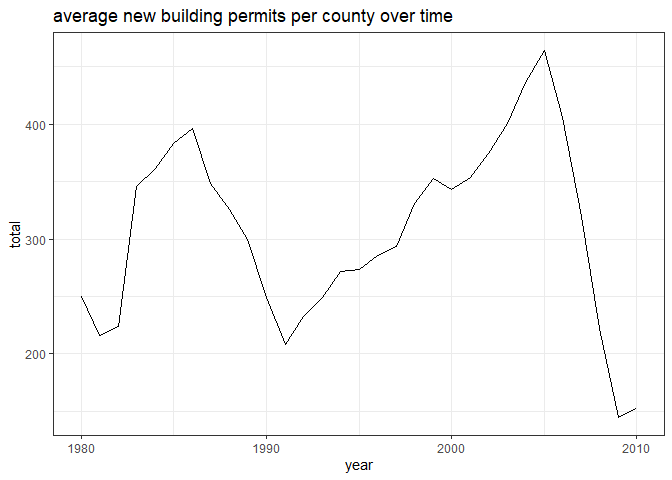
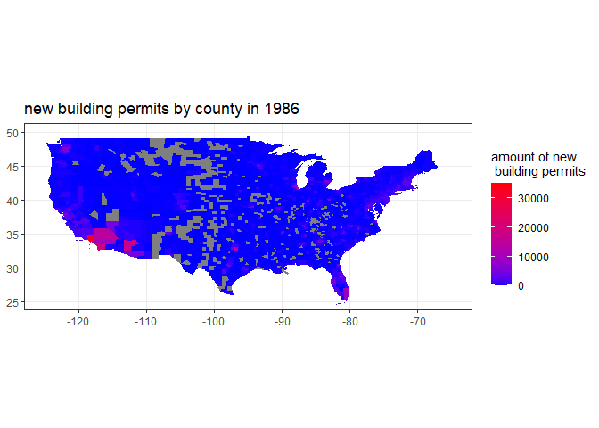
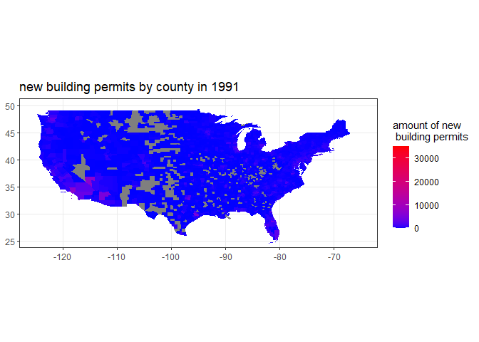
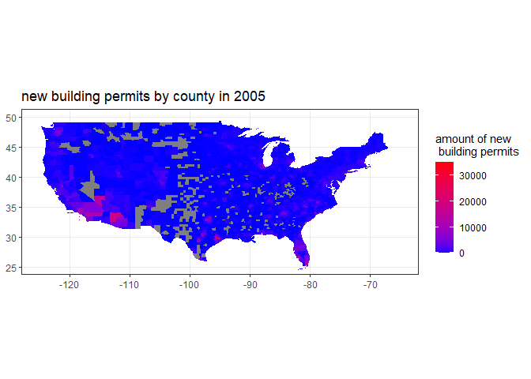
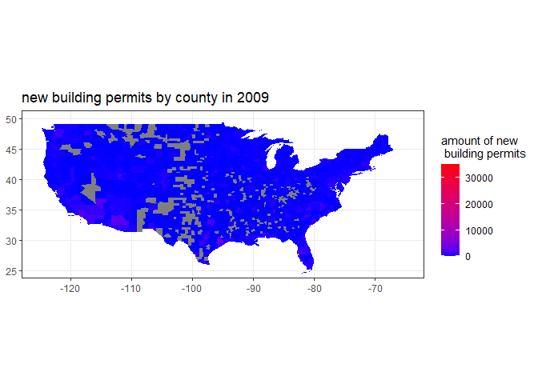

```r
ggplot(all, aes(x = year, y = total)) +
  geom_path() +
  theme_bw() +
  ggtitle('average new building permits per county over time')
```

<!-- -->

## intro 

first, we looked at the average new building permits over time and chose specific years to look at. We chose '86, '91, '05, and '09 because they correspended to the peaks and valleys that directly followed. 


```r
ggplot(final86) +
  geom_sf(aes(geometry = geometry, fill = total), color = NA) +
  coord_sf(xlim = c(-125, -65), ylim = c(25, 50)) +
  scale_fill_gradient(low = 'blue', high = 'red', limits = c(0, 35000)) +
  ggtitle('new building permits by county in 1986') +
  labs(fill = 'amount of new \n building permits') +
  theme_bw()
```

<!-- -->

## '86 

first we look at '86. we see that there is a lot of activity in south california and south west arizona. there is also light activity throughout the midwest and east as well. 


```r
ggplot(final91) +
  geom_sf(aes(geometry = geometry, fill = total), color = NA) +
  coord_sf(xlim = c(-125, -65), ylim = c(25, 50)) +
  scale_fill_gradient(low = 'blue', high = 'red', limits = c(0, 35000)) +
  ggtitle('new building permits by county in 1991') +
  labs(fill = 'amount of new \n building permits') +
  theme_bw()
```

<!-- -->

## '91 

next we look at 91, which we determed to be a low spot after the peak of '86. the graph supports this. it's hard to find any activity throughout the country and even the hot spots in so cal and arizona are much less bright.


```r
ggplot(final05) +
  geom_sf(aes(geometry = geometry, fill = total), color = NA) +
  coord_sf(xlim = c(-125, -65), ylim = c(25, 50)) +
  scale_fill_gradient(low = 'blue', high = 'red', limits = c(0, 35000)) +
  ggtitle('new building permits by county in 2005') +
  labs(fill = 'amount of new \n building permits') +
  theme_bw()
```

<!-- -->

## '05 

next up is the great peak of '05 before the '08 recession. we can see considerable activity in so cal and arizona again, and easy to identify activity throughout the rest of the country. 


```r
ggplot(final09) +
  geom_sf(aes(geometry = geometry, fill = total), color = NA) +
  coord_sf(xlim = c(-125, -65), ylim = c(25, 50)) +
  scale_fill_gradient(low = 'blue', high = 'red', limits = c(0, 35000)) +
  ggtitle('new building permits by county in 2009') +
  labs(fill = 'amount of new \n building permits') +
  theme_bw()
```

<!-- -->

## '09

finally we look at '09. there is little to no activity anywhere in the country at all. even so cal and arizona barley show up on the map this time. 

